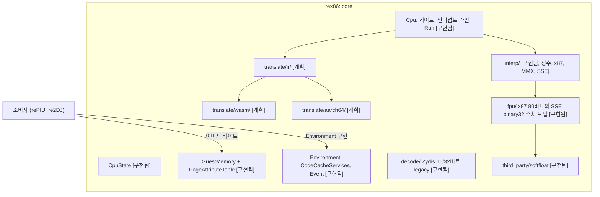

# 아키텍처 / Architecture

이 문서는 지금 구현된 구조와 계획된 구조를 함께 적는다. 구현된 것은 **[구현됨]**, 계획은 **[계획]**으로 표시한다. 큰 방향은 [docs/PROJECT_CHARTER.md](docs/PROJECT_CHARTER.md), 결정의 근거는 [#1 설계](docs/design/20261007-i001-repository-and-public-contract.md)에 있다.

*This document records the structure as implemented, marked **[implemented]**, and as planned, marked **[planned]**. The broad direction is in [docs/PROJECT_CHARTER.md](docs/PROJECT_CHARTER.md) and the reasoning in the [#1 design](docs/design/20261007-i001-repository-and-public-contract.md).*

## 1. 전체 그림 / The whole

## 2. 공개 계약 / The public contract **[구현됨 / implemented]**

| 헤더 | 내용 |
|---|---|
| `include/rex86/cpu_state.h` | `CpuState`: `gpr[8]`, `eip`, `eflags`, `segments[6]`(`SegmentRegister`: selector, base, limit, present, executable, writable, default_32bit), `X87State`(80비트 레지스터 8개, CW/SW/TW, 마지막 명령과 피연산자 포인터). `Reset()`은 Intel SDM 초기값(EFLAGS 비트 1, CW 0x037F, TW 0xFFFF, 평탄 세그먼트, CS만 실행 가능). `SseState`(#29): `xmm[8]`(16바이트), `mxcsr`(초기 0x1F80). MMX 레지스터는 따로 없고 `X87State::registers[n]`의 하위 64비트다 |
| `include/rex86/guest_memory.h` | `GuestMemory(base, size)`: 게스트 주소 A는 `base + A`, `base`가 null이면 identity. `Read/Write 8/16/32`, `ReadBytes/WriteBytes`, `HostPointer`. `PageAttributeTable`: 4 KiB 단위 `kMapped`, `kRead`, `kWrite`, `kExecute`, `kTranslated`. 접근은 범위와 페이지 속성을 통째로 검사한 뒤 수행 |
| `include/rex86/environment.h` | `StopReason`(`kNoEngine`, `kBudgetExhausted`, `kGate`, `kSoftwareInterrupt`, `kPortIo`, `kFault`, `kHalted`, `kStopRequested`), `FaultKind`(rePIU `platform::FaultKind`와 re2DJ `NativeFaultKind`에 1:1, #17에서 SS 기준 limit 위반의 `kStackFault`, #19에서 x87 #MF의 `kFloatingPoint`, #29에서 SSE #XM의 `kSimdFloatingPoint` 추가), `Event`(32비트 게스트 값만), `Descriptor`, `Features`(x87, cmov, mmx, fxsr, sse, sse2, segments_16bit. #29부터 sse2를 뺀 전부가 기본 켬), `Environment`(LoadDescriptor, PortRead/Write, InterruptTarget, ReadTimeStampCounter, Cpuid, OnCodePageWritten), `CodeCacheServices`(Allocate, Release, BeginWrite, EndWrite) |
| `include/rex86/cpu.h` | `Cpu(memory, environment, features, code_cache = nullptr)`. 게이트 집합(`RegisterGate`, `IsGate`), pending 인터럽트 256비트(`RaiseInterrupt`, `NextPendingInterrupt`: 높은 벡터 먼저), `Run(budget)`, `Step`, `RequestStop`, `InvalidateCode`, `ActiveEngine` |
| `include/rex86/version.h` | `VersionString()`: `VERSION` 파일 값 |

`Features`는 흉내 낼 기판의 CPU를 고르는 수단이다. 코어는 대상 기판 CPU의 합집합 상한(P6 정수, P6 x87, MMX, SSE)을 구현하고, 소비자는 기판에 맞춰 기능을 끄며, 꺼진 기능의 명령은 그 CPU처럼 #UD다([#21 설계](docs/design/20261008-i021-target-board-cpu-baseline.md) 결정 2). `cmov`(기본 켬)는 CMOVcc와, x87이 켜져 있으면 FCOMI 계열과 FCMOVcc를 함께 켜고 끈다(#22, K6-2를 흉내 낼 때 끈다). `mmx`, `fxsr`, `sse`(#29, 기본 켬)는 MMX, FXSAVE/FXRSTOR, Pentium III SSE를 켜고 끈다. Mendocino는 `sse`를, K6-2는 `fxsr`와 `sse`를 끈다.

*`Features` is how a consumer picks the board CPU it emulates: the core implements the target boards' union ceiling (P6 integer, P6 x87, MMX, SSE), consumers switch features off per board, and a disabled feature's instructions raise #UD as on that CPU ([#21 design](docs/design/20261008-i021-target-board-cpu-baseline.md), decision 2). `cmov` (on by default) gates CMOVcc and, with x87 on, the FCOMI family and FCMOVcc (#22; off to emulate the K6-2). `mmx`, `fxsr` and `sse` (#29, on by default) gate MMX, FXSAVE/FXRSTOR and the Pentium III's SSE; the Mendocino turns `sse` off, the K6-2 `fxsr` and `sse`.*

#11부터 `Run`은 인터프리터로 실행한다(`ActiveEngine`은 `kInterpreter`). `Run`의 루프(src/cpu.cpp)는 정지 요청, 게이트(해당 명령 실행 전), IF가 켜진 명령 경계의 인터럽트 전달(MOV SS, POP SS, IF를 켠 STI 직후 한 경계는 지연, #15), 예산만 소유하고, x86 의미는 전부 `src/interp/`에 있다. 세그먼트 적재는 선택자 값과 무관하게 항상 `Environment::LoadDescriptor`를 거친다(#15 결정 1). 1차 증분의 명령 범위는 [#11 설계](docs/design/20261007-i011-interpreter-core.md) 결정 3의 표를 따르며, 범위 밖 명령은 `kIllegalInstruction` 폴트로 보고된다(조용한 더미 금지). 폴트는 정확하다: `interp::Step`이 실행 전 정수 상태(GPR, EFLAGS, 세그먼트)를 저장했다가 폴트면 복원하고, REP 문자열만 완료된 반복을 유지한다. near 분기 목적지는 피연산자 크기로 잘리고 분기 시점에 CS limit을 검사한다(#17 결정 6, 7). `rex86_probe`의 둘째 줄은 이제 `engine=interpreter run=fault`다(초기 상태의 페이지는 비매핑이라 fetch가 폴트).

*From #11 on, `Run` executes on the interpreter (`ActiveEngine` is `kInterpreter`). The loop in src/cpu.cpp owns only stop requests, gates (before the gated instruction runs), interrupt delivery at IF-enabled boundaries and the budget; every x86 semantic lives under `src/interp/`. The first increment's instruction scope is decision 3 of the [#11 design](docs/design/20261007-i011-interpreter-core.md); anything outside it reports a `kIllegalInstruction` fault (no quiet dummies). Faults are precise: `interp::Step` saves the integer state (GPRs, EFLAGS, segments) and restores it on a fault, with only REP strings keeping completed iterations; near branch targets are truncated by operand size and checked against the CS limit at the branch (#17 decisions 6 and 7). `rex86_probe`'s second line now reads `engine=interpreter run=fault`, since the reset state's pages are unmapped and the fetch faults.*

## 3. 계획된 엔진 구조 / Planned engine structure **[계획 / planned]**

| 디렉터리 | 역할 | 단계 |
|---|---|---|
| `src/decode/` | **[구현됨]** Zydis(16/32비트 legacy 모드) 래퍼 `Decoder`, `DecodedInstruction`(길이, 서명, x87, 제어 흐름) | 1 |
| `src/interp/` | **[구현됨, P6 정수, x87, MMX, SSE]** 인터프리터: `interp::Step`(한 명령), `access`(주소 생성, 세그먼테이션, `LoadSegment`, SMC 검사), `flags`(즉시 계산), `exec_arith`(시프트, 곱셈/나눗셈, 비트 연산), `exec_strings`(문자열, 문자열 포트 I/O+REP), `exec_segments`(세그먼트 적재, 같은 권한의 far 제어 흐름, IRET, 특권 명령 거절), `exec_bcd`(BCD, BOUND, SALC), `exec_post386`(486 이후 정수: CMOVcc, BSWAP, XADD, CMPXCHG, CMPXCHG8B, UD0/1/2, #22), `exec_x87`/`exec_x87_env`/`exec_x87_transcendental`/`x87_stack`/`x87_access`(x87 명령, 초월함수의 스택과 C1/C2(#25), 레지스터 스택, 태그, 스택 폴트, FIP/FDP, 환경 이미지, 다음 대기형 명령의 #MF). `simd_access`(MM/XMM 접근, MMX 진입의 TOP과 태그와 #MF, 64/128비트 피연산자, 16바이트 정렬 #GP, 모든 조각을 먼저 검사하는 저장), `exec_mmx`(MMX와 SSE가 더한 MMX 정수 명령, EMMS), `exec_sse`(SSE 이동, 논리, 셔플, 언팩, 비시간 저장, PREFETCH, SFENCE), `exec_sse_float`(SSE 부동소수점: 요소별 결과 뒤 전계산/후계산 순서로 MXCSR과 #XM), `exec_fxsave`(FXSAVE/FXRSTOR, LDMXCSR/STMXCSR)(#29). 기능 판정은 `interpreter.cpp`의 `FeatureEnabled`(SSE가 더한 MMX 정수 명령은 이름으로). 블록 캐시는 측정 뒤 | 1 |
| `src/fpu/` | **[구현됨, x87과 SSE]** x87 수치 모델: `float80`(80비트 값과 분류), `softfloat_bridge`(SoftFloat 연결, 공통 피연산자 검사), `x87_math`(SoftFloat 3e 위의 예외 의미, 우선순위, 지수 조정 결과, C1, FPREM, FSCALE, FXTRACT, BCD, 상수), `x87_transcendental`/`transcendental_kernels`/`wide_float`(초월함수 여덟: 66비트 Pi의 정수 축소, binary128 급수, 따로 든 지수와 오차 부호로 한 번 반올림, #25). `sse_math`(SSE binary32 한 요소: SoftFloat 위의 SSE NaN 규칙, 반올림 전 언더플로 판정, #D와 그 우선순위, FZ, MIN/MAX, 비교, 변환, RCP/RSQRT 모델, #29). 디코드를 모르므로 번역 백엔드의 helper로 재사용 | 1 |
| `src/translate/ir/` | x86 블록을 IR로. 플래그는 명시적 값, 죽은 플래그 제거 | 3 |
| `src/translate/wasm/` | IR을 wasm 모듈 바이트열로. 인스턴스화는 호스트 JS | 3 |
| `src/translate/aarch64/` | IR을 AArch64 기계어로. 코드 캐시는 `CodeCacheServices` | 5 |
| `tests/host/<os>/` | 호스트 CPU 대조 fuzz(x86 호스트에서만). **[구현됨]** `linux/x87_fuzz.cpp`(x87, 초월함수는 ulp 허용치 판정과 `--dump`, [가이드](docs/guides/x87-host-fuzz.md)), `linux/int_fuzz.cpp`(32비트 정수, i386 프로세스의 TF 단일 스텝, [가이드](docs/guides/integer-host-fuzz-and-traces.md)). `linux/simd_fuzz.cpp`(MMX/SSE, FXRSTOR와 FXSAVE 사이의 한 명령, 호스트 폴트는 신호로, RCP/RSQRT는 허용치, [가이드](docs/guides/simd-host-fuzz.md), #29). 셋 다 `--record`로 trace를 쓴다 | 1 |
| `src/trace/` | **[구현됨]** trace 형식(리틀 엔디안 바이너리, `RX86TRC1`)과 재생(`trace::Replay`: 공개 계약만으로 코어를 돌려 기록된 기대값과 비교). 코어 밖의 내부 라이브러리 `rex86_trace_format`(#22 결정 5) | 1 |
| `src/tools/trace/` | **[구현됨]** `rex86_trace`: 파일 재생과 `--dump N`. 모든 호스트(wasm32는 `-sNODERAWFS`)에서 빌드 | 1 |
| `src/tools/bench/` | **[구현됨]** `rex86_bench`: 벤치마크 하네스(#27). 바이트 어셈블러(`asm`), 합성 커널 다섯(`alu`, `memory`, `call`, `string`, `x87`)과 혼합 워크로드, C++ 참조 모델(`workloads`), 프레임 루프와 통계(`runner`). 공개 계약만 쓰므로 모든 엔진을 같은 길로 잰다. MIPS, 프레임 시간 p50/p99/최대, 첫 프레임, 기판 넷의 실시간 비율(IPC 가정)을 보고. [가이드](docs/guides/benchmark.md), [측정 기록](docs/analysis/interpreter-performance.md) | — |
| `tests/traces/` | **[구현됨]** 고정 시드 trace 묶음 `int32.rxt`(정수 12,000건), `x87.rxt`(x87 2,587건), `x87_transcendental.rxt`(초월함수 1,850건, #25), `simd.rxt`(MMX/SSE, #29). 기대값은 Intel 호스트 CPU가 만들었고 다섯 호스트의 ctest가 재생한다 | 1 |
| `src/tools/census/` | **[구현됨]** 독립 census: 평탄 이미지 + 진입점, 재귀 하강 하한과 선형 스윕 상한. [가이드](docs/guides/instruction-census.md) | 1 |
| `src/tools/sst/` | **[구현됨]** SingleStepTests/80386(MIT) 러너. MOO v1.1 파서, 디코더 검증, 인터프리터 실행 비교(real mode limit 0xFFFF, 예외와 소프트웨어 인터럽트는 하네스가 IVT 전달을 흉내, #17). [가이드](docs/guides/singlesteptests.md) | 1 |
| `third_party/zydis/` | **[구현됨]** Zydis v4.1.1 amalgamation(MIT), `rex86_zydis` STATIC, 코어에 PRIVATE 링크 | 1 |

디코더는 코어 내부 모듈이다. 공개 헤더는 Zydis 타입을 노출하지 않으므로 디코더는 공개 계약 변경 없이 교체 가능하다.

*The decoder is core-internal: no public header exposes a Zydis type, so the decoder stays replaceable without a contract change.*

엔진 선택은 실행 시점이다. `Cpu`에 `CodeCacheServices`가 없으면 인터프리터로만 돈다(iOS).

*Engine choice is made at run time: without `CodeCacheServices` the core runs the interpreter alone (iOS).*

## 4. 빌드와 CI / Build and CI **[구현됨 / implemented]**

| 타깃 | 종류 | 내용 |
|---|---|---|
| `rex86_warnings` | INTERFACE | 컴파일러별 경고, `REX86_WARNINGS_AS_ERRORS`, `REX86_SANITIZE`(예: `address,undefined`, rex86 타깃에만) |
| `rex86_core` (`rex86::core`) | STATIC | 코어. `REX86_VERSION`은 PRIVATE 정의 |
| `rex86_unit_tests` | 실행 파일 | `tests/unit/`, CTest 등록. Emscripten에서는 `node`로 실행 |
| `rex86_probe` | 실행 파일 | 모든 호스트에서 같은 `key=value` 줄 |
| `rex86_zydis` | STATIC | Zydis v4.1.1 amalgamation. 경고 타깃 미적용, 코어에 PRIVATE 링크 |
| `rex86_softfloat` | STATIC | Berkeley SoftFloat 3e(C, 8086 specialization). 경고 타깃 미적용, 코어에 PRIVATE 링크 |
| `rex86_trace_format` | STATIC | trace 형식과 재생(`src/trace/`). 코어의 공개 계약만 사용 |
| `rex86_trace` | 실행 파일 | trace 재생 도구. `tests/traces/*.rxt` 재생이 ctest(`rex86_trace_corpus`)로 모든 호스트에 등록 |
| `rex86_x87_fuzz` | 실행 파일 | x87 호스트 CPU 대조 fuzz. x86/x86-64 Linux에서만, 짧은 고정 시드로 ctest 등록. 초월함수의 정확한 반올림은 `--dump`와 `scripts/x87_transcendental_oracle.py`(Python 3, 외부 패키지 없음)로 따로 확인(#25) |
| `rex86_simd_fuzz` | 실행 파일 | MMX/SSE 호스트 CPU 대조 fuzz(#29). x86/x86-64 Linux에서만, 짧은 고정 시드로 ctest 등록 |
| `rex86_int_fuzz` | 실행 파일 | 32비트 정수 호스트 CPU 대조 fuzz. i386 Linux 프로세스에서만(`CMAKE_SIZEOF_VOID_P` 4), 짧은 고정 시드로 ctest 등록 |
| `rex86_bench_lib` | STATIC | 벤치마크 하네스의 어셈블러, 워크로드, 프레임 루프(`src/tools/bench/`). 단위 테스트가 링크 |
| `rex86_bench` | 실행 파일 | 벤치마크 하네스. 모든 호스트에서 빌드(wasm32는 `-sNODERAWFS`), 첫 줄에 `$<CONFIG>`를 적음. `--smoke`가 ctest(`rex86_bench_smoke`)로 모든 호스트에 등록 |
| `rex86_census` | 실행 파일 | 명령 census 도구. Emscripten에서는 빌드하지 않음 |
| `rex86_sst` | 실행 파일 | SingleStepTests 러너. Emscripten 제외, `REX86_SST_DIR`로 ctest 등록 |

`REX86_BUILD_TESTS`는 최상위 프로젝트일 때만 기본 ON이므로 FetchContent 소비자는 라이브러리만 받는다. CI는 Windows x86(MSVC), Linux x64(GCC, Clang), Linux i386(Debian 컨테이너), Linux AArch64(`ubuntu-24.04-arm`), wasm32(Emscripten, Node)의 다섯 호스트와, Linux x64의 ASan/UBSan 작업(`linux-x64-sanitize`, GCC)이 모든 브랜치 push에서 돈다.

*`REX86_BUILD_TESTS` defaults to ON only for the top-level project, so a FetchContent consumer gets the library alone. CI runs the five hosts plus an ASan/UBSan job on Linux x64 (`linux-x64-sanitize`, GCC) on every branch push.*

## 5. 갱신 규칙 / Update rules

구현된 구조가 바뀌면 같은 작업에서 이 문서를 갱신하고, 계획이 구현되면 표시를 **[구현됨]**으로 바꾼다.

*When the implemented structure changes, update this document in the same task; when a plan is implemented, change its mark to **[implemented]**.*
