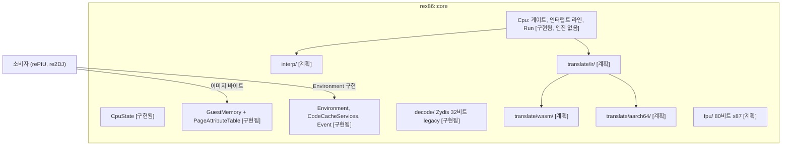

# 아키텍처 / Architecture

이 문서는 지금 구현된 구조와 계획된 구조를 함께 적는다. 구현된 것은 **[구현됨]**, 계획은 **[계획]**으로 표시한다. 큰 방향은 [docs/PROJECT_CHARTER.md](docs/PROJECT_CHARTER.md), 결정의 근거는 [#1 설계](docs/design/20261007-i001-repository-and-public-contract.md)에 있다.

*This document records the structure as implemented, marked **[implemented]**, and as planned, marked **[planned]**. The broad direction is in [docs/PROJECT_CHARTER.md](docs/PROJECT_CHARTER.md) and the reasoning in the [#1 design](docs/design/20261007-i001-repository-and-public-contract.md).*

## 1. 전체 그림 / The whole

## 2. 공개 계약 / The public contract **[구현됨 / implemented]**

| 헤더 | 내용 |
|---|---|
| `include/rex86/cpu_state.h` | `CpuState`: `gpr[8]`, `eip`, `eflags`, `segments[6]`(`SegmentRegister`: selector, base, limit, present, executable, writable, default_32bit), `X87State`(80비트 레지스터 8개, CW/SW/TW, 마지막 명령과 피연산자 포인터). `Reset()`은 Intel SDM 초기값(EFLAGS 비트 1, CW 0x037F, TW 0xFFFF, 평탄 세그먼트, CS만 실행 가능) |
| `include/rex86/guest_memory.h` | `GuestMemory(base, size)`: 게스트 주소 A는 `base + A`, `base`가 null이면 identity. `Read/Write 8/16/32`, `ReadBytes/WriteBytes`, `HostPointer`. `PageAttributeTable`: 4 KiB 단위 `kMapped`, `kRead`, `kWrite`, `kExecute`, `kTranslated`. 접근은 범위와 페이지 속성을 통째로 검사한 뒤 수행 |
| `include/rex86/environment.h` | `StopReason`(`kNoEngine`, `kBudgetExhausted`, `kGate`, `kSoftwareInterrupt`, `kPortIo`, `kFault`, `kHalted`, `kStopRequested`), `FaultKind`(rePIU `platform::FaultKind`와 re2DJ `NativeFaultKind`에 1:1), `Event`(32비트 게스트 값만), `Descriptor`, `Features`(x87, mmx, sse, sse2, segments_16bit), `Environment`(LoadDescriptor, PortRead/Write, InterruptTarget, ReadTimeStampCounter, Cpuid, OnCodePageWritten), `CodeCacheServices`(Allocate, Release, BeginWrite, EndWrite) |
| `include/rex86/cpu.h` | `Cpu(memory, environment, features, code_cache = nullptr)`. 게이트 집합(`RegisterGate`, `IsGate`), pending 인터럽트 256비트(`RaiseInterrupt`, `NextPendingInterrupt`: 높은 벡터 먼저), `Run(budget)`, `Step`, `RequestStop`, `InvalidateCode`, `ActiveEngine` |
| `include/rex86/version.h` | `VersionString()`: `VERSION` 파일 값 |

지금 `Run`은 엔진이 없으므로 `kNoEngine`을 돌려주고 명령을 retire하지 않는다. 성공을 흉내내는 더미를 두지 않는다는 규칙에 따른 것이다. `ActiveEngine`은 `kNone`이다.

*`Run` returns `kNoEngine` and retires nothing, since no engine exists yet; `ActiveEngine` is `kNone`. A dummy that imitated success is ruled out.*

## 3. 계획된 엔진 구조 / Planned engine structure **[계획 / planned]**

| 디렉터리 | 역할 | 단계 |
|---|---|---|
| `src/decode/` | **[구현됨]** Zydis(32비트 legacy 모드) 래퍼 `Decoder`, `DecodedInstruction`(길이, 서명, x87, 제어 흐름). 블록 캐시는 인터프리터 작업에서 | 1 |
| `src/interp/` | 인터프리터. IR을 거치지 않는 정확성 기준. 플래그 즉시 계산 | 1 |
| `src/fpu/` | 80비트 x87 (SoftFloat 3 `extF80` 채택 후보) | 1 |
| `src/translate/ir/` | x86 블록을 IR로. 플래그는 명시적 값, 죽은 플래그 제거 | 3 |
| `src/translate/wasm/` | IR을 wasm 모듈 바이트열로. 인스턴스화는 호스트 JS | 3 |
| `src/translate/aarch64/` | IR을 AArch64 기계어로. 코드 캐시는 `CodeCacheServices` | 5 |
| `tests/host/<os>/` | 호스트 CPU 대조 fuzz(x86 호스트에서만), trace 생성 | 1 |
| `src/tools/census/` | **[구현됨]** 독립 census: 평탄 이미지 + 진입점, 재귀 하강 하한과 선형 스윕 상한. [가이드](docs/guides/instruction-census.md) | 1 |
| `third_party/zydis/` | **[구현됨]** Zydis v4.1.1 amalgamation(MIT), `rex86_zydis` STATIC, 코어에 PRIVATE 링크 | 1 |

디코더는 코어 내부 모듈이다. 공개 헤더는 Zydis 타입을 노출하지 않으므로 디코더는 공개 계약 변경 없이 교체 가능하다.

*The decoder is core-internal: no public header exposes a Zydis type, so the decoder stays replaceable without a contract change.*

엔진 선택은 실행 시점이다. `Cpu`에 `CodeCacheServices`가 없으면 인터프리터로만 돈다(iOS).

*Engine choice is made at run time: without `CodeCacheServices` the core runs the interpreter alone (iOS).*

## 4. 빌드와 CI / Build and CI **[구현됨 / implemented]**

| 타깃 | 종류 | 내용 |
|---|---|---|
| `rex86_warnings` | INTERFACE | 컴파일러별 경고, `REX86_WARNINGS_AS_ERRORS` |
| `rex86_core` (`rex86::core`) | STATIC | 코어. `REX86_VERSION`은 PRIVATE 정의 |
| `rex86_unit_tests` | 실행 파일 | `tests/unit/`, CTest 등록. Emscripten에서는 `node`로 실행 |
| `rex86_probe` | 실행 파일 | 모든 호스트에서 같은 `key=value` 줄 |
| `rex86_zydis` | STATIC | Zydis v4.1.1 amalgamation. 경고 타깃 미적용, 코어에 PRIVATE 링크 |
| `rex86_census` | 실행 파일 | 명령 census 도구. Emscripten에서는 빌드하지 않음 |

`REX86_BUILD_TESTS`는 최상위 프로젝트일 때만 기본 ON이므로 FetchContent 소비자는 라이브러리만 받는다. CI는 Windows x86(MSVC), Linux x64(GCC, Clang), Linux i386(Debian 컨테이너), Linux AArch64(`ubuntu-24.04-arm`), wasm32(Emscripten, Node)의 다섯 작업이 모든 브랜치 push에서 돈다.

*`REX86_BUILD_TESTS` defaults to ON only for the top-level project, so a FetchContent consumer gets the library alone. CI runs five jobs on every branch push.*

## 5. 갱신 규칙 / Update rules

구현된 구조가 바뀌면 같은 작업에서 이 문서를 갱신하고, 계획이 구현되면 표시를 **[구현됨]**으로 바꾼다.

*When the implemented structure changes, update this document in the same task; when a plan is implemented, change its mark to **[implemented]**.*
