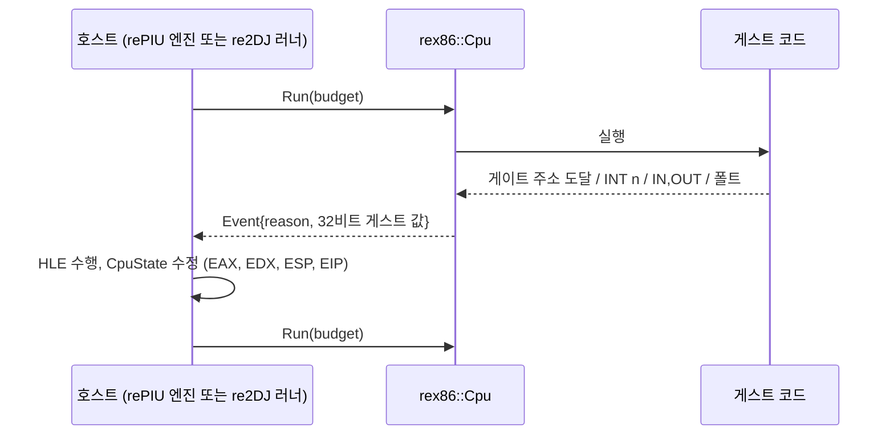
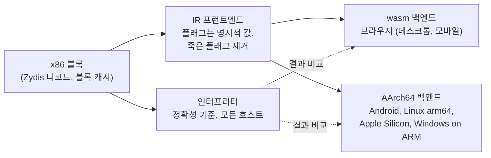

# #1 설계 : 저장소 구조, 개발 규칙, 공용 CPU 코어의 공개 계약 / #1 design : repository structure, development rules and the shared CPU core's public contract

이슈: [#1](https://github.com/reexec/rex86/issues/1) | 지시서: [20261007-i001](../work-orders/20261007-i001-repository-and-public-contract.md) | 로그: [20261007-i001](../work-logs/20261007-i001-repository-and-public-contract.md)

## 배경 / Background

rePIU와 re2DJ는 원본 32비트 x86 게임 실행 파일을 고치지 않고 실행하며 주변 환경만 HLE로 대체한다. 두 프로젝트의 데스크톱 경로는 모두 호스트 CPU가 x86이라는 전제 위에 있다. rePIU는 `direct`(Win32, Linux i386)와 `cache`(Linux x64, long mode 코드 캐시) 실행 모델, re2DJ는 i386 직접 실행, Linux x64 compatibility mode, Windows x86 WOW64다. 브라우저(wasm)와 ARM 기기에는 그 전제가 없다.

두 프로젝트는 이 문제를 각자 조사했다. rePIU는 작업 513에서 웹을 "네 번째 실행 backend"로 설계하고 Stage 1(코어의 wasm32 빌드)과 Stage 2(명령 census: mnemonic 120개, 피연산자 서명 320개, 상위 17개가 87.89%)까지 마친 뒤 Stage 3(플랫폼 중립 인터프리터)을 보류했다. re2DJ는 작업 014와 015에서 재사용 엔진(v86, TinyEMU, libx86emu, Blink)을 평가해 모두 탈락시켰고, 작업 007에서 "웹 또는 공용 fallback 실행 경로가 필요해지는 시점까지" 직접 인터프리터를 미뤘으며, 작업 310에서 웹을 활성 범위에서 제거했다.

사용자는 두 프로젝트가 공유하는 x86 CPU 에뮬레이터를 별도 저장소로 만들기로 하고, 목표를 웹에서 모바일(ARM)까지 넓혔다. 이 저장소가 그것이다.

*rePIU and re2DJ run original 32-bit x86 game executables unmodified, replacing only the surrounding environment with HLE. Every desktop path of both rests on the host CPU being x86: rePIU's `direct` (Win32, Linux i386) and `cache` (Linux x64 long-mode code cache) execution models, re2DJ's i386 direct execution, Linux x64 compatibility mode and Windows x86 WOW64. A browser (wasm) and an ARM device lack that premise. Both projects looked at this separately: rePIU designed the web as a "fourth execution backend" in task 513, finished Stage 1 (the core building for wasm32) and Stage 2 (the instruction census: 120 mnemonics, 320 operand forms, the top 17 covering 87.89%) and put Stage 3 (a platform-neutral interpreter) on hold; re2DJ evaluated reusable engines (v86, TinyEMU, libx86emu, Blink) in tasks 014 and 015 and rejected them all, deferred a custom interpreter in task 007 "until a Web or shared fallback path requires it", and removed the web from its active scope in task 310. The user decided to build the shared x86 CPU emulator as its own repository and widened the goal from the web to mobile (ARM). This repository is that.*

## 결정 1: 코어의 범위는 CPU까지다 / Decision 1: the core's scope ends at the CPU

| 코어 안 / In the core | 코어 밖 (소비자) / Outside (consumers) |
|---|---|
| `CpuState`: 범용 레지스터, EIP, EFLAGS, 세그먼트 레지스터와 디스크립터 캐시, x87 80비트 상태 | LE 로더(rePIU), PE32 로더(re2DJ) |
| `GuestMemory`: 평탄 뷰와 페이지 속성표 | DOS/DPMI/Glide HLE, Win32/DirectX HLE |
| 디코더(Zydis 채택 후보), 블록 캐시 | SelectorTable의 의미, TEB, 게이트 ABI, 포트 버스의 의미 |
| 인터프리터, IR 프런트엔드, wasm 백엔드, AArch64 백엔드 | OS 계층(OPFS, WebGL2, GLES, 오디오, 입력, 앱 수명 주기) |
| `Environment`와 `CodeCacheServices` 계약, `Event` | 자산, 게임별 프로파일 |
| 검증 하네스(단위 테스트, 호스트 CPU 대조, trace 재생), census 도구 | |

코어가 게스트 형식, OS, 그래픽 API를 모르기 때문에 두 프로젝트가 같은 코드를 쓸 수 있다. re2DJ 작업 015에서 v86이 탈락한 이유가 "CPU가 PC 모델과 분리되지 않음"이었으므로, 이 경계는 처음부터 지킨다. 모바일 요구(터치, GLES, 저장소)는 전부 OS 계층이고 코어에 영향이 없다.

*Because the core knows no guest format, OS or graphics API, both projects can use the same code. v86 failed re2DJ's task 015 because its CPU was inseparable from the PC model, so this boundary is kept from the start. Mobile requirements (touch, GLES, storage) are all OS-layer matters and do not touch the core.*

## 결정 2: 호스트 계약은 이벤트와 재개다 / Decision 2: the host contract is events and resumption

코어는 게스트를 실행하다가 다음 중 하나에서 멈추고 32비트 게스트 값만 담긴 `Event`를 돌려준다. 호스트가 `CpuState`를 고친 뒤 다시 `Run`한다.

| `StopReason` | 소비자 쪽 대응 / Consumer counterpart |
|---|---|
| `kGate` | re2DJ `NativeImportGateEvent{gate_address, instruction_pointer, stack_pointer}`와 `NativeImportGateResult{eax, edx, stack_bytes_to_pop, exit_process}`. rePIU LINEXE 게이트(far jump로 합성 셀렉터 진입 뒤 선형 주소) |
| `kSoftwareInterrupt` | rePIU INT 21h, 31h, 33h, 16h, 2Fh. 폴트 경계에서 디코드하던 것을 벡터 번호로 바로 받음 |
| `kPortIo` | `Environment::PortRead/Write`가 거절한 접근. rePIU JAMMA/PIU10/YMZ, re2DJ `LegacyIoPortBus`(확인된 RVA에서만 허용하는 정책은 호스트 콜백 안에서) |
| `kFault` | rePIU `platform::FaultKind`, re2DJ `NativeFaultKind`와 1:1인 `FaultKind` |
| `kBudgetExhausted`, `kHalted`, `kStopRequested` | 호스트의 메시지 펌프와 스케줄링 지점 |
| `kNoEngine` | 이 작업의 상태. 엔진이 없음을 명시적으로 보고 |

호스트가 공급하는 것은 `Environment` 하나다. 셀렉터 적재 시의 디스크립터(`LoadDescriptor`), 포트 I/O, 인터럽트 벡터의 목적지(`InterruptTarget`: IDT는 rePIU DPMI HLE가 소유), RDTSC와 CPUID 값. 비동기 인터럽트는 `Cpu::RaiseInterrupt(vector)`로 올리고 코어가 IF를 추적해 명령 경계와 `sti`, `iret`, `hlt`에서 전달한다. rePIU의 "IRQ0을 `sti` 시점에 전달"이 코어의 기본 동작이 된다. 호스트에서 게스트로의 호출(re2DJ의 윈도 프로시저, rePIU의 인터럽트 프레임)은 뒤에 `CallGuest`로 더한다: 반환 주소를 내부 게이트로 두고 거기 닿을 때까지 재진입 실행.

이벤트에 호스트 포인터나 엔진 내부 핸들을 넣지 않는다. 그래서 같은 호스트 코드가 인터프리터와 모든 번역 백엔드를 섬긴다.

*The core runs the guest, stops at one of the reasons above and returns an `Event` holding 32-bit guest values only; the host edits `CpuState` and calls `Run` again. The host supplies one `Environment`: descriptors on selector loads, port I/O, the target of an interrupt vector (the IDT belongs to rePIU's DPMI HLE), RDTSC and CPUID values. Asynchronous interrupts are raised with `Cpu::RaiseInterrupt(vector)`; the core tracks IF and delivers at an instruction boundary and at `sti`, `iret` and `hlt`, which makes rePIU's "deliver IRQ0 at `sti`" the core's default. Host-to-guest calls (re2DJ's window procedures, rePIU's interrupt frames) come later as `CallGuest`: the return address is an internal gate and execution re-enters until it is reached. No host pointer or engine handle enters an event, so the same host code serves the interpreter and every translation backend.*

## 결정 3: 게스트 메모리는 평탄 뷰와 페이지 속성표다 / Decision 3: guest memory is a flat view plus a page attribute table

`GuestMemory{base, size}`에서 게스트 주소 A는 `base + A`다. `base`가 null이면 identity 매핑이다. rePIU의 네이티브 arena(게스트 주소 = 호스트 주소)와 설계 513 결정 3의 wasm 배치(게스트를 선형 메모리 맨 아래에)가 모두 이 형태다. re2DJ의 `GuestAddress` 값 타입과 `Read/Write` 접근자 규칙도 그대로 성립한다.

페이지 속성표(4 KiB 단위: `kMapped`, `kRead`, `kWrite`, `kExecute`, `kTranslated`)가 코어가 아는 유일한 보호다. 하드웨어 페이지 보호와 폴트 전달에 기대지 않으므로 wasm과 JIT 금지 호스트에서도 같은 코드가 돈다. 자기 수정 코드(rePIU의 import stub 패치, re2DJ 보호 빌드의 런타임 복호화)는 `kTranslated` 페이지에 대한 store를 번역 시점에 심은 검사로 잡고 블록을 무효화한다. 접근은 범위와 페이지 속성을 통째로 검사한 뒤 수행하므로 반만 쓰이는 일이 없고, 다중 바이트 값은 바이트 단위로 조립해 호스트의 정렬과 바이트 순서에 기대지 않는다.

*In `GuestMemory{base, size}` guest address A lives at `base + A`; a null base is the identity mapping, which is both rePIU's native arena and task 513's wasm layout, and re2DJ's `GuestAddress` value-type rule holds unchanged. The 4 KiB page attribute table (`kMapped`, `kRead`, `kWrite`, `kExecute`, `kTranslated`) is the only protection the core knows, so the same code runs on wasm and on JIT-forbidding hosts. Self-modifying code is caught by checks placed at translation time on stores to `kTranslated` pages. Accesses are checked whole before being performed, and multi-byte values are assembled byte by byte.*

## 결정 4: CPU 상태는 고정 폭 필드이고 x87은 처음부터 80비트다 / Decision 4: fixed-width state, 80-bit x87 from the start

`CpuState`의 모든 필드는 고정 폭 값이다. rePIU의 `GuestCpuContext`(Windows CONTEXT 필드명)와 re2DJ가 게스트 SEH에 넘기는 `CONTEXT`로의 변환은 필드별 복사다. 초기값은 Intel SDM을 따른다(EFLAGS 비트 1, FNINIT의 CW 0x037F와 TW 0xFFFF, 평탄 세그먼트, CS만 실행 가능).

x87은 80비트 메모리 형식(`FSTP m80`, `FNSAVE`, `FNSTENV`로 관측 가능한 형식) 그대로 레지스터 8개를 둔다. rePIU 작업 514가 80비트 메모리 피연산자 14곳과 `fldcw` 10회를 확인했고, 레지스터 파일 폭을 나중에 바꾸는 것은 재작성이다. 구현은 Berkeley SoftFloat 3의 `extF80`(BSD 3-Clause) 또는 그에 준하는 자체 구현으로, 모든 호스트에서 비트 단위로 같은 결과를 내는 것이 목적이다. 호스트 FPU를 쓰는 빠른 경로는 같은 결과를 내는 것이 증명된 뒤에만 더한다.

*Every `CpuState` field is a fixed-width value, so conversion to rePIU's `GuestCpuContext` and to the `CONTEXT` re2DJ hands guest SEH is a field-by-field copy. Reset values follow the Intel SDM. x87 keeps eight registers in the observable 80-bit memory format: rePIU's task 514 confirmed 14 80-bit memory operands and 10 `fldcw` sites, and changing the register file's width later is a rewrite. The implementation is Berkeley SoftFloat 3's `extF80` (BSD 3-Clause) or an equivalent, aiming at bit-identical results on every host; a host-FPU fast path is added only once proven equal.*

## 결정 5: 인터프리터 하나와 공용 IR 위의 백엔드 둘 / Decision 5: one interpreter and two backends over a shared IR

* **인터프리터**가 정확성 기준이다. IR을 거치지 않고 플래그를 즉시 계산한다. 사전 디코드한 블록 캐시로 명령마다 디코드하지 않는다. 플랫폼 중립 C++이므로 네이티브 호스트에서 소비자의 기존 실행과 단일 스텝으로 대조할 수 있다(설계 513이 Stage 3의 중심이라고 적은 이유).
* **IR 프런트엔드**에만 번역 경로의 x86 의미가 있다. 백엔드는 IR만 알므로 백엔드 하나를 더하는 비용은 x86 명령 수가 아니라 IR 명령 수에 비례한다. 1판 제안의 "x86에서 wasm으로 직접 번역"을 ARM 목표가 들어오면서 이 구조로 바꿨다.
* **번역 단위와 시점**: 기본 블록 또는 superblock, 실행 중 도달한 블록만(rePIU census의 간접 분기 117개와 re2DJ 보호 빌드의 디스어셈블 방해 때문에 정적 번역은 불가), 간접 분기는 블록 주소 표 dispatch.
* **wasm 백엔드**는 모듈 바이트열을 만들고 인스턴스화는 Worker의 JS가 비동기로 한다. 그동안 인터프리터가 계속 돈다(계층화). 게스트 메모리를 선형 메모리의 고정 구간에 두어 주소를 `load`/`store`의 상수 offset에 접는다.
* **AArch64 백엔드**는 코드 캐시의 할당과 보호 전환을 `CodeCacheServices` 콜백으로 받는다. Linux/Android는 `mmap`+`mprotect`, macOS는 `MAP_JIT`와 스레드별 W^X 전환, Windows on ARM은 `VirtualProtect`이고, 전부 호스트 쪽이다. 메모리 순서는 두 소비자 모두 한 번에 한 게스트 스레드만 실행하므로 문제가 되지 않는다.
* **엔진 선택은 실행 시점**이다. `Cpu`에 `CodeCacheServices`가 없으면 인터프리터로만 돈다. iOS 앱은 실행 가능 메모리를 만들 수 없으므로 거기서는 인터프리터가 유일한 엔진이고, iOS에서 번역 실행에 닿는 길은 Safari의 wasm 경로다.
* **x86-64 백엔드는 지금 범위 밖**이다. 소비자의 데스크톱 경로가 이미 있다. 다만 IR 구조 덕에 뒤에 더할 수 있고, 그 백엔드는 호스트 ISA가 게스트와 같다는 점을 이용해 호환 명령을 원본 바이트 그대로 복사하고 경계 명령에서만 이벤트로 나가는 혼합 형태가 될 수 있다. 그것이 rePIU AOT(원본 바이트 복사 + long mode 호환 패치 + 폴트 기반 경계, 약 3만 줄)를 대체할 수 있는지는 2단계 A의 단일 스텝 비교 측정 뒤에 따로 판단한다. 대체한다면 순서는 트랩 플래그 단일 스텝 fallback을 인터프리터로, `legacy` 백엔드를 인터프리터로, 마지막에 AOT 본체다.

*The interpreter is the correctness reference, computing flags eagerly without the IR, running on a pre-decoded block cache, and comparable instruction by instruction against the consumers' native execution. The IR frontend alone carries x86 semantics on the translation path; backends know IR only, so adding one costs IR instructions, not x86 instructions (the first proposal's direct x86-to-wasm translation became this once ARM joined the goals). Translation is per basic block or superblock, only for blocks reached at run time, with indirect branches through a block address table. The wasm backend emits module bytes that the Worker's JS instantiates asynchronously while the interpreter keeps running; guest memory sits at a fixed range of linear memory so addresses fold into `load`/`store` offsets. The AArch64 backend receives code-cache allocation and protection switching through `CodeCacheServices` (host-side `mmap`/`mprotect`, `MAP_JIT`, `VirtualProtect`). The engine is chosen at run time: without `CodeCacheServices` the core runs the interpreter alone, which is the only engine an iOS app may run; Safari's wasm path is how iOS reaches translated execution. An x86-64 backend is out of scope now; the IR allows adding one later as a hybrid that copies compatible bytes verbatim and exits only at boundaries, and whether that could replace rePIU's AOT (about 30,000 lines of byte copying, long-mode patching and fault-driven boundaries) is decided separately after phase 2A's measurements, in the order single-step fallback, `legacy` backend, then the AOT itself.*

## 결정 6: 저장소, 규칙, 공유 방식 / Decision 6: repository, rules and sharing

* 저장소는 `reexec/rex86`(공개). 규칙은 rePIU의 AGENTS.md에서 CPU 코어에 해당하는 것만 추렸다. 게스트 형식, HLE, 자산, 플랫폼 디렉터리 규칙은 빠지고 코어 경계 규칙과 소비자 규칙이 들어갔다. 작업 처리(이슈가 작업 번호, `work/iNNN-slug` 브랜치, 문서 상호 링크)와 머지 절차(VERSION 올림, PR `Closes #N`, CI 통과, squash merge, 로컬 tag)는 두 소비자와 같다.
* 소비자는 CMake FetchContent로 release tag를 고정해 `rex86::core`를 링크한다. 두 저장소가 SDL3, Dear ImGui, spdlog를 이미 그렇게 가져오고 submodule은 쓰지 않는다. 로컬 동시 개발은 `FETCHCONTENT_SOURCE_DIR_REX86`.
* 테스트 프레임워크는 들이지 않고 두 소비자와 같은 최소 하네스(`tests/unit/test_support.h`)를 쓴다.
* CI는 다섯 호스트다: Windows x86(MSVC), Linux x64(GCC, Clang), Linux i386(컨테이너), Linux AArch64(`ubuntu-24.04-arm`), wasm32(Emscripten, Node). 모든 브랜치 push에서 돌고, 다섯 곳에서 `rex86_probe`의 줄이 같아야 한다. 1판 제안은 arm64 CI를 1단계에 켜기로 했으나 비용이 없어 0단계부터 켠다. macOS arm64 러너는 AArch64 백엔드 작업에서 더한다.

*The repository is `reexec/rex86` (public). Its rules are the subset of rePIU's AGENTS.md that applies to a CPU core, with the guest-format, HLE, asset and platform-directory rules replaced by core boundary rules and consumer rules; task handling (the issue number is the task number, `work/iNNN-slug` branches, cross-linked documents) and the merge procedure (VERSION bump, PR `Closes #N`, green CI, squash merge, local tag) are the consumers'. Consumers link `rex86::core` through FetchContent pinned to a release tag, as both already do for SDL3, Dear ImGui and spdlog; `FETCHCONTENT_SOURCE_DIR_REX86` serves local co-development. No test framework; the consumers' minimal harness. CI runs on five hosts (Windows x86, Linux x64 GCC and Clang, Linux i386 in a container, Linux AArch64, wasm32 under Node) on every branch push, and `rex86_probe` must print the same lines on all five. The arm64 job is on from phase 0 since it costs nothing; a macOS arm64 runner joins with the AArch64 backend.*

## 결정 7: 검증 / Decision 7: verification

1. **명령 단위 테스트**: (mnemonic, 피연산자 서명) 형태마다 입력 상태와 기대 출력. census 상위 형태부터.
2. **호스트 CPU 대조 fuzz**(`tests/host/`): Linux x64와 i386 CI 러너는 실제 x86이다. 무작위 상태와 명령을 격리 버퍼에서 호스트 CPU로 한 번, 코어로 한 번 실행해 비교한다. GCC의 80비트 `long double`로 x87도 대조한다. 그 결과를 **trace**로 저장한다.
3. **trace 재생**: ARM과 wasm 호스트에는 대조할 x86이 없으므로 x86 CI가 만든 trace를 재생해 비교한다. 인터프리터가 모든 호스트에서 비트 단위로 같다는 원칙이 전제다.
4. **백엔드 대 인터프리터**: 같은 블록을 세 엔진으로 실행해 상태를 비교한다. 같은 `CpuState`이므로 비교기는 하나다.
5. **소비자와의 차등 검증**: rePIU는 Windows x86 또는 Linux i386에서 `direct` 모델과, re2DJ는 Linux x86 러너와 단일 스텝으로 대조한다. 이것이 없으면 번역 버그를 브라우저 안에서 잡아야 한다.

*Unit tests per (mnemonic, operand form) from the census's top forms down; a host-CPU comparison fuzz under `tests/host/` on the x86 CI runners (x87 included through GCC's 80-bit `long double`) whose results are saved as traces; trace replay on ARM and wasm hosts, which have no x86 to compare against; backend-versus-interpreter state comparison with one comparator; and single-step differential runs against rePIU's `direct` model and re2DJ's Linux x86 runner.*

## 결정 8: 소비자 접합 지점 / Decision 8: where the consumers connect

| 소비자 | 지점 | 내용 |
|---|---|---|
| rePIU | `execution_model.h` | `none` 모델 자리에 `emulated`. CMake가 EMSCRIPTEN과 ARM에서 고르고, 차등 검증을 위해 네이티브에서도 선택 가능 |
| rePIU | `src/platform/web/`의 stub 다섯 | `guest_cpu_context`는 `CpuState` 변환, `fault_handler`는 코어 이벤트를 `FaultEvent`로 바꿔 등록된 콜백 호출, `virtual_memory`는 페이지 속성표 위임. 엔진의 `DispatchGuestException` 경로가 그대로 삶 |
| rePIU | `execution_trampoline_<model>.cpp` | `_emulated`: 게스트 스택 진입 대신 `Cpu::Run` 루프 |
| rePIU | PIT IRQ0 | `RaiseInterrupt(8)`과 `InterruptTarget` |
| re2DJ | 작업 310 | 웹 제거 결정을 뒤집는 설계가 먼저 필요. 작업 007이 적은 "그 시점"이 왔다고 선언 |
| re2DJ | `ExecutionBackend` | `EmulatedExecutionBackend`: `PrepareImage`는 `GuestMemory`에 PE 매핑, `WaitForEvent`는 `Run`, `CompleteImport`는 EAX/EDX/ESP 갱신. 이 추상 클래스는 게스트 값만 담도록 설계되어 있어 그대로 맞음 |
| re2DJ | 게스트 SEH, 스레드, 레거시 I/O | `kFault`에서 `CONTEXT` 합성, 스레드마다 `Cpu` 하나(현재의 게스트 락 정책과 같은 모양), `PortRead/Write`에서 RVA 정책 뒤 `LegacyIoPortBus` |

두 접합은 각 소비자 저장소의 설계 작업이다. 이 저장소는 그 둘이 모두 맞는 계약을 제공할 책임만 진다.

*Each connection is a design task in its consumer's repository; this repository's duty is a contract both fit.*

## 미확정과 위험 / Unresolved and risks

| 항목 | 상태 | 처리 |
|---|---|---|
| x87 환경 save/restore(`fnsave`, `frstor`) 사용 | rePIU 작업 514에서 **미확정** | 어쨌든 구현. 80비트 레지스터 파일이면 비용이 작음 |
| re2DJ 게스트의 명령 집합(SSE 포함) | **미측정** | census 도구를 이 저장소로 옮겨 복호화 덤프와 비보호 6th 빌드에 돌리는 것이 1단계 첫 작업 |
| 16비트 코드 세그먼트 | rePIU `mode16_*`가 있어 실행된다고 **추정** | `Features::segments_16bit`로 처음부터 지원 |
| Worker 실행 전제 | 설계 513 결정 7, 브라우저 미측정으로 **추정** | 코어는 "한 스레드에서 `Run(budget)` 반복" 형태라 호스트 선택에 열려 있음 |
| iOS JIT 금지 | **확인됨** | 실행 시점 엔진 선택, 인터프리터 전용 모드 |
| 성능 | 인터프리터는 원본 하드웨어에 못 미칠 것으로 **추정** | 속도는 백엔드의 몫. 측정은 `performance.now()` 기준으로 다시 세움 |
| 코어가 한 소비자에 치우칠 위험 | 설계 단계 | 두 어댑터를 같은 사람이 번갈아 진행 |

## 단계 계획과 이 작업의 범위 / Phases and this task's scope

| 단계 | 산출물 | 완료 기준 |
|---|---|---|
| **0 (이 작업)** | 저장소, 규칙, 공개 계약(`CpuState`, `GuestMemory`, `Environment`, `Cpu`), 하네스, 다섯 호스트 CI, `rex86_probe` | 다섯 구성에서 빌드와 테스트 통과, probe 줄 일치. `Run`은 `kNoEngine`을 명시적으로 보고 |
| 1 | 디코더(Zydis), 인터프리터, 80비트 x87, census 도구 이식, 호스트 CPU 대조 fuzz, trace | 두 census의 전체 형태를 덮고 fuzz 통과, arm64와 wasm에서 trace 재생 통과 |
| 2A, 2B | rePIU `emulated` 모델, re2DJ `EmulatedExecutionBackend`(각 소비자 저장소) | 각각 네이티브 차등 검증 일치, 한 타이틀이 타이틀 화면까지 |
| 3 | IR 프런트엔드, wasm 백엔드, 계층화, SMC 검사 | 인터프리터와 상태 비교 일치 |
| 4 | 각 소비자의 브라우저 호스트 | 데스크톱과 모바일 브라우저에서 실행 |
| 5 | AArch64 백엔드, `CodeCacheServices` | arm64 러너에서 trace 재생 일치 |
| 6 | 각 소비자의 ARM 네이티브 호스트(Android 먼저) | 실제 기기 실행 |

이 작업(#1)은 0단계다. 엔진이 없으므로 `Cpu::Run`은 `StopReason::kNoEngine`을 돌려주고 명령을 하나도 retire하지 않는다. 조용히 성공하는 더미를 두지 않는다는 rePIU `src/platform/web/`의 교훈을 그대로 따른다.

*This task (#1) is phase 0. With no engine, `Cpu::Run` returns `StopReason::kNoEngine` and retires nothing, following rePIU's `src/platform/web/` lesson that a stub must never imitate success.*

## 검증 / Verification

* Linux x64 GCC Debug와 Clang Release에서 `-Werror`로 빌드, `rex86_unit_tests`와 `rex86_probe` 통과.
* `CMakePresets.json`을 JSON으로, `ci.yml`을 YAML로 읽어 구조를 확인하고 `build_web_wasm.sh`를 `bash -n`으로 확인.
* Windows x86, Linux i386, Linux AArch64, wasm32는 이 머신에 툴체인이 없어 CI로 확인한다. 작업 로그에 그렇게 적는다.

*Linux x64 GCC Debug and Clang Release build with `-Werror` and pass `rex86_unit_tests` and `rex86_probe`; the presets are loaded as JSON, `ci.yml` as YAML and the wasm script checked with `bash -n`; Windows x86, Linux i386, Linux AArch64 and wasm32 have no toolchain on this machine and are checked by CI, as the work log records.*
