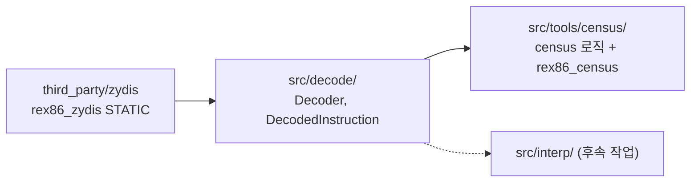

# #5 설계 : 디코더(Zydis) 도입과 독립 명령 census 도구 / #5 design : the Zydis decoder and the standalone instruction census tool

이슈: [#5](https://github.com/reexec/rex86/issues/5) | 지시서: [20261007-i005](../work-orders/20261007-i005-decoder-and-census.md) | 로그: [20261007-i005](../work-logs/20261007-i005-decoder-and-census.md)

## 배경 / Background

[#1 설계](20261007-i001-repository-and-public-contract.md)는 1단계 첫 작업을 census 도구 이식으로 지정했다. re2DJ 게스트의 명령 집합은 미측정이고, 인터프리터(1단계 본체)가 구현할 명령의 우선순위는 census가 정한다. census와 인터프리터 모두 디코더가 전제이므로 이 작업은 둘을 함께 다룬다: Zydis 도입과 `src/decode/` 모듈, 그리고 독립 census 도구.

rePIU의 `repiu_instruction_census`는 그대로 옮길 수 없다. 그 도구는 rePIU의 DOS/4GW LE 로더와 AOT 번역 계획(`BuildAotTranslationPlan`)이 만든 도달 집합을 보고하는 리포터이고, 출력의 절반 이상이 rePIU x64 AOT 에미터의 장기 모드 호환성 측정이다. 코어는 게스트 형식을 모르므로(AGENTS.md 경계 규칙) 이 저장소의 도구는 로더 없이 평탄 코드 이미지를 입력받고, 측정 로직(재귀 하강 도달, 선형 스윕 상한, mnemonic과 피연산자 서명, x87 집계)만 같은 형태로 재구성한다.

*Design #1 names the census port as phase 1's first task: re2DJ's instruction set is unmeasured, and the census sets the interpreter's implementation order. Both the census and the interpreter presuppose a decoder, so this task delivers Zydis with the `src/decode/` module and the standalone census tool together. rePIU's `repiu_instruction_census` cannot move as it is: it is a reporter over the reach set built by rePIU's DOS/4GW LE loader and AOT translation plan, and more than half of its output measures the x64 AOT emitter's long-mode compatibility. Since the core knows no guest format, this repository's tool takes a flat code image with no loader and rebuilds only the measurement logic (recursive-descent reach, linear-sweep upper bound, mnemonic and operand signatures, the x87 tally) in the same shape.*

## 결정 1: Zydis v4.1.1 amalgamation을 vendoring한다 / Decision 1: vendor the Zydis v4.1.1 amalgamation

rePIU와 같은 방식, 같은 버전이다. 공식 `amalgamate.py`가 생성한 단일 파일(`Zydis.c`, `Zydis.h`, tag `v4.1.1`, Zycore 포함)을 `third_party/zydis/`에 두고 `rex86_zydis` STATIC 타깃(`ZYDIS_STATIC_BUILD`)으로 빌드한다.

* **FetchContent가 아닌 이유**: 코어가 소비자에 FetchContent로 들어가므로, 코어 자신의 의존성이 또 configure 시점 네트워크를 요구하면 소비자 빌드가 네트워크에 묶인다. rePIU가 이미 같은 amalgamation을 다섯 호스트(MSVC Win32, GCC/Clang, wasm32)에서 빌드해 검증했다.
* **라이선스**: Zydis와 Zycore 모두 MIT. 전염성 라이선스 금지 규칙에 맞고, `THIRD_PARTY_NOTICES.md`에 rePIU와 같은 해시를 기록한다.
* `rex86_zydis`에는 `rex86_warnings`를 걸지 않는다. 서드파티 코드의 경고로 `-Werror` CI가 깨지는 것을 막는다. C 파일이므로 프로젝트 언어에 C를 더한다.
* Zydis는 libc만 쓰고 OS 헤더를 포함하지 않으므로 코어의 OS 헤더 금지 규칙에 어긋나지 않는다.

*The same method and version as rePIU: the official amalgamated `Zydis.c`/`Zydis.h` (tag `v4.1.1`, Zycore included) under `third_party/zydis/`, built as the `rex86_zydis` STATIC target with `ZYDIS_STATIC_BUILD`. Not FetchContent, because the core itself enters consumers through FetchContent and a configure-time network dependency would propagate; rePIU has already proven this amalgamation on all five hosts. Both licenses are MIT, recorded in `THIRD_PARTY_NOTICES.md` with rePIU's hashes. `rex86_warnings` is not applied to third-party code, C is added to the project languages, and Zydis includes no OS header, so the core's boundary rule holds.*

## 결정 2: 디코더는 코어 내부 모듈이다 / Decision 2: the decoder is a core-internal module

`src/decode/decoder.h`, `src/decode/decoder.cpp`. 공개 계약(`include/rex86/`)은 바뀌지 않는다. 소비자는 디코더를 직접 쓰지 않고 `Cpu::Run`을 쓰므로, Zydis 타입이 공개 헤더에 나타나지 않아야 디코더 교체 규칙(모든 하위 시스템은 교체 가능)이 성립한다. 따라서 **두 소비자 어댑터에 미치는 영향은 없다.**



* `rex86::decode::Decoder`: 32비트 legacy 모드(`ZYDIS_MACHINE_MODE_LEGACY_32`, `ZYDIS_STACK_WIDTH_32`) 고정. `Decode(bytes, length, guest_address, out)`.
* `rex86::decode::DecodedInstruction`: Zydis의 디코드 결과(명령과 피연산자)를 담고, 코어가 반복해서 묻는 것을 메서드로 제공한다: `Length()`, `MnemonicName()`, `OperandSignature()`(rePIU census와 같은 형식: 명시적 피연산자를 `r32`, `m80`, `i8`, `p32`로), `IsX87()`, 제어 흐름 분류(`kNone`, `kDirectJump`, `kDirectCall`, `kConditionalBranch`, `kReturn`, `kIndirect`, `kSoftwareInterrupt`, `kHalt`)와 직접 분기 목적지.
* 내부 헤더는 Zydis 타입을 노출해도 된다(`src/` 안에서만 포함). 단위 테스트는 include 경로에 `src/`를 더해 접근한다.
* 16비트 코드 세그먼트(`Features::segments_16bit`)의 디코드는 인터프리터 작업에서 모드 인자로 넓힌다. 지금 고정하는 것은 census의 범위가 32비트 평탄 코드이기 때문이다.

*`src/decode/decoder.{h,cpp}`; the public contract does not change, so **there is no effect on either consumer's adapter** — consumers call `Cpu::Run`, never the decoder, and keeping Zydis types out of public headers is what keeps the decoder replaceable. `Decoder` is fixed to 32-bit legacy mode and `DecodedInstruction` carries the Zydis result plus what the core repeatedly asks: length, mnemonic name, the operand signature in rePIU's census format (`r32`, `m80`, `i8`, `p32` for explicit operands), `IsX87()`, and a control-flow classification with the direct-branch target. Internal headers may expose Zydis types (included only under `src/`); unit tests add `src/` to their include path. 16-bit decoding widens to a mode argument in the interpreter task; the census's scope is 32-bit flat code.*

## 결정 3: census 도구는 평탄 이미지와 명시적 진입점을 받는다 / Decision 3: the census takes a flat image and explicit entries

`src/tools/census/census.{h,cpp}`(로직, 단위 테스트 대상)와 `main.cpp`(`rex86_census` 실행 파일, 파일 읽기와 인자 해석만).

```
rex86_census <image.bin> --base 0x01000000 --entry 0x01000000 [--entry A]... [--exec start:length]...
```

* **입력**: 평탄 바이너리 파일 하나. `--base`는 이미지가 놓인 게스트 주소, `--entry`는 재귀 하강 시작점(복수), `--exec`는 실행 가능 구간(생략하면 파일 전체). 로더가 없으므로 재배치와 복호화는 소비자 쪽에서 끝난 덤프를 전제한다. rePIU는 재배치된 LE 이미지 덤프, re2DJ는 복호화된 PE 섹션 덤프를 만든다.
* **재귀 하강(하한)**: 진입점에서 시작해 직접 jmp/call/jcc의 목적지와 fallthrough를 따라간다. ret, 간접 jmp, hlt, 디코드 실패에서 멈춘다. 간접 call과 소프트웨어 인터럽트는 복귀를 전제로 fallthrough로 계속 간다(rePIU census가 "경계는 벽이 아니라 문"으로 다룬 것과 같은 이유: INT 21h는 HLE가 서비스하고 다음 명령에서 계속된다). 방문 주소는 중복 제거. 간접 분기 너머는 모르므로 결과는 하한이다.
* **선형 스윕(상한)**: 실행 가능 구간 전체를 앞에서부터 디코드하고 실패하면 1바이트 전진. 데이터를 코드로 세므로 상한이다. 두 값의 간격이 정직하게 아는 것이다(rePIU census의 원칙 유지).
* **보고**: `key=value` 줄과 표. 전체 명령 수, mnemonic별 수와 피연산자 서명 집합, 서명 누적 커버리지(상위 N), x87 집계(총수, 80비트 메모리 피연산자, 제어 워드 접근, 환경 save/restore), ISA 확장 집계(x87, MMX, SSE, SSE2 등 Zydis ISA set 기준), 선형 스윕의 mnemonic 수와 실패 수.
* **범위 밖**: rePIU census의 장기 모드 호환 측정(`LongModeTally`, 도달 가능성 walk, `--cache`)은 rePIU x64 AOT의 것이므로 가져오지 않는다.
* wasm32에서는 빌드하지 않는다(`NOT EMSCRIPTEN`). 호스트 파일시스템을 읽는 측정 도구이고 측정은 네이티브 호스트에서 한다. 디코더 모듈 자체는 모든 호스트에서 빌드된다.
* 측정 결과는 소비자 규칙대로 소비자와 측정 시점을 밝혀 `docs/analysis/`에 기록한다. 실행 절차는 `docs/guides/instruction-census.md`에 둔다.

*`census.{h,cpp}` holds the logic under unit test and `main.cpp` only reads files and arguments. The tool takes one flat binary, `--base`, repeatable `--entry` points and optional `--exec` ranges (default: the whole file); relocation and decryption are assumed done in the consumer's dump. Recursive descent from the entries follows direct jmp/call/jcc targets and fallthrough, stopping at ret, indirect jmp, hlt and decode failures, while indirect calls and software interrupts continue at their fallthrough on the premise that they return (rePIU's census treated such boundaries as doors, not walls: an `INT 21h` is serviced by HLE and execution carries on) — a lower bound, since nothing beyond an indirect branch is known. The linear sweep decodes every executable range, advancing one byte on failure — an upper bound that counts data as code. The gap between the two is what is honestly known. The report prints `key=value` lines and tables: totals, per-mnemonic counts and operand-signature sets, cumulative signature coverage, the x87 tally (total, 80-bit memory operands, control-word access, environment save/restore), ISA-extension tallies from Zydis ISA sets, and the sweep's counts. rePIU's long-mode measurements stay behind. The tool is not built under Emscripten (it reads the host filesystem; measurement happens on native hosts) while the decoder module builds everywhere. Results are recorded in `docs/analysis/` naming the consumer and the measurement time, and the procedure lives in `docs/guides/instruction-census.md`.*

## 미확정과 위험 / Unresolved and risks

| 항목 | 상태 | 처리 |
|---|---|---|
| 재귀 하강이 rePIU AOT 계획의 도달 집합과 정확히 같은가 | **다름이 확인됨**(rePIU는 HLE 경계, 점프 테이블 해석 등 추가 지식 보유) | 이 도구는 하한+상한의 간격을 보고하는 것으로 충분. rePIU 쪽 census 수치(mnemonic 120, 서명 320)와의 대조는 rePIU 덤프 측정 시 수행 |
| re2DJ 덤프 입수 | **미확정** | 도구와 절차 문서까지가 이 작업. 실제 측정은 사용자가 덤프로 수행하고 결과는 후속으로 `docs/analysis/`에 기록 |
| Zydis 신규 버전(v5) | 미평가 | rePIU와 버전을 맞추는 것이 우선. 승급은 두 저장소가 함께 |

*Risks: the recursive descent is known to differ from rePIU's AOT-plan reach (rePIU holds extra knowledge such as HLE boundaries and jump-table parsing) — reporting the lower/upper gap suffices here, and the cross-check against rePIU's census figures (120 mnemonics, 320 forms) happens when its dump is measured. Obtaining re2DJ dumps is unresolved: this task ends at the tool and the guide, the user runs the measurements, and results land in `docs/analysis/` as follow-ups. Zydis v5 is unevaluated; staying on rePIU's version comes first and any upgrade moves both repositories together.*

## 검증 / Verification

* 단위 테스트: 디코더(길이, mnemonic, 서명, x87 판별, 제어 흐름 분류, 디코드 실패)와 census 로직(합성 코드 조각의 재귀 하강 도달 집합, 선형 스윕 상한, 집계 수치).
* 로컬 Windows x86(MSVC `-A Win32`) 빌드와 `ctest` 통과. 나머지 네 호스트는 push 시 CI가 확인한다.
* `rex86_census`를 합성 바이너리에 실행해 보고 형식을 확인한다.

*Unit tests cover the decoder (length, mnemonic, signature, x87, control-flow class, failure) and the census logic (reach set, sweep bound and tallies over synthetic fragments); the local Windows x86 MSVC build and `ctest` pass, CI checks the other four hosts on push, and `rex86_census` runs on a synthetic binary to confirm the report format.*
