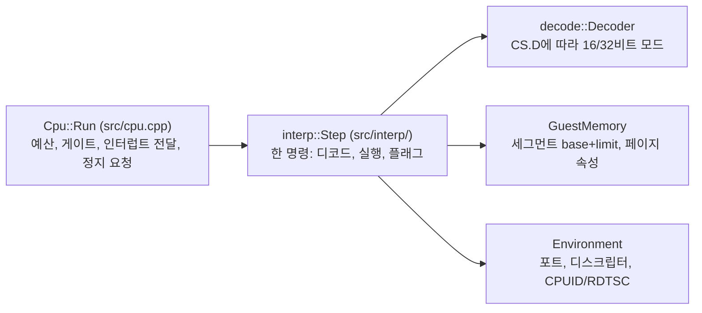

# #11 설계 : 인터프리터 1차 — 실행 코어, 플래그 모델, 정수 명령 핵심 그룹 / #11 design : interpreter increment 1 — the execution core, the flag model and the core integer groups

이슈: [#11](https://github.com/reexec/rex86/issues/11) | 지시서: [20261007-i011](../work-orders/20261007-i011-interpreter-core.md) | 로그: [20261007-i011](../work-logs/20261007-i011-interpreter-core.md)

## 배경 / Background

0단계가 계약을, #5가 디코더를, #7이 독립 합격 기준(SingleStepTests)을 세웠다. 이 작업은 1단계의 본체인 인터프리터를 시작한다. 인터프리터는 정확성 기준이므로 한 번에 완성하려 하지 않고, **실행 코어를 먼저 세우고 명령 그룹을 증분으로 더한다**. 각 증분의 합격 기준은 SingleStepTests 실행 비교(#7의 2차)다: 구현된 명령은 통과해야 하고, 미구현 명령은 조용히 실패하는 대신 명시적으로 건너뛰며 커버리지로 보고된다.

*Phase 0 built the contract, #5 the decoder and #7 the independent acceptance bar. This task starts phase 1's main body. The interpreter is the correctness reference, so it is not attempted in one stroke: **the execution core comes first and instruction groups accrue incrementally**, each increment accepted by the SingleStepTests execute-and-compare (#7's stage 2) — implemented instructions must pass, and unimplemented ones are skipped explicitly and reported as coverage rather than failing silently.*

## 결정 1: 실행 코어와 의미의 분리 / Decision 1: the execution core apart from the semantics

* `Cpu::Run`(cpu.cpp)이 루프를 소유한다: 정지 요청 확인, **명령 실행 전** 게이트 주소 확인(`kGate`), IF가 켜진 명령 경계에서 pending 인터럽트 전달, 예산 소진(`kBudgetExhausted`). x86 의미는 전혀 없다.
* `interp::Step`(src/interp/)이 한 명령을 실행한다: CS의 D 비트로 디코드 모드를 고르고, 디코드하고, 의미를 수행하고, 플래그를 즉시 계산한다. 결과는 "retire했다" 또는 "이벤트로 멈춘다"다.
* 디코드는 명령마다 수행한다. #1 설계의 사전 디코드 블록 캐시는 측정 뒤의 최적화다("측정 없이 최적화하지 않는다"). 인터페이스가 Step 단위이므로 블록 캐시는 뒤에 내부 교체로 들어온다.
* 인터럽트 전달은 현재 스택 폭(SS.D)에 맞는 FLAGS/CS/IP 프레임을 푸시하고 IF/TF를 끄고 `InterruptTarget`으로 점프한다. 호스트가 거절하면 `kSoftwareInterrupt`로 멈춘다(벡터 유지).
* **공개 계약 헤더는 바뀌지 않는다.** `ActiveEngine`이 `kInterpreter`를 돌려주고 `Run`이 실제로 실행하는 것은 #1이 예약해 둔 동작의 구현이다. 소비자 영향: rePIU·re2DJ 어댑터는 이제 `kNoEngine` 처리 분기 대신 실제 이벤트를 받는다. 어댑터 코드 변경은 불필요하다(이벤트 계약 동일).

*`Cpu::Run` (cpu.cpp) owns the loop — stop requests, the gate check **before** the instruction at a gate address runs (`kGate`), pending-interrupt delivery at instruction boundaries with IF set, and the budget — and holds no x86 semantics. `interp::Step` executes one instruction: it picks the decode mode from CS.D, decodes, performs the semantics and computes flags eagerly, returning either "retired" or "stopped with this event". Decoding is per instruction: design #1's pre-decoded block cache is an optimization that follows measurement, and the Step-shaped interface lets it arrive later as an internal replacement. Interrupt delivery pushes the FLAGS/CS/IP frame at the current stack width, clears IF/TF and jumps through `InterruptTarget`, stopping with `kSoftwareInterrupt` when the host declines. **No public header changes**: `ActiveEngine` answering `kInterpreter` and `Run` actually running implement the behavior #1 reserved, and the consumers' adapters need no code change (the event contract is identical).*

## 결정 2: 주소 생성과 폴트 / Decision 2: address generation and faults

목표 1(#9에서 보강된 주소·세그먼테이션 의미)을 처음부터 이 경로에 둔다.

* 유효 주소는 주소 크기(명령의 address width)로 wrap한다(16비트면 `& 0xFFFF`).
* 선형 주소 = 세그먼트 base + 유효 주소. limit 검사(`offset + size - 1 > limit` → `kGeneralProtection` 폴트 이벤트, 평탄 세그먼트는 빠른 경로).
* `GuestMemory` 접근 실패(범위 밖, 페이지 속성)는 `kAccessViolation` 폴트 이벤트. 폴트 시 명령은 retire되지 않고 EIP는 명령 시작을 가리킨다.
* 스택 접근은 SS를, 일반 접근은 디코더가 보고하는 세그먼트(override 반영)를 쓴다.
* `kTranslated` 페이지로의 store는 지금도 `Cpu::InvalidateCode` 경로와 같은 플래그 제거 + `OnCodePageWritten` 보고를 수행한다(목표 2의 SMC 완료 기준의 인터프리터 쪽 절반).

*Goal 1's address/segmentation semantics (as #9 strengthened them) live on this path from the start: effective addresses wrap at the instruction's address width; linear = segment base + offset with the limit check (`kGeneralProtection` on violation, a fast path for flat segments); a failed `GuestMemory` access is a `kAccessViolation` fault event; a faulting instruction does not retire and EIP stays at its start; stack accesses use SS and others the decoder-reported segment with overrides. A store to a `kTranslated` page clears the flag and reports `OnCodePageWritten`, the interpreter half of goal 2's SMC bar.*

## 결정 3: 1차 명령 그룹 / Decision 3: the first instruction groups

| 포함 (1차) | 제외 (후속 증분) |
|---|---|
| MOV(r/m/imm/seg 읽기), MOVZX/MOVSX, LEA, XCHG, NOP | 시프트/회전(SHL/SHR/SAR/ROL/ROR/RCL/RCR) |
| ADD/ADC/SUB/SBB/AND/OR/XOR/CMP/TEST, INC/DEC, NEG/NOT | MUL/IMUL/DIV/IDIV |
| PUSH/POP(r/m/imm), PUSHF/POPF, PUSHA/POPA | 문자열 명령(MOVS/STOS/LODS/SCAS/CMPS, REP) |
| Jcc/JMP/CALL/RET(near, 직접·간접), JCXZ/LOOP류 | far 제어 흐름, 세그먼트 레지스터 적재 |
| CLC/STC/CMC/CLD/STD/CLI/STI, LAHF/SAHF, CBW/CWDE/CWD/CDQ | x87, MMX/SSE |
| HLT(`kHalted`), INT n(`kSoftwareInterrupt`), IN/OUT(콜백 → `kPortIo`), RDTSC/CPUID | BCD(AAA/DAA류), BT류, SETcc, CMOVcc, BSF/BSR |

* 플래그는 폭(8/16/32)별 공용 헬퍼로 즉시 계산한다: 덧셈/뺄셈 계열(CF, OF, SF, ZF, AF, PF), 논리 계열(CF=OF=0), INC/DEC(CF 보존).
* 미구현 mnemonic은 `kIllegalInstruction` 폴트가 아니라 **전용 내부 상태로 구분해** SST 러너가 "미구현 건너뜀"으로 집계할 수 있게 한다. 코어 외부로는 `kFault`/`kIllegalInstruction`으로 보고한다(조용한 더미 금지 규칙).

*The first groups cover the moves, the ALU family, the stack operations, near control flow, the flag and width-conversion instructions, and the boundary instructions (HLT, INT n, port I/O through the callbacks, RDTSC/CPUID); shifts/rotates, multiply/divide, strings, far control flow, segment loads, x87/MMX/SSE, BCD, bit tests, SETcc/CMOVcc and BSF/BSR are later increments. Flags are computed eagerly through shared width-parametric helpers (add/sub family with CF/OF/SF/ZF/AF/PF, logic with CF=OF=0, INC/DEC preserving CF). An unimplemented mnemonic is distinguished internally so the SST runner tallies it as "skipped: unimplemented", while outside the core it reports as a `kIllegalInstruction` fault (no quiet dummies).*

## 결정 4: SST 2차 — 실행 비교 / Decision 4: SST stage 2 — execute and compare

`rex86_sst --execute`:

* 16 MiB `GuestMemory`(전 페이지 RWX)를 한 번 만들고 테스트마다 초기 RAM 항목을 쓰고 실행 뒤 **건드린 주소만** 0으로 되돌린다.
* real mode 세그먼트는 디스크립터 캐시로 표현한다: base = selector × 16, limit 0xFFFF, D=0. 코어 수정이 필요 없다(#7 설계의 예상대로).
* 한 테스트 = `Cpu::Step()` 한 번. 비교: `FINA` 레지스터(변경된 것만, `RM32` 마스크로 undefined 제외 — eflags 포함), `FINA` RAM 바이트.
* 건너뛰는 것(각각 집계·보고): 미구현 mnemonic, 예외를 기록한 테스트(`EXCP` — 폴트 의미 비교는 후속), 세그먼트 레지스터를 바꾸는 테스트. 통과/실패/건너뜀과 mnemonic별 커버리지를 요약한다.
* 완료 기준: 구현된 그룹의 테스트에서 **불일치 0**. 전체 커버리지 %는 보고일 뿐 이 작업의 합격 조건이 아니다.

*`rex86_sst --execute` builds one 16 MiB RWX `GuestMemory`, writes each test's initial RAM and reverts only the touched addresses afterwards; real-mode segments are descriptor caches with base = selector × 16, limit 0xFFFF and D=0, needing no core change. One test is one `Cpu::Step()`, compared against the FINA registers (changed ones only, undefined bits removed by the RM32 masks, eflags included) and the FINA RAM bytes. Skipped and tallied separately: unimplemented mnemonics, tests recording an exception (fault-semantics comparison is a later increment) and tests changing segment registers. The bar: **zero mismatches** on the implemented groups' tests; the overall coverage percentage is a report, not this task's pass condition.*

## 미확정과 위험 / Unresolved and risks

| 항목 | 상태 | 처리 |
|---|---|---|
| 386 실측 undefined 플래그가 RM32 마스크로 전부 가려지는가 | **추정** | 실행 비교에서 불일치가 나오면 그 명령을 로그에 기록하고 SDM과 대조해 판단 |
| real mode 한정 의미(IVT, 16비트 프레임)와 32비트 사용자 모드 코어의 차이 | **확인됨** | INT·예외 테스트는 1차에서 건너뛴다. 코어의 인터럽트 프레임은 SS.D를 따른다 |
| 명령마다 디코드하는 비용 | 측정 전 | 벤치마크 하네스(목표 3) 뒤에 블록 캐시로 교체 판단 |

*Risks: whether the RM32 masks cover every hardware-undefined flag is an assumption checked by the comparison itself (mismatches are logged and judged against the SDM); real-mode-only semantics (IVT, 16-bit frames) differ from a 32-bit user-mode core, so INT/exception tests are skipped in this increment while the core's own interrupt frame follows SS.D; per-instruction decode cost awaits the benchmark harness before a block cache replaces it.*

## 검증 / Verification

* 단위 테스트(`tests/unit/interp_test.cpp`): 합성 코드로 ALU 플래그 경계값, 8/16/32비트 피연산자, 스택 push/pop, call/ret, Jcc, 게이트 정지, 예산, HLT/INT/포트 이벤트, 메모리 폴트(EIP 보존), kTranslated store 보고.
* SST 실행 비교: 구현 그룹의 파일들에서 불일치 0. 결과 수치를 작업 로그에 기록.
* 로컬 Windows x86 빌드와 `ctest`, 나머지 호스트는 push 시 CI.

*Unit tests cover ALU flag edge cases across widths, stack and call/ret, Jcc, gate stops, the budget, the HLT/INT/port events, memory faults preserving EIP and the kTranslated store report; the SST comparison shows zero mismatches on the implemented groups with the figures recorded in the log; the local Windows x86 build and ctest pass and CI checks the other hosts on push.*
