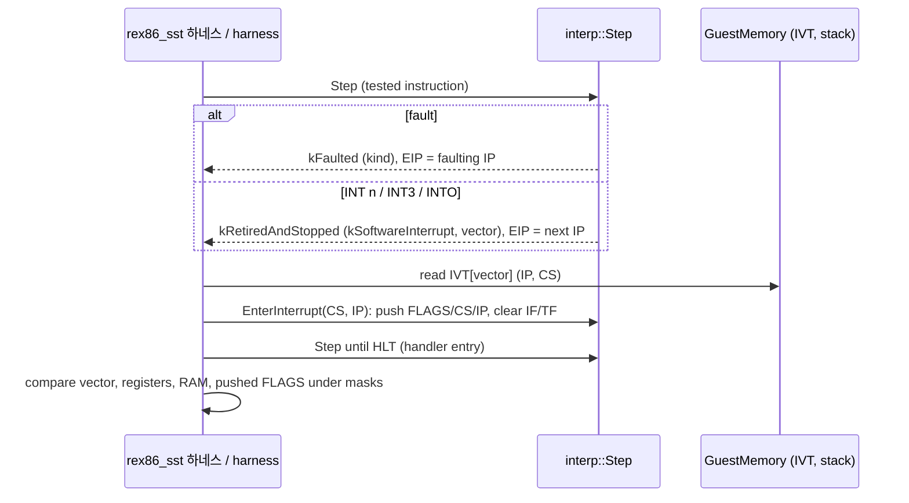

# #17 설계 : SST 예외 의미 비교 — real mode IVT 전달 흉내와 세그먼트 limit 바로잡기 / #17 design : SST exception comparison — emulated real-mode IVT delivery and the corrected segment limit

이슈: [#17](https://github.com/reexec/rex86/issues/17) | 지시서: [20261008-i017](../work-orders/20261008-i017-sst-exception-comparison.md) | 로그: [20261008-i017](../work-logs/20261008-i017-sst-exception-comparison.md)

## 범위 / Scope

#15까지 SST 실행 비교는 예외를 기록한 테스트 150,304건을 `skipped_exception`으로 건너뛰었다. 이 작업은 그 테스트들을 비교 대상으로 만든다. 같은 장치로 지금 경계로 분류되는 INT n/INT3/INTO(`kSoftwareInterrupt`)도 비교 대상이 된다. 함께 README의 낡은 현재 상태 문장과 달성도 표를 갱신한다.

`EXCP` 기록의 실측 분포(전체 스위트, `EXCP.number`별):

| 벡터 | 건수 | 주된 출처 |
|---|---|---|
| 13 (#GP) | 93,269 | 67 prefix(32비트 주소) 파일에서 오프셋 > 0xFFFF |
| 6 (#UD) | 34,879 | 비잠금 명령의 LOCK, LEA/LDS/LES 등의 레지스터 피연산자 |
| 12 (#SS) | 16,566 | SS 기준 접근의 limit 위반 |
| 5 (BOUND) | 1,858 | BOUND |
| 0 (#DE) | 1,009 | DIV/IDIV |
| 4, 3, 1 | 232, 104, 9 | INTO, INT3, INT1 |
| 그 밖 (2, 7~255) | 약 2,600 | `CD.MOO`(INT n)의 벡터별 |

*Through #15 the SST execute-and-compare skipped the 150,304 tests that record an exception (`skipped_exception`); this task makes them comparable, and the same mechanism makes INT n/INT3/INTO (today `kSoftwareInterrupt` boundaries) comparable too. The README's stale current-state text and its attainment table are refreshed with it. Measured `EXCP` distribution by vector: #GP 93,269 (32-bit-address files, offsets above 0xFFFF), #UD 34,879 (LOCK on non-lockable instructions, register operands of LEA/LDS/LES...), #SS 16,566 (limit violations through SS), BOUND 1,858, #DE 1,009, INTO/INT3/INT1 232/104/9, and about 2,600 more spread over `CD.MOO`'s INT n vectors.*

## 결정 1: real mode 세그먼트 limit은 0xFFFF다 — #11의 'unreal' 결론 정정 / Decision 1: the real-mode segment limit is 0xFFFF — correcting #11's 'unreal' conclusion

#11은 `6784.MOO` #1076(`test [ds:eax-183Bh],bl`)처럼 오프셋이 0xFFFF를 넘는데 예외가 없는 테스트를 근거로 리그의 디스크립터 캐시가 4GiB limit('unreal')이라고 결론 내리고 하네스에 4GiB limit을 두었다. 이번 실측이 이 결론을 뒤집는다.

* 업스트림 README: "real mode 테스트는 디스크립터 캐시를 기본값으로 초기화하므로 모든 세그먼트의 limit은 0xFFFF", `EA32`의 "offset > limit이면 예외".
* 67 prefix 파일의 `EA32`를 가진 테스트 502,844건 가운데 오프셋 > 0xFFFF이면서 #GP/#SS인 것이 97,380건이다. 어긋나는 것은 모두 설명된다: LOCK #UD가 먼저인 경우, BT 계열(레지스터 비트 오프셋이 실제 주소를 옮김 — `EA32`는 기준 주소만 기록), 오프셋 0xFFFF에서 2바이트 이상 접근(limit을 넘어 #GP/#SS), 무효 SIB(386 quirk로 실제 EA가 다름).
* #11의 근거 테스트 자체가 무효 SIB다. `67 84 9C E0 C5E7FFFF`의 SIB `E0`은 index=없음, scale=8이고 386은 EA = EAX×8 − 0x183B = 0x7C75(limit 안)를 계산한다. 이미 `skipped_hw_quirk`로 분리되는 인코딩이다.

따라서 하네스의 디스크립터(초기 적용과 `LoadDescriptor` 모두)를 limit 0xFFFF로 바꾼다. 코어는 바뀌지 않는다(`Linearize`가 이미 limit을 검사한다). `docs/analysis/singlesteptests-386ex-deviations.md` 1절의 해당 항목을 정정한다.

*#11 concluded from tests like `6784.MOO` #1076 (`test [ds:eax-183Bh],bl`, an offset above 0xFFFF without a recorded exception) that the rig's descriptor caches carry a 4 GiB 'unreal' limit, and gave the harness 4 GiB limits. This task's measurements overturn that: upstream's README says real-mode tests start from default descriptor caches with 0xFFFF limits and that an `EA32` offset above the limit should fault; of the 502,844 tests with `EA32` in the 67-prefixed files, 97,380 have offsets above 0xFFFF and record #GP/#SS, and every disagreement is explained (LOCK's #UD first, the BT family whose register bit offset moves the real address while `EA32` records the base, 2+-byte accesses at offset 0xFFFF crossing the limit, invalid SIBs whose real EA differs); and #11's own evidence is an invalid SIB — `E0` has no index and scale 8, so the 386 computes EAX×8 − 0x183B = 0x7C75, inside the limit, an encoding already counted as `skipped_hw_quirk`. The harness's descriptors (initial apply and `LoadDescriptor`) therefore get limit 0xFFFF; the core is unchanged (`Linearize` already checks limits), and the analysis topic's section 1 entry is corrected.*

## 결정 2: SS 기준 limit 위반은 `FaultKind::kStackFault`다 / Decision 2: an SS limit violation is `FaultKind::kStackFault`

SDM(Vol. 3A 6.15, Interrupt 12)은 SS를 통한 참조(스택 연산과 SS 기준 메모리 피연산자)의 limit 위반을 #SS로, 그 밖의 세그먼트를 #GP로 정의한다. 지금 코어는 둘 다 `kGeneralProtection`이라 SDM 의미가 사라지고, SST의 #SS 16,566건과 비교할 수 없다. `FaultKind`에 `kStackFault`를 더하고 `Linearize`가 세그먼트가 SS일 때 이를 낸다(not-present SS도 #SS — SDM의 "SS 세그먼트가 present가 아니면 #SS").

**공개 계약 변경과 소비자 영향**: `include/rex86/environment.h`의 열거형에 값 하나가 더해진다(값은 `kGeneralProtection` 바로 뒤, `kOther`의 정수값이 하나 밀림). 소비자는 소스로 빌드하므로 ABI 영향은 재빌드뿐이다. 두 어댑터는 새 값을 매핑해야 한다.

* rePIU(`platform` FaultKind): DOS/4GW 게스트의 스택 폴트는 지금까지 GP로 오던 것이 이제 별도로 온다. DPMI 예외 12로 전달하는 것이 SDM과 맞다. 별도 처리가 없다면 GP와 같은 경로로 매핑한다.
* re2DJ(`NativeFaultKind`): 평탄 4GiB SS(`IsFlat`)는 limit 검사를 건너뛰므로 Win32 게스트에서는 이 값이 나오지 않는다. 열거형 완전성을 위해 GP와 같은 경로로 매핑하면 충분하다.

머지 뒤 두 소비자 저장소에 tag 갱신 작업을 만든다(소비자 규칙).

*The SDM (Vol. 3A 6.15, Interrupt 12) defines a limit violation through SS — stack operations and SS-based memory operands — as #SS and any other segment's as #GP. The core reports both as `kGeneralProtection` today, which loses SDM meaning and cannot match SST's 16,566 #SS tests. `FaultKind` gains `kStackFault`, raised by `Linearize` when the segment is SS (a not-present SS is #SS too, per the SDM). Public-contract change and consumer impact: one enumerator added right after `kGeneralProtection` (shifting `kOther`'s integer value); consumers build from source, so the ABI cost is a rebuild, and both adapters map the new value — rePIU would ideally deliver it as DPMI exception 12, otherwise along its GP path; re2DJ's flat 4 GiB SS skips the limit check (`IsFlat`), so the value never arises for its Win32 guests and mapping it along the GP path suffices for completeness. After the merge, tag-update tasks are opened in both consumer repositories per the consumer rules.*

## 결정 3: IVT 전달은 하네스가 흉내 낸다 / Decision 3: the harness emulates IVT delivery

코어는 사용자 모드 CPU이고 호스트 계약은 "이벤트와 재개"다. 폴트는 `kFaulted` 이벤트로, INT n은 retire 뒤 `kSoftwareInterrupt` 이벤트로 멈추며, 예외를 어디로 보낼지는 호스트의 일이다. real mode IVT 전달은 SST 리그(실제 386의 real mode)의 사정이므로 **코어가 아니라 하네스가** 흉내 낸다. 하네스는 rePIU의 DPMI HLE가 할 일과 같은 자리에 선다.

전달 절차(하네스):

1. 이벤트에서 벡터를 정한다. 폴트: `kDivide`→0, `kSingleStep`→1, `kBreakpoint`→3, `kOverflow`→4, `kBound`→5, `kIllegalInstruction`→6, `kStackFault`→12, `kGeneralProtection`→13. 소프트웨어 인터럽트: `event.vector`.
2. 목적지를 IVT(선형 `vector × 4`의 IP:CS 워드 쌍)에서 읽는다.
3. 기존 `interp::EnterInterrupt`로 FLAGS/CS/IP를 push하고 IF/TF를 끄고 점프한다. push되는 IP는 폴트면 폴트 명령의 IP(코어가 EIP를 보존함), 트랩(INT n/INT3/INTO)이면 다음 명령의 IP(코어가 retire함)다 — SDM의 폴트/트랩 구분 그대로이고, 하네스는 아무것도 고치지 않는다.
4. 핸들러 첫 바이트에 생성기가 심은 HLT까지 계속 실행한다.

비교 규칙:

* 테스트가 `EXCP`를 기록했으면 코어가 같은 벡터의 이벤트를 내야 한다. 다른 벡터, 또는 이벤트 없이 HLT에 닿으면 불일치다. 반대로 `EXCP`가 없는데 코어가 전달 대상 이벤트를 내도 불일치다(지금까지 `kDivide`의 하드웨어 quirk 분류는 유지).
* 최종 레지스터와 RAM은 기존 규칙(RM32 마스크, f_umask)으로 비교한다. RAM에는 push된 프레임이 들어 있다.
* push된 FLAGS 이미지(`EXCP.flag_address`의 2바이트)는 eflags와 같은 정의 플래그 마스크로 비교한다. 업스트림 README가 이 주소를 제공하는 이유가 바로 이것이다(폴트 시점의 미정의 플래그).
* 전달 중 또 폴트가 나면(이중 폴트) 표현하지 않고 따로 센다. 스위트는 셧다운 테스트를 거른다고 밝힌다.

*The core is a user-mode CPU whose host contract is events and resumption: a fault stops as a `kFaulted` event, an INT n retires and stops as `kSoftwareInterrupt`, and where an exception goes is the host's business. Real-mode IVT delivery belongs to the SST rig (a real 386 in real mode), so the harness — not the core — emulates it, standing where rePIU's DPMI HLE stands. Delivery: map the event to a vector (kDivide 0, kSingleStep 1, kBreakpoint 3, kOverflow 4, kBound 5, kIllegalInstruction 6, kStackFault 12, kGeneralProtection 13; a software interrupt's own vector), read IP:CS from the IVT at linear `vector × 4`, call the existing `interp::EnterInterrupt` to push FLAGS/CS/IP, clear IF/TF and jump — the pushed IP is the faulting instruction's for faults (the core preserves EIP) and the next instruction's for traps (the core retired them), the SDM's fault/trap split with nothing patched by the harness — and run on to the HLT the generator seeds at the handler. Comparison: a recorded `EXCP` requires the core to raise the same vector, and a different vector or reaching the HLT without one is a mismatch, as is raising a deliverable event where nothing was recorded (the existing `kDivide` hardware-quirk classification stays); final registers and RAM — which holds the pushed frame — are compared under the existing RM32/f_umask rules; the pushed FLAGS image at `EXCP.flag_address` is compared under the same defined-flag mask as eflags, which is why upstream provides that address; and a fault during delivery (a double fault) is not represented but counted apart, the suite stating that shutdown tests are filtered out.*

## 결정 4: 남는 경계 / Decision 4: what stays a boundary

* 포트 입력(IN/INS): 리그의 버스 입력을 재현할 근거가 없다(#15 그대로).
* 특권 명령(`kPrivilegedInstruction`): 사용자 모드 코어가 설계상 거절한다. real mode 리그에서는 실행된다.
* 하드웨어 quirk(무효 SIB, IDIV 음수 오버플로)와 표현 불가(24비트 버스 wrap, 긴 a32 REP 중단)는 #11/#13 분류 그대로다. 예외 테스트에도 같은 분류를 먼저 적용한다.

*Port input stays a boundary (nothing reproduces the rig's bus input); privileged instructions stay one (a user-mode core refuses them by design, while the real-mode rig executes them); hardware quirks (invalid SIB, IDIV negative overflow) and unrepresentable cases (24-bit bus wrap, interrupted long a32 REPs) keep #11/#13's classification, applied to exception tests first as well.*

## 결정 5: 명령 인출과 CS limit / Decision 5: instruction fetch and the CS limit

SDM은 CS limit 밖 인출을 #GP로 정의한다. 지금 `Step`은 인출이 limit에서 멈추고 디코드가 바이트 부족으로 실패하면 `kIllegalInstruction`을, 한 바이트도 못 읽으면 `kAccessViolation`을 낸다. limit 때문에 인출이 잘렸고 디코드가 실패하면(또는 인출 0바이트면) `kGeneralProtection`을 낸다. 페이지 속성 때문에 잘린 경우는 지금처럼 `kAccessViolation`이다. SST에 이 경우가 있는지는 구현 후 실측으로 확인해 로그에 남긴다. 분기 목적지가 CS limit 밖인 경우(SDM: 분기 명령에서 #GP)도 SST가 드러내면 같은 작업에서 다룬다.

*The SDM makes a fetch beyond the CS limit #GP. Today `Step` reports `kIllegalInstruction` when the fetch stops at the limit and the decode runs out of bytes, and `kAccessViolation` when not one byte is fetchable; a fetch truncated by the limit whose decode fails (or that fetched nothing) now raises `kGeneralProtection`, while a truncation by page attributes stays `kAccessViolation`. Whether the suite exercises this is measured after implementation and logged; a branch target beyond the CS limit (SDM: #GP at the branch) is handled in this task too if the suite exposes it.*

## README / README

* 첫머리 경고 상자: "아직 실행 엔진이 없다"를 인터프리터의 현재 상태(정수 명령, SST 결과, 번역 백엔드·x87 미구현)로 바꾼다.
* 달성도 절의 "현재 명령 커버리지 0% (엔진 없음)"을 SST 수치로 바꾼다. 1단계 행에 #17을 더한다.

*The opening warning box drops "no execution engine yet" for the interpreter's current state (the integer set, the SST figures, no translation backend or x87 yet); the attainment section's "coverage 0% (no engine)" becomes the SST figures, and the phase 1 row gains #17.*

## 검증 / Verification

* 단위 테스트: SS 기준 메모리 피연산자와 PUSH의 limit 위반이 `kStackFault`, DS 기준은 `kGeneralProtection`(레지스터 무변경, EIP 보존). CS limit에서 잘린 인출이 `kGeneralProtection`.
* SST 실행 비교: 전체 스위트 **mismatches 0**, `skipped_exception`이 0에 가까워지는지(남는 것은 근거와 함께 로그에), 기존 1,592,800건이 limit 0xFFFF에서도 통과하는지.
* 로컬 Linux x64 빌드와 `ctest`, 나머지 호스트는 push 시 CI.

*Unit tests: SS-based memory operands and PUSH beyond the limit raise `kStackFault`, DS-based ones `kGeneralProtection` (registers unchanged, EIP preserved), and a fetch truncated at the CS limit raises `kGeneralProtection`. SST: **zero mismatches** across the suite, `skipped_exception` driven toward zero (whatever remains logged with reasons), and the existing 1,592,800 tests still passing under limit 0xFFFF. Local Linux x64 build and ctest; CI covers the other hosts on push.*
