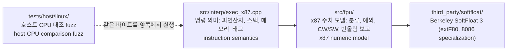
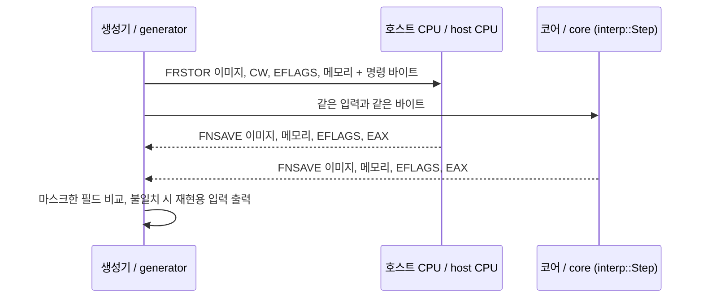

# #19 설계 : x87 1차 — SoftFloat 기반 80비트 x87과 호스트 CPU 대조 fuzz / #19 design : x87 increment 1 — an 80-bit x87 on SoftFloat and the host-CPU comparison fuzz

이슈: [#19](https://github.com/reexec/rex86/issues/19) | 지시서: [20261008-i019](../work-orders/20261008-i019-x87-increment-1.md) | 로그: [20261008-i019](../work-logs/20261008-i019-x87-increment-1.md)

## 범위 / Scope

[#1 설계 결정 4](20261007-i001-repository-and-public-contract.md)는 x87을 처음부터 80비트로, 모든 호스트에서 비트 단위로 같게 두기로 했고, 구현 후보로 Berkeley SoftFloat 3의 `extF80`을 적었다. 이 작업은 그 결정을 구현한다. 1단계 완료 기준 가운데 "x87"과 "호스트 CPU 대조 fuzz"(x87 부분)가 여기 들어간다.

| 그룹 | 명령 |
|---|---|
| 적재·저장 | FLD/FST/FSTP(m32, m64, m80, ST(i)), FILD/FIST/FISTP(m16, m32, m64), FBLD/FBSTP, FXCH, FLDZ/FLD1/FLDPI/FLDL2T/FLDL2E/FLDLG2/FLDLN2 |
| 산술 | FADD/FSUB/FSUBR/FMUL/FDIV/FDIVR(+P, 정수 피연산자 FI*), FSQRT, FABS, FCHS, FRNDINT, FSCALE, FXTRACT, FPREM, FPREM1 |
| 비교 | FCOM/FCOMP/FCOMPP, FUCOM/FUCOMP/FUCOMPP, FICOM/FICOMP, FTST, FXAM, FCOMI/FCOMIP/FUCOMI/FUCOMIP(P6) |
| 조건 이동 | FCMOVcc(P6) |
| 제어 | FNINIT, FLDCW, FNSTCW, FNSTSW(m16, AX), FNCLEX, FNSTENV/FLDENV, FNSAVE/FRSTOR, FINCSTP/FDECSTP, FFREE, FNOP, WAIT/FWAIT의 #MF |

* **제외(2차)**: 초월함수 FSIN, FCOS, FSINCOS, FPTAN, FPATAN, F2XM1, FYL2X, FYL2XP1. SoftFloat에 없고, 하드웨어 결과를 비트 단위로 재현하는 문제는 따로 설계해야 한다(결정 8). 1차 동안 이들은 `kUnimplemented`다.
* **제외(범위 밖)**: FISTTP(SSE3), FXSAVE/FXRSTOR(SSE 증분), 386 이전 명령(FENI/FDISI/FSETPM은 387 이후 no-op이며 그렇게 구현).
* 소비자 census가 아직 없으므로 범위는 "P6까지의 x87 전체에서 초월함수 제외"로 잡는다. rePIU 작업 514가 확인한 80비트 메모리 피연산자와 `fldcw`가 이 범위에 들어간다.

*[#1's decision 4](20261007-i001-repository-and-public-contract.md) set x87 at 80 bits from the start, bit-identical on every host, naming Berkeley SoftFloat 3's `extF80` as the candidate; this task implements it, covering phase 1's "x87" and the x87 part of the "host-CPU comparison fuzz". Scope: loads and stores (real, integer, BCD, FXCH, the constants), arithmetic (the six basic operations with pop and integer forms, FSQRT, FABS, FCHS, FRNDINT, FSCALE, FXTRACT, FPREM, FPREM1), comparisons (FCOM/FUCOM/FICOM families, FTST, FXAM, P6's FCOMI family), P6's FCMOVcc, and control (FNINIT, FLDCW, FNSTCW, FNSTSW, FNCLEX, FNSTENV/FLDENV, FNSAVE/FRSTOR, FINCSTP/FDECSTP, FFREE, FNOP, #MF on WAIT). The transcendentals (FSIN, FCOS, FSINCOS, FPTAN, FPATAN, F2XM1, FYL2X, FYL2XP1) wait for increment 2 — SoftFloat lacks them and reproducing hardware bits is its own design problem (decision 8) — and stay `kUnimplemented` meanwhile; FISTTP (SSE3) and FXSAVE/FXRSTOR (the SSE increment) are out of scope, and the pre-387 FENI/FDISI/FSETPM are the 387+ no-ops. With no consumer census yet, the scope is "the whole x87 through P6 minus transcendentals", which contains the 80-bit memory operands and `fldcw` sites rePIU's task 514 found.*

## 결정 1: SoftFloat 3을 vendoring하고 x87 수치 모델을 `src/fpu/`에 둔다 / Decision 1: vendor SoftFloat 3 and keep the x87 numeric model in `src/fpu/`

구조는 세 층이다.

* **`third_party/softfloat/`**: [berkeley-softfloat-3](https://github.com/ucb-bar/berkeley-softfloat-3)의 Release 3e 커밋(`f74b1e4`)에서 `build/template-FAST_INT64/Makefile`이 나열한 소스와 `8086` specialization을 수정 없이 가져온다. `platform.h`만 이 저장소가 쓴다(리틀 엔디언, `SOFTFLOAT_FAST_INT64`, `THREAD_LOCAL`). C 정적 라이브러리 `rex86_softfloat`로 빌드하고 코어에 PRIVATE로 링크한다. 순수 정수 연산이라 x86, x86-64, wasm32, AArch64에서 비트 단위로 같다. `THIRD_PARTY_NOTICES.md`에 커밋과 라이선스를 기록한다.
* **`8086` specialization을 쓰는 이유**: x87의 NaN 규칙을 따른다(두 NaN 중 유효숫자가 큰 쪽 전파, 기본 NaN은 음수 QNaN `0xFFFF C000000000000000` = x87의 "real indefinite"). tininess는 반올림 후에 판정한다.
* **`src/fpu/`(x87 수치 모델)**: x86 디코드를 모르는, 80비트 값과 CW/SW만 다루는 계층이다. 나중에 IR 백엔드가 helper 호출로 같은 코드를 쓴다. 이 계층이 SoftFloat이 다루지 않는 x87의 사정을 맡는다.
  - 피연산자 분류: 387 이후 x87은 unnormal, pseudo-NaN, pseudo-infinity를 **무효 피연산자(#IA)**로 다루고, pseudo-denormal(지수 0, J=1)은 denormal로 받아들인다. SoftFloat은 unnormal을 정규화해 계산하므로, 호출 전에 분류해 걸러낸다.
  - denormal 피연산자 예외(#D): SoftFloat에는 없으므로 산술 피연산자에서 직접 검출한다.
  - C1(반올림 방향): 결과가 inexact일 때 x87은 "올림이면 C1=1"을 보고한다. 같은 연산을 0 방향 반올림으로 한 번 더 계산해 크기를 비교해 정한다(inexact일 때만 추가 비용).
  - 정밀도 제어(PC): `extF80_roundingPrecision`(32/64/80)이 덧셈·뺄셈·곱셈·나눗셈·제곱근에만 적용된다. SDM과 같다.
  - SoftFloat의 전역 상태(`softfloat_roundingMode`, `softfloat_exceptionFlags`, `extF80_roundingPrecision`)는 연산마다 CW에서 설정하고 결과 플래그를 SW로 옮긴다. `THREAD_LOCAL`로 정의해 여러 스레드의 `Cpu`가 섞이지 않게 한다.

*Three layers. `third_party/softfloat/` vendors, unmodified, the sources `build/template-FAST_INT64/Makefile` lists plus the `8086` specialization from the Release 3e commit (`f74b1e4`) of berkeley-softfloat-3; only `platform.h` is this repository's (little-endian, `SOFTFLOAT_FAST_INT64`, `THREAD_LOCAL`). It builds as the C static library `rex86_softfloat`, linked PRIVATE into the core; being pure integer code it is bit-identical on x86, x86-64, wasm32 and AArch64; `THIRD_PARTY_NOTICES.md` records the commit and license. The `8086` specialization follows x87's NaN rules (the NaN with the larger significand propagates; the default NaN is the negative QNaN `0xFFFF C000000000000000`, x87's real indefinite) and detects tininess after rounding. `src/fpu/` is the x87 numeric model, knowing 80-bit values and CW/SW but no x86 decoding, so IR backends can later call the same code as helpers; it handles what SoftFloat does not: operand classification (the 387+ x87 treats unnormals, pseudo-NaNs and pseudo-infinities as invalid operands, #IA, and accepts pseudo-denormals as denormals, while SoftFloat would normalize unnormals, so they are filtered first), the denormal-operand exception (#D, detected directly), C1's round-up report (on an inexact result the operation is recomputed toward zero and the magnitudes compared — extra cost only when inexact), precision control (`extF80_roundingPrecision` applies to add, subtract, multiply, divide and square root only, as in the SDM), and SoftFloat's global state, set from CW before each operation with the flags moved to SW afterwards, declared `THREAD_LOCAL` so `Cpu`s on different threads never mix.*

## 결정 2: 상태는 기존 `X87State` 그대로, 태그는 2비트 / Decision 2: the existing `X87State`, with 2-bit tags

`CpuState::x87`(#1)의 필드를 그대로 쓴다. 공개 계약은 바뀌지 않는다.

* `registers[8]`은 **물리 레지스터** R0~R7이다. ST(i) = R[(TOP + i) mod 8]이고, TOP은 SW 비트 11~13이다.
* `tag_word`는 FNSTENV 형식의 2비트 태그 8개다(00 valid, 01 zero, 10 special, 11 empty). 값을 쓸 때마다 내용에서 다시 계산한다.
* FLDENV/FRSTOR가 읽은 태그는 "비었음(11)인가"만 쓰고, 나머지는 레지스터 내용에서 다시 계산한다(SDM의 FXRSTOR 축약 태그와 같은 원리, P6 이후 동작). 이 해석은 호스트 대조로 확인한다.
* `last_instruction_pointer/selector`, `last_operand_pointer/selector`, `last_opcode`(FIP/FCS/FDP/FDS/FOP): 제어 명령(FNINIT, FLDCW, FNSTCW, FNSTSW, FNSTENV, FLDENV, FNSAVE, FRSTOR, FNCLEX, WAIT)이 아닌 x87 명령마다 갱신한다. 값은 게스트 주소(CS 선택자와 오프셋, 메모리 피연산자의 세그먼트 선택자와 오프셋)이고, FOP는 opcode의 하위 11비트다.

*`CpuState::x87` (#1) is used as is; the public contract does not change. `registers[8]` are the physical registers R0–R7, ST(i) = R[(TOP + i) mod 8] with TOP in SW bits 11–13; `tag_word` holds eight FNSTENV-format 2-bit tags (valid, zero, special, empty), recomputed from contents on every write; FLDENV/FRSTOR take only "empty or not" from the loaded tags and recompute the rest from the registers (the principle of FXRSTOR's abridged tags, P6+ behavior), an interpretation the host comparison checks; and FIP/FCS/FDP/FDS/FOP are updated by every x87 instruction except the control ones (FNINIT, FLDCW, FNSTCW, FNSTSW, FNSTENV, FLDENV, FNSAVE, FRSTOR, FNCLEX, WAIT), holding guest values: the CS selector and offset, the memory operand's segment selector and offset, and the opcode's low 11 bits.*

## 결정 3: 예외 — 마스크된 응답은 정확히, 마스크 안 된 예외는 #MF로 / Decision 3: exceptions — exact masked responses, #MF for unmasked ones

x87 예외 6종(IE 포함 스택 폴트 SF, DE, ZE, OE, UE, PE)을 SDM Vol. 1 8.4~8.5대로 다룬다.

* **마스크됨**: SDM의 기본 응답을 그대로 낸다. 무효 → real indefinite(또는 정수 indefinite `0x8000...`, BCD indefinite), 0으로 나눔 → 부호 있는 무한대, 오버플로 → 반올림 모드에 따른 무한대 또는 최대 유한값, 언더플로 → denormal 또는 0, 부정확 → 반올림 결과. 스택 오버플로/언더플로는 IE+SF, C1 = 1(오버플로) 또는 0(언더플로)이고 목적지에 indefinite를 넣는다.
* **마스크 안 됨**: SW에 플래그와 ES(오류 요약), B를 세운다.
  - 연산 전 예외(IE, 스택 폴트, DE, ZE): 목적지와 TOP이 바뀌지 않는다(SDM).
  - 연산 후 예외(OE, UE): 레지스터 목적지에는 지수를 24576만큼 조정한 결과를 넣는다(SDM 8.4.4, 8.5.5). 메모리 목적지(FST m32/m64 등)는 저장하지 않는다. 지수 조정 결과는 피연산자를 미리 2^±12288로 나눠 계산한다(곱셈·나눗셈은 양쪽 피연산자에 나눠 걸면 중간값이 표현 범위를 벗어나지 않는다. 덧셈·뺄셈은 큰 쪽이 최대 지수 근처이므로 양쪽에 2^∓24576을 건다. 이때 작은 쪽이 0으로 사라지면 같은 부호의 최소 denormal로 바꿔 sticky를 보존한다).
  - PE: 결과를 정상으로 저장한다.
* **#MF 전달**: 마스크 안 된 예외가 대기(ES=1) 중이면, 다음의 **대기형** x87 명령(FN 접두가 아닌 명령과 WAIT/FWAIT)이 실행 전에 `FaultKind::kFloatingPoint`로 폴트한다(EIP는 그 명령, 상태는 그대로 — #17의 정확한 폴트). 비대기형(FNINIT, FNCLEX, FNSTSW, FNSTCW, FNSTENV, FNSAVE)은 검사하지 않는다. 소비자가 핸들러에서 FNCLEX 등으로 ES를 지운 뒤 재개한다. 이는 CR0.NE=1(네이티브 오류 보고)의 의미이며, 사용자 모드 코어는 IRQ13 경로를 모른다.

**공개 계약 변경과 소비자 영향**: `FaultKind::kFloatingPoint`(SDM #MF, 벡터 16)를 `kStackFault` 뒤에 더한다.

* rePIU(`platform::FaultKind`): FPU 전용 값이 없다. `kOther`로 매핑하거나 DPMI 예외 16/IRQ13(INT 75h) 경로로 보낸다. DOS 게임은 거의 모든 예외를 마스크하므로 실제로는 드물다.
* re2DJ(`NativeFaultKind`): Win32 SEH의 `STATUS_FLOAT_*` 코드로 매핑할 수 있다(어느 코드인지는 SW의 플래그로 정한다). MSVC 런타임 기본 CW(0x027F)는 전부 마스크한다.

머지 뒤 두 소비자 저장소에 매핑과 tag 갱신 작업을 만든다.

*The six x87 exceptions (IE with the stack fault SF, DE, ZE, OE, UE, PE) follow SDM Vol. 1 8.4–8.5. Masked, the SDM's default responses are produced exactly: the real indefinite (or the integer `0x8000...` and BCD indefinites) for invalid operations, a signed infinity for divide-by-zero, infinity or the largest finite value by rounding mode for overflow, a denormal or zero for underflow, the rounded result for inexact, and for stack overflow/underflow IE+SF with C1 = 1 or 0 and the indefinite in the destination. Unmasked, SW gets the flag, ES and B: pre-computation exceptions (IE, stack fault, DE, ZE) leave the destination and TOP unchanged; post-computation OE/UE store the result with its exponent adjusted by 24576 into a register destination (SDM 8.4.4, 8.5.5) and store nothing to memory, the adjusted result computed by pre-scaling the operands — 2^±12288 on each side for multiply and divide keeps every intermediate in range, and 2^∓24576 on both for add and subtract, where the larger operand sits near the extreme exponent, with a smaller operand that scales to zero replaced by the smallest denormal of its sign to keep the sticky bit; PE stores normally. #MF: with an unmasked exception pending (ES=1), the next waiting x87 instruction (any non-FN form, and WAIT/FWAIT) faults `FaultKind::kFloatingPoint` before executing, EIP at it and the state untouched (#17's precise faults); the non-waiting FNINIT, FNCLEX, FNSTSW, FNSTCW, FNSTENV and FNSAVE do not check; the consumer clears ES (FNCLEX and the like) in its handler and resumes — CR0.NE=1's native error reporting, as a user-mode core knows no IRQ13 path. Public-contract change: `FaultKind::kFloatingPoint` (SDM #MF, vector 16) after `kStackFault`. rePIU's `platform::FaultKind` has no FPU value, so it maps to `kOther` or goes the DPMI exception 16 / IRQ13 (INT 75h) way — rare, as DOS games mask nearly everything; re2DJ can map it to Win32 SEH's `STATUS_FLOAT_*` codes chosen by SW's flags, the MSVC runtime's default CW (0x027F) masking everything. Mapping and tag-update tasks go to both consumers after the merge.*

## 결정 4: 저장 형식 / Decision 4: environment and save formats

FNSTENV/FLDENV(14/28바이트)와 FNSAVE/FRSTOR(94/108바이트)는 **보호 모드 형식**을 쓰고, 16비트/32비트는 피연산자 크기로 고른다. 사용자 모드 코어의 소비자는 모두 보호 모드다. real mode 형식(선형 주소를 담는 형식)은 쓰지 않는다. FNSAVE는 저장 뒤 FNINIT을 수행한다(SDM).

*FNSTENV/FLDENV (14/28 bytes) and FNSAVE/FRSTOR (94/108 bytes) use the protected-mode formats, 16- or 32-bit by operand size — both consumers run in protected mode, and the real-mode layout (with linear addresses) is not used; FNSAVE performs FNINIT after storing (SDM).*

## 결정 5: FPREM/FPREM1과 그 밖의 비SoftFloat 연산 / Decision 5: FPREM/FPREM1 and the other non-SoftFloat operations

* **FPREM/FPREM1**: 유효숫자 정수 연산으로 직접 구현한다. 지수 차 D < 64이면 완전 나머지(C2=0, C0/C3/C1 = 몫의 비트 2/1/0)를 구한다. D ≥ 64이면 부분 나머지(C2=1)이고, 이때 한 번에 줄이는 비트 수 N은 SDM이 "32~63 사이 구현 의존"으로 둔다. N은 호스트 대조로 정하고 analysis에 기록한다. 결과는 언제나 정확(exact)하다.
* **FRNDINT**: `extF80_roundToInt`(CW의 반올림 모드, 결과가 바뀌면 PE).
* **FSCALE**: ST(1)을 0 방향으로 정수화한 값만큼 지수를 더한다. 범위를 넘으면 OE/UE 응답을 따른다. 큰 배율은 SDM의 특수값 표(무한대·0과의 조합)대로 처리한다.
* **FXTRACT**: 지수와 유효숫자를 분리한다. 0이면 ZE와 −∞ 지수, denormal은 정규화해서 분리한다.
* **FBLD/FBSTP**: 18자리 packed BCD. FBSTP는 CW 반올림으로 정수화하고, 범위를 넘으면 BCD indefinite(마스크 시)를 쓴다.
* **FXAM, FTST, 비교**: 분류는 결정 1의 분류 함수를 쓴다. 비교 결과는 C3/C2/C0(FCOM 계열)과 ZF/PF/CF(FCOMI 계열)이며, FUCOM 계열은 QNaN에서 IE를 내지 않는다.

*FPREM/FPREM1 are implemented directly on the integer significands: with exponent difference D < 64 the remainder is complete (C2=0, C0/C3/C1 = quotient bits 2/1/0); with D ≥ 64 it is partial (C2=1), reducing by N bits, which the SDM leaves "implementation-dependent between 32 and 63" — N comes from the host comparison and is recorded in the analysis; the result is always exact. FRNDINT is `extF80_roundToInt` (CW rounding, PE when the value changes). FSCALE adds ST(1) truncated toward zero to the exponent, with OE/UE responses beyond range and the SDM's special-value table for infinities and zeros. FXTRACT splits exponent and significand (ZE and a −∞ exponent for zero; denormals normalized first). FBLD/FBSTP handle 18-digit packed BCD, FBSTP rounding by CW and writing the BCD indefinite (masked) out of range. FXAM, FTST and the comparisons use decision 1's classifier; results go to C3/C2/C0 (FCOM family) or ZF/PF/CF (FCOMI family), the FUCOM family raising no IE for QNaNs.*

## 결정 6: 호스트 CPU 대조 fuzz / Decision 6: the host-CPU comparison fuzz

SST에는 FPU 테스트가 없다. AGENTS.md는 "명령 의미를 추가하는 작업은 단위 테스트와 호스트 CPU 대조를 같은 작업에서 둔다"고 정한다. `tests/host/linux/x87_fuzz.cpp`(첫머리에서 x86/x86-64 Linux가 아니면 `#error`)를 만든다.

* **같은 바이트를 양쪽에서 실행한다.** 실행 가능한 버퍼에 `push edx; popf; frstor [edi]; <명령>; fnsave [esi]; pushf; pop edx; ret`를 놓는다. 이 바이트열은 i386과 x86-64에서 뜻이 같다(REX 없이 `[edi]`/`[esi]`/`[ebx]`가 64비트 모드에서는 `[rdi]`/`[rsi]`/`[rbx]`). 호스트는 inline asm으로 이 버퍼를 호출하고, 코어는 같은 바이트를(ret 대신 HLT) 평탄 32비트 메모리에서 실행한다. 대상 명령의 메모리 피연산자는 `[ebx]` 기준이다.
* **입력**: 무작위 108바이트 FRSTOR 이미지(레지스터 값은 0, ±denormal, pseudo-denormal, unnormal, 최소/최대 지수, ±∞, QNaN/SNaN, pseudo-NaN, 정수 경계 같은 특수값에 비중을 둔다), 무작위 CW(반올림 4종, 정밀도 3종, 마스크 조합), 무작위 산술 플래그, 무작위 128바이트 메모리 피연산자. 호스트가 대상 명령 앞에서 #MF를 일으키지 않도록 SW의 예외 플래그는 마스크된 것만 남긴다.
* **비교**: FNSAVE 이미지의 CW/SW/TW와 레지스터 80바이트, 메모리 피연산자 128바이트, EFLAGS의 산술 플래그, EAX(FNSTSW AX)를 비교한다. FIP/FCS/FOP/FDP/FDS는 주소 공간이 달라 비교하지 않는다(코어의 값은 단위 테스트로 확인). 예약 비트(CW 비트 6 등)는 SDM 값을 쓴다.
* **실행**: 고정 시드로 CTest에 등록한다(빠른 회수). 긴 실행은 인자로 회수와 시드를 준다. x86 CI 러너(linux-x64, linux-x86)에서 돈다.
* **호스트 차이**: 로컬 호스트는 AMD Zen 3이고, CI 러너는 Intel일 수도 AMD일 수도 있다. 기준은 SDM이다. 제조사마다 다른 동작이 나오면 analysis에 "확인됨/제조사 의존"으로 기록하고, fuzz는 그 경우를 분류해 센다.
* 초월함수는 1차 fuzz 대상에서 뺀다.

*SST has no FPU tests, and AGENTS.md puts the host comparison in the same task as new instruction semantics, so `tests/host/linux/x87_fuzz.cpp` (an `#error` unless x86/x86-64 Linux) is built. Both sides run the same bytes: an executable buffer holds `push edx; popf; frstor [edi]; <instruction>; fnsave [esi]; pushf; pop edx; ret`, which means the same on i386 and x86-64 (without REX, `[edi]`/`[esi]`/`[ebx]` are `[rdi]`/`[rsi]`/`[rbx]` in 64-bit mode); the host calls it through inline asm and the core runs the same bytes (HLT for ret) in flat 32-bit memory, memory operands based on `[ebx]`. Inputs: a random 108-byte FRSTOR image weighted toward special values (zeros, ± denormals, pseudo-denormals, unnormals, extreme exponents, infinities, QNaN/SNaN, pseudo-NaNs, integer boundaries), a random CW (four roundings, three precisions, mask combinations), random arithmetic flags and a random 128-byte memory operand, with only masked exception flags left in SW so the host raises no #MF ahead of the instruction. Compared: the FNSAVE image's CW/SW/TW and 80 register bytes, the 128 memory bytes, the arithmetic EFLAGS and EAX (FNSTSW AX); FIP/FCS/FOP/FDP/FDS differ by address space and are left to unit tests, and reserved bits use the SDM's values. It runs under CTest with a fixed seed and a quick count, longer runs taking a count and seed, on the x86 CI runners (linux-x64, linux-x86). The local host is an AMD Zen 3 while CI runners may be Intel or AMD; the SDM is the reference, and vendor-specific behavior is recorded in the analysis as "confirmed / vendor-dependent" and counted apart by the fuzz. Transcendentals are excluded from the first fuzz.*

## 결정 7: 디스패치 / Decision 7: dispatch

`src/interp/exec_x87.cpp`가 `ExecuteX87(Ctx*)`를 제공하고 `ExecuteExtended`의 순서에 들어간다. 대기형 명령의 #MF 검사와 FIP/FDP 갱신은 이 파일의 진입부에서 한다. `Features::x87 = false`면 지금처럼 `kIllegalInstruction`이다(SDM의 CR0.EM=1은 #NM이지만, 기능 플래그의 계약은 "비활성 기능의 명령은 illegal instruction"이다).

*`src/interp/exec_x87.cpp` provides `ExecuteX87(Ctx*)`, placed in `ExecuteExtended`'s order; the waiting instructions' #MF check and the FIP/FDP updates happen at its entry. With `Features::x87 = false` the result stays `kIllegalInstruction` (the SDM's CR0.EM=1 would be #NM, but the Features contract makes a disabled feature's instruction illegal).*

## 결정 8: 초월함수는 2차에서 / Decision 8: transcendentals in increment 2

하드웨어 초월함수는 SDM이 정확도(대개 1 ulp 미만)만 규정하고 비트 결과는 세대·제조사마다 다르다. 같은 결과를 모든 호스트에서 내는 소프트웨어 구현(목표 2)은 가능하지만, "호스트 CPU와 불일치 0"(목표 1)은 이 부분에 그대로 적용할 수 없다. 2차 설계에서 기준(예: 특정 세대의 실측 재현, 또는 정확히 반올림된 값과 ulp 허용치)을 정한다.

*For hardware transcendentals the SDM specifies only accuracy (mostly under 1 ulp); the bits differ by generation and vendor. A software implementation identical on every host (goal 2) is possible, but goal 1's "zero divergence from the host CPU" cannot apply verbatim; increment 2's design sets the reference (reproducing a measured generation, or correctly rounded values with an ulp tolerance).*

## 구현 중 확정된 사항 / Settled during implementation

* **SoftFloat 버전**: 처음에 고른 upstream HEAD(`a0c6494`)는 3e 이후 추가된 bf16 코드가 8086 specialization에서 빌드되지 않는다. 3e 이후 커밋은 8086 specialization을 바꾸지 않으므로 Release 3e(`f74b1e4`)로 고정했다. `softfloat.h`는 `platform.h`를 포함하지 않으므로 C++ 쪽도 `platform.h`를 먼저 포함하고, C++에서는 `THREAD_LOCAL`을 `thread_local`로 정의한다(C의 `_Thread_local`과 링크 시 TLS 종류가 맞아야 한다).
* **예외 우선순위(결정 3 보강)**: SDM 4.9.2의 순서를 메모리 피연산자에도 적용한다. 단정밀도·배정밀도 메모리 피연산자는 변환 시점에 플래그를 내지 않고(SNaN은 SNaN으로 유지) "denormal이었음"을 `fpu::OperandHints`로 연산에 넘겨, #D가 스택 폴트, QNaN, 무효 연산, #Z 뒤에 판정된다. 메모리 피연산자는 스택 검사 전에 읽어 메모리 폴트가 가장 먼저 온다.
* **비교의 마스크 안 된 #IA**: SDM의 FCOM/FCOMI 결과 표("flags not set if unmasked #IA")를 따른다. AMD Zen 3는 unordered를 쓰므로 fuzz가 이 경우를 `vendor_deviations`로 따로 센다. 나머지 실측 동작(CW 정규화, C 비트, FSTPNCE, FPREM의 N = 32 + D mod 32, 이중 범위 초과의 포화 등)은 SDM이 정하지 않은 곳이라 채택했다. 전체 목록은 [x87 호스트 대조 분석](../analysis/x87-host-comparison.md)에 있다.
* **pseudo-denormal**: SoftFloat에 넘기기 전에 지수 1로 정규화한다(SoftFloat 3e의 덧셈이 올림을 잃음).
* **fuzz 재현 모드**: `--replay`로 한 건을 재현해 입력·호스트·코어를 나란히 출력한다. 불일치 분석의 주 도구였다.

*SoftFloat: the upstream HEAD first chosen (`a0c6494`) carries post-3e bf16 code that does not build with the 8086 specialization; no later commit touches that specialization, so Release 3e (`f74b1e4`) is pinned. `softfloat.h` does not include `platform.h`, so the C++ side includes it first, and `THREAD_LOCAL` is `thread_local` in C++ to match C's `_Thread_local` TLS at link time. Exception priority (decision 3, extended): SDM 4.9.2's order covers memory operands too — single and double memory operands convert silently (an SNaN stays signaling) and pass "was denormal" to the operation through `fpu::OperandHints`, so #D is decided after stack faults, QNaNs, invalid operations and #Z; the operand is read before the stack checks so a memory fault comes first. Unmasked-#IA compares follow the SDM's FCOM/FCOMI tables ("flags not set"); the AMD Zen 3 writes unordered, which the fuzz counts as `vendor_deviations`. The other measured behaviors (CW canonicalization, condition codes, FSTPNCE, FPREM's N = 32 + D mod 32, saturation beyond the adjusted range, …) sit where the SDM is silent and are adopted; the full list is in the [x87 host-comparison analysis](../analysis/x87-host-comparison.md). Pseudo-denormals are canonicalized to exponent 1 before SoftFloat (whose 3e addition loses a carry). The fuzz's `--replay` mode, printing input, host and core side by side for one case, was the main tool of the mismatch analysis.*

## 검증 / Verification

* 단위 테스트: 스택(TOP, 태그, 오버/언더플로), 형식 변환(m32/m64/m80/정수/BCD 경계), 반올림 모드·정밀도, 마스크된 응답 6종, 마스크 안 된 예외의 목적지 보존과 #MF, FCOMI의 EFLAGS, FNSTENV/FNSAVE 레이아웃과 FIP/FDP, FPREM의 C 비트.
* 호스트 CPU 대조 fuzz: 로컬 AMD Zen 3에서 긴 실행(수백만 회) **불일치 0**(제조사 의존 분류는 근거와 함께 로그와 analysis에), CI x86 러너에서 고정 시드 짧은 실행.
* SST 전체 실행 비교 mismatches 0 유지, 다섯 호스트 CI(wasm32·AArch64에서 SoftFloat 빌드 포함).

*Unit tests cover the stack (TOP, tags, overflow/underflow), format conversions at their boundaries (m32/m64/m80/integer/BCD), rounding modes and precision, the six masked responses, unmasked exceptions preserving destinations and raising #MF, FCOMI's EFLAGS, the FNSTENV/FNSAVE layouts with FIP/FDP, and FPREM's condition bits. The host comparison fuzz must show **zero mismatches** over a long local run (millions) on AMD Zen 3, vendor-dependent classes logged with evidence in the log and analysis, plus a fixed-seed short run on the CI x86 runners; the SST execute-and-compare stays at zero mismatches, and all five CI hosts build SoftFloat (wasm32 and AArch64 included).*
