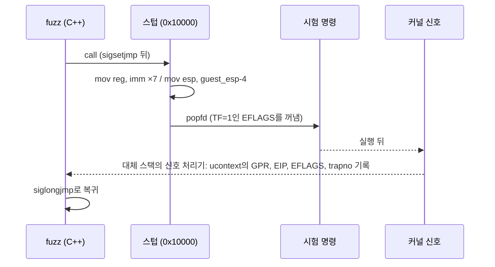

# #22 설계 : P6 정수 보완과 32비트 정수 명령 호스트 CPU 대조, trace와 호스트 간 재생 / #22 design : P6 integer completion, the 32-bit integer host-CPU comparison, traces and cross-host replay

이슈: [#22](https://github.com/reexec/rex86/issues/22) | 지시서: [20261008-i022](../work-orders/20261008-i022-integer-host-fuzz-and-trace.md) | 로그: [20261008-i022](../work-logs/20261008-i022-integer-host-fuzz-and-trace.md) | 선행: [#19 x87 fuzz](20261008-i019-x87-increment-1.md), [#21 최소 사양](20261008-i021-target-board-cpu-baseline.md)

## 배경 / Background

정수 명령의 검증은 SingleStepTests/80386(386EX, real mode) 하나에 서 있다. 소비자 게스트는 32비트 평탄 코드로 돌고, 그 경로는 66/67 prefix와 단위 테스트로만 간접 검증된다. 386 스위트라 486 이후 명령은 검증 수단이 아예 없고, 실제로 #21이 요구한 P6 정수 명령(CMOVcc, BSWAP, XADD, CMPXCHG, CMPXCHG8B, UD2)이 인터프리터에 없다. 또 x87 fuzz와 SST는 x86 호스트에서만 돌아서, arm64와 wasm32에서 같은 결과를 내는지(목표 2)를 잴 수단이 없다.

*Integer verification rests on SingleStepTests/80386 alone (a 386EX in real mode). The consumer guests run 32-bit flat code, reached only indirectly through 66/67 prefixes and unit tests; being a 386 suite it cannot see anything after the 386, and indeed the P6 integer instructions #21 requires (CMOVcc, BSWAP, XADD, CMPXCHG, CMPXCHG8B, UD2) are absent from the interpreter. And the x87 fuzz and SST run on x86 hosts only, so nothing measures whether arm64 and wasm32 give the same results (goal 2).*

## 범위 / Scope

1. i386 Linux 호스트에서 정수 명령 하나를 호스트 CPU와 코어로 실행해 비교하는 fuzz(`rex86_int_fuzz`).
2. trace 형식, 기록(정수 fuzz와 x87 fuzz의 `--record`), 재생 도구(`rex86_trace`), 저장소에 넣는 trace 묶음, 모든 호스트의 ctest 재생.
3. P6 정수: CMOVcc, BSWAP, XADD, CMPXCHG, CMPXCHG8B, UD0/UD1/UD2, EFLAGS AC/ID 쓰기, `Features::cmov`.
4. fuzz가 드러내는 코어의 SDM 이탈 수정.
5. ASan/UBSan CI 작업.

범위 밖: x86-64 호스트에서의 정수 fuzz(32비트 인코딩을 실행하려면 compatibility mode 전환이 필요하다. 필요해지면 후속), MMX/SSE(1b), 세그먼트 적재와 특권 명령의 보호 모드 의미(호스트 OS의 GDT/LDT에 묶임), 벤치마크 하네스.

*In scope: the i386 Linux integer fuzz (`rex86_int_fuzz`); the trace format, recording (`--record` in both fuzzers), the replay tool (`rex86_trace`), a committed trace corpus replayed by ctest on every host; the P6 integer instructions, writable EFLAGS AC/ID and `Features::cmov`; fixes for whatever SDM deviations the fuzz exposes; an ASan/UBSan CI job. Out of scope: the integer fuzz on x86-64 hosts (32-bit encodings need a compatibility-mode switch there; a follow-up if needed), MMX/SSE (1b), the protected-mode semantics of segment loads and privileged instructions (tied to the host OS's GDT/LDT), the benchmark harness.*

## 결정 1: 호스트 실행은 i386 프로세스의 트랩 플래그 단일 스텝 / Decision 1: host execution is a trap-flag single step in an i386 process

x87 fuzz는 x87 인코딩이 32비트와 64비트 모드에서 같은 뜻이라 x86-64에서 돌 수 있었다. 정수 명령은 다르다(0x40~0x4F가 REX, PUSH/POP의 폭, 주소 크기). 그래서 정수 fuzz는 **i386 Linux 프로세스**에서만 빌드되고 돈다(`#error`로 확인). CI의 `linux-x86` 작업(i386 Debian 컨테이너)과, multilib가 있는 개발 환경에서 돈다.

명령 하나의 실행 직후 상태를 얻는 수단은 **트랩 플래그(TF)**다.



* POPFD가 TF를 켜면 **다음 명령 뒤에** 단일 스텝 트랩이 온다. 분기, CALL, RET이 어디로 가든 목적지의 명령은 인출되지 않고 EIP만 보고된다.
* 폴트는 신호로 오고(#DE SIGFPE trapno 0, #UD SIGILL 6, #GP SIGSEGV 13, #SS 12, #PF 14, BOUND 5), 컨텍스트는 폴트 직전 상태다. 코어의 정확한 폴트(#17)와 그대로 비교된다.
* REP 문자열은 TF 아래서 **반복마다** 트랩한다. 처리기는 EIP가 시험 명령 시작이면(반복 중) longjmp하지 않고 돌아가 다음 반복을 실행시킨다.
* 신호 처리기는 `sigaltstack`의 대체 스택에서 돈다. 게스트가 ESP를 마음대로 쓰기 때문이다.

이 방법은 설계 전에 시험해 확인했다(ADD, 분기 성립과 불성립, #DE, #PF, UD2, POPFD, BSWAP, CLI의 #GP, BOUND, AAM 0).

*The x87 fuzz could run on x86-64 because x87 encodings mean the same in 32- and 64-bit mode; integer encodings do not (0x40-0x4F are REX, PUSH/POP widths, address size), so the integer fuzz builds and runs in **i386 Linux processes only** (`#error` otherwise): the CI's `linux-x86` job (an i386 Debian container) and any multilib development machine. The state right after one instruction comes from the **trap flag**: a POPFD that sets TF makes the single-step trap arrive **after the next instruction**, so wherever a branch, CALL or RET goes, only EIP is reported and the target is never fetched; faults arrive as signals carrying the pre-instruction context, which compares directly with the core's precise faults (#17); REP strings trap after **each iteration**, so the handler returns without longjmp while EIP still addresses the tested instruction; the handler runs on a `sigaltstack` stack since the guest owns ESP. The technique was tried before this design (ADD, taken and untaken branches, #DE, #PF, UD2, POPFD, BSWAP, CLI's #GP, BOUND, AAM 0).*

## 결정 2: 양쪽이 같은 주소를 쓴다 / Decision 2: both sides use the same addresses

호스트는 고정 주소 `0x10000`에 12 KiB(코드 4 KiB, 작업 영역 8 KiB)를 매핑하고, 위아래에 PROT_NONE 보호 영역을 둔다. 코어는 같은 게스트 주소에 같은 내용을 둔다(별도 버퍼, 같은 페이지 속성). **레지스터 값이 양쪽에서 똑같으므로** LEA, CALL이 push하는 복귀 주소, 주소를 담은 레지스터의 산술까지 그대로 비교된다. 범위 밖 주소는 양쪽 모두 #PF/접근 위반이다.

세그먼트 선택자 값은 호스트의 실제 값(CS, DS/ES/SS, FS, GS)을 읽어 코어에 넣는다. PUSH sreg와 MOV r/m, sreg가 비교된다. FS는 Linux i386에서 null이므로 코어도 null(present=false)로 둔다. GS는 TLS를 가리켜 base를 알 수 없으므로 GS override는 생성하지 않는다.

*The host maps 12 KiB at the fixed address `0x10000` (4 KiB code, 8 KiB work area) with PROT_NONE guards around it, and the core holds the same contents at the same guest addresses (its own buffer, the same page attributes). **Register values are identical on both sides**, so LEA, the return address a CALL pushes and arithmetic on address-holding registers compare too; out-of-range addresses fault on both (#PF / access violation). The host's real selector values (CS, DS/ES/SS, FS, GS) are read into the core so PUSH sreg and MOV r/m, sreg compare; FS is null on Linux i386 and the core's FS is null (not present) too; GS points at the TLS with an unknown base, so no GS override is generated.*

## 결정 3: 명령 생성 / Decision 3: generating instructions

* **형태 표**: 1바이트 opcode와 `0F xx`, 각 modrm.reg를 Zydis로 디코드해 (opcode, mnemonic)별 형태를 만든다. 표본은 형태 단위로 고르게 뽑는다. 허용 ISA 집합: I86, I186, I386, I486REAL, PENTIUMREAL, CMOV, LAHF, FAT_NOP, PPRO.
* **제외**(환경이나 권한에 묶인 것): CLI, STI, HLT, IN/OUT/INS/OUTS, INT n/INT1/INT3/INTO, IRET, 세그먼트 레지스터 적재(MOV sreg, POP sreg, LDS/LES/LFS/LGS/LSS), far JMP/CALL/RET, ARPL과 I286 시스템 명령, CPUID, RDTSC, RDMSR/WRMSR, INVD/WBINVD/INVLPG, RSM, SYSENTER/SYSEXIT.
* **prefix**: 66, 67, 세그먼트 override(26, 2E, 36, 3E, 64), F2/F3, F0를 확률로 붙인다. 디코드가 실패하면 버린다.
* **레지스터**: 각 GPR을 작업 영역 포인터, 작은 값, 무작위 값 중에서 고른다. ESP는 작업 영역 가운데. REP 문자열은 ECX(또는 CX)를 0~8로.
* **주소 맞춤**: 명시적, 암시적 메모리 피연산자(Zydis가 숨은 피연산자로 알려 주는 [ESI], [EDI], [ESP] 포함)의 유효 주소를 `ZydisCalcAbsoluteAddressEx`로 계산해, base 레지스터(없으면 index, 둘 다 없으면 disp32)를 조정해 작업 영역 안으로 옮긴다. 맞춘 뒤에도 영역 밖(16비트 주소의 0x10000 미만 제외)이면 버린다. ENTER와 LEAVE는 EBP도 영역 안으로 둔다.
* **EFLAGS 입력**: TF와 IF는 1(호스트 사용자 모드의 조건), 산술 플래그와 DF, ID는 무작위, AC와 NT는 0.

*A form table from Zydis-decoding one-byte opcodes and `0F xx` with each modrm.reg, sampled uniformly per (opcode, mnemonic); allowed ISA sets I86, I186, I386, I486REAL, PENTIUMREAL, CMOV, LAHF, FAT_NOP, PPRO; excluded as environment- or privilege-bound: CLI, STI, HLT, port I/O, INT n/INT1/INT3/INTO, IRET, segment-register loads, far transfers, ARPL and the I286 system instructions, CPUID, RDTSC, MSRs, cache and TLB control, RSM, SYSENTER/SYSEXIT. Prefixes 66, 67, segment overrides (26, 2E, 36, 3E, 64), F2/F3 and F0 are added by chance and undecodable results dropped. Each GPR is a work-area pointer, a small value or random; ESP sits mid work area; REP strings get ECX (or CX) 0-8. Every memory operand, explicit or hidden ([ESI], [EDI], [ESP]), has its effective address computed with `ZydisCalcAbsoluteAddressEx` and moved into the work area by adjusting the base register (else the index, else disp32); cases still outside (16-bit addresses below 0x10000 excepted) are dropped, and ENTER/LEAVE also get EBP inside. Input EFLAGS: TF and IF set (the host's user-mode condition), arithmetic flags, DF and ID random, AC and NT clear.*

## 결정 4: 비교와 미정의 / Decision 4: comparison and undefined results

비교 항목: 결과 종류(retire, 폴트 종류), GPR 8개, EIP, EFLAGS, 코드 페이지와 작업 영역 전체. #PF/접근 위반이면 폴트 주소(CR2)도 비교한다.

SDM이 미정의로 두는 것은 마스크한다.

| 미정의 | 근거 |
|---|---|
| Zydis가 명령별로 알려 주는 미정의 플래그(`cpu_flags->undefined`) | MUL/IMUL, DIV, BT 계열, BCD 등 |
| 시프트와 회전: 마스크된 count ≠ 1이면 OF, SHL/SHR/SAR에서 count ≥ 폭이면 CF | SDM SAL/SAR/SHL/SHR, RCL/RCR/ROL/ROR |
| SHLD/SHRD: count > 피연산자 폭이면 결과와 플래그 전체 | SDM SHLD/SHRD |
| BSF/BSR: 원본이 0이면 목적지 레지스터 | SDM BSF/BSR |
| BSWAP 16비트: 목적지 레지스터 | SDM BSWAP |
| 32비트 PUSH sreg: 스택 슬롯의 상위 2바이트 | SDM PUSH(최근 프로세서는 16비트만 씀) |

호스트 쪽의 인공물도 뺀다: EFLAGS.RF(폴트 컨텍스트), POPF/POPFD의 IF와 IOPL(호스트는 CPL 3이라 바꾸지 못한다). SDM이 분명한데 호스트가 다르면 `vendor_deviations`로 따로 세고 analysis에 기록한다(#19와 같은 규칙).

*Compared: the outcome (retired, fault kind), the eight GPRs, EIP, EFLAGS, the whole code page and work area, and the fault address (CR2) for #PF / access violations. What the SDM leaves undefined is masked (table above: Zydis's per-instruction undefined flags; OF for shift and rotate counts other than 1 and CF for SHL/SHR/SAR counts at or above the width; SHLD/SHRD results and flags for counts above the operand size; BSF/BSR's destination for a zero source; 16-bit BSWAP's destination; the upper two bytes of a 32-bit PUSH sreg slot). Host artifacts are dropped too: EFLAGS.RF in fault contexts, and POPF's IF and IOPL, which the CPL 3 host cannot change. Where the SDM is clear and the host differs, the case counts as `vendor_deviations` and goes into analysis, as in #19.*

## 결정 5: trace 형식과 재생 / Decision 5: the trace format and replay

trace는 "이 입력에서 이 결과가 나와야 한다"는 기록이다. 호스트 CPU가 기대값을 만들고, 어느 호스트의 코어든 재생해 비교한다. 형식은 리틀 엔디안 바이너리이고 `src/trace/`가 읽고 쓴다(코어 밖의 내부 라이브러리 `rex86_trace_format`).

```
파일: "RX86TRC1" | u32 version(=1) | u32 case_count | case...
case: u32 size | u8 kind(1 정수, 2 x87) | u8 mode(0 단일 스텝, 1 HLT까지) | u16 flags | u32 features
      입력: u8 region_count, {u32 base, u32 size, u8 page_flags}...
            u32 fill_seed, u16 patch_count, {u32 addr, u16 len, bytes}...
            u16 selector[6], u8 segment_present_bits
            u32 gpr[8], eip, eflags, u32 budget
      기대: u8 reason, u8 fault_kind, u32 fault_address
            u32 gpr[8], eip, eflags, u32 eflags_mask, u8 gpr_mask
            u16 diff_count, {u32 addr, u16 len, bytes}...   (입력 메모리에 대한 변경)
            u16 ignore_count, {u32 addr, u16 len}...        (비교하지 않을 바이트)
```

* 영역의 초기 내용은 `fill_seed`의 xorshift32 수열이다. 8 KiB 작업 영역을 그대로 담지 않아 한 건이 약 150바이트다.
* `rex86_trace <파일>`이 재생하고 불일치를 사례 번호와 함께 보고한다. `--dump N`이 한 건을 사람이 읽게 펼친다. 코어만 쓰므로 Windows, AArch64, wasm32(Node, `-sNODERAWFS`)에서 모두 빌드된다.
* **저장소에 넣는 묶음**: `tests/traces/int32.rxt`(정수 fuzz, 고정 시드)와 `tests/traces/x87.rxt`(x87 fuzz, 고정 시드). ctest가 다섯 호스트 모두에서 재생한다. x86에서 만든 기대값이 arm64와 wasm32에서 그대로 나오는지가 목표 2의 첫 실측이다. 크기는 합쳐서 수 MB 이하로 둔다.
* fuzz의 불일치는 `--record`로 trace 한 건이 되어 어느 호스트에서든 재현된다(목표 9).

*A trace records "this input must give this result": a host CPU produces the expectation and any host's core replays it. The format above is little-endian binary, read and written by `src/trace/` (`rex86_trace_format`, an internal library outside the core). Regions start as an xorshift32 sequence from `fill_seed`, so a case is about 150 bytes instead of carrying the 8 KiB work area. `rex86_trace <file>` replays and reports mismatches by case number, `--dump N` spells one case out; it uses only the core, so it builds on Windows, AArch64 and wasm32 (Node, `-sNODERAWFS`). Committed corpus: `tests/traces/int32.rxt` and `tests/traces/x87.rxt` from fixed seeds, replayed by ctest on all five hosts (the first measurement of goal 2: x86-made expectations reproduced on arm64 and wasm32), kept to a few MB in total. A fuzz mismatch becomes a one-case trace through `--record`, reproducible on any host (goal 9).*

## 결정 6: 코어 변경 / Decision 6: core changes

* **P6 정수**(새 파일 `src/interp/exec_post386.cpp`): CMOVcc(16/32비트, 조건과 무관하게 원본을 읽는다), BSWAP, XADD, CMPXCHG(비교가 실패해도 목적지에 쓰기 주기가 있다: SDM), CMPXCHG8B(같음), UD0/UD1/UD2는 미구현이 아닌 #UD 폴트.
* **`Features::cmov`**(기본 켬): CPUID.01H:EDX.CMOV처럼 CMOVcc와, x87이 켜져 있으면 FCOMI/FCOMIP/FUCOMI/FUCOMIP/FCMOVcc를 함께 켠다. K6-2(EZ2DJ 1세대)를 흉내 낼 때 끈다(#21 결정 2). 공개 계약 변경이다.
* **EFLAGS AC/ID 쓰기**: POPF/POPFD와 IRET의 쓰기 마스크에 비트 18, 21을 더한다(#21 결정 3). #AC는 모델링하지 않는다.
* fuzz가 드러내는 이탈은 SDM 기준으로 고치고 로그에 적는다. 예상되는 것 하나: 평탄 세그먼트 빠른 경로가 쓰기 가능 여부를 보지 않아, CS override로 쓰는 경우 호스트는 #GP인데 코어는 통과할 것이다.

*P6 integer in the new `src/interp/exec_post386.cpp`: CMOVcc (16/32-bit, reading the source whatever the condition), BSWAP, XADD, CMPXCHG (the destination gets a write cycle even when the compare fails, per the SDM), CMPXCHG8B (likewise), and UD0/UD1/UD2 as #UD faults rather than unimplemented. `Features::cmov` (on by default) gates CMOVcc and, with x87 on, FCOMI/FCOMIP/FUCOMI/FUCOMIP/FCMOVcc, as CPUID.01H:EDX.CMOV does; it is switched off to emulate the K6-2 (EZ2DJ generation 1, #21 decision 2), a public contract change. POPF/POPFD and IRET's write mask gains bits 18 and 21 (#21 decision 3); #AC is not modeled. Deviations the fuzz exposes are fixed toward the SDM and logged; one is expected: the flat-segment fast path never checks writability, so a write through a CS override passes in the core while the host raises #GP.*

## 결정 7: CI / Decision 7: CI

* `linux-x86`(i386 컨테이너): 정수 fuzz의 짧은 고정 시드 실행이 ctest에 등록되어 돈다.
* 다섯 호스트 모두: `rex86_trace`가 저장소의 묶음을 재생한다(ctest).
* 새 작업 `linux-x64-sanitize`: Clang, `-fsanitize=address,undefined -fno-sanitize-recover=all`을 rex86의 타깃에만 건다(third_party는 원본 그대로 두고 계측하지 않는다). 단위 테스트, probe, trace 재생, x87 fuzz를 돌린다.

*`linux-x86` (the i386 container) runs a short fixed-seed integer fuzz registered with ctest; all five hosts replay the committed corpus with `rex86_trace`; a new `linux-x64-sanitize` job builds with Clang and `-fsanitize=address,undefined -fno-sanitize-recover=all` on rex86's own targets only (third_party stays as upstream wrote it, uninstrumented) and runs the unit tests, the probe, trace replay and the x87 fuzz.*

## 소비자 영향 / Consumer impact

* `Features`에 `cmov`가 생긴다(기본 켬). 지금까지의 동작과 같고, K6-2 기판을 흉내 내는 소비자만 끈다.
* POPF가 AC와 ID를 바꾼다. 게스트의 CPU 판별이 486 이후, CPUID 지원으로 보게 되므로 소비자의 CPUID 응답이 흉내 내는 기판과 맞아야 한다.
* 새로 실행되는 명령(CMOVcc 등)이 지금까지의 #UD 대신 결과를 낸다.

*`Features` gains `cmov` (on by default, the behavior so far; only consumers emulating the K6-2 board switch it off). POPF changes AC and ID, so guest CPU detection sees a 486-or-later with CPUID, and consumers' CPUID answers must match the emulated board. Newly executed instructions (CMOVcc and the rest) produce results instead of #UD.*

## 검증 / Verification

* 정수 fuzz: 여러 시드로 수백만 건 이상, 불일치 0(미정의와 `vendor_deviations` 제외). 측정 호스트는 이 작업 환경의 Intel Xeon과 CI의 x86 러너.
* trace 재생: 묶음이 다섯 호스트에서 불일치 0.
* SST: 실행 1,741,900, 불일치 0, 미구현 0이 유지되는지(POPF 마스크와 세그먼트 검사 변경의 회귀 확인).
* 단위 테스트: P6 명령, `Features::cmov`, POPF AC/ID, trace 형식의 왕복.
* 로컬 빌드: GCC Debug/Release, Clang(`-Werror`), i386(multilib). 나머지는 CI.

*Integer fuzz: millions of cases over several seeds with zero mismatches (undefined results and `vendor_deviations` aside), measured on this environment's Intel Xeon and the CI's x86 runners. Trace replay: the corpus replays with zero mismatches on all five hosts. SST: 1,741,900 executed, zero mismatches, zero unimplemented still hold (the regression check for the POPF mask and segment-check changes). Unit tests for the P6 instructions, `Features::cmov`, POPF AC/ID and the trace format's round trip. Local builds: GCC Debug/Release, Clang (`-Werror`), i386 (multilib); the rest by CI.*
