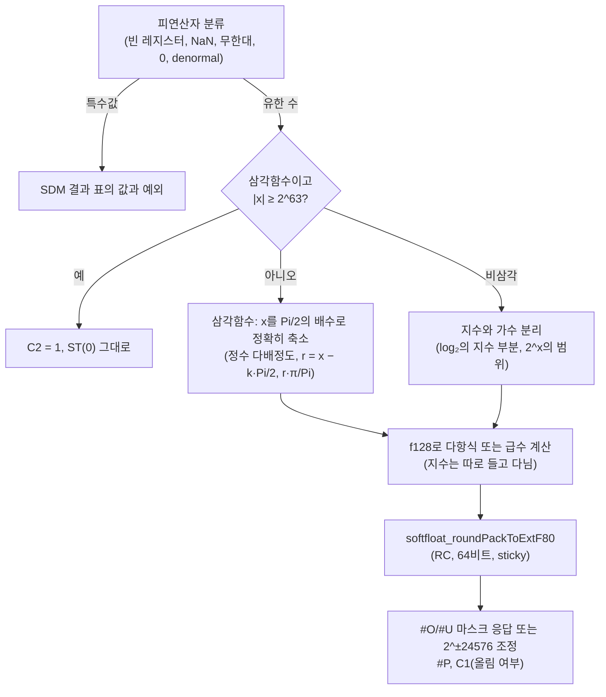

# #25 설계 : x87 2차 — 초월함수와 호스트 CPU 대조 / #25 design : x87 increment 2 — the transcendentals and the host-CPU comparison

이슈: [#25](https://github.com/reexec/rex86/issues/25) | 지시서: [20261008-i025](../work-orders/20261008-i025-x87-transcendentals.md) | 로그: [20261008-i025](../work-logs/20261008-i025-x87-transcendentals.md) | 앞 작업: [#19 설계](20261008-i019-x87-increment-1.md) 결정 8

## 범위 / Scope

1단계의 마지막 항목이다. [#19](20261008-i019-x87-increment-1.md)는 x87을 초월함수만 빼고 구현했고, 정확도 기준은 이 작업으로 미뤘다(결정 8). 대상은 여덟 명령이다.

| 명령 | 의미 | 스택 |
|---|---|---|
| FSIN | ST(0) := sin ST(0) | 그대로 |
| FCOS | ST(0) := cos ST(0) | 그대로 |
| FSINCOS | ST(0) := sin, cos를 push | push 하나 |
| FPTAN | ST(0) := tan, 1.0을 push | push 하나 |
| FPATAN | ST(1) := arctan(ST(1)/ST(0)), pop | pop 하나 |
| F2XM1 | ST(0) := 2^ST(0) − 1 | 그대로 |
| FYL2X | ST(1) := ST(1) × log₂ST(0), pop | pop 하나 |
| FYL2XP1 | ST(1) := ST(1) × log₂(ST(0) + 1), pop | pop 하나 |

함께 하는 것: x87 호스트 대조 fuzz에 여덟 명령을 넣는다(지금은 `Excluded()`로 빠져 있다). 판정에는 ulp 허용치를 새로 둔다. 단위 테스트와 trace 묶음에도 넣는다. 범위 밖: 성능(측정 없이 최적화하지 않는다), 호스트 FPU를 쓰는 빠른 경로.

*The last item of phase 1. [#19](20261008-i019-x87-increment-1.md) implemented the x87 without the transcendentals and left their accuracy reference to this task (decision 8). The eight instructions are listed in the table above. Along with them, the x87 host-comparison fuzz takes the eight in (today `Excluded()` drops them) with a new ulp-tolerance judgment, and unit tests and the trace corpus cover them. Out of scope: performance (nothing is optimized without a measurement) and a fast path on the host FPU.*

## 근거 / Sources

* 명령별 의미: Intel SDM 2권의 FSIN, FCOS, FSINCOS, FPTAN, FPATAN, F2XM1, FYL2X, FYL2XP1 항목(결과 표, 플래그, 예외). 이 작업에서는 [felixcloutier.com의 SDM 발췌](https://www.felixcloutier.com/x86/fsin)로 읽었다.
* **SDM 1권 8.3.8 "Approximation of Pi"**: 축소에 쓰는 내부 π는 `Pi = 0.f × 2²`, `f = C90FDAA2 2168C234 C`이고, 유효 숫자는 66비트다. "FSIN(x), FCOS(x), FPTAN(x)는 실제로 sin(x·π/Pi), cos(x·π/Pi), tan(x·π/Pi)를 근사한다." FSINCOS는 FSIN과 FCOS를 합친 것이다.
* **SDM 1권 8.3.10 "Transcendental Instruction Accuracy"**: Pentium 이후 여덟 명령의 최악 오차는 nearest-even에서 1 ulp 미만, 다른 반올림 방향에서 1.5 ulp 미만이고, 입력에 대해 단조다. 삼각함수의 이 한계는 축소된 인자에만 성립한다.
* **SDM 1권 8.1.5.2**: 정밀도 제어(PC)는 FADD, FSUB, FMUL, FDIV 계열과 FSQRT에만 적용된다. 초월함수는 PC와 무관하게 64비트 유효 숫자로 반올림하고, 반올림 방향(RC)은 따른다.

SDM 1권은 [Intel의 PDF](https://www.intel.com/content/www/us/en/developer/articles/technical/intel-sdm.html)에서 직접 읽었다.

*Per-instruction semantics come from the SDM Volume 2 entries for the eight instructions (result tables, flags, exceptions), read here through [felixcloutier.com's SDM extract](https://www.felixcloutier.com/x86/fsin). **SDM Volume 1, 8.3.8 "Approximation of Pi"**: the internal π used for reduction is `Pi = 0.f × 2²` with `f = C90FDAA2 2168C234 C`, 66 significant bits, and "FSIN(x), FCOS(x), and FPTAN(x) are really approximating the mathematical functions sin(x·π/Pi), cos(x·π/Pi), and tan(x·π/Pi)", FSINCOS being FSIN and FCOS together. **8.3.10 "Transcendental Instruction Accuracy"**: from the Pentium on, the worst-case error of the eight is under 1 ulp rounding to nearest-even and under 1.5 ulps in the other modes, and they are monotonic in their inputs; for the trigonometric ones the bound holds only for reduced arguments. **8.1.5.2**: precision control affects only the FADD/FSUB/FMUL/FDIV families and FSQRT, so the transcendentals round to a 64-bit significand whatever PC says, and they honor RC. Volume 1 was read from [Intel's PDF](https://www.intel.com/content/www/us/en/developer/articles/technical/intel-sdm.html).*

## 결정 1: 기준은 SDM 모델의 정확한 반올림 / Decision 1: the reference is the SDM's model, correctly rounded

사용자가 정한 기준이다. 각 명령의 결과는 아래 수학 함수 값을 **CW.RC 방향으로 64비트 유효 숫자에 정확히 반올림**한 값이다.

| 명령 | 수학 함수(SDM 모델) |
|---|---|
| FSIN, FSINCOS의 sin | sin(x · π/Pi) |
| FCOS, FSINCOS의 cos | cos(x · π/Pi) |
| FPTAN | tan(x · π/Pi) |
| FPATAN | atan2(ST(1), ST(0)) (참 π 기준, SDM 표의 사분면) |
| F2XM1 | 2^x − 1 |
| FYL2X | y · log₂x |
| FYL2XP1 | y · log₂(x + 1) |

삼각함수 넷은 SDM 8.3.8의 문장을 그대로 모델로 삼는다: 인자를 66비트 `Pi`로 축소하고, 축소된 값에서 참 함수를 계산한다. 그래서 π의 배수 근처에서는 실제 Intel CPU처럼 수학적인 sin(x)와 크게 다를 수 있다. 정확한 반올림은 SDM의 오차 한계(1 ulp, 1.5 ulp) 안에 들고 단조성도 지킨다. 실측 Intel 결과와 마지막 비트가 다를 수 있으며, 이 차이는 결정 5의 허용치로 판정한다.

*The user's choice. Each result is the value of the function in the table above **correctly rounded to a 64-bit significand in CW.RC's direction**. The four trigonometric instructions take SDM 8.3.8's sentence as the model: reduce by the 66-bit `Pi`, evaluate the true function on what remains, so near multiples of π the result departs from the mathematical sin(x) as a real Intel CPU's does. Correct rounding sits inside the SDM's error bounds (1 ulp, 1.5 ulps) and keeps monotonicity; the last bit may differ from a measured Intel result, which decision 5's tolerance judges.*

## 결정 2: 계산은 정수 축소와 SoftFloat f128 / Decision 2: integer reduction and SoftFloat's f128

결과가 모든 호스트에서 비트 단위로 같아야 하므로(목표 2) 호스트 libm과 호스트 FPU를 쓰지 않는다. 계산은 이미 들어 있는 SoftFloat 3e의 128비트 형식(`float128_t`, 유효 숫자 113비트)과 정수 연산만으로 한다. 새 서드파티는 없다.

* **축소**: |x| < 2^63인 x와 `Pi/2`(67비트)의 몫 k를 정수로 구하고, 나머지 r = x − k·Pi/2를 192비트 고정소수점으로 **정확히** 계산한다. FPREM이 쓰는 방식과 같다(SDM 8.3.8, "same reduction mechanism used by the FPREM and FPREM1 instructions"). 그다음 r·(π/Pi)를 f128로 만든다. π/Pi는 1에 2^−69 수준으로 가까운 상수다. 사분면 k mod 4로 sin과 cos, 부호를 고른다.
* **함수 계산**: 축소된 범위에서 f128 거듭제곱급수(sin, cos, tan = sin/cos, atan, expm1, log1p 계열)를 계산한다. 항 수는 남는 항이 2^−120 아래가 될 때까지다. log₂는 지수 e와 가수 m ∈ [1, 2)로 나눠 e + log₂m으로, F2XM1은 2^x − 1 = expm1(x·ln2)로 계산해 0 근처의 상쇄를 피한다. FYL2X와 FYL2XP1의 곱 y·log₂(…)는 f128 곱 한 번으로 하고 지수는 int32로 따로 든다. f128의 지수 범위가 extF80과 같아서, 결과가 범위를 넘거나 지수 조정 결과(결정 4)가 필요한 경우에도 중간값이 넘치지 않게 하려는 것이다.
* **반올림**: 마지막 단계는 SoftFloat의 `softfloat_roundPackToExtF80(sign, exp, sig, sigExtra, 80)`이다. 이 함수가 RC 방향 반올림, overflow, tiny, denormal, inexact를 한 번에 처리한다. f128 계산 오차는 113비트의 몇 ulp 수준이다. 그래서 64비트로의 반올림이 틀릴 수 있는 경우는 참값이 반올림 경계의 약 2^−105 상대 거리 안에 있을 때뿐이다(table-maker's dilemma). 그 경우에도 결과는 결정적이고 SDM 한계 안에 든다. 이를 "정확한 반올림(드문 경계 사례 제외)"이라고 적는다.
* **위치**: `src/fpu/x87_transcendental.{h,cpp}`(새 파일). 축소와 급수는 `src/fpu/f128_series.{h,cpp}`로 분리할 수 있으면 분리한다. 디코드를 모르므로 번역 백엔드의 helper로 재사용된다(#19와 같다).

*Results must be bit-identical on every host (goal 2), so neither the host libm nor the host FPU is used: only SoftFloat 3e's 128-bit format (`float128_t`, 113-bit significand), already vendored, and integer arithmetic; no new third party. **Reduction**: for |x| < 2^63, the quotient k of x by `Pi/2` (67 bits) is found as an integer and the remainder r = x − k·Pi/2 computed **exactly** in 192-bit fixed point, the FPREM mechanism (SDM 8.3.8, "the same reduction mechanism used by the FPREM and FPREM1 instructions"); r·(π/Pi) then becomes an f128, π/Pi being a constant within about 2^−69 of 1, and the quadrant k mod 4 picks sin or cos and the sign. **Evaluation**: f128 power series on the reduced range (sin, cos, tan = sin/cos, atan, expm1, log1p families), summed until the remaining terms fall below 2^−120; log₂ splits into the exponent e and the significand m ∈ [1, 2) as e + log₂m; F2XM1 computes 2^x − 1 as expm1(x·ln2) to avoid cancellation near 0; FYL2X's and FYL2XP1's product y·log₂(…) is one f128 multiplication with the exponent carried apart in an int32, because f128's exponent range equals extF80's and an out-of-range result or an exponent-adjusted one (decision 4) must not overflow on the way. **Rounding**: the last step is SoftFloat's `softfloat_roundPackToExtF80(sign, exp, sig, sigExtra, 80)`, which rounds in RC's direction and handles overflow, tininess, denormals and inexactness at once. The f128 evaluation errs by a few ulps of 113 bits, so rounding to 64 bits can go wrong only when the true value lies within about 2^−105 (relative) of a rounding boundary (the table-maker's dilemma); even then the result is deterministic and inside the SDM's bounds. This is recorded as "correctly rounded, rare boundary cases excepted". **Location**: `src/fpu/x87_transcendental.{h,cpp}` (new), with the reduction and the series split into `src/fpu/f128_series.{h,cpp}` where that separates cleanly; knowing no decoding, it is reusable as a translation-backend helper, as in #19.*

## 결정 3: 특수값, 범위, 정의되지 않은 동작 / Decision 3: special values, ranges and undefined behavior

* **특수값과 예외**: SDM 2권의 결과 표를 그대로 구현한다. FPATAN의 0/0, ∞/∞ 사분면 값(±π, ±π/2, ±π/4, ±3π/4), FYL2X의 #IA(음수, 0 × ∞ 꼴)와 #Z(ST(0) = ±0이면 결과는 ST(1)과 반대 부호의 ∞), FYL2XP1의 표, F2XM1의 ±0, sin/tan(±0) = ±0, cos(±0) = 1이 해당한다. #IA(SNaN, 지원하지 않는 형식, 정의역 밖) > #Z > #D의 순서는 #19의 `CheckOperands`와 SDM 4.9.2를 따른다.
* **삼각함수의 범위**: |x| ≥ 2^63이면 C2 = 1이고 ST(0)는 그대로이며 예외는 없다. FSINCOS와 FPTAN은 push하지 않는다. 범위 안이면 C2 = 0이다.
* **C1**: 쓰인 결과가 올림이면 1, 아니면 0. 스택 언더플로는 0, 오버플로는 1이다(#19의 `Commit`과 `StackFault`).
* **SDM이 "정의되지 않음"으로 둔 것**은 Intel 호스트(이 작업 환경의 Core i5-7200U, Kaby Lake)에서 측정해 정한다. 대상은 C0와 C3(여덟 명령 모두), C2(비삼각 넷), C2 = 1일 때 FCOS의 C1, |x| > 1인 F2XM1, 정의역 밖 FYL2XP1이다. 측정 결과가 단순한 규칙이면(예: "C0/C3 = 0") 그대로 구현하고, 아니면 해당 입력을 fuzz 판정에서 "정의되지 않음" 범주로 빼고 그 근거를 분석 문서에 적는다. 정의역 밖에서도 코어는 같은 공식(2^x − 1, y·log₂(x + 1))을 계산한다. 결정적이기만 하면 된다.
* **FSIN, FCOS의 #U**: SDM은 FSIN과 FCOS의 예외에 #U를 적지 않지만 FSINCOS와 FPTAN에는 적는다. sin(tiny) ≈ tiny이므로 denormal 입력에서의 #U 보고는 측정으로 정한다.

*Special values and exceptions follow the SDM Volume 2 result tables: FPATAN's quadrant values for 0/0 and ∞/∞ (±π, ±π/2, ±π/4, ±3π/4); FYL2X's #IA (negatives, the 0 × ∞ shapes) and #Z (ST(0) = ±0 gives ∞ of the sign opposite ST(1)'s); FYL2XP1's table; F2XM1 on ±0; sin/tan(±0) = ±0 and cos(±0) = 1; the order #IA (SNaN, unsupported formats, out of domain) > #Z > #D follows #19's `CheckOperands` and SDM 4.9.2. Trigonometric range: |x| ≥ 2^63 sets C2 = 1, leaves ST(0) and raises nothing, and FSINCOS and FPTAN push nothing; in range C2 = 0. C1 reports a rounded-up written result, 0 on stack underflow and 1 on overflow (#19's `Commit` and `StackFault`). **What the SDM leaves undefined** is settled by measurement on the Intel host (this workspace's Core i5-7200U, Kaby Lake): C0 and C3 (all eight), C2 (the four non-trigonometric), FCOS's C1 when C2 = 1, F2XM1 with |x| > 1 and FYL2XP1 out of its domain. A simple measured rule ("C0/C3 = 0", say) is implemented as such; otherwise those inputs fall into an "undefined" class the fuzz does not judge, with the evidence in the analysis document. Out of domain the core still computes the same formula (2^x − 1, y·log₂(x + 1)); it only has to be deterministic. FSIN/FCOS and #U: the SDM lists no #U for FSIN and FCOS but does for FSINCOS and FPTAN; with sin(tiny) ≈ tiny, #U on denormal inputs is settled by measurement.*

## 결정 4: 지수 조정 결과와 스택 / Decision 4: exponent-adjusted results and the stack

* **#O, #U가 마스크되지 않았을 때**: #19와 같이 참 결과를 2^∓24576으로 조정해 반올림한 값을 쓴다(SDM 4.9.1.4, 8.4.4). 지수를 따로 들고 다니므로(결정 2) `roundPack` 전에 지수에서 24576을 더하거나 빼기만 하면 된다. 넘칠 수 있는 명령은 FYL2X, FYL2XP1(y가 큰 경우)이다. 작아질 수 있는 명령은 다섯이다: sin, tan(tiny x), F2XM1(tiny x), FPATAN(|y/x| tiny), FYL2X류(y tiny).
* **스택**: FSIN, FCOS, F2XM1은 `ExecUnary` 꼴이다. FSINCOS와 FPTAN은 FXTRACT 꼴로, ST(0)가 비면 언더플로 #IS, ST(7)이 차 있으면 오버플로 #IS다. 마스크된 응답은 FXTRACT처럼 ST(0)에 indefinite를 쓰고 indefinite를 push하는 것을 출발점으로 두고 측정으로 확인한다. FPATAN, FYL2X, FYL2XP1은 ST(0) 또는 ST(1)이 비면 #IS이고, 마스크된 응답은 ST(1) := indefinite 후 pop이다(FADDP 꼴). 마스크되지 않은 예외로 결과를 쓰지 않으면 pop도 하지 않는다(#19의 산술과 같다).
* **위치**: 명령 의미의 통합은 `src/interp/exec_x87_transcendental.cpp`(새 파일)에 두고, `ExecuteX87`의 `default` 분기 앞에 여덟 mnemonic을 연결한다. `Features::x87`이 꺼져 있으면 지금처럼 다른 x87 명령과 함께 #UD다.

*Unmasked #O or #U: as in #19, the true result scaled by 2^∓24576 and rounded is delivered (SDM 4.9.1.4, 8.4.4); with the exponent carried apart (decision 2) that is an addition to the exponent before `roundPack`. FYL2X and FYL2XP1 can overflow (a large y); sin and tan of a tiny x, F2XM1 of a tiny x, FPATAN with a tiny |y/x| and the FYL2X pair with a tiny y can underflow. Stack: FSIN, FCOS and F2XM1 take `ExecUnary`'s shape; FSINCOS and FPTAN take FXTRACT's, an empty ST(0) being underflow #IS and a full ST(7) overflow #IS, the masked response starting from FXTRACT's (indefinite into ST(0), indefinite pushed) and confirmed by measurement; FPATAN, FYL2X and FYL2XP1 raise #IS when ST(0) or ST(1) is empty, the masked response being ST(1) := indefinite then pop (FADDP's shape), and an unmasked exception that writes nothing pops nothing (as #19's arithmetic). The instruction integration lives in `src/interp/exec_x87_transcendental.cpp` (new), the eight mnemonics wired ahead of `ExecuteX87`'s `default`; with `Features::x87` off they raise #UD together with the other x87 instructions, as today.*

## 결정 5: 호스트 대조 판정 / Decision 5: judging against the host CPU

x87 fuzz(`rex86_x87_fuzz`)에서 여덟 명령의 `Excluded()`를 풀고, 판정을 세 갈래로 나눈다.

| 판정 | 조건 | 집계 |
|---|---|---|
| 일치 | FNSAVE 이미지, 메모리, EFLAGS 모두 비트 일치 | `matches`(기존) |
| 허용 | 결과 레지스터의 값만 다르고, 같은 부호·같은 분류의 유한 수이며, 차이가 RC = nearest에서 1 ulp, 다른 방향에서 2 ulp 이하. 다른 것은 모두 일치. 단 값이 다를 때 C1과 #P는 다를 수 있다 | `within_tolerance`(새) |
| 불일치 | 그 밖 전부 | `mismatches` |

* **허용치 근거**: 코어는 0.5 ulp 이내(정확한 반올림), 호스트는 SDM 한계(1 ulp, 1.5 ulp) 이내다. 둘의 차이는 nearest에서 1.5 ulp 미만, 그러니까 1 ulp 이하이고, 다른 방향에서 2.5 ulp 미만, 그러니까 2 ulp 이하다. 이 판정은 초월함수 여덟에만 적용한다. 다른 명령은 지금처럼 비트 일치만 본다.
* **입력 분포**: 지금 생성기는 특수값에 비중을 두고 지수를 넓게 뽑는다. 그래서 삼각함수 인자 대부분이 2^63 밖으로 나간다. 초월함수 형태에는 정의역 가중 입력을 더한다. 삼각함수는 |x| < 2^63의 고른 지수, Pi/2 배수 근처, tiny와 denormal, 경계 2^63 근처를 뽑는다. F2XM1은 [−1, 1], FYL2XP1은 |x| < 1 − √2/2를 주로 하고 정의역 밖은 일부만 뽑는다. FPATAN과 FYL2X는 지수 차가 큰 쌍을 포함한다.
* **trace 기록**: `--record`는 **비트 일치 사례만** 기록한다. 허용 사례의 기대값은 호스트 값이라 코어가 재생하면 다르기 때문이다. trace 묶음 `x87.rxt`에 초월함수 일치 사례를 더해 다섯 호스트에서 코어의 결정성을 확인한다.
* **완료 기준**: Intel 호스트(Kaby Lake, WSL2의 i386과 x86-64 프로세스)에서 긴 실행의 불일치 0. 허용 비율과 ulp 분포는 분석 문서에 적는다. CI(AMD EPYC)의 짧은 실행도 녹색이어야 한다. AMD가 66비트가 아닌 π를 쓰거나 SDM 한계를 넘는 결과를 내면, 근거와 함께 "제조사 이탈" 범주로 따로 센다(#19의 선례). 이 판단은 측정 뒤에 하고 작업 로그에 적는다.

*In the x87 fuzz (`rex86_x87_fuzz`) the eight leave `Excluded()` and are judged three ways (table above): a **match** when the FNSAVE image, memory and EFLAGS agree bit for bit (`matches`, as today); **within tolerance** when only the result register's value differs, both finite with the same sign and class, by at most 1 ulp with RC = nearest and 2 ulps otherwise, everything else agreeing except that C1 and #P may differ when the values do (`within_tolerance`, new); a **mismatch** otherwise. Rationale: the core is within 0.5 ulp (correct rounding) and the host within the SDM's bounds (1 and 1.5 ulps), so they differ by under 1.5 ulps, at most 1, to nearest and by under 2.5, at most 2, otherwise. The tolerance applies to these eight alone; everything else stays bit-exact. Inputs: today's generator favors special values and draws exponents widely, so most trigonometric arguments would land beyond 2^63; the transcendental forms gain domain-weighted inputs (trigonometric arguments with exponents spread over |x| < 2^63, near multiples of Pi/2, tiny and denormal, near the 2^63 edge; F2XM1 mostly in [−1, 1] and FYL2XP1 mostly within |x| < 1 − √2/2, with some out-of-domain draws; FPATAN and FYL2X pairs with large exponent gaps). Traces: `--record` records **matching cases only**, since a tolerated case's expectation is the host's value, which the core's replay would not reproduce; transcendental matches join the `x87.rxt` corpus so all five hosts confirm the core's determinism. Done when a long run on the Intel host (Kaby Lake, i386 and x86-64 processes under WSL2) shows zero mismatches, with the tolerated share and the ulp distribution recorded in the analysis; the CI's short run on its AMD EPYC must stay green too, and should AMD use a π other than the 66-bit one or exceed the SDM's bounds, that class is counted apart as a vendor deviation with evidence (#19's precedent), decided after measurement and logged.*

## 테스트 전략 / Test strategy

* **단위 테스트** `tests/unit/x87_transcendental_test.cpp`:
  * SDM 결과 표의 모든 칸(특수값, 부호, 예외)과 C2 범위 경계(2^63 바로 아래와 위).
  * 스택 언더플로와 오버플로, 마스크되지 않은 예외로 pop을 하지 않는 경우.
  * 정확히 알려진 값: FPATAN(1, 1) = FLDPI/4와 같은 비트, F2XM1(1) = 1, F2XM1(−1) = −0.5, FYL2X(y, 2^k) = y·k, FPTAN이 push하는 1.0.
  * 66비트 Pi의 효과: x = FLDPI(80비트 π)에서 FSIN이 sin(x·π/Pi)이고, 수학적 sin(x)가 아님을 고정한다.
  * Intel 호스트에서 비트 일치로 측정된 벡터 일부를 회귀로 고정한다.
* **호스트 대조**: 결정 5. 긴 실행은 로컬 WSL2(Intel)에서 하고, CI는 짧은 실행이다.
* **호스트 간 결정성**: trace 묶음 재생(ctest `rex86_trace_corpus`, 다섯 호스트).
* **SST**: FPU 테스트가 없으므로 영향이 없다. 전체 실행으로 mismatches 0 유지만 확인한다.

*Unit tests `tests/unit/x87_transcendental_test.cpp`: every cell of the SDM result tables (special values, signs, exceptions) and the C2 range edge (just below and above 2^63); stack underflow and overflow, and an unmasked exception that withholds the pop; exactly known values (FPATAN(1, 1) bit-equal to FLDPI/4, F2XM1(1) = 1, F2XM1(−1) = −0.5, FYL2X(y, 2^k) = y·k, the 1.0 FPTAN pushes); the 66-bit Pi pinned (FSIN of x = FLDPI's 80-bit π gives sin(x·π/Pi), not the mathematical sin(x)); and some vectors measured bit-equal on the Intel host as regressions. Host comparison per decision 5, the long run locally under WSL2 (Intel) and a short one in CI. Cross-host determinism through the trace corpus replay (ctest `rex86_trace_corpus` on five hosts). SST has no FPU tests and is unaffected; the full run confirms zero mismatches.*

## 소비자 영향 / Consumer impact

공개 계약(`include/rex86/`)은 바뀌지 않는다. 지금까지 `kIllegalInstruction`으로 멈추던 여덟 명령이 결과를 낸다. rePIU와 re2DJ 게스트 중 초월함수를 쓰는 코드(예: 삼각함수 테이블 생성, 각도 계산)가 이제 코어에서 돈다. 어댑터는 바꿀 것이 없다.

*No change to the public contract (`include/rex86/`). The eight instructions, which stopped with `kIllegalInstruction` so far, produce results, so rePIU's and re2DJ's guest code using them (trigonometric table generation, angle computations) now runs on the core; the adapters need no change.*

## 문서 / Documents

ARCHITECTURE(`src/fpu/`의 "초월함수 제외" 표기 해제), README 달성도(1단계 완료), 분석 `x87-host-comparison.md`(초월함수 절: 허용 비율, ulp 분포, 정의되지 않은 동작의 측정), kb `x87.md`(66비트 Pi, 정확도 한계, 이 저장소의 모델), 가이드 `x87-host-fuzz.md`(새 집계와 판정).

*ARCHITECTURE (dropping "transcendentals excluded" from `src/fpu/`), README attainment (phase 1 done), the analysis `x87-host-comparison.md` (a transcendental section: the tolerated share, the ulp distribution, the measured undefined behavior), the kb page `x87.md` (the 66-bit Pi, the accuracy bounds, this repository's model) and the guide `x87-host-fuzz.md` (the new count and judgment).*
