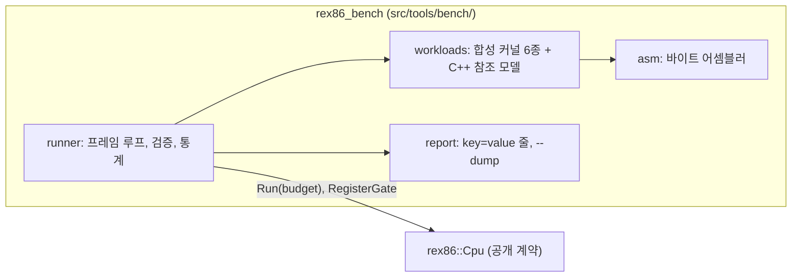
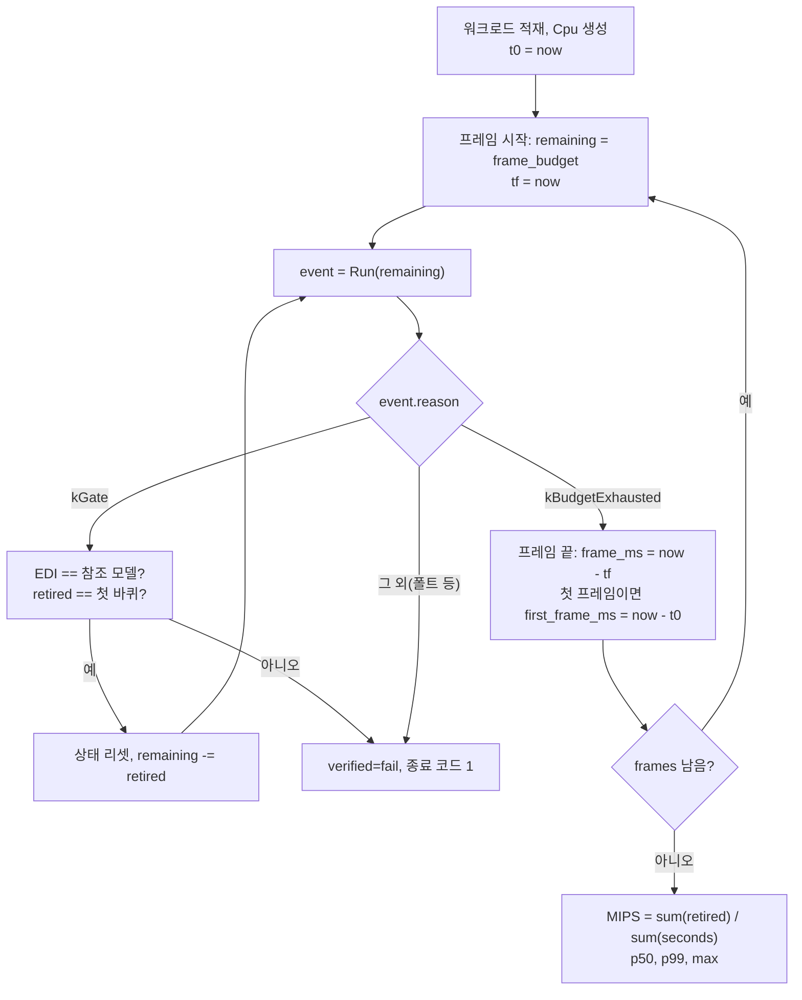

# #27 설계 : 벤치마크 하네스 / #27 design : the benchmark harness

이슈: [#27](https://github.com/reexec/rex86/issues/27) | 지시서: [20261009-i027](../work-orders/20261009-i027-benchmark-harness.md) | 로그: [20261009-i027](../work-logs/20261009-i027-benchmark-harness.md) | 근거: [README 목표 3, 4, 7, 8](../../README.md), [#21 설계](20261008-i021-target-board-cpu-baseline.md) 결정 4, [대상 기판의 CPU](../kb/target-board-cpus.md) 3절

## 범위 / Scope

README 달성도 표의 "벤치마크 하네스와 비교군 측정" 행을 시작한다. 이 작업은 **하네스**를 만들고 인터프리터의 **첫 기준선**을 기록한다. 하네스는 네 목표의 측정 수단이다.

| 목표 | 하네스가 재는 것 | 이 작업에서 |
|---|---|---|
| 3 성능 | MIPS, 기판 기준 CPU 한 프레임 분량의 실행 시간, 실시간 비율 | 구현 |
| 4 단독 측정 가능성 | 한 번의 실행으로 성능 지표 산출, 원본 바이너리 없이 | 구현 |
| 7 자원 예산 | 메모리 계측(게스트 버퍼, 페이지 속성표, 코드 캐시) | 지금 측정 가능한 항목만. 코드 캐시 사용량은 백엔드가 생기면 같은 자리에 더한다 |
| 8 반응성 | 프레임 시간 분포(p50, p99, 최대), 첫 프레임까지의 시간 | 구현. 인터프리터만 있는 지금은 분포가 평평하고, 번역 백엔드가 들어오면 워밍업과 번역 정지가 여기 드러난다 |

범위 밖: **비교군(v86, Boxedwine) 측정**. 같은 워크로드를 그 구현들에서 돌리려면 브라우저에서 코드 이미지를 적재하는 호스트가 필요하고, 그것은 웹 데모(4단계)의 일이다. 이 작업은 워크로드 이미지를 파일로 내보내는 데(`--dump`)까지만 준비한다. **최적화**도 범위 밖이다. 이 작업은 측정만 하고, 측정값이 다음 작업(블록 캐시, 인출 빠른 경로, 번역 백엔드)의 근거가 된다. 코어(`include/`, `src/` 중 도구가 아닌 부분)는 바꾸지 않는다.

*This starts the attainment table's "benchmark harness and comparator measurement" row: the **harness** itself and the interpreter's **first baseline**. The harness measures four goals: 3 (MIPS, the time of one reference-CPU frame's worth of instructions, the real-time ratio), 4 (one run yields the figures, no original binary), 7 (memory instrumentation, today only what is measurable: the guest buffer, the page attribute table, with code-cache usage added in the same place once a backend exists) and 8 (the frame-time distribution p50/p99/max and time to first frame, flat today with the interpreter alone, where a translation backend's warm-up and translation stalls will show). Out of scope: **comparator measurement** (v86, Boxedwine), which needs a browser host that loads the code image, the web demo's job (phase 4); this task only prepares the export of workload images (`--dump`). **Optimization** is out of scope too: this task measures, and its figures ground the next ones (block cache, fetch fast path, translation backends). The core (`include/` and the non-tool part of `src/`) does not change.*

## 결정 1: 하네스는 공개 계약 위의 도구다 / Decision 1: the harness is a tool on the public contract

`src/tools/bench/`에 두고 `rex86_bench`로 빌드한다. 코어의 공개 헤더(`Cpu`, `GuestMemory`, `Environment`)만 쓴다. 그래서 인터프리터와 앞으로의 번역 백엔드를 같은 프로그램으로 측정하고(`--engine`), 소비자가 코어를 쓰는 것과 같은 경로의 비용을 잰다(`Run(budget)`의 반복). 내부 헤더(`src/interp/`, `src/decode/`)에 기대지 않으므로 엔진 구조가 바뀌어도 하네스는 바뀌지 않는다. 단위 테스트만 어셈블러 인코딩을 확인하기 위해 내부 디코더를 쓴다.

시계는 `std::chrono::steady_clock`이다. 표준 라이브러리이므로 호스트 OS 헤더 금지 규칙과 충돌하지 않고, Emscripten에서는 `performance.now()`로 구현된다. 호스트 CPU 모델명 같은 OS 의존 정보는 하네스가 읽지 않고, 측정하는 사람이 분석 문서에 적는다(가이드).

모든 호스트에서 빌드한다. wasm32에서는 `node rex86_bench.js`로 돈다. 브라우저가 1차 목표 호스트이므로 wasm 수치가 가장 중요하다. 네이티브 수치는 AArch64 2차 목표와 소비자의 x86 호스트(oracle 용도)의 참고값이다.

*The harness lives in `src/tools/bench/`, builds as `rex86_bench` and uses the public headers alone (`Cpu`, `GuestMemory`, `Environment`), so one program measures the interpreter and the future translation backends (`--engine`) along the same path a consumer takes (repeated `Run(budget)`), and no change inside the engines touches it; only the unit tests use the internal decoder, to check the assembler's encodings. The clock is `std::chrono::steady_clock`: standard library, so no conflict with the no-OS-header rule, implemented over `performance.now()` under Emscripten. OS-dependent facts such as the host CPU's model name are not read by the harness; whoever measures writes them into the analysis (the guide). It builds on every host, under Node on wasm32 (`node rex86_bench.js`); the browser being the first target, the wasm figures matter most, with native figures as references for the AArch64 second target and the consumers' x86 oracle hosts.*

## 결정 2: 워크로드는 실행 중에 조립하는 합성 커널이다 / Decision 2: workloads are synthetic kernels assembled at run time

저장소는 원본 바이너리를 담지 않으므로(법적 범위) 워크로드는 바이트 어셈블러(`asm.h`)가 실행 중에 만든다. 어셈블러는 범용이 아니다. 커널이 쓰는 인코딩만 알고, 레이블과 rel32 분기를 고친다. 커널은 게임 코드가 많이 쓰는 형태를 하나씩 대표한다.

| 커널 | 대표하는 것 | 명령 형태 | 결과 |
|---|---|---|---|
| `alu` | 레지스터 산술, 짧은 루프 | ADD, XOR, IMUL r32,imm, SHR, ROL, INC/DEC, Jcc rel8 | EAX의 해시 |
| `memory` | 배열 순회, 적재와 저장 | MOV r32,[base+index*4], MOV [..],r32, MOVZX r32,byte [..], ADD r32,[..] | EAX의 합 |
| `call` | 함수 호출과 스택 프레임 | PUSH/POP, CALL rel32, RET imm16, MOV [EBP+disp], LEA | EAX |
| `string` | 블록 복사와 채움 | REP STOSD, REP MOVSD, CLD, 그 뒤 읽어 보는 ADD r32,[..] | EAX |
| `x87` | 부동소수점 누적 | FLD m64, FMUL m64, FADD m64, FADDP, FXCH, FSTP m64, FISTP m32 | EAX(정수 변환값) |
| `mixed` | 게임 루프의 혼합 | 위 다섯 커널을 작은 반복 수로 차례로 호출 | EAX의 XOR 누적 |

커널은 모두 `RET`로 끝나는 서브루틴이고, 워크로드는 "드라이버"가 커널을 호출한 뒤 **게이트 주소**에 도달하는 한 바퀴(lap)다. 드라이버는 `EDI`에 커널 결과를 XOR로 모으고, 하네스는 게이트에서 `EDI`를 C++ 참조 모델의 값과 대조한다. 참조 모델은 각 커널의 계산을 `std::uint32_t` 산술로 다시 적은 것이다(x87 커널은 결과가 정확히 표현되는 값만 쓰므로 정수로 검증된다: `Σ (i·0.5·2 + 1) = N(N+1)/2`). 그래서 벤치마크는 **틀린 결과를 빠르게 내는 엔진을 성능으로 치지 않는다.** 한 바퀴의 retire 수는 결정적이고, 하네스는 첫 바퀴의 수를 기억해 다음 바퀴마다 같은지 확인한다.

REP 문자열 명령은 반복 전체가 명령 하나로 retire된다. 그래서 `string` 커널의 MIPS는 다른 커널과 비교할 수 없다. 하네스는 그 커널의 MIPS를 그대로 보고하되 가이드와 분석에서 "프레임 시간으로 비교"하도록 적는다.

메모리 배치는 4 MiB다: 코드 `0x00010000`(읽기와 실행만), 데이터 `0x00100000`(읽기와 쓰기), 스택 꼭대기 `0x003FF000`. 코드 페이지에 쓰기가 없으므로 SMC 검사(kTranslated)가 번역 백엔드에서 어떤 비용을 내는지는 별도 워크로드의 몫이다(계획, 3단계).

*Since the repository ships no original binary (legal scope), the workloads are built at run time by a byte assembler (`asm.h`) that knows only the encodings the kernels use, with labels and rel32 fixups. Each kernel stands for a shape game code uses a lot: `alu` (register arithmetic, short loops), `memory` (array walks with loads and stores), `call` (calls with stack frames), `string` (REP STOSD/MOVSD block fill and copy), `x87` (floating-point accumulation) and `mixed` (the five in turn with small counts, a game loop's blend). Every kernel is a subroutine ending in `RET`; a workload is one lap in which a driver calls the kernels and reaches a **gate address**, XORing the kernel results into `EDI`, which the harness checks against a C++ reference model at the gate (plain `std::uint32_t` arithmetic restating each kernel; the x87 kernel uses only exactly representable values, `Σ (i·0.5·2 + 1) = N(N+1)/2`, so it verifies as an integer). The benchmark therefore **never credits an engine that is fast and wrong**. A lap's retired count is deterministic; the harness remembers the first lap's and checks every later one. A REP string instruction retires once for the whole repetition, so the `string` kernel's MIPS does not compare with the others; the harness reports it as is and the guide and analysis say to compare its frame time instead. The layout is 4 MiB: code at `0x00010000` (read and execute only), data at `0x00100000` (read and write), stack top `0x003FF000`. Nothing writes code pages, so the cost of the kTranslated check in a translation backend belongs to a workload of its own (planned, phase 3).*

## 결정 3: 측정 단위는 프레임이고 프레임은 Run(budget) 한 번이다 / Decision 3: the unit is a frame, and a frame is one Run(budget)

소비자는 프레임마다 `Run(budget)`을 부른다. 하네스도 같다. 한 프레임은 정확히 `frame_budget`개의 명령을 retire한다. 바퀴가 프레임 중간에 끝나면(kGate) 결과를 검증하고 상태를 리셋한 뒤 남은 예산으로 `Run`을 이어 부른다. 그래서 프레임의 길이는 늘 같고, 검증과 리셋 비용은 프레임 시간에 포함된다(소비자의 게이트 처리 비용에 해당하므로 빼지 않는다. 바퀴는 수만 명령이고 프레임은 수백만 명령이라 비중은 작다).

보고하는 값:

| 키 | 뜻 |
|---|---|
| `mips` | Σ retired / Σ 프레임 시간. 모든 프레임을 합친 값 |
| `frame_ms_p50`, `frame_ms_p99`, `frame_ms_max` | 프레임 시간 분포. p99는 정렬 뒤 `ceil(0.99·n) - 1` 번째 |
| `first_frame_ms` | Cpu 생성(워크로드 적재 포함)부터 첫 프레임 끝까지 |
| `laps` | 검증한 바퀴 수. `verified=ok` 또는 `fail` |

기본값은 프레임 예산 100만 명령, 20프레임이다. 인터프리터 3.5 MIPS에서 워크로드 하나에 약 6초, 여섯 워크로드에 약 40초다. `--frames`와 `--budget`으로 바꾼다.

*A consumer calls `Run(budget)` once a frame, and so does the harness: a frame retires exactly `frame_budget` instructions. When a lap ends mid-frame (kGate) the harness verifies the result, resets the state and continues `Run` with the remaining budget, so frames are always the same length and the verification and reset cost stays inside the frame time (it corresponds to a consumer's gate handling; a lap is tens of thousands of instructions and a frame millions, so the share is small). Reported: `mips` (Σ retired over Σ frame seconds), `frame_ms_p50/p99/max` (p99 taken at index `ceil(0.99·n) - 1` after sorting), `first_frame_ms` (from Cpu construction, workload load included, to the end of the first frame), `laps` and `verified`. Defaults: a budget of one million instructions and 20 frames, about six seconds per workload at the interpreter's 3.5 MIPS, forty for the six; `--frames` and `--budget` change them.*

## 결정 4: 실시간 비율은 기판의 클럭과 IPC 가정으로 환산한다 / Decision 4: the real-time ratio converts by the board's clock and an IPC assumption

README 목표 3의 실용 기준은 "기준 CPU 한 프레임 분량의 명령을 16.7 ms 안에"다. 기준 CPU는 [#21 설계](20261008-i021-target-board-cpu-baseline.md) 결정 4의 표다. 한 프레임 분량의 명령 수는 `clock × IPC / 60`이다. 클럭은 확인된 값이지만 **IPC는 추정**이다. P6과 K6-2가 실제 게임 코드에서 내는 지속 IPC는 측정하지 않았고, 공개된 수치도 코드마다 다르다. 하네스는 **IPC 1.0을 기본 가정**으로 두고 `--ipc`로 바꿀 수 있게 한다. 1.0은 보수적인 쪽이 아니다. P6의 지속 IPC는 분기와 캐시 미스가 많은 코드에서 1 아래로 내려가는 일이 많으므로, 1.0은 기준 CPU에 유리한(코어에 엄격한) 가정이다. 이 가정은 분석 문서에 추정으로 표기하고, 기판 실물이나 사이클 정확 자료가 생기면 바꾼다.

| 기판 | 기준 CPU | 클럭 | 프레임 명령 수(IPC 1.0) |
|---|---|---|---|
| `ez2dj1` | AMD K6-2 | 400 MHz | 6,666,667 |
| `mk3` | Mendocino Celeron | 400 MHz | 6,666,667 |
| `mk5` | Tualatin Celeron | 1.3 GHz | 21,666,667 |
| `ez2dj2` | Tualatin Celeron | 1.4 GHz | 23,333,333 |

워크로드마다 네 기판에 대해 `realtime_ratio = mips / (clock_mhz × ipc)`와 `frame_ms_at_board = 프레임 명령 수 / mips / 1000`을 보고한다. 비율 1.0이 실시간이다. 이 환산은 측정한 MIPS에 곱하는 것이므로 기판별로 따로 돌릴 필요가 없다. 기판 분량을 실제로 한 프레임으로 돌려 보고 싶으면 `--budget 6666667`처럼 준다.

*README goal 3's practical bar is "one reference-CPU frame's worth of instructions within 16.7 ms", the reference CPUs being the table of [#21 design](20261008-i021-target-board-cpu-baseline.md) decision 4, and a frame's worth is `clock × IPC / 60`. The clocks are confirmed; **the IPC is inferred**: the sustained IPC of a P6 or a K6-2 on real game code has not been measured and published figures vary by code. The harness **assumes IPC 1.0 by default**, changeable with `--ipc`. That is not the conservative side: a P6's sustained IPC often drops below 1 on branchy, cache-missing code, so 1.0 favors the reference CPU and is strict on the core. The analysis marks it inferred, to be replaced when board hardware or cycle-accurate data exists. The boards: `ez2dj1` (K6-2, 400 MHz, 6,666,667 instructions a frame at IPC 1.0), `mk3` (Mendocino Celeron, 400 MHz, the same), `mk5` (Tualatin Celeron, 1.3 GHz, 21,666,667), `ez2dj2` (Tualatin Celeron, 1.4 GHz, 23,333,333). For each workload and board the harness reports `realtime_ratio = mips / (clock_mhz × ipc)` and `frame_ms_at_board`; 1.0 is real time. Being a multiplication on the measured MIPS it needs no per-board run; to run a board's worth as one frame, pass `--budget 6666667` or so.*

## 결정 5: 출력은 probe와 같은 key=value 줄이고 smoke 모드가 ctest에 들어간다 / Decision 5: key=value lines as the probe's, and a smoke mode in ctest

출력은 `[rex86-bench] key=value ...` 줄이다. `rex86_probe`, `rex86_trace`와 같은 형식이라 grep과 스크립트로 모으기 쉽고, 호스트 간 비교가 줄 단위로 된다. 첫 줄은 빌드 정보(`version`, `config`(Release/Debug), `pointer_bytes`, `arch`(컴파일러 정의 매크로로 x86/x86-64/aarch64/wasm32), `engine`)다. 마지막 줄은 `result=ok` 또는 `result=fail`이다.

`--smoke`는 워크로드마다 한 바퀴만 돌려 검증한다. 시간은 재지 않는다(재더라도 보고하지 않는다). ctest 항목 `rex86_bench_smoke`로 다섯 호스트의 CI에 들어가, 워크로드가 코어에서 올바르게 돌고 참조 모델과 일치하는 것을 지킨다. 측정값은 CI에 기록하지 않는다. 공유 러너의 변동이 커서 추세로 쓸 수 없고, 수치는 사람이 고정된 호스트에서 재어 분석 문서에 적는다.

`--dump <디렉터리>`는 워크로드마다 코드 이미지(`<이름>.bin`)와 메타데이터(`<이름>.txt`: 적재 주소, 진입점, 게이트 주소, 데이터 영역, 초기 레지스터, 기대 EDI, 한 바퀴 retire 수)를 쓴다. 비교군 측정(후속)이 같은 바이트를 적재하는 데 쓴다.

측정은 Release 빌드로 한다. Linux에는 `linux-x64-release` 프리셋이 있고, Windows에는 `windows-x86-release` 빌드 프리셋을 더한다(같은 configure 프리셋, `Release` 구성). 하네스는 자기 구성을 첫 줄에 적어 Debug 수치가 섞이지 않게 한다.

*Output is `[rex86-bench] key=value ...` lines, the probe's and `rex86_trace`'s form, easy to grep and to compare across hosts line by line. The first line is the build (`version`, `config` Release/Debug, `pointer_bytes`, `arch` from compiler-defined macros, `engine`), the last `result=ok` or `fail`. `--smoke` runs one verified lap per workload without reporting times, and the ctest entry `rex86_bench_smoke` carries it into the five hosts' CI, so the workloads keep running correctly on the core and matching the model; figures are not recorded in CI, whose shared runners vary too much for a trend, and are measured by a person on a fixed host into the analysis. `--dump <dir>` writes each workload's code image (`<name>.bin`) and metadata (`<name>.txt`: load address, entry, gate, data region, initial registers, expected EDI, retired per lap) for the comparator measurement to load the same bytes later. Measurement uses Release builds: Linux has `linux-x64-release`, and Windows gains a `windows-x86-release` build preset (same configure preset, `Release` configuration); the harness prints its configuration so Debug figures never mix in.*

## 결정 6: 메모리 계측은 지금 셀 수 있는 것만 / Decision 6: memory instrumentation counts only what is countable today

목표 7의 수단으로 하네스는 `memory` 줄에 게스트 버퍼 크기, 페이지 속성표 크기(`page_count × sizeof(PageFlag)`), `sizeof(Cpu)`를 적는다. 코드 캐시 예산과 사용량은 하네스의 `CodeCacheServices` 구현(`BenchCodeCache`: `Allocate`/`Release`의 합계와 최대치를 셈)으로 재며, 번역 백엔드가 생기는 3단계에 같은 줄에 `code_cache_peak_bytes`로 더한다. 이 작업에서는 `--engine translator`를 받으면 명시적으로 거절한다(`engine_available=false`, 종료 코드 2. 조용한 더미 금지). 프로세스 전체의 피크 RSS는 OS 헤더가 필요하므로 코어 규칙에 따라 `src/tools/bench/host/<os>/` 호스트 전용 파일로 후속에 둔다.

*For goal 7 the `memory` line records the guest buffer size, the page attribute table size (`page_count × sizeof(PageFlag)`) and `sizeof(Cpu)`. Code-cache budget and usage are measured by the harness's own `CodeCacheServices` (`BenchCodeCache`, summing `Allocate`/`Release` with a peak) and join the same line as `code_cache_peak_bytes` in phase 3 with the translation backend; today `--engine translator` is refused explicitly (`engine_available=false`, exit code 2, no quiet dummy). The process's peak RSS needs OS headers, so by the core rules it goes to a host-specific file under `src/tools/bench/host/<os>/` in a follow-up.*

## 결정 7: 첫 기준선과 문서 / Decision 7: the first baseline and the documents

이 작업의 측정 호스트는 이 작업 환경(AMD Ryzen 5 5600X, WSL2 Ubuntu 24.04, GCC 13, x86-64 Release)과 Windows x86(MSVC, Release)이다. 결과는 새 분석 문서 `docs/analysis/interpreter-performance.md`에 호스트, 빌드, 커밋과 함께 **확인됨**으로 적고, IPC 가정은 **추정**으로 적는다. [#21 설계](20261008-i021-target-board-cpu-baseline.md) 결정 4가 적은 scratchpad 수치(약 3.5 MIPS, Xeon 2.1 GHz)는 이 기준선으로 대체된다. wasm32와 AArch64 수치는 이 환경에 도구가 없으면 후속 코멘트로 더한다.

가이드 `docs/guides/benchmark.md`에 빌드, 실행, 해석(REP 문자열 주의, IPC 가정), 기록 절차를 적는다. ARCHITECTURE의 도구 표와 빌드 표, README 달성도 표(하네스 완료, 비교군 측정 미착수), README 목표 3의 "현재 수치" 문단을 갱신한다.

*The measuring hosts are this workspace (AMD Ryzen 5 5600X, WSL2 Ubuntu 24.04, GCC 13, x86-64 Release) and Windows x86 (MSVC, Release). Results go to the new analysis `docs/analysis/interpreter-performance.md` as **confirmed** with host, build and commit, the IPC assumption as **inferred**; the scratchpad figure in [#21 design](20261008-i021-target-board-cpu-baseline.md) decision 4 (about 3.5 MIPS on a 2.1 GHz Xeon) is superseded. wasm32 and AArch64 figures follow as issue comments where this environment lacks the tools. The guide `docs/guides/benchmark.md` covers building, running, reading (the REP caveat, the IPC assumption) and recording; ARCHITECTURE's tool and build tables, README's attainment table (harness done, comparator measurement not started) and goal 3's "current figures" paragraph are updated.*

## 소비자 영향 / Consumer impact

공개 계약은 바뀌지 않는다. 소비자는 하네스를 빌드하지 않는다(`REX86_BUILD_TESTS`가 꺼진 FetchContent 소비자에게는 보이지 않는다). 하네스의 프레임 루프는 소비자의 호스트 루프와 같은 모양(`Run(budget)` 반복, 게이트 처리)이므로 여기서 잰 비용이 소비자에게 그대로 적용된다.

*No contract change; consumers do not build the harness (invisible to a FetchContent consumer with `REX86_BUILD_TESTS` off). The harness's frame loop has the shape of a consumer's host loop (repeated `Run(budget)`, gate handling), so the costs measured here carry over.*

## 검증 / Verification

* 단위 테스트 `tests/unit/bench_test.cpp`: 어셈블러의 인코딩(코어의 디코더로 길이와 mnemonic을 확인), 레이블 고정, 워크로드 여섯이 한 바퀴를 돌아 참조 모델과 일치하고 retire 수가 결정적임, 프레임 분할(게이트가 프레임 중간에 걸릴 때 예산이 정확히 지켜짐), p99 색인.
* `rex86_bench --smoke`가 ctest에 들어가 다섯 호스트에서 돈다.
* 측정: 두 호스트의 Release 기준선을 분석 문서에 기록한다.
* 로컬 빌드: WSL2 GCC(Debug, Release, ASan/UBSan), Windows MSVC. Clang, AArch64, wasm32는 CI.

*Unit tests in `tests/unit/bench_test.cpp` check the assembler's encodings (lengths and mnemonics through the core's decoder), label fixups, that the six workloads complete a lap matching the model with a deterministic retired count, frame slicing (the budget holds exactly when a gate falls mid-frame) and the p99 index; `rex86_bench --smoke` runs in ctest on the five hosts; the two hosts' Release baselines go into the analysis; local builds are WSL2 GCC (Debug, Release, ASan/UBSan) and Windows MSVC, with Clang, AArch64 and wasm32 in CI.*
