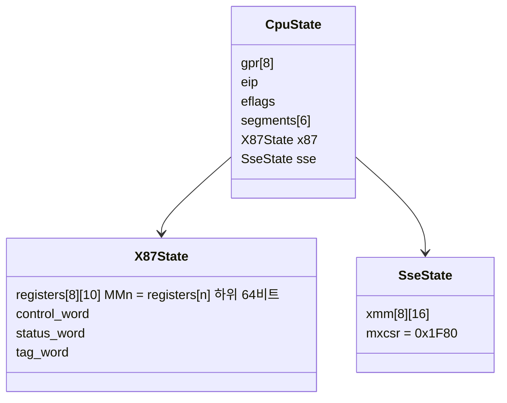
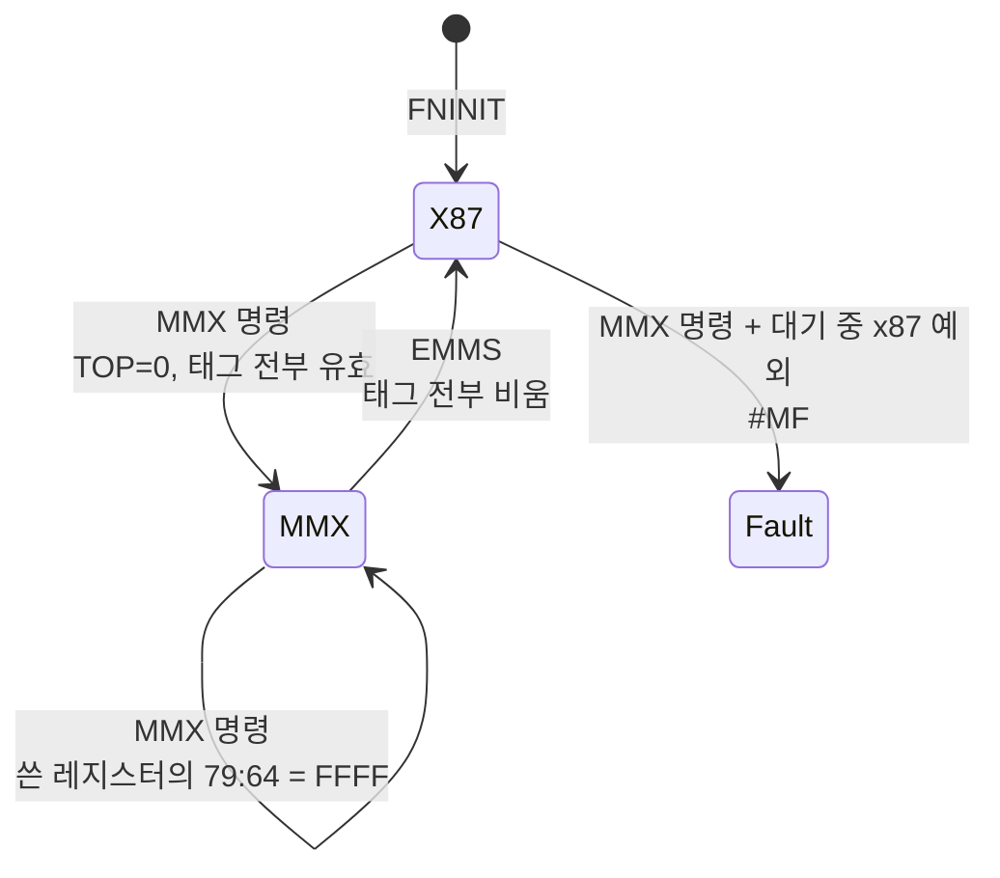

# #29 설계 : 1b — MMX와 SSE / #29 design : phase 1b — MMX and SSE

이슈: [#29](https://github.com/reexec/rex86/issues/29) | 지시서: [20261009-i029](../work-orders/20261009-i029-mmx-and-sse.md) | 로그: [20261009-i029](../work-logs/20261009-i029-mmx-and-sse.md) | 근거: [#21 설계](20261008-i021-target-board-cpu-baseline.md) 결정 1, 2, [대상 기판의 CPU](../kb/target-board-cpus.md), [#19 설계](20261008-i019-x87-increment-1.md)(x87 상태와 fuzz)

## 범위 / Scope

[#21](20261008-i021-target-board-cpu-baseline.md)이 정한 CPU 상한(P6 정수, P6 x87, MMX, Pentium III SSE) 가운데 남은 MMX와 SSE를 인터프리터에 넣는다. 양이 많아 x87(#19, #25)처럼 두 증분으로 나누되, 한 이슈와 한 브랜치에서 끝낸다.

| 증분 | 내용 |
|---|---|
| 1 | 공개 계약(SSE 상태, `Features::fxsr`, 기본값), FXSAVE/FXRSTOR, LDMXCSR/STMXCSR, MMX 전체, SSE가 더한 MMX 정수 명령(PSHUFW, PAVGB 등), SSE의 이동, 논리, 셔플, 언팩, MOVMSKPS, MOVNTPS/MOVNTQ/MASKMOVQ, PREFETCHh, SFENCE, 그리고 SIMD 호스트 대조 fuzz |
| 2 | SSE 부동소수점: 산술(ADD/SUB/MUL/DIV/SQRT, MIN/MAX), 비교(CMPPS/CMPSS, COMISS/UCOMISS), 변환(CVTPI2PS, CVTPS2PI, CVTTPS2PI, CVTSI2SS, CVTSS2SI, CVTTSS2SI), RCPPS/RSQRTPS와 스칼라형, MXCSR 예외와 #XM |

범위 밖: SSE2 이후(66 접두 MMX 형태 포함, 지금처럼 `Features::sse2`가 꺼져 #UD), 3DNow!(K6-2만의 확장, census가 확인할 때만), AMD의 PREFETCH(0F 0D, P6에서 #UD), 번역 백엔드, 성능.

*The MMX and SSE left of [#21](20261008-i021-target-board-cpu-baseline.md)'s CPU ceiling (P6 integer, P6 x87, MMX, the Pentium III's SSE), split like the x87 (#19, #25) into two increments, finished in one issue and one branch. Increment 1: the contract (SSE state, `Features::fxsr`, defaults), FXSAVE/FXRSTOR, LDMXCSR/STMXCSR, all of MMX, the MMX integer instructions SSE added (PSHUFW, PAVGB, ...), SSE moves, logic, shuffles, unpacks, MOVMSKPS, MOVNTPS/MOVNTQ/MASKMOVQ, PREFETCHh, SFENCE and the SIMD host-comparison fuzz. Increment 2: SSE floating point (arithmetic, MIN/MAX, CMPPS/CMPSS, COMISS/UCOMISS, the conversions, RCPPS/RSQRTPS and their scalar forms, MXCSR exceptions and #XM). Out of scope: SSE2 and later (66-prefixed MMX forms included, which stay #UD while `Features::sse2` is off), 3DNow! (the K6-2's alone, only if a census confirms it), AMD's PREFETCH (0F 0D, #UD on the P6), translation backends and performance.*

## 측정 먼저 / Measured first

이 작업 환경의 AMD Ryzen 5 5600X(Zen 3)에서 작은 프로브로 FXSAVE 이미지를 쟀다(x86-64와 i386 같음).

| 항목 | 값 | 처리 |
|---|---|---|
| MXCSR_MASK(바이트 28~31) | 0x0002FFFF(DAZ와 AMD의 비정렬 SSE 비트 17) | 호스트마다 다르다. fuzz가 비교하지 않는다 |
| FIP/FCS/FOP/FDP/FDS(6~23) | x87 예외가 없으면 0 | AMD 동작. fuzz가 비교하지 않는다 |
| 레지스터 슬롯의 바이트 10~15 | 0 | 코어도 0을 쓴다 |
| MMX 명령 뒤 | TOP = 0, 축약 태그 0xFF(전부 유효), 쓴 MM 레지스터의 비트 79:64 = FFFF | SDM 11.4와 같다 |

*Probed on this workspace's AMD Ryzen 5 5600X (Zen 3), x86-64 and i386 alike: MXCSR_MASK reads 0x0002FFFF (DAZ plus AMD's misaligned-SSE bit 17) and differs by host, so the fuzz does not compare it; FIP/FCS/FOP/FDP/FDS read 0 without a pending x87 exception (AMD behavior), not compared either; bytes 10-15 of each register slot are 0, as the core writes; after an MMX instruction TOP is 0, the abridged tag 0xFF (all valid) and the written MM register's bits 79:64 FFFF, as SDM 11.4 says.*

## 결정 1: 공개 계약 / Decision 1: the public contract

* **MMX 레지스터는 새 필드가 아니다.** MMn은 x87 물리 레지스터 n(`X87State::registers[n]`)의 하위 64비트다(SDM Vol. 1 9.5). 이미 80비트 메모리 형식으로 물리 순서대로 저장되어 있으므로 그대로 쓴다.
* **`CpuState`에 `SseState sse`를 더한다**: `std::array<std::array<std::uint8_t, 16>, 8> xmm`(리틀 엔디안 바이트), `std::uint32_t mxcsr = 0x1F80`(SDM 초기값: 예외 전부 마스크, 가장 가까운 값 반올림). `Reset()`이 초기화한다.
* **`FaultKind::kSimdFloatingPoint`**(#XM, 벡터 19)를 더한다. 증분 2가 쓴다. 두 소비자의 FaultKind에는 아직 대응 값이 없으므로 어댑터가 새로 매핑해야 한다.
* **`Features::fxsr`**(CPUID.01H:EDX.FXSR)를 더한다. Mendocino Celeron은 FXSAVE가 있고 SSE가 없으며, K6-2는 둘 다 없다. `sse`나 `mmx`로는 이 둘을 가를 수 없다.
* **기본값**: `mmx`, `sse`, `fxsr`를 켬으로 바꾼다. `cmov`처럼 "구현된 상한이 기본, 소비자가 기판에 맞춰 끈다"는 #21 결정 2를 따른다. `sse2`는 계속 끔이다.

| 기판 | x87 | cmov | mmx | fxsr | sse |
|---|---|---|---|---|---|
| EZ2DJ 1세대 (K6-2) | 켬 | 끔 | 켬 | **끔** | 끔 |
| MK3 (Mendocino) | 켬 | 켬 | 켬 | 켬 | 끔 |
| MK5, EZ2DJ 2세대 | 켬 | 켬 | 켬 | 켬 | 켬 |



*MMX registers are no new field: MMn is the low 64 bits of x87 physical register n (`X87State::registers[n]`, SDM Vol. 1 9.5), already stored in physical order in the 80-bit memory format. `CpuState` gains `SseState sse` with `xmm` (eight 16-byte little-endian arrays) and `mxcsr = 0x1F80` (the SDM's reset value: all exceptions masked, round to nearest), reset by `Reset()`. `FaultKind::kSimdFloatingPoint` (#XM, vector 19) is added for increment 2; neither consumer's FaultKind has it yet, so both adapters map it anew. `Features::fxsr` (CPUID.01H:EDX.FXSR) is added: the Mendocino Celeron has FXSAVE without SSE and the K6-2 has neither, which `sse` and `mmx` cannot express. `mmx`, `sse` and `fxsr` default to on, following #21 decision 2 (the implemented ceiling is the default and consumers switch off per board, as `cmov` does); `sse2` stays off. The table gives each board's flags.*

## 결정 2: 기능 플래그 판정 / Decision 2: feature gating

Zydis의 ISA 집합만으로는 부족하다. Zydis는 SSE와 함께 도입된 MMX 정수 명령(PSHUFW, PAVGB/W, PEXTRW, PINSRW, PMAXSW, PMAXUB, PMINSW, PMINUB, PMULHUW, PSADBW, MASKMOVQ, MOVNTQ)을 `PENTIUMMMX`로 분류한다(측정). 판정은 다음과 같다.

| 명령 | 필요한 플래그 |
|---|---|
| ISA `PENTIUMMMX`이고 위 SSE 정수 목록에 없음 | `mmx` |
| ISA `PENTIUMMMX`이고 위 목록에 있음 | `mmx`와 `sse` |
| ISA `SSE`(PMOVMSKB, CVTPI2PS 등 MMX 레지스터를 쓰는 것 포함), `SSEMXCSR`, `SSE_PREFETCH` | `sse`. MMX 레지스터를 쓰는 것은 `mmx`도 |
| ISA `FXSAVE` | `fxsr` |

`fxsr`가 켜지고 `sse`가 꺼진 CPU(Pentium II, Mendocino)의 FXSAVE는 MXCSR과 XMM 영역을 쓰지 않고, FXRSTOR는 그 영역을 읽지 않는다. SDM이 이 영역을 SSE가 없는 프로세서에서 예약으로 두므로 **추정**이다. 실물 확인은 P6 세대 하드웨어가 생기면 한다.

*Zydis's ISA sets are not enough: it files the MMX integer instructions SSE introduced (PSHUFW, PAVGB/W, PEXTRW, PINSRW, PMAXSW, PMAXUB, PMINSW, PMINUB, PMULHUW, PSADBW, MASKMOVQ, MOVNTQ) under `PENTIUMMMX` (measured). Gating: `PENTIUMMMX` outside that list needs `mmx`; inside it, `mmx` and `sse`; `SSE` (MMX-register ones such as PMOVMSKB and CVTPI2PS needing `mmx` too), `SSEMXCSR` and `SSE_PREFETCH` need `sse`; `FXSAVE` needs `fxsr`. On a CPU with `fxsr` and without `sse` (the Pentium II, the Mendocino) FXSAVE leaves the MXCSR and XMM fields alone and FXRSTOR does not read them, inferred from the SDM calling those fields reserved there; confirmed when P6 hardware is at hand.*

## 결정 3: MMX와 x87의 공유 / Decision 3: MMX and the x87

SDM Vol. 1 9.5~9.6을 따른다.

* EMMS를 뺀 모든 MMX 명령(SSE가 더한 MMX 정수 명령, CVTPI2PS/CVTPS2PI/CVTTPS2PI, MOVNTQ, MASKMOVQ, PMOVMSKB 포함)은 실행 시 **TOP = 0**, **태그 전부 유효(00)**로 만든다.
* MM 레지스터에 쓰면 그 물리 레지스터의 비트 79:64가 **FFFF**가 된다.
* EMMS는 태그를 전부 비움(11)으로 만든다.
* MMX 명령과 EMMS는 실행 전에 마스크 안 된 x87 예외가 대기 중이면 **#MF**(`kFloatingPoint`)다. x87의 대기형 명령과 같은 검사를 쓴다. FXSAVE/FXRSTOR와 SSE(XMM) 명령은 검사하지 않는다.
* MMX 명령은 FIP/FDP/FOP를 바꾸지 않는다. Zen 3는 이것을 볼 수 없게 만들므로(측정 표) fuzz가 비교하지 않고, Intel에서의 확인은 미확정으로 둔다.



*Per SDM Vol. 1 9.5-9.6: every MMX instruction but EMMS (the SSE-added MMX integer instructions, CVTPI2PS/CVTPS2PI/CVTTPS2PI, MOVNTQ, MASKMOVQ and PMOVMSKB included) sets TOP to 0 and every tag to valid; writing an MM register sets its physical register's bits 79:64 to FFFF; EMMS sets every tag to empty; MMX instructions and EMMS raise #MF (`kFloatingPoint`) when an unmasked x87 exception is pending, by the same check the x87's waiting instructions use, while FXSAVE/FXRSTOR and the XMM instructions do not check. MMX instructions leave FIP/FDP/FOP alone; Zen 3 hides those (the measurement table), so the fuzz does not compare them and the Intel side stays unresolved.*

## 결정 4: 메모리 피연산자와 정렬 / Decision 4: memory operands and alignment

* 64비트와 128비트 피연산자는 x87처럼 바이트 단위로 조립한다(`x87::ReadOperandBytes`를 일반화한 `simd_access`). 세그먼트 limit과 페이지 속성 검사는 기존 경로를 지난다.
* **16바이트 정렬 요구**: MOVAPS, MOVNTPS, 메모리 피연산자를 가진 패킹 SSE 명령(산술, 논리, 셔플, 언팩, 비교, 변환 중 128비트 피연산자를 읽는 것), FXSAVE/FXRSTOR. 정렬되지 않으면 **#GP**(`kGeneralProtection`)이고, 검사는 메모리 접근보다 먼저다(SDM 각 명령의 "#GP: if a memory operand is not aligned on a 16-byte boundary"). MOVUPS, 스칼라형, MOVLPS/MOVHPS, MMX의 64비트 피연산자, MOVSS의 32비트 피연산자는 정렬을 요구하지 않는다.
* MASKMOVQ는 DS:EDI(주소 크기에 따라 DI)에 바이트 마스크로 쓴다. 마스크가 0인 바이트는 쓰지 않으며, 그 주소의 폴트 여부는 SDM이 구현 정의로 둔다. 코어는 쓰는 바이트만 검사한다(**추정**, fuzz로 확인).
* PREFETCHh와 SFENCE는 상태를 바꾸지 않는다. PREFETCHh는 메모리에 닿지 않으므로 폴트도 내지 않는다(SDM: "does not generate exceptions").

*64- and 128-bit operands are assembled byte by byte as the x87's are (`simd_access`, generalizing `x87::ReadOperandBytes`), through the existing segment-limit and page checks. 16-byte alignment is required by MOVAPS, MOVNTPS, the packed SSE instructions with a 128-bit memory operand and FXSAVE/FXRSTOR; a misaligned operand is #GP (`kGeneralProtection`), checked before any access (the SDM's "#GP: if a memory operand is not aligned on a 16-byte boundary"); MOVUPS, the scalar forms, MOVLPS/MOVHPS, MMX's 64-bit operands and MOVSS's 32-bit operand need none. MASKMOVQ stores the masked bytes at DS:EDI (DI under a 16-bit address size); whether unmasked-out bytes fault is implementation-defined, and the core checks only the bytes it writes (inferred, the fuzz confirms). PREFETCHh and SFENCE change no state, and PREFETCHh never faults (the SDM: "does not generate exceptions").*

## 결정 5: FXSAVE/FXRSTOR와 MXCSR / Decision 5: FXSAVE/FXRSTOR and MXCSR

* 이미지는 SDM Vol. 2 FXSAVE의 32비트 형식이다: FCW, FSW, 축약 FTW(물리 레지스터마다 1비트, 1 = 비어 있지 않음), FOP, FIP, FCS, FDP, FDS, MXCSR, MXCSR_MASK, ST0~ST7(16바이트 슬롯에 80비트, **스택 순서**, 나머지 6바이트 0), XMM0~XMM7. 바이트 288 이후는 쓰지 않는다.
* FXRSTOR는 축약 태그를 레지스터 내용으로 2비트 태그로 되돌린다(유효, 0, 특수). 
* **MXCSR은 Pentium III 모델이다**: 유효 비트 0xFFBF(비트 6 DAZ는 Pentium III에 없다). LDMXCSR과 FXRSTOR는 예약 비트가 하나라도 서 있으면 #GP다. FXSAVE는 MXCSR_MASK에 0x0000FFBF를 쓴다. 실물 Pentium III는 이 자리에 0을 썼다고 알려져 있고, SDM은 0을 "0xFFBF로 보라"로 정의하므로 뜻은 같다(**추정**).
* FXSAVE는 x87 예외 대기 여부와 무관하게 FIP/FDP/FOP를 저장한다(Intel 방식). AMD가 0을 쓰는 것은 fuzz가 비교하지 않는 부분이다.

*The image is the SDM Vol. 2 FXSAVE 32-bit format: FCW, FSW, the abridged FTW (one bit per physical register, 1 = not empty), FOP, FIP, FCS, FDP, FDS, MXCSR, MXCSR_MASK, ST0-ST7 (80 bits in 16-byte slots, **stack order**, the other 6 bytes zero) and XMM0-XMM7; nothing past byte 288 is written. FXRSTOR expands the abridged tag from register contents (valid, zero, special). MXCSR follows the Pentium III: valid bits 0xFFBF (no DAZ, bit 6); LDMXCSR and FXRSTOR raise #GP on any reserved bit; FXSAVE writes MXCSR_MASK 0x0000FFBF, where Pentium III hardware is said to have written 0, which the SDM defines to mean 0xFFBF (inferred). FXSAVE saves FIP/FDP/FOP whether or not an exception is pending (Intel's way); AMD's zeros fall in what the fuzz does not compare.*

## 결정 6: SSE 부동소수점 모델 (증분 2) / Decision 6: the SSE floating-point model (increment 2)

x87처럼 SoftFloat 3e(binary32)를 쓰되 SSE의 규칙을 그 위에 둔다. 새 파일 `src/fpu/sse_math.{h,cpp}`다.

* **NaN**: SoftFloat의 8086 특수화는 x87 규칙(큰 유효 숫자)을 따르므로 쓰지 않는다. SSE 규칙(SDM Vol. 1 표 4-7, 11.5.2.2)을 직접 구현한다: 둘 다 NaN이면 첫 피연산자(목적지)를, 하나만 NaN이면 그것을 QNaN으로 바꿔 낸다. 연산이 무효이면 기본 QNaN(0xFFC00000).
* **MINPS/MAXPS**: 어느 쪽이든 NaN이거나 둘 다 0이면 **둘째 피연산자(원본)**를 낸다(SDM MINPS 의사 코드).
* **예외 순서**: 전계산 예외(#I, #D, #Z)를 모든 요소에서 먼저 모으고, 마스크 안 된 것이 있으면 결과를 쓰지 않고 #XM. 없으면 계산하고 후계산 예외(#O, #U, #P)를 모아 같은 판정을 한다(SDM 11.5.1). MXCSR 플래그는 감지된 요소의 것을 모두 세운다.
* **#D**: SoftFloat이 주지 않으므로 직접 판정한다. DAZ는 없다(Pentium III). **FTZ**(비트 15)는 언더플로가 마스크되어 있을 때 결과를 0으로 하고 #U와 #P를 세운다.
* **변환**: 범위를 넘는 정수 변환은 0x80000000(정수 indefinite)과 #I.
* **COMISS/UCOMISS**: ZF, PF, CF를 쓰고 OF, SF, AF를 지운다. COMISS는 QNaN에도 #I, UCOMISS는 SNaN에만.
* **RCPPS/RSQRTPS**: SDM은 상대 오차 1.5 × 2⁻¹²만 보장하고 Intel과 AMD의 값이 다르다. 코어는 결정적인 모델을 하나 정한다: **참값(1/x, 1/√x)을 binary32로 정확히 반올림**한다. 오차 한계를 넘지 않고 모든 호스트에서 같다. fuzz는 이 두 명령을 SDM 한계의 허용치로 판정한다. 비정규 입력과 0, 무한대의 특수값은 측정한 호스트 동작을 따른다.
* 언더플로 판정 시점(반올림 전/후)과 #D와 #I의 우선순위처럼 SDM이 분명하지 않은 곳은 증분 2의 측정으로 정하고 분석 문서에 적는다.

*Built on SoftFloat 3e's binary32 with SSE's rules on top, in the new `src/fpu/sse_math.{h,cpp}`. NaNs: the 8086 specialization follows the x87 (larger significand), so SSE's rule (SDM Vol. 1 table 4-7, 11.5.2.2) is implemented directly: the first operand (the destination) when both are NaN, the NaN one otherwise, quieted, and the default QNaN 0xFFC00000 for an invalid operation. MINPS/MAXPS return the second operand (the source) when either is NaN or both are zero (the SDM's pseudocode). Exceptions: pre-computation ones (#I, #D, #Z) gathered over every element first, an unmasked one writing nothing and raising #XM; otherwise compute and judge post-computation ones (#O, #U, #P) the same way (SDM 11.5.1), with MXCSR flags set for every element that raised them. #D is detected here since SoftFloat does not report it; there is no DAZ (Pentium III); FTZ (bit 15) flushes results to zero with #U and #P when underflow is masked. Out-of-range integer conversions give 0x80000000 (the integer indefinite) with #I. COMISS/UCOMISS write ZF, PF, CF and clear OF, SF, AF, COMISS signalling #I on QNaNs too, UCOMISS on SNaNs only. RCPPS/RSQRTPS: the SDM guarantees only a relative error of 1.5 × 2⁻¹², and Intel and AMD differ, so the core picks one deterministic model, **the true 1/x and 1/√x correctly rounded to binary32**, inside the bound and equal on every host; the fuzz judges the two within the SDM bound, while denormal, zero and infinite inputs follow the measured host behavior. What the SDM leaves unclear, such as tininess before or after rounding and the order of #D and #I, is measured in increment 2 and recorded in the analysis.*

## 결정 7: SIMD 호스트 대조 fuzz / Decision 7: the SIMD host-comparison fuzz

x87 fuzz와 같은 구조로 `tests/host/linux/simd_fuzz.cpp`를 만든다. x86-64와 i386 Linux에서 빌드되고(접두사 없이 같은 뜻), 짧은 고정 시드가 ctest에 들어간다.

```
push edx; popf; fxrstor [edi]; <명령>; fxsave [esi]; pushf; pop edx; ret   (코어는 ret 대신 hlt)
```

* 입력: 무작위 FXSAVE 이미지(x87 레지스터, 태그, TOP, MM 값, XMM 값, MXCSR), EFLAGS, EAX, [ebx]의 16바이트 정렬 64바이트. MXCSR은 비트 6과 16 이상을 세우지 않는다(Zen 3에는 DAZ가 있어 #GP가 나지 않으므로 Pentium III와 다르다). 정렬 #GP를 보려고 [ebx+8] 형태를 일부 섞는다.
* 형태: ISA `PENTIUMMMX`, `SSE`, `SSEMXCSR`, `SSE_PREFETCH`의 모든 인코딩. ModRM의 레지스터 피연산자는 MM0~7/XMM0~7 전부, 범용 레지스터 피연산자는 EAX, 메모리는 [ebx]와 [ebx+8]. 66/F2 접두 형태(SSE2 이후)와 FXSAVE/FXRSTOR 자신은 뺀다(하네스이고, 단위 테스트가 맡는다).
* 비교: FXSAVE 이미지 0~287바이트(FOP/FIP/FCS/FDP/FDS인 6~23과 MXCSR_MASK인 28~31 제외), EFLAGS의 산술 플래그, EAX, 메모리 64바이트, 폴트 종류.
* 폴트: 호스트에서 #GP/#MF/#XM/#UD는 신호로 온다(SIGSEGV, SIGFPE, SIGILL). x87 fuzz처럼 sigsetjmp로 받아 코어의 폴트 종류와 비교한다.
* 기록: 일치 사례를 `--record`로 trace에 쓰고 `tests/traces/simd.rxt`를 저장소에 둔다. 다섯 호스트의 ctest가 재생한다.
* 증분 2의 RCPPS/RSQRTPS는 허용치 판정이다. 제조사 이탈은 정수 fuzz처럼 좁은 조건으로 따로 센다.

*Same shape as the x87 fuzz, in `tests/host/linux/simd_fuzz.cpp`, building on x86-64 and i386 Linux (the encodings mean the same without prefixes), with a short fixed seed in ctest; the stub is above (HLT instead of RET on the core). Inputs: a random FXSAVE image (x87 registers, tags, TOP, MM and XMM values, MXCSR), EFLAGS, EAX and a 16-byte-aligned 64-byte block at [ebx]; MXCSR never gets bit 6 or bits 16 and up (Zen 3 has DAZ and would not #GP as the Pentium III does), and some [ebx+8] forms exercise the alignment #GP. Forms: every encoding of `PENTIUMMMX`, `SSE`, `SSEMXCSR` and `SSE_PREFETCH`, with every MM/XMM register in ModRM, EAX for general registers and [ebx]/[ebx+8] for memory; 66/F2-prefixed forms (SSE2 and later) and FXSAVE/FXRSTOR themselves (the harness, covered by unit tests) are left out. Compared: FXSAVE image bytes 0-287 (except FOP/FIP/FCS/FDP/FDS at 6-23 and MXCSR_MASK at 28-31), the arithmetic flags, EAX, the 64 memory bytes and the fault kind. Host faults (#GP/#MF/#XM/#UD) arrive as SIGSEGV, SIGFPE or SIGILL, caught with sigsetjmp as in the x87 fuzz and compared with the core's fault kind. Matching cases are recorded with `--record` into the committed `tests/traces/simd.rxt`, replayed by ctest on all five hosts. Increment 2's RCPPS/RSQRTPS are judged with a tolerance, and vendor deviations are counted apart under narrow conditions as in the integer fuzz.*

## 결정 8: 파일 / Decision 8: files

| 파일 | 내용 |
|---|---|
| `include/rex86/cpu_state.h`, `environment.h` | `SseState`, `kSimdFloatingPoint`, `Features::fxsr`, 기본값 |
| `src/interp/simd_access.{h,cpp}` | 64/128비트 피연산자, 정렬 검사, MM/XMM 레지스터 접근, MMX 진입(TOP, 태그, #MF) |
| `src/interp/exec_mmx.cpp` | MMX와 SSE가 더한 MMX 정수 명령, EMMS |
| `src/interp/exec_sse.cpp` | SSE 이동, 논리, 셔플, 언팩, MOVMSKPS, 비시간 저장, PREFETCH, SFENCE, LDMXCSR/STMXCSR |
| `src/interp/exec_fxsave.cpp` | FXSAVE/FXRSTOR |
| `src/interp/exec_sse_float.cpp`, `src/fpu/sse_math.{h,cpp}` | 증분 2 |
| `tests/unit/mmx_test.cpp`, `sse_test.cpp` | 단위 테스트 |
| `tests/host/linux/simd_fuzz.cpp`, `tests/traces/simd.rxt` | 호스트 대조와 trace |
| `src/trace/trace_format.h`, `replay.cpp` | `kFeatureFxsr` 비트 |

*Files: the contract headers (`SseState`, `kSimdFloatingPoint`, `Features::fxsr`, defaults); `simd_access` (64/128-bit operands, alignment, MM/XMM register access, MMX entry: TOP, tags, #MF); `exec_mmx.cpp` (MMX, the SSE-added MMX integer instructions, EMMS); `exec_sse.cpp` (SSE moves, logic, shuffles, unpacks, MOVMSKPS, non-temporal stores, PREFETCH, SFENCE, LDMXCSR/STMXCSR); `exec_fxsave.cpp`; increment 2's `exec_sse_float.cpp` and `src/fpu/sse_math`; unit tests `mmx_test.cpp` and `sse_test.cpp`; the fuzz and `tests/traces/simd.rxt`; the trace format's `kFeatureFxsr` bit.*

## 소비자 영향 / Consumer impact

* **`CpuState` 크기와 필드가 바뀐다.** 두 어댑터는 `sse.xmm`, `sse.mxcsr`를 옮겨야 한다. re2DJ의 guest SEH `CONTEXT`는 `ExtendedRegisters`(FXSAVE 이미지 512바이트)에 XMM과 MXCSR을 담으므로, 그 변환에 이 필드를 쓴다. rePIU의 `GuestCpuContext`는 DOS/4GW 게임이 SSE를 쓰지 않는 MK3 판이 대부분이지만 MK5 판을 위해 같은 필드를 옮긴다.
* **`FaultKind::kSimdFloatingPoint`**: 두 어댑터의 매핑 표에 한 줄씩 더한다. 게스트가 MXCSR의 마스크를 풀지 않으면 생기지 않는다.
* **기본값 변화**: `Features{}`를 그대로 쓰던 소비자는 이제 MMX/SSE/FXSAVE가 실행된다(전에는 #UD). 흉내 낼 기판이 MK3이면 `sse = false`, K6-2이면 `fxsr = false`와 `cmov = false`를 둬야 하고, CPUID 응답과 일치시켜야 한다(#21 결정 2).
* 머지 뒤 각 소비자 저장소에 tag 올림 작업을 만든다.

*`CpuState` changes size and fields: both adapters carry `sse.xmm` and `sse.mxcsr` — re2DJ's guest SEH `CONTEXT` holds XMM and MXCSR in `ExtendedRegisters` (the 512-byte FXSAVE image) and converts through these fields; rePIU's `GuestCpuContext` carries them for the MK5 builds, though most of its DOS/4GW games are MK3 builds without SSE. `FaultKind::kSimdFloatingPoint` adds one row to each adapter's mapping and never occurs unless a guest unmasks MXCSR exceptions. With the new defaults a consumer using `Features{}` as is now executes MMX/SSE/FXSAVE (#UD before): emulating the MK3 needs `sse = false`, the K6-2 `fxsr = false` and `cmov = false`, consistent with the CPUID answers (#21 decision 2). After the merge, a tag-bump task goes to each consumer repository.*

## 검증 / Verification

* 단위 테스트: MMX 명령마다 경계값(포화, 부호, 시프트 count ≥ 폭), MMX와 x87 공유(TOP, 태그, 79:64, EMMS, #MF), FXSAVE/FXRSTOR 왕복과 축약 태그, MXCSR 예약 비트 #GP, 정렬 #GP, 기능 플래그 표의 #UD. 증분 2: NaN 규칙, MIN/MAX, 예외 순서와 #XM, FTZ, 변환 indefinite, COMISS 플래그, RCPPS 모델.
* 호스트 대조: Zen 3(x86-64, i386)에서 긴 실행 불일치 0. CI의 Intel/AMD 러너가 짧은 실행을 맡는다.
* trace 묶음이 다섯 호스트에서 재생되고, 기존 SST, 정수와 x87 fuzz, 기존 trace 묶음이 그대로 통과한다.
* 로컬: WSL2 GCC(Debug, Release, ASan/UBSan, i386), Windows MSVC. Clang, AArch64, wasm32는 CI.

*Unit tests cover each MMX instruction's edges (saturation, signs, shift counts at or past the width), the MMX/x87 sharing (TOP, tags, bits 79:64, EMMS, #MF), FXSAVE/FXRSTOR round trips and the abridged tag, MXCSR reserved-bit #GP, alignment #GP and the feature table's #UD; increment 2 adds the NaN rule, MIN/MAX, exception order and #XM, FTZ, the conversions' indefinite, COMISS flags and the RCPPS model. The host comparison runs long on Zen 3 (x86-64 and i386) with zero mismatches, CI's Intel and AMD runners taking short runs; the trace corpus replays on the five hosts, and SST, the integer and x87 fuzzes and the existing corpora still pass. Local builds: WSL2 GCC (Debug, Release, ASan/UBSan, i386) and Windows MSVC; Clang, AArch64 and wasm32 in CI.*
