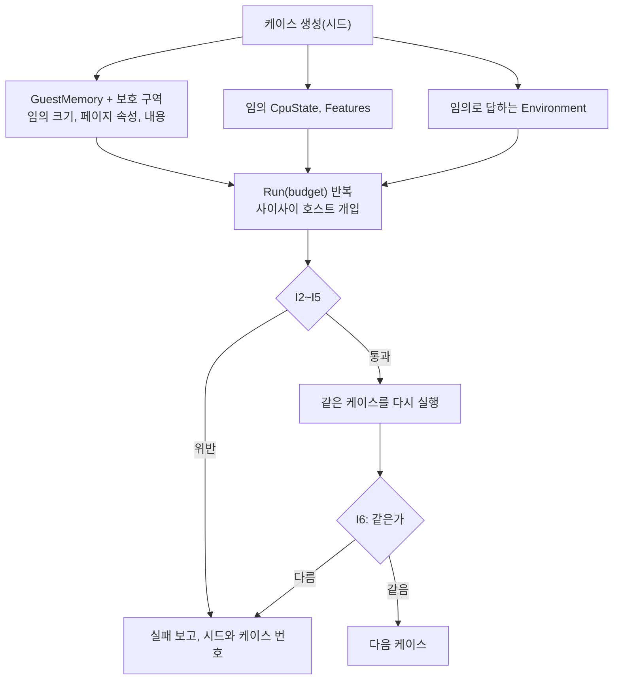

# #31 설계 : 견고성 하네스 / #31 design : the robustness harness

이슈: [#31](https://github.com/reexec/rex86/issues/31) | 지시서: [20261009-i031](../work-orders/20261009-i031-robustness-fuzz.md) | 로그: [20261009-i031](../work-logs/20261009-i031-robustness-fuzz.md) | 근거: [README 목표 6](../../README.md), [#22 설계](20261008-i022-integer-host-fuzz-and-trace.md) 결정 7(ASan/UBSan CI)

## 범위 / Scope

README 목표 6의 측정 수단 가운데 남은 "디코더·인터프리터 fuzzing(임의 바이트열 + 임의 상태)"를 만든다. ASan/UBSan CI 작업(`linux-x64-sanitize`)은 #22에서 생겼다. 호스트 CPU 대조 fuzz들은 의미가 맞는지를 보지만, 그 입력은 하네스가 고른 정상적인 상태다. 이 하네스는 반대로 **의미는 묻지 않고 어떤 입력에서도 지켜져야 하는 불변식**만 본다.

번역 백엔드는 아직 없다. 3단계에서 같은 하네스가 백엔드를 인터프리터와 차등 비교하도록 넓힌다(결정 6).

*This builds the remaining instrument of README goal 6, "fuzzing the decoder and interpreter with arbitrary bytes and state"; the ASan/UBSan CI job (`linux-x64-sanitize`) came with #22. The host-comparison fuzzes check meaning on sane states the harness chooses; this one, conversely, asks nothing about meaning and checks only **invariants that must hold for any input**. No translation backend exists yet; in phase 3 the same harness grows a differential comparison of a backend against the interpreter (decision 6).*

## 결정 1: 불변식 / Decision 1: the invariants

| 번호 | 불변식 | 확인 방법 |
|---|---|---|
| I1 | 호스트 프로세스가 크래시하지 않는다 | 하네스가 끝까지 돈다. ASan/UBSan 보고 0 |
| I2 | 게스트는 `GuestMemory` 버퍼 밖을 읽거나 쓰지 않는다 | 버퍼 앞뒤에 보호 구역. ASan 빌드는 그 구역을 poison해 읽기도 잡고, 그 밖의 빌드는 쓰기를 canary로 잡는다 |
| I3 | 게스트는 쓰기 권한(`kMapped` + `kWrite`)이 없는 페이지를 바꾸지 않는다 | 케이스 시작 때 그런 페이지의 내용을 떠 두고 매 `Run` 뒤 비교 |
| I4 | 코어는 페이지 속성을 `kTranslated` 말고는 바꾸지 않는다. `kTranslated`는 실행 가능한 페이지에만 선다(#34의 디코드 캐시가 세운다) | 속성표 비교 |
| I5 | `Run(budget)`의 이벤트가 계약대로다: retire 수 ≤ budget, `kBudgetExhausted`면 = budget, `kFault`면 `fault_kind` ≠ `kNone`, `kGate`면 등록된 게이트 주소, 열거값은 정의된 범위 | 매 `Run` 뒤 |
| I6 | 결정적이다: 같은 케이스를 두 번 돌리면 이벤트 열, 최종 상태, 메모리가 같다 | 케이스마다 두 번 실행 비교. 초기화되지 않은 값을 읽는 결함을 잡고, 목표 2(호스트 무관한 결과)의 전제이기도 하다 |
| I8 | 번역이 인터프리터와 같다: 모든 블록을 IR 평가기로 번역해 돌린 결과의 이벤트 열, 최종 상태, 메모리, `kTranslated`를 뺀 페이지 속성이 인터프리터의 것과 같다(#44 결정 5, 이 설계의 결정 6) | 케이스마다 세 번째 실행 `{kEvaluator, 0}`과 비교 |

"성립하지 않는 입력은 명시적 폴트"는 I5가 맡는다. 코어가 이해하지 못하는 명령은 `kIllegalInstruction`으로 멈춰야 하며, 조용히 성공하면 안 된다. 이것을 따로 재려면 의미가 필요하므로 호스트 대조 fuzz들의 몫이다.

*I1 the host process never crashes (the harness runs to the end, zero ASan/UBSan reports); I2 the guest never reads or writes outside the `GuestMemory` buffer (guard zones around it, poisoned for ASan builds so reads are caught too, canaries catching writes elsewhere); I3 the guest never changes a page without write permission (`kMapped` + `kWrite`), checked against a snapshot after every `Run`; I4 the core changes no page attribute but `kTranslated`, which it sets only on executable pages (#34's decode cache sets it); I5 every `Run(budget)` event keeps the contract (retired ≤ budget, = budget on `kBudgetExhausted`, a fault kind on `kFault`, a registered address on `kGate`, enumerators in range); I6 determinism: the same case run twice gives the same events, final state and memory, which catches reads of uninitialized values and underlies goal 2. "Invalid input is an explicit fault" is I5's: an instruction the core does not understand must stop with `kIllegalInstruction`, never quietly succeed; measuring that further needs meaning and belongs to the host-comparison fuzzes.*

## 결정 2: 케이스 생성 / Decision 2: case generation

시드 하나에서 결정적으로 만든다. 무작위가 넓게 퍼지면 첫 명령에서 폴트로 끝나는 케이스만 남으므로, 각 요소를 "대부분 그럴듯하게, 가끔 극단으로" 고른다.

| 요소 | 생성 |
|---|---|
| 메모리 | 크기 4 KiB~1 MiB, 가끔 페이지 배수가 아닌 크기. 페이지마다 속성을 무작위로(비매핑, 읽기, 쓰기, 실행, `kTranslated`의 조합, 대부분은 읽기·쓰기·실행). 내용은 무작위 바이트, 또는 접두사와 `0F` 확장 opcode가 잦은 "명령 수프" |
| 범용 레지스터 | 70%는 메모리 안 주소, 나머지는 32비트 전체 |
| EIP | 대부분 메모리 안. 가끔 버퍼 끝 근처나 밖 |
| EFLAGS | 32비트 전체 무작위(예약 비트, TF, DF, IF, AC, ID 포함) |
| 세그먼트 | 대부분 평탄. 가끔 임의 base, limit, present, executable, writable, default_32bit |
| x87 | 임의 레지스터, CW, SW, TW, 포인터 |
| SSE | 임의 XMM, 임의 MXCSR(예약 비트 포함. 호스트는 상태를 무엇으로든 둘 수 있다) |
| `Features` | 일곱 플래그를 각각 무작위 |
| `Environment` | 케이스 시드에서 이어지는 난수로 답한다: 선택자 거절 또는 임의 descriptor, 포트 수락 또는 거절, 인터럽트 대상 수락 또는 거절, 임의 RDTSC와 CPUID |
| 호스트 개입 | `Run` 사이에 임의 벡터의 `RaiseInterrupt`/`ClearPendingInterrupt`, `RegisterGate`, `InvalidateCode`, 레지스터 수정, `RequestStop`, 폴트 뒤 EIP를 옮기고 계속하거나 케이스 종료 |

디코더는 따로도 돈다: 0~16바이트 임의 바이트열을 32비트와 16비트 모드로 디코드하고, 성공하면 길이가 1~15이고 서명과 제어 흐름 질의가 끝나는지 본다.

*Everything comes deterministically from one seed, each element "mostly plausible, sometimes extreme", since uniformly random state ends nearly every case at the first instruction: memory of 4 KiB to 1 MiB, sometimes not a page multiple, random per-page attributes (mostly read-write-execute), random bytes or an "instruction soup" rich in prefixes and `0F` opcodes; general registers 70% inside memory; EIP mostly inside, sometimes near or past the end; all 32 EFLAGS bits random; segments mostly flat, sometimes arbitrary; arbitrary x87 and SSE state (MXCSR's reserved bits included, since a host may set state to anything); each of the seven `Features` random; an `Environment` answering from the case's random stream; and host interventions between `Run`s (interrupts raised and cleared, gates, `InvalidateCode`, register edits, `RequestStop`, moving EIP after a fault or ending the case). The decoder also runs alone on 0-16 random bytes in 32- and 16-bit modes, a successful decode needing a length of 1-15 and its signature and flow queries returning.*

## 결정 3: 드라이버와 libFuzzer / Decision 3: the driver and libFuzzer

* **드라이버** `rex86_robust`(`src/tools/robust/`): 시드 범위를 돌리는 결정적 프로그램. 공개 계약만 쓰고(디코더 fuzz만 내부 헤더) 호스트 OS 헤더가 없어 **다섯 호스트 모두에서 빌드**된다. 짧은 실행이 ctest `rex86_robust_smoke`로 들어가 CI의 모든 작업(ASan/UBSan 포함)에서 돈다. 실패는 시드와 케이스 번호로 재현한다(`--case`).
* **libFuzzer 진입점**: CMake 옵션 `REX86_LIBFUZZER`(Clang 전용)를 켜면 `rex86_robust_libfuzzer`를 만든다. 입력 바이트를 케이스 생성기의 난수원으로 쓰므로, libFuzzer의 범위 기반 변형이 드라이버와 같은 생성기를 탄다. 이 옵션은 코어를 `-fsanitize=fuzzer-no-link`로 계측한다.
* **CI**: 새 작업 `linux-x64-libfuzzer`(Clang 18, ASan + UBSan + libFuzzer)가 고정 시간(60초) 동안 돈다. 크래시가 나면 재현 입력을 artifact로 올린다.

*The driver `rex86_robust` (`src/tools/robust/`) runs a seed range deterministically, using the public contract alone (the decoder fuzz aside) and no OS header, so it **builds on all five hosts**; a short run is the ctest entry `rex86_robust_smoke`, run by every CI job including ASan/UBSan, and a failure reproduces from its seed and case number (`--case`). The CMake option `REX86_LIBFUZZER` (Clang only) builds `rex86_robust_libfuzzer`, whose input bytes are the generator's random source, so libFuzzer's coverage-guided mutation drives the same generator; the option instruments the core with `-fsanitize=fuzzer-no-link`. A new CI job `linux-x64-libfuzzer` (Clang 18, ASan + UBSan + libFuzzer) runs for a fixed 60 seconds and uploads any crashing input as an artifact.*

## 결정 4: 시간 상한 / Decision 4: time bounds

하네스가 멈추지 않으려면 케이스마다 일이 유한해야 한다. `Run`의 예산이 명령 수를 막지만, **REP 문자열은 한 번의 Step 안에서 끝까지 반복**한다(`exec_strings.cpp`). 32비트 주소에서 ECX가 크면 한 명령이 매핑된 연속 영역의 크기만큼(최대 버퍼 크기 / 폭) 돈다. 16비트 주소에서는 CX라 65,535번이 상한이다. 하네스는 메모리를 1 MiB 이하로 두어 최악을 약 100만 반복으로 묶는다.

이것은 크래시가 아니라 **반응성 문제**다(README 목표 8). 수백 MB를 쓰는 소비자에서 REP 하나가 수 초 걸릴 수 있다. 하드웨어는 반복 사이에 인터럽트를 받으므로, 코어도 반복을 예산에 세거나 덩어리로 끊어 재개할 수 있다. 다만 `instructions_retired`의 뜻과 trace 묶음, 벤치마크의 `string` 워크로드에 영향을 주는 계약 결정이라 이 작업에서 하지 않고 **후속 이슈**로 둔다.

*The harness must not hang, so each case's work must be finite. `Run`'s budget bounds instructions, but **a REP string runs to completion within one Step** (`exec_strings.cpp`): with 32-bit addressing and a large ECX one instruction iterates as far as the mapped contiguous region goes (at most buffer size / width), while 16-bit addressing caps CX at 65,535. Memory of at most 1 MiB bounds the worst case at about a million iterations. This is not a crash but a **responsiveness problem** (README goal 8): in a consumer with hundreds of MB, one REP can take seconds. Hardware takes interrupts between iterations, so the core could count iterations against the budget or cut them into resumable chunks, but that changes what `instructions_retired` means and touches the trace corpora and the benchmark's `string` workload, so it is left to a **follow-up issue** rather than this task.*

## 결정 5: 고친 결함의 처리 / Decision 5: handling what it finds

하네스가 찾은 결함은 같은 작업에서 고치고, 각각 단위 테스트로 고정한다. 고치는 곳은 코어 소스이며 공개 계약은 바꾸지 않는다. 고칠 수 없거나 설계 결정이 필요한 것은 분석 문서에 적고 후속으로 둔다.

*Defects the harness finds are fixed in this task, each pinned by a unit test, in the core's sources without a contract change; anything needing a design decision goes to the analysis topic and a follow-up.*

## 결정 6: 번역 백엔드 / Decision 6: translation backends

3단계의 백엔드가 생기면 같은 케이스를 인터프리터와 백엔드로 돌려 이벤트, 상태, 메모리가 같은지 본다(목표 2의 "백엔드 대 인터프리터"). 하네스는 엔진을 고르는 지점(`Cpu`의 `CodeCacheServices`)만 열어 두면 되므로 지금 구조로 넓힐 수 있다.

*Once phase 3's backends exist, the same case runs on the interpreter and a backend and the events, state and memory are compared (goal 2's "backend against interpreter"); the harness only needs the engine choice (`Cpu`'s `CodeCacheServices`) opened up, so today's structure extends to it.*

## 소비자 영향 / Consumer impact

공개 계약은 바뀌지 않는다. 하네스가 찾아 고친 결함은 소비자에게 그대로 이롭다.

*No contract change; defects found and fixed benefit both consumers directly.*

## 검증 / Verification

* 드라이버 긴 실행: GCC ASan/UBSan(x86-64) 수십만 케이스, Release 수백만 케이스, i386, MSVC x86에서 위반 0.
* libFuzzer: 로컬 Clang 18 ASan/UBSan로 장시간 실행에서 크래시 0.
* ctest의 smoke가 다섯 호스트와 새니타이저 작업에서 통과하고, 새 CI 작업이 녹색이다.
* 하네스 자신의 시험: 불변식 검사기가 위반을 실제로 잡는지 단위 테스트로 확인한다(보호 구역 쓰기, 쓰기 금지 페이지 변경, 이벤트 계약 위반을 일부러 만든다).

*Long driver runs with zero violations under GCC ASan/UBSan (x86-64, hundreds of thousands of cases), Release (millions), i386 and MSVC x86; long libFuzzer runs under Clang 18 ASan/UBSan with zero crashes; the smoke passing in ctest on the five hosts and the sanitizer job, and the new CI job green. The harness itself is tested: unit tests check that the invariant checkers do catch violations, by producing a guard-zone write, a write-protected page change and an event-contract violation on purpose.*
