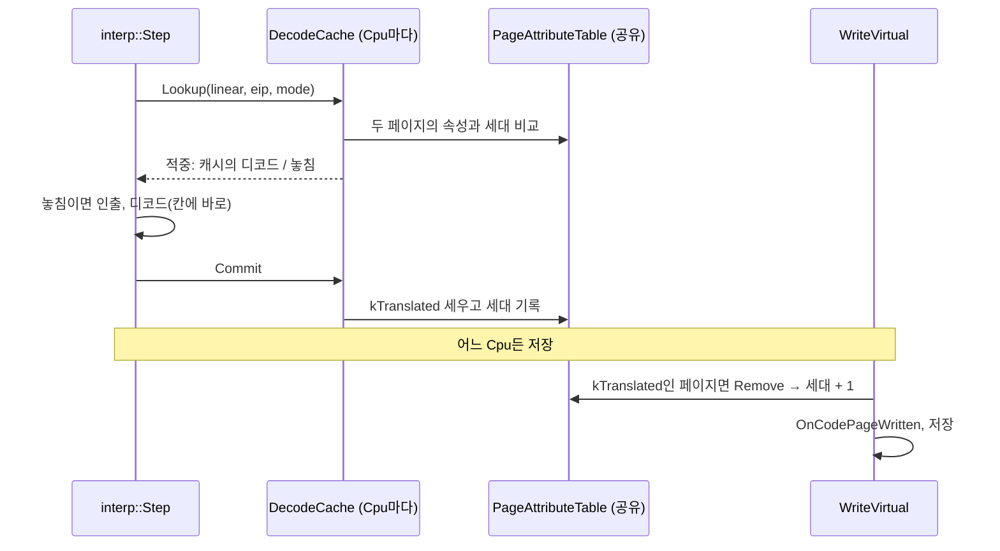

# #34 설계 : 인터프리터 빠른 경로 / #34 design : the interpreter fast path

이슈: [#34](https://github.com/reexec/rex86/issues/34) | 지시서: [20261009-i034](../work-orders/20261009-i034-interpreter-decode-cache.md) | 로그: [20261009-i034](../work-logs/20261009-i034-interpreter-decode-cache.md) | 근거: [인터프리터 성능 기준선](../analysis/interpreter-performance.md), [#27 설계](20261009-i027-benchmark-harness.md), [#11 설계](20261007-i011-interpreter-core.md)(위험 표의 "블록 캐시는 측정 뒤")

## 측정 먼저 / Measured first

gprof(GCC 13, x86-64, `-O2 -pg`), 벤치마크 `alu`, `memory`, `mixed` 워크로드 각 1,000만 명령, AMD Ryzen 5 5600X. **확인됨**.

| 부분 | 비중 | 내용 |
|---|---|---|
| 인출 | 약 32% | `GuestMemory::Read8` 16.6%, `PageAttributeTable::AllHave` 15.2%. 명령마다 15바이트를 바이트 단위로 읽고, 바이트마다 페이지를 두 번 검사한다(명령당 `AllHave` 34회, `Read8` 15회) |
| 디코드 | 약 31% | Zydis(`ZydisDecoderTreeGetChildNode` 18.5%, `ZydisDecodeOperands` 9.8% 등) |
| `interp::Step` 자체 | 17% | 1,136바이트 `DecodedInstruction`의 0 초기화, 상태 저장(정확한 폴트용) |
| 의미 실행 | 약 10% | `ReadOperand`, `WriteVirtual`, 각 실행 파일 |

명령 하나의 비용은 의미가 아니라 **인출과 디코드**다. 같은 주소의 명령을 다시 디코드하지 않으면 그 대부분이 사라진다. 게임 코드는 루프가 대부분이므로 같은 주소가 반복된다.

*Measured with gprof (GCC 13, x86-64, `-O2 -pg`) over 10M instructions each of the benchmark's `alu`, `memory` and `mixed` workloads on an AMD Ryzen 5 5600X, confirmed: fetching about 32% (byte-wise reads of 15 bytes per instruction with two page checks per byte, 34 `AllHave` and 15 `Read8` calls per instruction), decoding about 31% (Zydis), `interp::Step` itself 17% (zeroing a 1,136-byte `DecodedInstruction` and saving state for precise faults), semantics about 10%. An instruction costs fetching and decoding, not meaning; game code is mostly loops, so the same addresses repeat, and not decoding them again removes most of the cost.*

## 결정 1: 디코드 캐시 / Decision 1: the decode cache

`src/interp/decode_cache.{h,cpp}`. `Cpu`가 소유하고 `interp::Step`에 넘긴다(넘기지 않으면 지금처럼 매번 디코드한다. SST 러너 같은 직접 호출자는 그대로다).

* **구조**: 직접 사상 4,096칸. 칸마다 키(선형 주소, EIP 오프셋, 디코드 모드 16/32)와 디코드 결과, 첫 바이트와 마지막 바이트 페이지의 세대(결정 2)를 둔다. 키에 EIP 오프셋을 넣는 이유는 상대 분기의 목적지가 오프셋으로 계산되기 때문이다(CS base가 바뀌면 같은 선형 주소라도 결과가 다르다).
* **적중 조건**: 키 일치, 두 페이지의 세대 일치, 두 페이지의 속성에 `kMapped`, `kRead`, `kExecute`, `kTranslated`가 모두 있음, CS가 평탄하지 않으면 명령 전체가 limit 안. 이 검사는 페이지 속성표 조회 둘과 비교 몇 개다.
* **삽입**: 놓치면 지금처럼 인출하고 디코드한 결과를 그 칸에 바로 쓴다(복사 없음). 디코드에 성공했고 명령이 선형 주소 4 GiB 경계를 넘지 않으면, 명령이 걸친 페이지에 `kTranslated`를 세우고 그 페이지들의 세대를 기록한다.
* **메모리**: 칸 저장소는 처음 쓸 때 초기화하지 않은 채 할당한다(x86-64 약 4.6 MB). `Cpu`를 많이 만드는 fuzz가 매번 4.6 MB를 0으로 채우지 않게 하기 위해서다.

*`src/interp/decode_cache.{h,cpp}`, owned by `Cpu` and passed to `interp::Step` (without one, every instruction is decoded as today, so direct callers such as the SST runner are unchanged). Direct-mapped, 4,096 slots, each holding a key (linear address, EIP offset, 16/32-bit mode), the decode, and the generations (decision 2) of its first and last bytes' pages; the EIP offset is in the key because relative branch targets are computed from it. A hit needs the key, both generations, `kMapped`, `kRead`, `kExecute` and `kTranslated` on both pages, and, for a non-flat CS, the whole instruction within the limit: two page-table reads and a few compares. A miss fetches and decodes as today straight into the slot (no copy) and, on success and when the instruction does not wrap the 4 GiB linear space, sets `kTranslated` on its pages and records their generations. Slot storage is allocated uninitialized on first use (about 4.6 MB on x86-64), so fuzzers creating many `Cpu`s do not zero 4.6 MB each time.*

## 결정 2: 무효화는 페이지 속성표의 세대로 / Decision 2: invalidation through the page table's generations

자기 수정 코드는 아키텍처 규칙대로 페이지 속성표로 잡는다(하드웨어 페이지 보호에 기대지 않는다). 세대를 어디에 둘지가 핵심이다. **두 소비자는 게스트 스레드마다 `Cpu`를 두고 `GuestMemory`를 공유한다.** 세대를 `Cpu`마다 두면 다음 경우가 틀린다. Cpu A와 B가 페이지 P를 캐시했다. B가 P에 저장해 `kTranslated`를 지우고 B의 캐시만 무효화한다. A가 P의 다른 명령을 다시 디코드해 `kTranslated`를 세운다. 이제 B의 낡은 항목이 플래그 검사를 통과한다.

그래서 **세대를 `PageAttributeTable`에 둔다.** 페이지마다 `std::uint32_t` 세대가 있고, `kTranslated`가 서 있다가 지워질 때(`Remove`, `Set`) 1 오른다. 공개 헤더에는 조회 함수 `Generation(address)` 하나가 더해진다.

* **게스트 저장**: 모든 저장은 `WriteVirtual`을 지난다(확인함). 그곳은 이미 `kTranslated` 페이지에서 플래그를 지우므로 세대가 저절로 오르고, 그 페이지에 걸친 모든 Cpu의 모든 칸이 한 번에 무효가 된다. `WriteVirtual`은 바뀌지 않는다.
* **호스트**: `Cpu::InvalidateCode`는 이미 범위의 `kTranslated`를 지우므로 세대가 오른다. 호스트가 속성표를 직접 `Set`하거나 `Remove`해도 같다. **호스트가 이미 실행된 코드를 바꾸면 `InvalidateCode`를 불러야 한다는 것은 원래 계약**(`cpu.h`의 설명)이지만, 지금까지 인터프리터는 이것에 기대지 않았다. 이제 기댄다.
* 실행 중인 명령은 칸을 가리키지만, 무효화는 세대만 바꾸고 칸을 지우지 않으며 새 삽입은 다음 Step 시작에서만 일어나므로, 자기 자신을 고치는 명령도 안전하다.
* 세대 표의 메모리는 페이지마다 4바이트(64 MiB 게스트면 64 KiB, 4 GiB면 4 MiB)다. 페이지마다 1바이트인 속성 배열 옆에 둔다.

*Self-modifying code is caught through the page attribute table, as the architecture rules require, and where the generations live is the crux: **both consumers run one `Cpu` per guest thread over a shared `GuestMemory`**. With per-`Cpu` epochs, this goes wrong: Cpus A and B cache page P; B stores into P, clearing `kTranslated` and invalidating its own cache only; A re-decodes another instruction on P and sets `kTranslated` again; now B's stale slots pass the flag check. So **the generations live in `PageAttributeTable`**: one `std::uint32_t` per page, incremented whenever `kTranslated` goes from set to clear (`Remove`, `Set`), with one accessor `Generation(address)` added to the public header. Every store goes through `WriteVirtual` (checked), which already clears `kTranslated`, so the generation rises by itself and every slot of every `Cpu` over that page is invalid at once, `WriteVirtual` itself unchanged. `Cpu::InvalidateCode` already clears `kTranslated`, and so does a host's direct `Set` or `Remove`. **That a host changing code that has run must call `InvalidateCode` was always the contract** (`cpu.h`), but the interpreter did not depend on it until now. The executing instruction points into its slot, but invalidation only changes generations and new insertions happen only at the start of the next Step, so even an instruction rewriting itself is safe. The table costs 4 bytes per page (64 KiB for a 64 MiB guest, 4 MiB for 4 GiB), beside the byte-per-page attribute array.*

## 결정 3: 묶음 인출 / Decision 3: bulk fetching

캐시를 놓쳤을 때, 15바이트 창이 한 페이지(또는 두 페이지) 안에 있으면 페이지 속성을 페이지마다 한 번 검사하고 `GuestMemory::ReadBytes`로 한 번에 읽는다. CS limit과 페이지 경계, 버퍼 끝에서 멈추는 동작(폴트 종류와 주소)은 지금의 바이트 단위 루프와 같아야 하므로, 창을 "limit까지", "인출 가능한 페이지까지", "버퍼 끝까지" 중 가장 짧은 길이로 자른 뒤 읽는다.

*On a miss, the 15-byte window is cut to the shortest of "up to the CS limit", "up to the last fetchable page" and "up to the buffer end", each page checked once, and read with one `GuestMemory::ReadBytes`, so stopping at a limit, a page boundary or the buffer end (with the same fault kind and address) behaves exactly as today's byte loop.*

## 결정 4: 그 밖의 작은 것 / Decision 4: smaller items

* `Cpu::Run`의 게이트 검사는 게이트가 하나도 없으면 해시 조회를 건너뛴다.
* 측정 뒤 남는 병목은 이 작업에서 고치지 않고 분석 문서에 적는다(측정 없이 최적화하지 않는다).

*`Cpu::Run` skips the gate hash lookup when no gate is registered; whatever bottleneck remains after the measurement goes to the analysis rather than being fixed here.*

## 결정 5: 무엇이 바뀌지 않아야 하나 / Decision 5: what must not change

결과는 바뀌지 않는다. 바뀌는 것은 호스트가 볼 수 있는 두 가지 부수 효과뿐이다.

* 실행된 코드 페이지에 `kTranslated`가 선다. 그런 페이지에 저장하면 `OnCodePageWritten`(진단용)이 불린다. 코드와 데이터가 섞인 페이지는 저장마다 무효화와 재디코드가 반복되어 느려질 수 있지만 결과는 같다. 이 비용은 측정해 분석에 적는다.
* 견고성 하네스의 불변식 I4(속성은 `kTranslated`를 지우는 것 말고 바뀌지 않는다)를 "`kTranslated` 말고는 바뀌지 않는다"로 고친다. 엔진이 번역한 페이지에 `kTranslated`를 세우는 것은 원래 설계된 동작이다.

검증 수단은 이미 있다: 단위 테스트, SingleStepTests는 이 환경에 없으므로 제외, 세 호스트 대조 fuzz, trace 묶음 넷, 견고성 하네스(결정성 I6 포함). 여기에 SMC 전용 단위 테스트를 더한다: 실행된 명령을 같은 페이지의 저장으로 바꾸고 다시 실행, 다른 주소의 명령이 같은 페이지에 있을 때, 호스트가 `InvalidateCode` 뒤 코드를 바꿀 때, CS base가 바뀔 때.

*Results must not change; only two host-visible side effects do: executed code pages get `kTranslated`, so a store there calls `OnCodePageWritten` (diagnostics only), and a page mixing code and data may thrash between invalidation and re-decoding, slower but with the same results, a cost measured into the analysis; and the robustness harness's invariant I4 becomes "attributes other than `kTranslated` never change", setting `kTranslated` on a translated page being the designed behavior. The existing instruments verify it (unit tests, three host-comparison fuzzes, four trace corpora, the robustness harness with its determinism check I6; SingleStepTests is not in this environment), plus new SMC unit tests: an executed instruction rewritten by a store on its page and run again, another instruction on the same page, a host change after `InvalidateCode`, and a CS base change.*

## 소비자 영향 / Consumer impact

* 공개 API에는 `PageAttributeTable::Generation`이 더해진다(추가뿐). `Cpu`는 캐시를 가리키는 `std::unique_ptr` 멤버를 얻어 복사할 수 없게 되고 이동만 된다(소비자 코드가 `Cpu`를 복사하지 않는다면 영향 없음). 크기와 ABI가 바뀌므로 다시 빌드해야 한다.
* **소비자가 이미 실행된 게스트 코드를 고치면 `InvalidateCode`를 불러야 한다**(rePIU의 HLE 패치, re2DJ의 import 썽크 재작성 같은 경우). 원래 계약이지만 이제 인터프리터에서도 필요하다.
* 메모리: `Cpu`마다 실행을 시작하면 약 4.6 MB(x86-64), 4 MB(wasm32)가 더 든다. 목표 7(자원 예산)의 계측에 들어간다.

*The public API gains `PageAttributeTable::Generation` (an addition only); `Cpu` gains a `std::unique_ptr` to its cache and becomes move-only (no effect unless consumer code copies a `Cpu`), and its size and ABI change, so consumers rebuild. **A consumer changing guest code that has already run must call `InvalidateCode`** (rePIU's HLE patches, re2DJ's import-thunk rewrites): always the contract, now needed by the interpreter too. Memory: about 4.6 MB (x86-64) or 4 MB (wasm32) more per `Cpu` once it runs, counted in goal 7's instrumentation.*

## 검증 / Verification

* 벤치마크: 같은 호스트와 빌드로 전후 MIPS와 프레임 시간을 분석 문서에 적는다.
* 결과 불변: 단위 테스트, x87/정수/SIMD 호스트 대조 fuzz, trace 묶음, 견고성 하네스(ASan/UBSan 포함)가 전부 통과.
* SMC 단위 테스트(결정 5).
* 로컬 빌드: GCC x86-64(Debug, Release, ASan/UBSan), i386, MSVC x86. Clang, AArch64, wasm32는 CI.

*The benchmark records MIPS and frame times before and after on the same host and build; unchanged results are shown by the unit tests, the x87, integer and SIMD host fuzzes, the trace corpora and the robustness harness (ASan/UBSan included); the SMC unit tests of decision 5; local builds on GCC x86-64 (Debug, Release, ASan/UBSan), i386 and MSVC x86, with Clang, AArch64 and wasm32 in CI.*
