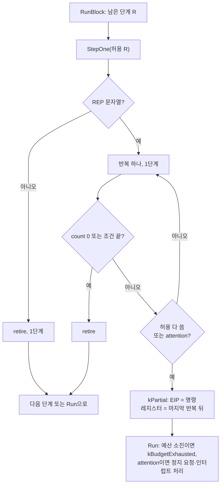

# #32 설계 : REP 문자열 반복을 실행 예산에 세기 / #32 design : counting REP string iterations against the budget

이슈: [#32](https://github.com/reexec/rex86/issues/32) | 지시서: [20261010-i032](../work-orders/20261010-i032-rep-string-budget.md) | 로그: [20261010-i032](../work-logs/20261010-i032-rep-string-budget.md) | 근거: [#31 설계](20261009-i031-robustness-fuzz.md) 결정 4, [#35 설계](20261009-i035-block-execution.md), [트랩 플래그 단일 스텝](../kb/trap-flag-single-step.md)

## 문제 / Problem

인터프리터는 REP 문자열 명령을 한 번의 Step 안에서 끝까지 반복하고, 예산에는 명령 하나로 센다(`src/interp/exec_strings.cpp`). 32비트 주소에서 ECX가 크면 명령 하나가 매핑된 연속 영역 크기 / 폭만큼 돈다. 수백 MB를 쓰는 소비자에서는 `Run(budget)` 한 번이 예산과 상관없이 수 초 걸릴 수 있고, 그동안 `RequestStop`도 대기 인터럽트도 보지 못한다. 크래시는 아니지만 README 목표 8(반응성)에 어긋나며, 브라우저에서는 탭이 멈춘다. 예산이 프레임 시간의 대리값이라는 점(#27 결정 3)에서도, 6만 반복짜리 REP MOVSD를 명령 하나로 세면 시간 추정이 크게 틀린다.

*The interpreter runs a REP string instruction to completion within one Step and budgets it as one instruction (`src/interp/exec_strings.cpp`). With 32-bit addressing and a large ECX, one instruction iterates over as much contiguous mapped memory as there is, so in a consumer with hundreds of MB one `Run(budget)` can take seconds regardless of the budget, seeing neither `RequestStop` nor a pending interrupt meanwhile. Not a crash, but against README goal 8 (responsiveness), and a frozen tab in a browser. And with the budget standing in for frame time (#27, decision 3), counting a 60,000-iteration REP MOVSD as one instruction badly misjudges time.*

## 근거: 하드웨어는 반복 사이에서 멈춘다 / Basis: the hardware stops between iterations

**확인됨(사양)**. Intel SDM Vol. 2B의 REP 접두사 항목: 반복 문자열 연산은 예외나 인터럽트로 중단될 수 있고, 그때 원본·목적지 레지스터는 다음 원소를, **EIP는 문자열 명령 자신을**, ECX는 마지막으로 성공한 반복 뒤의 값을 가리켜 처리기에서 돌아오면 이어서 실행된다. 같은 SDM Vol. 3 18.3.1.4에 따르면 TF가 켜져 있으면 REP 문자열은 **반복마다** 단일 스텝 트랩을 낸다([kb](../kb/trap-flag-single-step.md)). 즉 반복 경계는 아키텍처상 정의된 정지 지점이고, 그 상태는 이미 코어가 반복 도중의 폴트에서 남기는 상태(`keep_partial_state`, #15)와 같다.

*Confirmed (specification): the Intel SDM Vol. 2B REP prefix entry says a repeating string operation can be suspended by an exception or interrupt, the source and destination registers then pointing at the next elements, **EIP at the string instruction itself** and ECX holding its value after the last successful iteration, so returning from the handler resumes it. Vol. 3 18.3.1.4 has REP strings take the single-step trap **after every iteration** when TF is set ([kb](../kb/trap-flag-single-step.md)). An iteration boundary is thus an architecturally defined stopping point, and its state is exactly what the core already leaves on a mid-string fault (`keep_partial_state`, #15).*

## 결정 1: 예산의 단위는 "단계"다 / Decision 1: the budget's unit is the step

**단계**(step)는 트랩 플래그 단일 스텝 하나가 실행하는 일이다. REP 문자열이 아닌 명령은 한 단계이고, REP 문자열은 **반복 하나가 한 단계**다. 반복이 하나도 없는 REP(시작할 때 count가 0)는 한 단계로 retire한다. N번 반복하는 REP는 N단계이며, 마지막 반복(count가 0이 되거나 REPE/REPNE 조건이 끝냄)이 그 명령을 retire한다.

* `Run(budget)`은 budget **단계**까지 실행하고, `Event`가 실행한 단계 수를 돌려준다.
* 반복 도중의 폴트(`kFault`)와 거절된 INS/OUTS(`kPortIo`, `kStopped`)는 그 전에 끝난 반복을 단계로 센다. 그 반복들은 이미 아키텍처 상태이기 때문이다(ECX, ESI, EDI가 진행해 있음). 지금은 0으로 센다.
* `Cpu::Step()`은 지금처럼 `Run(1)`이며, 이제 **한 단계**다. REP 문자열에서는 반복 하나다. 하드웨어의 TF 단일 스텝과 같은 단위이므로, 2A단계의 "소비자 네이티브 실행과 명령 단위 비교"(트랩 플래그)와도 맞는다.

다른 방법으로 "반복은 세지 않고 덩어리로 끊어 EIP를 명령에 둔 채 재개"(이슈의 둘째 안)도 검토했다. 하지만 끊은 덩어리를 예산에 세지 않으면 `Run`이 돌아오지 않는 문제가 그대로이고, 센다면 결국 이 결정과 같은 것을 고정 크기로 근사하게 된다. 그래서 택하지 않는다.

*A **step** is what one trap-flag single step runs: an instruction other than a REP string is one step, and in a REP string **each iteration is one step**. A REP with no iteration (count 0 at the start) retires as one step; a REP iterating N times is N steps, its last iteration (count reaching 0, or the REPE/REPNE condition ending it) retiring the instruction. `Run(budget)` runs up to budget **steps** and its `Event` returns the steps run. A mid-string fault (`kFault`) or a declined INS/OUTS (`kPortIo`, `kStopped`) counts the iterations completed before it, since they are already architectural (ECX, ESI and EDI advanced); today they count 0. `Cpu::Step()` stays `Run(1)` and is now **one step**, one iteration of a REP string: the hardware's TF single-step unit, which also matches phase 2A's instruction-by-instruction comparison against the consumers' native execution (by trap flag). The issue's other option, cutting iterations into chunks resumed with EIP on the instruction without counting them, was considered and not taken: uncounted chunks leave `Run` unbounded as now, and counted ones approximate this decision with a fixed size.*

## 결정 2: 반복 사이에서 멈추는 조건 / Decision 2: when to stop between iterations

문자열 루프는 Ctx로 **허용 단계 수**와 `attention`(#35)을 받는다. 반복 하나가 끝날 때마다 count와 조건을 먼저 보고, 명령이 끝나지 않았으면 허용을 다 썼거나 `attention`이 섰는지 본다. 둘 중 하나면 `kPartial`로 돌아간다. 이때 EIP는 명령에 그대로 있고, 레지스터는 마지막 반복 뒤 상태다(SDM의 중단 상태).

* **예산**: `RunBlock`은 남은 단계 수를 허용으로 준다. 그래서 `Run(budget)`은 정확히 budget 단계에서 `kBudgetExhausted`로 돌아온다(견고성 불변식 I5가 단계 기준으로 그대로 성립).
* **정지 요청과 인터럽트**: 반복마다 `attention`을 읽는다(relaxed 읽기 하나). 그래서 `RequestStop`이나 호스트 콜백(INS/OUTS의 포트 콜백) 안에서 올린 인터럽트를 다음 반복 경계에서 본다. `Run`은 그 경계에서 대기 인터럽트를 전달한다. 복귀 EIP는 문자열 명령이고, IRET 뒤에 나머지 반복이 이어진다. 이는 SDM과 같다.
* **인터럽트 그림자**: STI나 MOV SS 바로 뒤가 REP면, 그림자는 첫 단계(첫 반복) 하나에만 걸린다. **미확정**: SDM은 그림자와 REP 반복 경계의 관계를 적지 않는다. 경계마다 같은 규칙을 쓰는 것이 가장 단순하고 지금의 의미와도 같다.
* **허용 무제한**: `interp::Step`을 직접 부르는 쪽(SST 러너, 단위 테스트)은 허용을 주지 않는다. 그러면 지금처럼 명령을 끝까지 실행한다. SST 러너는 바뀌지 않는다.

*The string loop gets an **allowance** of steps and the `attention` flag (#35) through Ctx. After each iteration it checks the count and the condition first; if the instruction is not finished, it checks whether the allowance is used up or `attention` is raised, and either returns `kPartial`: EIP still at the instruction and the registers as the last iteration left them (the SDM's suspended state). Budget: `RunBlock` passes the remaining steps as the allowance, so `Run(budget)` returns `kBudgetExhausted` at exactly budget steps (the robustness invariant I5 holds as is, in steps). Stop requests and interrupts: `attention` is read every iteration (one relaxed load), so `RequestStop`, or an interrupt raised in a host callback (an INS/OUTS port callback), is seen at the next iteration boundary, where `Run` delivers a pending interrupt with the string instruction as the return EIP and the remaining iterations continuing after IRET, as in the SDM. The interrupt shadow: a REP right after STI or MOV SS has the shadow over its first step (iteration) alone. Unresolved: the SDM does not relate the shadow to REP iteration boundaries; one rule for every boundary is simplest and keeps today's meaning. No allowance: callers of `interp::Step` itself (the SST runner, unit tests) pass none and the instruction runs to completion as today; the SST runner is unchanged.*

## 결정 3: 진행 중인 명령과 게이트 / Decision 3: an instruction in progress and gates

게이트는 "그 주소의 명령이 실행되기 전"에 검사한다(#11). REP가 반복 도중에 멈춘 뒤 `Run`이 다시 불리면 EIP는 같은 명령을 가리키지만, 그 명령은 이미 실행 중이다. 그래서 그 자리에서 다시 `kGate`가 나면 안 된다. `Cpu`는 마지막 단계가 `kPartial`로 끝났을 때 그 명령의 선형 주소를 기억한다(`in_progress_`). 다음 `Run`은 현재 CS:EIP의 선형 주소가 같을 때만 게이트 검사를 건너뛴다. 단계 하나를 실행하면 기억을 지운다. 호스트가 그사이 EIP를 바꿨다면 주소가 달라지므로 게이트 검사는 평소대로 한다.

한계: 기억하는 주소는 하나다. REP가 반복 사이에서 인터럽트를 받고, 그 처리기 안의 다른 REP가 다시 반복 사이에서 멈추면 기억이 그쪽으로 옮겨 간다. 그 뒤 IRET으로 처음 REP에 돌아오면, 그 주소가 게이트일 때만 게이트가 다시 검사된다. **추정**: 실제 게이트는 썽크나 서비스 진입점에 있고 REP 문자열 위에 있지 않으므로, 이 경우는 생기지 않는다.

공개 조회 `Cpu::InstructionInProgress()`를 더한다. 이 함수는 반복 도중에 멈춘 REP가 있는지 알려 준다. trace 재생의 단일 스텝 모드가 이것으로 명령 하나를 끝까지 실행한다(결정 5). 소비자도 같은 식으로 쓸 수 있다(예: 디버거 UI의 "명령 하나 실행").

*Gates are checked before the instruction at the address runs (#11). When `Run` is called again after a REP stopped mid-way, EIP addresses the same instruction, which is already running, so no `kGate` may fire there. `Cpu` remembers the instruction's linear address when the last step ended `kPartial` (`in_progress_`); the next `Run` skips the gate check only when the current CS:EIP's linear address is that one, and running any step clears it. A host that changed EIP meanwhile gets a different address and the normal gate check. A limit: one address is remembered, so if a REP takes an interrupt between iterations and another REP in the handler stops between iterations too, the memory moves there, and returning to the first REP by IRET checks its gate again should its address be a gate; inferred not to arise, real gates sitting at thunk and service entries rather than on REP strings. A public query `Cpu::InstructionInProgress()` says whether a REP stopped mid-way; the trace replay's single-step mode uses it to run one whole instruction (decision 5), and consumers may do the same (a debugger UI's "run one instruction").*

## 결정 4: 공개 계약의 이름 / Decision 4: the names in the public contract

단위가 명령에서 단계로 바뀌므로, 이름이 뜻을 거짓으로 말하지 않게 바꾼다.

| 지금 | 바꾼 뒤 | 종류 |
|---|---|---|
| `Event::instructions_retired` | `Event::steps` | 필드 이름과 뜻 |
| `Cpu::Run(std::uint64_t instruction_budget)` | `Cpu::Run(std::uint64_t step_budget)` | 인자 이름(ABI 무관), 뜻 |
| `Cpu::Step()` | 그대로, 뜻은 "한 단계" | 뜻 |
| (없음) | `Cpu::InstructionInProgress()` | 추가 |
| `Cpu::retired_total_`(내부 누계) | 단계 누계 | 내부 |

**두 소비자는 아직 rex86을 참조하지 않는다**(2026-10-10 확인: rePIU, re2DJ 저장소에 `rex86`을 언급하는 파일이 없다. 2A·2B단계 미착수). 그래서 이름을 바꿔도 지금 고칠 어댑터가 없다. 통합이 시작된 뒤에 바꾸면 두 어댑터를 고쳐야 하므로, 지금이 가장 싼 시점이다.

*The unit changes from instructions to steps, so the names change rather than tell an untruth: `Event::instructions_retired` becomes `Event::steps`; `Run`'s parameter becomes `step_budget` (a name only, not ABI); `Cpu::Step()` keeps its name and now means one step; `Cpu::InstructionInProgress()` is added; the internal running totals count steps. **Neither consumer references rex86 yet** (checked 2026-10-10: no file in the rePIU or re2DJ repositories mentions `rex86`; phases 2A and 2B have not started), so the rename has no adapter to fix now, whereas after integration it would cost both adapters: now is the cheapest time.*

## 결정 5: 하네스와 도구 / Decision 5: harnesses and tools

* **trace 재생**(`src/trace/replay.cpp`): 정수 fuzz의 호스트 쪽은 REP 반복 트랩마다 처리기에서 돌아가 명령 하나를 끝까지 실행한다(kb). 그래서 `kSingleStep` 모드는 이제 `Step()`을 `InstructionInProgress()`가 거짓이 될 때까지 되풀이한다. trace 형식과 기존 묶음(`int32.rxt`의 REP 사례 포함)은 바뀌지 않고, 결과도 같아야 한다. `kUntilHalt`는 `Run(budget)`이며 예산이 단계로 바뀔 뿐이다. 묶음의 x87/SIMD 스텁에는 REP가 없다(구현 때 확인).
* **벤치마크**: `string` 워크로드는 이제 반복을 센다. 그래서 그 MIPS(이제 초당 백만 단계)가 다른 워크로드와 같은 척도가 된다. `string` 커널을 담은 `mixed`의 바퀴 단계 수도 바뀐다. 출력 키 `mips`는 유지하되 단계를 센다고 문서에 적는다. 분석에는 #32 이전 수치와 단위가 다르다는 것과 전후를 적는다.
* **견고성 하네스**: I5(`단계 ≤ budget`, `kBudgetExhausted`면 `= budget`)는 단계 기준으로 그대로다. #31 결정 4의 "메모리 1 MiB 이하로 REP 최악을 묶음"은 더는 필요 없지만 바꾸지 않는다(케이스 생성이 바뀌면 시드별 재현이 깨진다).
* **probe**, 단위 테스트의 `instructions_retired` 사용처는 이름만 바꾼다. 반복 도중 폴트의 단계 수를 확인하는 테스트는 기대값이 바뀐다.

*Trace replay (`src/trace/replay.cpp`): the integer fuzz's host side returns from its handler at every REP iteration trap and so runs one whole instruction (kb), so the `kSingleStep` mode now repeats `Step()` until `InstructionInProgress()` is false; the trace format and the existing corpora (`int32.rxt`'s REP cases included) do not change and must give the same results. `kUntilHalt` is `Run(budget)`, its budget now in steps; the corpora's x87/SIMD stubs have no REP (checked during implementation). Benchmark: the `string` workload now counts iterations, so its MIPS (now millions of steps a second) shares the other workloads' scale; `mixed`, which contains the `string` kernel, changes its steps per lap too. The output key `mips` stays, documented as counting steps; the analysis records that figures before #32 use another unit, and the before and after. Robustness: I5 (steps ≤ budget, = budget on `kBudgetExhausted`) holds as is in steps; #31 decision 4's "memory at most 1 MiB to bound the worst REP" is no longer needed but stays, since changing case generation would break per-seed reproduction. The probe's and unit tests' uses of `instructions_retired` are renamed; tests checking the steps of a mid-string fault get new expected values.*

## 결정 6: 무엇이 바뀌지 않아야 하나 / Decision 6: what must not change

* 아키텍처 결과: 정수·x87·SIMD 호스트 대조 fuzz, trace 묶음 전부, SST 174만 건이 그대로 통과한다. REP를 단계로 나눠 실행해도 최종 상태는 끝까지 한 번에 실행한 것과 같아야 한다.
* 이 동등성은 단위 테스트로 고정한다. 같은 REP(MOVS, STOS, LODS, CMPS, SCAS, INS, OUTS, 16·32비트 주소, DF 0·1, REPE/REPNE 조기 종료)를 예산 1, 2, 7 등으로 나눠 실행한 결과가 한 번에 실행한 결과와 같은지 본다.
* 성능: REP가 아닌 명령의 경로에는 허용 인자 하나가 더해질 뿐이다. 벤치마크의 `alu`·`memory`·`call`이 잡음 범위 안이어야 한다. 반복마다 relaxed 읽기와 비교가 하나씩 늘므로, `string`은 단계 기준 전후를 잰다.

*Architectural results: the integer, x87 and SIMD host comparison fuzz, every trace corpus and the 1.74M SST tests pass unchanged; running a REP in steps must end in the state running it at once does. Unit tests pin that equivalence: the same REP (MOVS, STOS, LODS, CMPS, SCAS, INS, OUTS; 16- and 32-bit addressing; DF 0 and 1; REPE/REPNE ending early) run in budgets of 1, 2, 7 and so on must equal one uninterrupted run. Performance: the path of instructions other than REP strings gains one allowance argument, and the benchmark's `alu`, `memory` and `call` must stay within the noise; each iteration gains a relaxed load and a compare, so `string` is measured before and after in steps.*

## 소비자 영향 / Consumer impact

* 지금은 없다. 두 소비자는 아직 rex86을 링크하지 않는다(결정 4).
* 통합 때 어댑터가 알아야 할 것:
  * 프레임 예산은 단계 단위다. REP 문자열은 반복마다 세므로, 같은 예산이 기준 CPU의 시간에 더 가깝다.
  * `kBudgetExhausted`는 REP 반복 도중에도 올 수 있다. 그때 EIP는 문자열 명령을 가리키고, 다음 `Run`이 이어서 실행한다. 호스트가 이 상태에서 EIP를 보고 판단하는 코드(예: "EIP가 게이트 주소면")를 쓰려면 `InstructionInProgress()`를 함께 봐야 한다.
  * 반복 도중에도 대기 인터럽트가 전달된다(복귀 EIP는 문자열 명령).

*None now: neither consumer links rex86 yet (decision 4). What adapters must know at integration: frame budgets are in steps, a REP string counting per iteration, so a budget tracks the reference CPU's time more closely; `kBudgetExhausted` may arrive mid-REP with EIP at the string instruction, the next `Run` continuing it, so host code judging by EIP there ("if EIP is at a gate address") also consults `InstructionInProgress()`; pending interrupts are delivered between iterations too (the return EIP being the string instruction).*

## 검증 / Verification

* 단위 테스트(새 `rep_budget_test.cpp`):
  * 결정 6의 동등성.
  * 예산 소진 시점의 레지스터와 EIP.
  * 반복 도중의 `RequestStop`, 포트 콜백 안에서 올린 인터럽트의 반복 사이 전달과 IRET 뒤 재개.
  * 진행 중인 REP 위치의 게이트를 건너뛰는 것과, 호스트가 EIP를 바꾸면 게이트를 검사하는 것.
  * count 0인 REP의 한 단계, 반복 도중 폴트와 거절된 INS의 단계 수.
  * 캐시가 없을 때와 있을 때 둘 다.
* 결과 불변: 정수 fuzz(i386), x87·SIMD fuzz, trace 묶음 전부, 견고성 하네스(ASan 포함), SST.
* 빌드: x86-64 Debug, Release, Clang, ASan/UBSan(예열 기본값과 0), i386, wasm32(emsdk 3.1.74). MSVC는 CI.
* 벤치마크: 같은 기계에서 수정 전후를 번갈아 잰다.

*Unit tests (a new `rep_budget_test.cpp`): decision 6's equivalence; registers and EIP when the budget runs out; `RequestStop` mid-string, an interrupt raised in a port callback delivered between iterations and resumed after IRET; skipping the gate at a REP in progress, and checking it once the host moves EIP; one step for a REP with count 0; the steps of a mid-string fault and of a declined INS; with and without the cache. Unchanged results: the integer fuzz (i386), the x87 and SIMD fuzz, every trace corpus, the robustness harness (ASan included) and SST. Builds: x86-64 Debug, Release, Clang, ASan/UBSan at the default warm-up and at 0, i386, wasm32 (emsdk 3.1.74); MSVC in CI. Benchmark: before and after, interleaved, on the same machine.*
