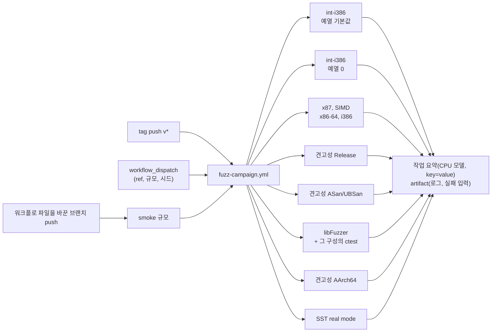

# #37 설계 : 릴리스 tag의 fuzz 캠페인 / #37 design : the release-tag fuzz campaign

이슈: [#37](https://github.com/reexec/rex86/issues/37) | 지시서: [20261010-i037](../work-orders/20261010-i037-tag-fuzz-campaign.md) | 로그: [20261010-i037](../work-logs/20261010-i037-tag-fuzz-campaign.md) | 근거: [#22 설계](20261008-i022-integer-host-fuzz-and-trace.md), [#31 설계](20261009-i031-robustness-fuzz.md), [#32 로그](../work-logs/20261010-i032-rep-string-budget.md)

## 문제 / Problem

브랜치 push의 CI(`ci.yml`)는 짧은 smoke만 돌린다. 정수 fuzz 5만 건, x87과 SIMD fuzz 2만 건, 견고성 300건, libFuzzer 60초다. 긴 캠페인은 작업 로그를 위해 로컬에서 몇십 분에서 한 시간 넘게 돌린다. #32에서는 정수 2,000만, x87 2,000만, SIMD 2,500만, 견고성 55만 건, libFuzzer 30분, SST 전체를 로컬 VM에서 돌렸다. 그래서 릴리스마다 검증 규모가 작업자와 기계에 따라 달라지고, 기록은 작업 로그에만 남는다.

#32에서 두 가지가 더 드러났다.

* 정수 fuzz의 `vendor_deviations`는 호스트 제조사에 따라 다르다. AMD Zen 3에서는 14와 16, Intel Xeon에서는 0이었다. 같은 숫자를 보고 판정하려면 러너의 CPU 모델이 함께 기록돼야 한다.
* CI의 libFuzzer 작업은 퍼저만 빌드하고 ctest를 돌리지 않는다. 그래서 Clang `-O2` + UBSan에서만 보이는 `GuestMemory::HostPointer`의 UB가 드러나지 않았다.

*Branch-push CI (`ci.yml`) runs short smokes only: 50,000 integer fuzz cases, 20,000 x87 and SIMD cases, 300 robustness cases and 60 seconds of libFuzzer. The long campaigns run locally for tens of minutes to more than an hour per work log; #32 ran 20M integer, 20M x87, 25M SIMD, 550,000 robustness cases, 30 minutes of libFuzzer and the whole SST suite on a local VM. So each release's scale of verification depends on who ran it on what machine, and the record lives only in work logs. #32 showed two more things: the integer fuzz's `vendor_deviations` differ by host vendor (14 and 16 on an AMD Zen 3, 0 on an Intel Xeon), so judging the number needs the runner's CPU model next to it; and CI's libFuzzer job builds only the fuzzer and runs no ctest, so `GuestMemory::HostPointer`'s UB, visible only under Clang `-O2` with UBSan, went unnoticed.*

## 구조 / Structure

새 워크플로 `.github/workflows/fuzz-campaign.yml`를 둔다. `ci.yml`은 그대로 둔다. `ci.yml`의 push 필터가 `branches: ['**']`라서 tag push에는 돌지 않으므로, 두 워크플로가 겹치지 않는다.

*A new workflow, `.github/workflows/fuzz-campaign.yml`, leaves `ci.yml` as it is. `ci.yml`'s push filter is `branches: ['**']`, so it does not run on tag pushes, and the two do not overlap.*

## 결정 1: 언제 도는가 / Decision 1: when it runs

* **tag push(`v*`)**: 전체 규모. 사용자가 머지 절차 7단계의 tag를 push하면 돈다.
* **`workflow_dispatch`**: 아무 ref에서 손으로 돌린다. 입력은 규모(`full`, `smoke`)와 시드 오프셋이다. 머지 전에 큰 변경을 전체 규모로 검증할 때 쓴다(#32 같은 작업). 단, GitHub은 기본 브랜치에 있는 워크플로만 dispatch할 수 있으므로 이 작업이 머지된 뒤부터 쓸 수 있다.
* **워크플로 파일을 바꾼 브랜치 push**: `paths: [.github/workflows/fuzz-campaign.yml, scripts/fuzz_campaign.sh]`로 걸러 smoke 규모로 돈다. 워크플로 자체의 고장을 머지 전에 잡기 위해서다. 이 작업의 브랜치도 이것으로 검증한다.

*Tag push (`v*`): full scale, run when the user pushes the tag of the merge procedure's step 7. `workflow_dispatch`: run by hand on any ref, with inputs for the scale (`full`, `smoke`) and a seed offset, for verifying a large change at full scale before merging (work like #32); GitHub dispatches only workflows on the default branch, so it is usable once this task merges. A branch push that changes the workflow files (`paths: [.github/workflows/fuzz-campaign.yml, scripts/fuzz_campaign.sh]`) runs at smoke scale, to catch a broken workflow before merging; this task's branch is verified that way.*

## 결정 2: 대상과 규모 / Decision 2: what runs, at what scale

러너는 public 저장소의 표준 러너(4 vCPU)다. 각 fuzz는 셋 이상의 프로세스로 나눠(shard) 코어를 다 쓴다. 각 작업의 목표는 60분 안이고, `timeout-minutes`는 120으로 둔다. 아래 처리량은 #32의 Intel Xeon 2.8 GHz VM에서 잰 값으로 **추정**한 것이며, 첫 실행에서 실제 시간을 재서 규모를 고친다.

| 작업 | 러너, 빌드 | 전체 규모 | smoke | 추정 시간 |
|---|---|---|---|---|
| int-i386 (예열 기본값) | ubuntu, `-m32` Release | 2,000만(4 × 500만) | 4 × 2만 | 약 10분 |
| int-i386 (예열 0) | ubuntu, `-m32` Release 예열 0 | 2,000만(4 × 500만) | 4 × 2만 | 약 10분 |
| x87, SIMD | ubuntu, x86-64와 `-m32` Release | x87 1억, SIMD x86-64 1억, SIMD i386 2,000만 | 각 4 × 2만 | 약 20분 |
| 견고성 Release | ubuntu, x86-64 Release | 100만(4 × 25만) | 4 × 500 | 약 20분 |
| 견고성 ASan/UBSan | ubuntu, GCC Debug ASan/UBSan 예열 0 | 10만(4 × 2만5천) | 4 × 100 | 약 30분 |
| libFuzzer | ubuntu, Clang ASan/UBSan | 30분(`-fork=4`), 먼저 그 구성의 ctest | 60초 | 약 35분 |
| 견고성 AArch64 | ubuntu-24.04-arm, Release | 50만(4 × 12만5천) | 4 × 500 | 약 15분 |
| SST real mode | ubuntu, x86-64 Release `--execute` | 941 파일 전부(4 shard) | 파일 8개 | 약 15분 |

* 정수 fuzz는 i386 프로세스가 필요하다(#22 결정 1). 브랜치 CI처럼 i386 컨테이너 대신 `gcc-multilib`의 `-m32` 빌드를 쓴다. JavaScript action(artifact 올리기)을 같은 작업에서 쓸 수 있고, #32에서 같은 방식으로 돌렸다.
* trace 묶음은 이미 브랜치 CI의 ctest가 다섯 호스트에서 전부 재생하므로 다시 돌리지 않는다.
* SST는 업스트림 저장소를 `--depth 1`로 받는다(약 1.2 GB). 받은 데이터는 저장소에 넣지 않는다(#7 설계).
* libFuzzer 작업은 퍼저를 돌리기 전에 같은 구성(Clang RelWithDebInfo + ASan/UBSan)으로 전체 ctest를 돌린다. #32에서 놓친 종류의 UB를 잡는다. 사용자 요청으로 브랜치 CI의 `linux-x64-libfuzzer` 작업에도 같은 단계를 더한다(작업 로그의 후속 절).
* libFuzzer의 말뭉치(corpus)는 `actions/cache`로 릴리스 사이에 이어 쓴다. 캐시가 사라져도 결과의 정확성은 바뀌지 않는다.

*The runners are public repositories' standard runners (4 vCPUs); each fuzz splits into four shard processes to use every core, aiming at under 60 minutes per job with `timeout-minutes` at 120. The throughputs behind the times in the table are estimates from #32's Intel Xeon 2.8 GHz VM; the first run measures the real times and the scales are corrected from them. The integer fuzz needs an i386 process (#22, decision 1); instead of the branch CI's i386 container it uses a `gcc-multilib` `-m32` build, so JavaScript actions (artifact upload) work in the same job, as #32 ran it. The trace corpus already replays in full on all five hosts in the branch CI's ctest and is not rerun. SST fetches the upstream repository at `--depth 1` (about 1.2 GB), never committed (#7 design). The libFuzzer job first runs the whole ctest in the same configuration (Clang RelWithDebInfo with ASan/UBSan), catching the kind of UB #32 missed; at the user's request the branch CI's `linux-x64-libfuzzer` job gains the same step (the work log's follow-up section). libFuzzer's corpus carries over between releases through `actions/cache`; losing the cache changes no result's correctness.*

## 결정 3: 시드 / Decision 3: seeds

시드는 tag에서 계산한다. `vMAJOR.MINOR.PATCH`의 버전 번호 `n = MAJOR × 10000 + MINOR × 100 + PATCH`(v0.0.19는 19)로 `오프셋 = n × 10^8`을 정하고, 도구별 기본 시드에 더한다. 호스트 대조 fuzz는 shard k(0부터)마다 `k`를 더하고, 견고성 하네스는 시드가 연속 구간이므로 `k × shard당 건수`를 더한다. libFuzzer의 `-seed`는 32비트라 오프셋을 2^32로 나눈 나머지를 쓴다.

| 작업 | 기본 시드 |
|---|---|
| 견고성 Release | 0 |
| 견고성 ASan/UBSan | 10,000,000 |
| 견고성 AArch64 | 20,000,000 |
| 정수 (예열 기본값) | 30,000,000 |
| 정수 (예열 0) | 40,000,000 |
| x87 | 50,000,000 |
| SIMD x86-64 | 60,000,000 |
| SIMD i386 | 70,000,000 |

기본 시드 사이가 10^7이고 견고성 Release의 전체 구간이 100만이므로, 한 릴리스 안에서 구간이 겹치지 않는다. 릴리스 사이는 10^8씩 떨어진다.

* 릴리스마다 새 입력 공간을 보고, tag 이름만으로 어떤 시드였는지 다시 계산할 수 있다.
* `workflow_dispatch`와 smoke는 입력의 오프셋을 쓴다(기본값 0).
* 작업 요약과 로그의 첫 줄에 실제 시드를 적는다.

*Seeds derive from the tag: the version number `n = MAJOR × 10000 + MINOR × 100 + PATCH` of `vMAJOR.MINOR.PATCH` (19 for v0.0.19) gives `offset = n × 10^8`, added to each tool's base seed in the table above; shard k (from 0) adds `k` for the host-comparison fuzzes and, since the robustness harness takes a contiguous seed range, `k × cases per shard` for it; libFuzzer's `-seed` is 32-bit, so it takes the offset modulo 2^32. The bases lie 10^7 apart and the Release robustness range spans 1M, so no ranges overlap within a release, and releases lie 10^8 apart. Each release explores new inputs, and the seeds can be recomputed from the tag name alone. `workflow_dispatch` and smoke use the input's offset (default 0). The job summary and the first log line state the actual seeds.*

## 결정 4: 판정과 제조사 차이 / Decision 4: verdicts and vendor differences

* **실패**: 도구의 종료 코드가 0이 아니면 그 작업이 실패한다. 호스트 대조 fuzz는 `mismatches`가 0이 아닐 때, 견고성 하네스는 `violations`가 0이 아닐 때, libFuzzer는 크래시나 시간 초과일 때, SST는 `mismatches`가 0이 아닐 때다. 도구의 기존 판정을 그대로 쓴다.
* **제조사 차이는 실패가 아니다**: 정수 fuzz의 `vendor_deviations`와 x87의 SDM 이탈, SIMD의 허용 사례는 지금처럼 따로 센다. 작업 요약에 러너의 CPU 모델(`/proc/cpuinfo`의 `model name`)과 함께 적는다.
* **문턱은 두지 않는다**: 러너 CPU는 실행마다 바뀔 수 있고(Intel, AMD Zen 3/4/5), 제조사별 정상 범위를 정할 자료가 아직 없다. **추정**: 여러 릴리스의 요약이 쌓이면 CPU 모델별 비율로 문턱을 정할 수 있다. 그때 새 이슈로 다룬다.

*Failure: a nonzero exit code fails the job, meaning nonzero `mismatches` for the host-comparison fuzzes, nonzero `violations` for the robustness harness, a crash or timeout for libFuzzer and nonzero `mismatches` for SST; the tools' own verdicts are used as they are. Vendor differences are not failures: the integer fuzz's `vendor_deviations`, the x87's SDM deviations and SIMD's tolerated cases are counted apart as today and written to the job summary with the runner's CPU model (`model name` from `/proc/cpuinfo`). No threshold: the runner CPU can change between runs (Intel, AMD Zen 3/4/5), and there is no data yet to set a normal range per vendor. Estimate: once several releases' summaries accumulate, ratios per CPU model can set thresholds, as a new issue.*

## 결정 5: 결과 보관 / Decision 5: keeping results

* 작업마다 `[rex86-campaign]` 접두어의 key=value 줄(도구, shard, 시드, 건수, 결과, CPU 모델, 걸린 시간)을 `$GITHUB_STEP_SUMMARY`에 쓴다.
* 전체 로그는 성공과 실패 모두 artifact로 올린다(보관 90일, 저장소 기본값).
* 실패 입력: 정수 fuzz는 `--failures`의 trace 파일, libFuzzer는 크래시 입력, 견고성 하네스는 로그의 `VIOLATION seed=` 줄(시드로 재현), x87과 SIMD는 로그의 실패 줄(시드와 반복 번호로 재현)이다.
* 공통 실행 논리는 스크립트 `scripts/fuzz_campaign.sh`에 둔다. shard를 띄우고, 기다리고, 줄을 모으고, 종료 코드를 합친다. 같은 스크립트를 로컬에서도 쓸 수 있다.

*Each job writes `[rex86-campaign]` key=value lines (tool, shard, seed, cases, result, CPU model, elapsed time) to `$GITHUB_STEP_SUMMARY`. Full logs go up as an artifact on success and failure alike (90 days, the repository default). Failing inputs: the integer fuzz's `--failures` trace file, libFuzzer's crashing inputs, the robustness harness's `VIOLATION seed=` lines (reproduced by seed), the x87 and SIMD fuzzes' failure lines (reproduced by seed and iteration). The shared run logic lives in a script, `scripts/fuzz_campaign.sh`: start the shards, wait, gather the lines, combine the exit codes; it runs locally too.*

## 결정 6: 실패했을 때와 머지 절차 / Decision 6: on failure, and the merge procedure

tag는 이미 push된 뒤라 캠페인이 tag를 막을 수는 없다. 그래서 캠페인은 **릴리스 뒤의 검증 기록**이고, 머지 전 검증을 대신하지 않는다.

* 캠페인이 실패하면 tag를 지우거나 옮기지 않는다. 소비자의 FetchContent가 이미 가리켰을 수 있기 때문이다. 대신 실패를 이슈로 만들고(재현 시드와 artifact 링크), 고친 뒤 patch 릴리스를 낸다. 소비자의 tag 올림 작업은 캠페인이 녹색인 tag로만 한다.
* AGENTS.md의 머지 절차에 다음을 더한다. tag push 뒤에 캠페인 결과를 확인하고, 다음 릴리스 노트의 검증 절에 앞 릴리스의 캠페인 결과(실행 링크, CPU 모델, 규모)를 적는다. 이는 squash 커밋 ID를 다음 노트에서 보완하는 지금의 규칙과 같은 모양이다.
* 작업 단위의 검증 규칙(구현과 검증은 같은 작업에서 끝낸다)은 바뀌지 않는다. 명령 의미를 바꾸는 작업은 지금처럼 자기 범위의 fuzz를 작업 안에서 돌린다. 그 규모를 맞추고 싶으면 머지 전에 `workflow_dispatch`로 캠페인을 브랜치에서 돌린다.

*The tag is already pushed, so the campaign cannot hold it back: it is a post-release verification record and does not replace verification before merging. A failing campaign does not delete or move the tag, since consumers' FetchContent may already point at it; the failure becomes an issue (reproducing seeds, artifact links), and a patch release follows the fix. Consumers' tag-bump tasks only take tags whose campaign is green. AGENTS.md's merge procedure gains: check the campaign after the tag push, and the next release notes' validation section records the previous release's campaign (run link, CPU model, scale), the same shape as today's rule of filling in the squash commit ID in the next notes. The per-task verification rule (implementation and verification end in the same task) stays: a task changing instruction semantics still runs its fuzz within the task, and can match the campaign's scale by dispatching it on the branch before merging.*

## 결정 7: action의 Node.js 런타임 / Decision 7: the actions' Node.js runtime

GitHub은 Node.js 20 기반 action을 Node.js 24로 강제 실행한다는 경고를 낸다(첫 smoke 캠페인과 `ci.yml` 모두). 두 워크플로의 action을 `runs.using: node24`인 주 버전으로 올린다. 각 버전의 `action.yml`에서 `node24`를 확인했다.

| action | 전 | 후 |
|---|---|---|
| `actions/checkout` | v4 | v7 |
| `actions/upload-artifact` | v4 | v7 |
| `actions/cache/restore`, `actions/cache/save` | v4 | v6 |
| `mymindstorm/setup-emsdk` | v14 | v16 |

* 릴리스 노트의 깨지는 변경을 확인했다. checkout v7은 `pull_request_target`과 `workflow_run`에서 fork PR checkout을 막는데, 이 저장소는 두 트리거를 쓰지 않는다. upload-artifact v7은 `archive: false`일 때 여러 파일을 거절하는데, 이 저장소는 기본값(압축)으로 디렉터리를 올린다. upload-artifact v6과 cache v5 이상은 러너 2.327.1 이상을 요구하고, GitHub 호스트 러너는 이를 만족한다. setup-emsdk v16의 입력(`version`, `actions-cache-folder`)은 그대로다.
* 주 버전 tag를 쓰는 지금의 관례를 유지한다.

*GitHub warns that Node.js 20 actions are forced onto Node.js 24 (in the first smoke campaign and in `ci.yml` alike). Both workflows move to the major versions whose `action.yml` says `runs.using: node24`, checked for each, as in the table above. The release notes' breaking changes were checked: checkout v7 blocks fork PR checkouts under `pull_request_target` and `workflow_run`, triggers this repository does not use; upload-artifact v7 refuses several files with `archive: false`, while this repository uploads directories with the default (zipped); upload-artifact v6 and cache v5 and later need runner 2.327.1 or newer, which GitHub-hosted runners meet; setup-emsdk v16 keeps its inputs (`version`, `actions-cache-folder`). The current convention of major-version tags stays.*

## 소비자 영향 / Consumer impact

없다. 코어 코드와 공개 계약은 바뀌지 않고, CI와 문서만 바뀐다. 결정 6에 따라 두 소비자의 tag 올림 작업은 캠페인이 녹색인 tag를 고른다.

*None: the core code and the public contract do not change, only CI and documents. Per decision 6, both consumers' tag bumps pick tags whose campaign is green.*

## 검증 / Verification

* 스크립트를 로컬에서 smoke 규모로 돌려 shard, 요약 줄, 종료 코드 합치기를 확인한다. 일부러 실패하는 경우(존재하지 않는 바이너리, 0이 아닌 종료 코드)도 확인한다.
* 작업 브랜치 push로 smoke 규모의 캠페인이 모든 작업에서 녹색인지 본다(결정 1).
* 전체 규모의 실제 시간은 머지 뒤 첫 tag 또는 `workflow_dispatch`에서 재고, 결정 2의 규모를 고친다. 이 측정은 작업 로그에 날짜별 절로 더한다.

*Run the script locally at smoke scale to check shards, summary lines and the combined exit code, including deliberate failures (a missing binary, a nonzero exit code). Check that a branch push runs the campaign green at smoke scale in every job (decision 1). The real times at full scale are measured at the first tag or `workflow_dispatch` after merging, correcting decision 2's scales, and added to the work log as a dated section.*
