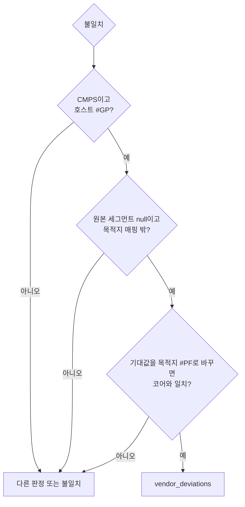

# #40 설계 : Zen 5의 CMPS 원본 #GP 판정 / #40 design : judging Zen 5's CMPS source #GP

이슈: [#40](https://github.com/reexec/rex86/issues/40) | 지시서: [20261010-i040](../work-orders/20261010-i040-zen5-cmps-gp.md) | 로그: [20261010-i040](../work-logs/20261010-i040-zen5-cmps-gp.md) | 근거: [정수 호스트 대조 분석](../analysis/integer-host-comparison.md)의 "Zen 5의 CMPS 폴트 주소", [#37 설계](20261010-i037-tag-fuzz-campaign.md) 결정 4

## 문제 / Problem

v0.0.20 머지 때 `main` push로 돈 smoke 캠페인에서 정수 fuzz가 불일치 1건으로 실패했다. 러너는 AMD EPYC 9V45(Zen 5)였다.

| 항목 | 값 |
|---|---|
| 명령 | `64 67 A6`: FS 접두어, 16비트 주소, CMPSB |
| 원본 FS:SI | FS가 null 선택자(i386 Linux 프로세스의 FS는 0)라 #GP |
| 목적지 ES:DI | DI = 0xFFEF, 매핑 밖이라 #PF |
| 호스트(Zen 5) | #GP (`FaultKind::kGeneralProtection`, 9) |
| 코어 | #PF (`FaultKind::kAccessViolation`, 1), 목적지 주소 |

Zen 5가 CMPS의 원본을 먼저 읽는다는 것은 이미 확인된 제조사 차이다. 코어는 Intel Cascade Lake, Zen 3, 386EX(SST)와 같이 목적지를 먼저 읽는다. 지금의 판정 `SourceFirstCompareFault`는 호스트의 폴트가 페이지 폴트이고 그 CR2가 원본에 있을 때만 제조사 차이로 센다. 원본 쪽이 null 세그먼트라 #GP가 나는 경우는 다루지 않아 불일치가 됐다.

*The smoke campaign of the `main` push at the v0.0.20 merge failed in the integer fuzz with one mismatch on an AMD EPYC 9V45 (Zen 5), as in the table above: `64 67 A6` (FS prefix, 16-bit addressing, CMPSB), the source FS:SI raising #GP through the null FS selector (FS is 0 in an i386 Linux process) and the destination ES:DI (DI = 0xFFEF) #PF outside the mapping; the host raised #GP, the core #PF at the destination. Zen 5 reading the CMPS source first is a confirmed vendor deviation, and the core reads the destination first like the Intel Cascade Lake, Zen 3 and the 386EX (SST). The current verdict `SourceFirstCompareFault` counts it only when the host's fault is a page fault whose CR2 lies in the source, so a source raising #GP through a null segment became a mismatch.*

## 결정 1: 코어는 바꾸지 않는다 / Decision 1: the core stays

SDM은 CMPS가 두 피연산자를 읽는 순서를 적지 않는다. 코어의 목적지 먼저 순서는 Intel, Zen 3, 386EX와 맞고, 대상 기판의 CPU(K6-2, Celeron)도 Intel 계열 순서를 따른다고 **추정**한다. 그래서 코어는 그대로 두고, 이 경우를 fuzz의 제조사 차이로 판정한다.

*The SDM does not give the order in which CMPS reads its operands. The core's destination-first order agrees with Intel, Zen 3 and the 386EX, and the boards' CPUs (K6-2, Celeron) are estimated to follow the Intel order too, so the core stays and the fuzz judges this case as a vendor deviation.*

## 결정 2: 판정 조건 / Decision 2: the conditions

`SourceFirstCompareFault` 옆에 `SourceSegmentFirstCompareFault`를 둔다. 다음을 모두 만족할 때만 `vendor_deviations`로 센다.

1. 명령이 CMPSB/W/D다.
2. 호스트의 폴트가 #GP다.
3. 원본 피연산자의 세그먼트(기본 DS, 접두어로 바뀜)가 null 선택자다. 이 fuzz에서 원본이 #GP를 내는 길은 이것뿐이다. 세그먼트가 모두 평탄하고 limit이 4 GiB이기 때문이다.
4. 목적지 ES:(E)DI가 매핑 밖이다.
5. 호스트의 기대값을 "목적지 주소의 #PF"로 바꾸면 사례가 코어와 일치한다. 주소는 목적지 피연산자의 바이트 하나여야 한다.

조건 5가 레지스터, 플래그, 메모리까지 나머지 전부의 일치를 요구한다. 그래서 코어가 다른 폴트나 다른 주소를 내면 여전히 불일치다. 기존 두 판정과 같은 모양이다.

*`SourceSegmentFirstCompareFault` sits beside `SourceFirstCompareFault` and counts under `vendor_deviations` only when all hold: the instruction is CMPSB/W/D; the host's fault is #GP; the source operand's segment (DS by default, changed by a prefix) is a null selector, the only way the source raises #GP in this fuzz, whose segments are all flat with a 4 GiB limit; the destination ES:(E)DI lies outside the mapping; and the case matches the core once the host's expectation reads as a #PF at a destination address, one byte of the destination operand. The last condition demands that everything else, registers, flags and memory, matches, so a core raising another fault or address stays a mismatch, the same shape as the two existing verdicts.*

## 결정 3: 기록 / Decision 3: what is recorded

* 분석 문서의 "Zen 5의 CMPS 폴트 주소" 절을 "Zen 5의 CMPS 읽기 순서"로 넓힌다. 확인된 두 갈래(두 #PF의 주소, 원본 #GP 대 목적지 #PF)를 적는다. 앞 절의 **추정**("모든 CMPS 형태에 같다")에 16비트 주소와 세그먼트 접두어의 관측을 더한다.
* 제조사 차이는 지금처럼 trace 묶음에 기록하지 않는다.

*The analysis section "Zen 5's CMPS fault address" widens to "Zen 5's CMPS read order", with both confirmed branches (the address of two #PFs, and a source #GP against a destination #PF); the earlier estimate ("the same in every CMPS form") gains the observation with 16-bit addressing and a segment prefix. Vendor deviations stay out of the trace corpus as before.*

## 소비자 영향 / Consumer impact

없다. 호스트 대조 fuzz(`tests/host/linux/int_fuzz.cpp`)와 문서만 바뀐다. 코어와 공개 계약은 그대로다.

*None: only the host-comparison fuzz (`tests/host/linux/int_fuzz.cpp`) and documents change; the core and the public contract stay.*

## 검증 / Verification

* **판정 경로**: 실패한 사례의 trace(`int-1.rxt`)를 코어로 재생하면 기대값 #GP와 불일치한다. 기대값을 목적지 #PF로 바꾸면 일치해야 한다. 이 기계(Zen 3)에서는 호스트가 같은 사례에서 #PF를 내므로, 같은 시드를 돌려 불일치 0과 `vendor_deviations`가 늘지 않음을 확인한다.
* **Zen 5**: 같은 시드(30000001, 2만 건)를 Zen 5 러너에서 돌려 불일치 0, `vendor_deviations`가 하나 이상인지 본다. 러너 CPU는 고를 수 없으므로 `workflow_dispatch`로 캠페인을 돌리고 작업 요약의 CPU 모델로 확인한다.
* **회귀**: i386 ctest(정수 fuzz 5만 건 포함), 로컬의 긴 정수 fuzz.

*The verdict path: replaying the failing case's trace (`int-1.rxt`) on the core mismatches the #GP expectation and must match once the expectation reads as a destination #PF; on this machine (Zen 3) the host raises #PF in the same case, so running the same seed checks zero mismatches with no rise in `vendor_deviations`. Zen 5: the same seed (30000001, 20,000 cases) on a Zen 5 runner must give zero mismatches and at least one vendor deviation; runner CPUs cannot be chosen, so the campaign runs through `workflow_dispatch` and the job summary's CPU model tells. Regression: the i386 ctest (the integer fuzz at 50,000 cases included) and a long local integer fuzz.*
