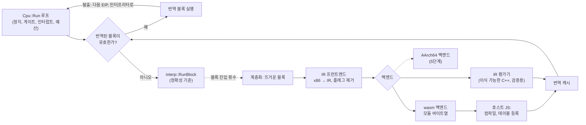
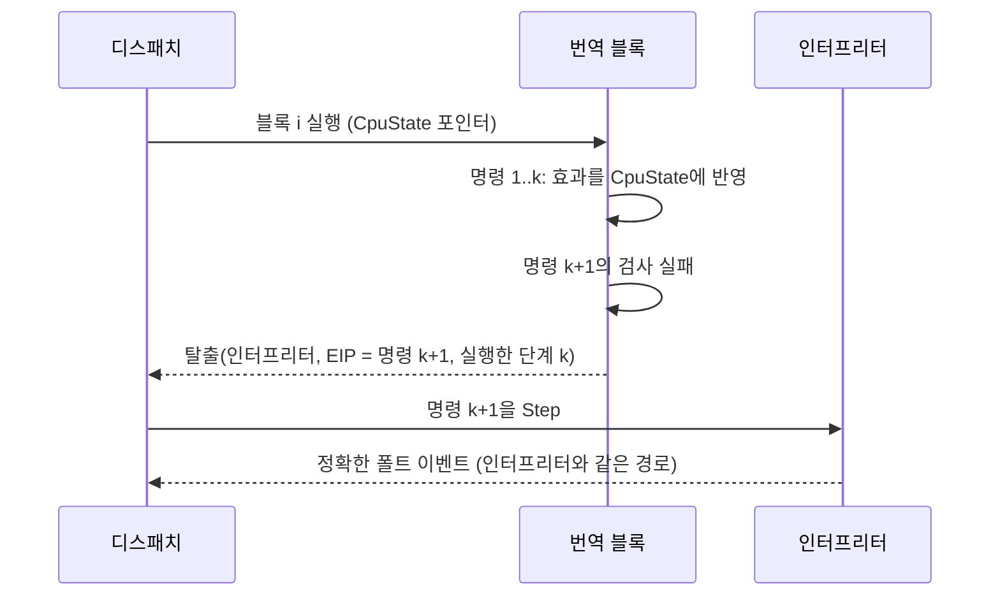

# #42 설계 : 3단계, IR 번역과 wasm 백엔드 / #42 design : phase 3, IR translation and the wasm backend

이슈: [#42](https://github.com/reexec/rex86/issues/42) | 로그: [20261010-i042](../work-logs/20261010-i042-phase3-translation.md) | 근거: [#1 설계](20261007-i001-repository-and-public-contract.md) 결정 5, [#31 설계](20261009-i031-robustness-fuzz.md) 결정 6, [#34 설계](20261009-i034-interpreter-decode-cache.md) 결정 2, [#35 설계](20261009-i035-block-execution.md), [#32 설계](20261010-i032-rep-string-budget.md), [kb: wasm에서 실행 중에 만든 코드](../kb/wasm-runtime-code.md), [인터프리터 성능](../analysis/interpreter-performance.md)

이 문서는 3단계 전체의 구조를 정하고 구현을 하위 이슈로 나눈다. 각 하위 이슈는 이 문서를 근거로 자기 설계(세부)와 지시서, 로그를 둔다.

*This document settles the structure of the whole of phase 3 and splits its implementation into sub-issues, each of which keeps its own detailed design, work order and log grounded in this one.*

## 범위 / Scope

README 로드맵 3단계: IR 프런트엔드, wasm 번역 백엔드, 계층화, SMC 검사. 완료 기준은 "인터프리터와 상태 비교 일치"다(#1 설계의 단계 표). AArch64 백엔드는 5단계다. 다만 IR과 번역 실행기는 그 백엔드도 그대로 쓰도록 만든다.

**지금의 출발점(확인됨)**: 인터프리터는 단계당 호스트 명령 약 500개다. x86-64 GCC Release에서 alu 워크로드가 17 MIPS 안팎(Intel Xeon VM, #32), 1.4 GHz 기판 대비 실시간 비율은 약 0.009다. 명령마다 디스패치하고 플래그를 즉시 계산하기 때문이다.

*Phase 3 of the README roadmap: the IR frontend, the wasm translation backend, tiering and SMC checks, done when "state comparison with the interpreter agrees" (the phase table of #1's design). The AArch64 backend is phase 5, but the IR and the translation runtime are built for it to use unchanged. The starting point (confirmed): the interpreter costs about 500 host instructions per step, around 17 MIPS on the alu workload in x86-64 GCC Release (Intel Xeon VM, #32), a real-time ratio near 0.009 against the 1.4 GHz board, because it dispatches per instruction and computes flags eagerly.*

## 결정 1: 구조 / Decision 1: structure



| 디렉터리 | 맡는 것 |
|---|---|
| `src/translate/ir/` | IR 정의, x86 → IR 프런트엔드, IR 최적화(죽은 플래그 제거, 상수 접기), IR 평가기 |
| `src/translate/` | 번역 실행기: 번역 캐시, 디스패치, 계층화, 무효화, 탈출 처리 |
| `src/translate/wasm/` | IR → wasm 모듈 바이트열, 호스트 계약 어댑터 |

* x86 의미는 인터프리터와 IR 프런트엔드에만 있다(AGENTS.md 구현 규칙). 백엔드는 IR만 안다.
* **IR 평가기**는 IR을 그대로 해석하는 이식 가능한 C++ 백엔드다. 성능용이 아니라 검증용이다. wasm 백엔드가 없는 네이티브 호스트(x86, AArch64)에서도 프런트엔드와 번역 실행기 전체를 인터프리터와 차등 비교할 수 있게 한다. **추정**: 사전 디코드와 플래그 제거 덕에 평가기가 인터프리터보다 빠를 수 있다. 그렇다면 JIT가 금지된 iOS의 빠른 경로가 될 수 있지만, 측정 전에는 엔진으로 내세우지 않는다.

*The table above assigns `src/translate/ir/` (the IR, the x86-to-IR frontend, IR optimization such as dead-flag removal and constant folding, and the IR evaluator), `src/translate/` (the translation runtime: the translation cache, dispatch, tiering, invalidation and exits) and `src/translate/wasm/` (IR to wasm module bytes, and the host-contract adapter). x86 semantics live only in the interpreter and the IR frontend (AGENTS.md implementation rules); backends know only the IR. The IR evaluator is a portable C++ backend that interprets the IR directly, for verification rather than speed: it lets the frontend and the whole runtime be compared against the interpreter on native hosts (x86, AArch64) that have no wasm backend. Estimate: thanks to pre-decoding and dead-flag removal it might beat the interpreter, which would make it a fast path for JIT-forbidden iOS, but it is not put forward as an engine before a measurement.*

## 결정 2: IR / Decision 2: the IR

* **블록 하나 = 직선 코드**: IR은 블록 하나의 명령열이다. 값은 한 번만 정의되는 32비트(일부 8, 16비트) 가상 값이다. 블록 안에 분기는 없고, 끝에 탈출이 하나 이상 있다(조건 탈출 포함).
* **게스트 상태 접근은 명시적**: `GetReg`/`SetReg`(8개 GPR과 부분 레지스터), `GetFlag`/`SetFlag`(CF, PF, AF, ZF, SF, OF를 하나씩), EIP는 탈출이 정한다.
* **플래그는 값이다**: 산술 명령은 결과와 함께 필요한 플래그 값을 따로 만든다. 블록 안에서 덮여 쓰이는 플래그 계산은 죽은 값 제거로 사라진다. 블록 끝에서는 모든 플래그가 살아 있다고 본다(보수적). 블록 사이의 활성 분석은 측정 뒤의 최적화다.
* **메모리 접근은 검사와 접근으로 나뉜다**: `CheckRead`/`CheckWrite`(세그먼트 limit, 페이지 속성, 쓰기면 `kTranslated`), 그다음 `Load`/`Store`. 검사가 실패하면 그 자리에서 **인터프리터 탈출**(결정 4)이다.
* **탈출 종류**: 상수 EIP로 이어감, 계산된 EIP로 이어감(간접 분기, RET), 인터프리터 탈출(이 명령은 인터프리터가 실행), 이벤트가 있는 명령(INT, HLT, 포트 I/O)은 블록을 끝내고 인터프리터가 실행한다.

*A block is straight-line code: the IR is one block's instruction list, its values single-definition 32-bit (some 8- and 16-bit) virtual values, with no branches inside and one or more exits at the end (conditional exits included). Guest state access is explicit: `GetReg`/`SetReg` (the eight GPRs and partial registers), `GetFlag`/`SetFlag` (CF, PF, AF, ZF, SF and OF one by one), EIP decided by the exits. Flags are values: an arithmetic instruction produces the flag values it needs apart from its result, and flag computations overwritten within the block disappear in dead-value removal; at a block's end every flag counts as live (conservative), inter-block liveness being an optimization after measurement. A memory access splits into a check and an access: `CheckRead`/`CheckWrite` (segment limit, page attributes, and `kTranslated` for writes), then `Load`/`Store`; a failing check is an **interpreter exit** on the spot (decision 4). Exits continue at a constant EIP, continue at a computed EIP (indirect branches, RET), or leave the instruction to the interpreter; instructions with events (INT, HLT, port I/O) end the block and the interpreter runs them.*

## 결정 3: 번역 단위와 적용 범위 / Decision 3: the translation unit and coverage

* **단위는 기본 블록**이다. 첫 명령부터 제어 이동, 이벤트가 있는 명령, 프런트엔드가 다루지 않는 명령, 최대 길이(64명령), 게이트 필터가 양성인 주소 중 먼저 오는 것 **앞**까지다. 블록은 페이지 둘에 걸칠 수 있고, 걸친 페이지 모두의 세대를 기록한다.
* **다루지 않는 명령은 인터프리터에게**: 프런트엔드는 일부 명령만 IR로 내린다. 나머지 앞에서 블록이 끝나고, 디스패치가 그 명령 하나를 인터프리터로 실행한다. 그래서 정확성은 적용 범위에 기대지 않고, 범위는 census 상위 형태부터 점점 넓힌다(rePIU census 상위 17형태가 87.89%, #1 설계).
* **첫 범위**: 정수 MOV, LEA, ALU(ADD, SUB, ADC, SBB, AND, OR, XOR, CMP, TEST, INC, DEC, NEG, NOT), 시프트와 회전, PUSH/POP, Jcc, JMP, CALL/RET(near), MOVZX/MOVSX, SETcc, CMOVcc, IMUL. REP 문자열, x87, MMX/SSE, 세그먼트 적재, 플래그 레지스터 전체를 다루는 명령(PUSHF/POPF 등)은 인터프리터에 남긴다.
* **명령을 내리는 조건**: 그 명령의 모든 검사가 모든 부수 효과보다 앞설 수 있을 때만이다("검사 먼저"). 그래야 검사 실패로 탈출해도 명령의 일부만 반영된 상태가 남지 않는다. PUSH m32처럼 읽기와 쓰기가 둘 다 있는 명령은 두 검사를 먼저 한다.

*The unit is the basic block: from its first instruction up to, and not including, whichever comes first of a control transfer, an instruction with an event, an instruction the frontend does not cover, the maximum length (64 instructions) and an address the gate filter flags; a block may span two pages and records both generations. Uncovered instructions go to the interpreter: the frontend lowers only some instructions, a block ends before any other, and dispatch runs that one instruction on the interpreter, so correctness does not depend on coverage, which widens from the census's top forms (rePIU's top 17 forms are 87.89%, #1's design). The first coverage is the list above; REP strings, the x87, MMX/SSE, segment loads and instructions handling the whole flags register (PUSHF/POPF and so on) stay with the interpreter. An instruction is lowered only when all its checks can precede all its side effects ("check first"), so an exit on a failed check never leaves the instruction half applied; an instruction both reading and writing memory, such as PUSH m32, does both checks first.*

## 결정 4: 정확한 상태와 폴트 / Decision 4: precise state and faults



* **게스트 상태는 `CpuState` 안에 있다.** 백엔드는 명령 하나 안에서는 값을 지역 변수에 둘 수 있지만, 탈출할 수 있는 지점(검사, 조건 탈출) 앞에서는 그때까지 끝난 명령의 효과를 `CpuState`에 반영한다. 블록 전체에 걸친 레지스터 캐싱은 측정 뒤의 최적화다.
* **폴트는 인터프리터가 낸다.** 검사가 실패하면 블록은 그 명령의 시작 상태로 탈출하고, 디스패치는 그 명령을 인터프리터로 다시 실행한다. 인터프리터가 폴트 종류, 주소, 정확한 상태 복원을 지금처럼 처리하므로, 번역 코드에는 폴트 의미가 따로 없다. 결정 3의 "검사 먼저" 덕에 이 재실행은 같은 결과를 낸다.
* 같은 방식이 SMC(결정 6)와 게이트 직전(결정 5)에도 쓰인다. 탈출 하나로 세 경우를 다룬다.

*Guest state lives in `CpuState`: a backend may keep values in locals within one instruction, but before any point that can exit (a check, a conditional exit) it writes the completed instructions' effects to `CpuState`; register caching across a whole block is an optimization after measurement. Faults are raised by the interpreter: on a failed check the block exits with the instruction's starting state, and dispatch runs that instruction again on the interpreter, which handles the fault kind, address and precise-state restore as today, so translated code carries no fault semantics of its own; decision 3's "check first" makes the rerun give the same result. The same exit serves SMC (decision 6) and the approach of a gate (decision 5): one exit covers three cases.*

## 결정 5: 예산, attention, 게이트, 인터럽트 / Decision 5: budget, attention, gates and interrupts

* **예산**: 블록은 자기 명령 수 n을 안다. 디스패치는 남은 예산이 n 이상일 때만 블록을 실행하고, 아니면 인터프리터로 간다. 블록이 중간에 탈출하면 실행한 단계 수를 돌려준다. 그래서 `Run(budget)`은 지금처럼 정확히 budget 단계에서 돌아온다(#32, 견고성 불변식 I5).
* **attention**(정지 요청, 대기 인터럽트): 디스패치가 블록 사이에서 읽는다. 블록은 64명령 이하라 지연은 짧다. 블록 연결(chaining)을 더할 때는 연결 지점에서 attention을 읽는다.
* **인터럽트 그림자**(STI, MOV SS 직후): 그 다음 명령은 인터프리터가 실행한다. 지금의 처리를 그대로 쓴다.
* **TF**: 코어는 TF 단일 스텝 트랩을 구현하지 않는다(#32 로그). 3단계도 이를 바꾸지 않는다.
* **게이트**: 블록은 게이트 필터가 양성인 주소 앞에서 끝난다(결정 3). `RegisterGate`는 모든 번역을 버린다. 게이트 등록은 드물고, 이미 번역된 블록 한가운데에 게이트가 생기면 "그 주소의 명령이 실행되기 전"이라는 계약(#11)이 깨지기 때문이다.
* **REP 문자열**: 인터프리터에 남기므로 #32의 반복 단위 의미가 그대로다.

*Budget: a block knows its instruction count n; dispatch runs it only when at least n steps remain, the interpreter otherwise, and a block exiting midway returns the steps it ran, so `Run(budget)` returns at exactly budget steps as today (#32, robustness invariant I5). Attention (stop requests, pending interrupts) is read by dispatch between blocks, a short delay with blocks of at most 64 instructions; chaining, when added, reads it at the chaining points. The interrupt shadow (right after STI, MOV SS): the next instruction runs on the interpreter, as today. TF: the core implements no TF single-step trap (#32's log), and phase 3 does not change that. Gates: blocks end before an address the gate filter flags (decision 3), and `RegisterGate` drops every translation, gate registration being rare and a gate appearing inside an already translated block breaking the contract that the check happens "before the instruction at that address runs" (#11). REP strings stay with the interpreter, so #32's per-iteration meaning holds.*

## 결정 6: SMC / Decision 6: SMC

* 번역한 코드의 페이지에 `kTranslated`를 둔다. 이미 디코드 캐시가 쓰는 장치다(#34 결정 2). 인터프리터와 호스트의 store, `InvalidateCode`는 `kTranslated`를 지우고 세대를 올린다.
* **번역 코드의 store**는 `CheckWrite`에서 `kTranslated`를 본다. 서 있으면 인터프리터 탈출이다. 인터프리터가 그 store를 실행해 세대를 올리고, 디스패치는 블록에 들어갈 때마다 기록한 세대를 확인하므로 낡은 번역을 다시 쓰지 않는다. 블록이 자기 자신을 고치는 경우도 같은 길로 처리된다.
* 하드웨어 페이지 보호와 폴트 전달에 기대지 않는다(AGENTS.md 아키텍처 규칙). wasm에는 그런 장치가 없기도 하다.

*Pages of translated code carry `kTranslated`, the mechanism the decode cache already uses (#34, decision 2): interpreter and host stores and `InvalidateCode` clear it and raise the generation. A store in translated code checks `kTranslated` in `CheckWrite` and takes an interpreter exit when it is set; the interpreter performs the store and raises the generation, and dispatch checks the recorded generations on every block entry, so a stale translation is never reused, a block modifying itself included. Nothing relies on hardware page protection or fault delivery (AGENTS.md architecture rules), which wasm lacks anyway.*

## 결정 7: 계층화 / Decision 7: tiering

* 인터프리터 경로에서 블록 시작 주소마다 진입 횟수를 센다. 문턱(첫값 32, 측정으로 조정)을 넘으면 번역을 요청한다. 차가운 코드는 번역 비용을 내지 않는다.
* **IR 평가기와 AArch64**(동기): 요청 자리에서 번역한다. 블록 하나는 작으므로 지연이 짧다.
* **wasm**(비동기 가능): 요청을 모아 모듈 하나로 만든다. 모듈 하나의 설치에 약 0.2 ms(결정 8의 실험)가 들어 블록마다 모듈을 만들면 비싸기 때문이다. 바이트열을 호스트에 넘기고, 설치가 끝날 때까지 인터프리터가 계속 돈다. README 목표 8("번역 때문에 프레임이 멈추지 않는다")이 이것으로 성립한다.
* 실행 시점의 엔진 선택은 그대로다. 백엔드가 없거나 호스트가 서비스를 주지 않으면 인터프리터만 돈다.

*The interpreter path counts entries per block start address, requesting a translation past a threshold (32 at first, tuned by measurement), so cold code pays no translation cost. The IR evaluator and AArch64 (synchronous) translate at the request, a block being small. Wasm (possibly asynchronous) gathers requests into one module, since installing a module takes about 0.2 ms (decision 8's spike) and a module per block would be costly; the bytes go to the host and the interpreter keeps running until the installation completes, which is how README goal 8 ("translation never stalls a frame") holds. Engine choice stays at run time: without a backend, or without the host's service, the interpreter alone runs.*

## 결정 8: wasm 백엔드와 호스트 계약 / Decision 8: the wasm backend and the host contract

**확인됨(실험, 2026-10-10, emsdk 3.1.74, Node 24.19, AMD Ryzen 5 5600X)**: C++(wasm32)에서 만든 68바이트 모듈을 JS가 `new WebAssembly.Module`과 `Instance(module, { env: { memory: wasmMemory } })`로 같은 선형 메모리에 인스턴스화하고 `addFunction`으로 테이블에 넣었다. C++은 돌려받은 인덱스를 함수 포인터로 바꿔 불렀고, 메모리를 읽고 쓰는 호출 하나가 3.0 ns, 설치 하나가 216 µs였다. 결과도 맞았다(41 → 42, 1,000만 번 뒤 10,000,041). 그래서 코어는 emscripten 헤더 없이 생성 코드를 부를 수 있다([kb](../kb/wasm-runtime-code.md)).

* **블록 함수의 모양**: `i32 block(i32 cpu_state)`. 돌려주는 값은 탈출 코드(종류와 실행한 단계)다. 모듈은 `env.memory`를 import한다. 게스트 메모리의 base는 wasm 선형 메모리 주소이므로 `load`/`store`의 상수 offset에 접는다(#1 설계). 페이지 속성표도 같은 메모리에 있으므로 검사는 표의 바이트를 직접 읽는다.
* **공개 계약에 추가**(`include/rex86/environment.h`):

  ```cpp
  // Hands generated wasm modules to the host, which compiles and instantiates
  // them against the core's own memory (env.memory) and adds their exports,
  // in order, to the indirect function table. Only wasm32 builds use it.
  class WasmModuleServices
  {
  public:
      virtual ~WasmModuleServices() = default;
      // The bytes stay valid until the host calls Cpu::CompleteWasmModule or
      // Cpu::FailWasmModule with this ticket, from the thread that runs the
      // Cpu and outside Run, or inside Submit itself for a synchronous host.
      virtual void Submit(std::uint32_t ticket, const std::uint8_t* bytes, std::size_t size,
                          std::uint32_t export_count) = 0;
  };
  ```

  `Cpu`에는 `CompleteWasmModule(ticket, const std::uint32_t* table_indices, count)`와 `FailWasmModule(ticket)`, 생성자나 설정 함수로 `WasmModuleServices*`를 받는 길을 더한다. 정확한 이름과 위치는 wasm 하위 이슈의 세부 설계에서 정한다.
* **참조 호스트 어댑터**: Emscripten JS 라이브러리 하나(`Submit`을 구현하고 결과를 `CompleteWasmModule`로 돌려줌)를 저장소에 둔다. 테스트와 Node 하네스가 쓰고, 두 소비자도 그대로 가져다 쓸 수 있다. 코어 라이브러리(`src/` 아래의 코어 파일, `include/`)에는 넣지 않는다. 위치는 새 디렉터리 `src/host/web/`다(**사용자 결정**, 2026-10-10). 소비자가 가져다 쓰는 호스트 어댑터의 자리이고, 나중의 AArch64용 `CodeCacheServices` 참조 구현도 같은 꼴(`src/host/<호스트>/`)로 둔다. 디렉터리를 만드는 하위 이슈 3에서 AGENTS.md 구현 규칙에 그 목적을 더한다.
* `CodeCacheServices`(실행 메모리)는 AArch64 백엔드(5단계)를 위해 그대로 둔다. wasm에는 실행 메모리가 없으므로 두 계약은 따로다.

*Confirmed (spike, 2026-10-10, emsdk 3.1.74, Node 24.19, AMD Ryzen 5 5600X): a 68-byte module built in C++ (wasm32) was instantiated by JS against the same linear memory with `new WebAssembly.Module` and `Instance(module, { env: { memory: wasmMemory } })` and added to the table with `addFunction`; C++ turned the returned index into a function pointer and called it, 3.0 ns per call reading and writing memory, 216 µs per installation, with the right result (41 to 42, and 10,000,041 after 10M calls). So the core calls generated code with no emscripten header (kb). The block function is `i32 block(i32 cpu_state)`, returning an exit code (kind and steps run); the module imports `env.memory`; guest memory's base is a wasm linear address folded into the `load`/`store` constant offset (#1's design), and the page attribute table lives in the same memory, so checks read its bytes directly. The public contract gains `WasmModuleServices` (above) in `include/rex86/environment.h`, and `Cpu` gains `CompleteWasmModule(ticket, const std::uint32_t* table_indices, count)`, `FailWasmModule(ticket)` and a way to take a `WasmModuleServices*` through its constructor or a setter, exact names and places settled in the wasm sub-issue's detailed design. A reference host adapter, one Emscripten JS library implementing `Submit` and answering through `CompleteWasmModule`, lives in the repository for the tests and the Node harness, and both consumers can take it as is; it stays out of the core library (the core files under `src/`, and `include/`), in a new directory `src/host/web/` (the user's decision, 2026-10-10): the place of host adapters consumers take, where a later `CodeCacheServices` reference for AArch64 follows the same shape (`src/host/<host>/`); sub-issue 3, which creates the directory, adds its purpose to AGENTS.md's implementation rules. `CodeCacheServices` (executable memory) stays for the AArch64 backend (phase 5); wasm has no executable memory, so the two contracts stay apart.*

## 결정 9: 검증 / Decision 9: verification

번역은 인터프리터와 같은 결과를 내야 하고, 다르면 번역이 틀린 것이다(AGENTS.md 아키텍처 규칙).

| 수단 | 무엇을 | 어디서 |
|---|---|---|
| 프런트엔드 단위 테스트 | 형태별로 명령 하나를 IR 평가기와 인터프리터로 실행해 비교, 무작위 상태 | 모든 호스트 |
| 번역 강제 모드 | 문턱 0으로 모든 블록을 번역해 기존 단위 테스트, trace 묶음, SST를 다시 돌림 | 모든 호스트(평가기), wasm32(wasm 백엔드) |
| 견고성 하네스 | 같은 케이스를 인터프리터와 번역 엔진으로 돌려 이벤트, 상태, 메모리 비교(#31 결정 6) | 모든 호스트, libFuzzer |
| 호스트 대조 fuzz | 번역 엔진으로도 돌려 호스트 CPU와 비교 | x86 Linux |
| fuzz 캠페인 | 번역 차등 작업 추가(x86-64 평가기, wasm32 Node) | tag push |
| 벤치마크 | 엔진별 MIPS, 프레임 시간 p99, 첫 프레임까지의 시간 | Node(wasm), 네이티브 |

* 번역 강제와 엔진 선택은 테스트용 설정으로 연다(예: `Cpu`의 번역 설정 구조체의 문턱, 백엔드 선택). 공개 계약에 들어가므로 세부 설계에서 이름을 정하고 두 소비자 영향에 적는다.

*Translation must give the interpreter's results, and a difference means the translation is wrong (AGENTS.md architecture rules); the table above lists the instruments: frontend unit tests comparing one instruction per form on the IR evaluator and the interpreter from random states (every host); a forced-translation mode, threshold 0, rerunning the existing unit tests, trace corpora and SST with every block translated (every host with the evaluator, wasm32 with the wasm backend); the robustness harness running each case on the interpreter and the translating engine and comparing events, state and memory (#31 decision 6; every host and libFuzzer); the host-comparison fuzzes also run through the translating engine (x86 Linux); a translation-differential job in the fuzz campaign (x86-64 evaluator, wasm32 Node); the benchmark per engine for MIPS, p99 frame time and time to first frame (Node for wasm, native). Forced translation and engine choice open as test settings (say, the threshold and backend choice in a translation-settings struct on `Cpu`), which enter the public contract, so the detailed design names them and records their consumer impact.*

## 결정 10: 성능의 기대와 측정 / Decision 10: expected performance and measurement

* 수치 목표는 README 목표 3대로 2단계 측정 뒤에 확정한다. 3단계는 측정 수단과 첫 기록을 만든다.
* **추정**: wasm 백엔드의 첫 판(블록 단위, 연결 없음, 레지스터를 `CpuState`에 둠, 메모리마다 페이지 검사)은 같은 Node의 wasm 인터프리터보다 몇 배 빠를 것이다. 그 뒤의 최적화(블록 연결, 블록 안 레지스터 캐싱, 블록 사이 플래그 활성, 스택 접근의 검사 병합)는 각각 측정으로 고른다(AGENTS.md: 측정 없이 최적화하지 않는다).

*Numeric targets are fixed after the phase 2 measurements, as README goal 3 says; phase 3 builds the instruments and the first record. Estimate: the wasm backend's first version (block units, no chaining, registers in `CpuState`, a page check per memory access) runs several times faster than the wasm interpreter on the same Node; the optimizations after it (block chaining, register caching within a block, flag liveness across blocks, merging the checks of stack accesses) are each chosen by measurement (AGENTS.md: nothing is optimized without a measurement).*

## 결정 11: 하위 이슈 / Decision 11: sub-issues

| 순서 | 하위 이슈 | 완료 조건 |
|---|---|---|
| 1 ([#43](https://github.com/reexec/rex86/issues/43)) | IR, 프런트엔드(결정 3의 첫 범위), IR 평가기, 형태별 차등 단위 테스트 | 첫 범위의 모든 형태가 무작위 상태 차등에서 인터프리터와 일치, 다섯 호스트 CI |
| 2 ([#44](https://github.com/reexec/rex86/issues/44)) | 번역 실행기: 번역 캐시, 디스패치, 계층화, 탈출, 예산, 게이트, SMC, 테스트용 엔진 설정. 평가기를 백엔드로 끝까지 연결 | 번역 강제 모드에서 기존 단위 테스트, trace 묶음, SST, 견고성 차등이 모든 호스트에서 통과 |
| 3 ([#45](https://github.com/reexec/rex86/issues/45)) | wasm 백엔드, `WasmModuleServices`, 참조 JS 어댑터, Node 하네스 | wasm32에서 번역 강제 모드 전체 통과, 벤치마크의 첫 기록 |
| 4 ([#46](https://github.com/reexec/rex86/issues/46)) | 캠페인과 하네스 통합(번역 차등 작업), README와 분석 갱신 | 캠페인 녹색, README 3단계 상태 갱신 |
| 이후 | 적용 범위 확대(census), 측정으로 고른 최적화 | 하위 이슈마다 측정 |

* 하위 이슈 1과 2는 wasm 없이 끝까지 검증된다. 그래서 wasm 백엔드(3)의 문제를 프런트엔드나 실행기의 문제와 나눠 볼 수 있다.

*Sub-issues in order, per the table above: 1, the IR, the frontend (decision 3's first coverage), the IR evaluator and per-form differential unit tests, done when every form of the first coverage matches the interpreter from random states and CI is green on five hosts; 2, the translation runtime (translation cache, dispatch, tiering, exits, budget, gates, SMC, test engine settings) wired end to end with the evaluator as backend, done when forced translation passes the existing unit tests, trace corpora, SST and the robustness differential on every host; 3, the wasm backend, `WasmModuleServices`, the reference JS adapter and a Node harness, done when forced translation passes in full on wasm32 with a first benchmark record; 4, campaign and harness integration (a translation-differential job) and README and analysis updates, done when the campaign is green and README's phase 3 status is updated; later, coverage growth by census and optimizations chosen by measurement. Sub-issues 1 and 2 are verified end to end without wasm, so the wasm backend's (3) problems can be told apart from the frontend's or the runtime's.*

## 소비자 영향 / Consumer impact

| 소비자 | 영향 |
|---|---|
| 공통 | 아무것도 하지 않으면 지금과 같다(인터프리터). 공개 계약에는 추가만 있다: `WasmModuleServices`, `Cpu`의 wasm 모듈 완료 함수, 번역 설정. `Event`와 `Run`의 의미는 바뀌지 않는다. `ActiveEngine`은 번역이 켜지면 `kTranslator`를 보고한다. |
| 공통 | **이미 실행된 코드를 고치면 `InvalidateCode`를 불러야 한다**는 계약(#34)이 번역에도 그대로 적용된다. 게이트 등록은 번역을 모두 버리므로, 실행 중에 게이트를 자주 등록하는 호스트는 비용을 낸다(**추정**: 두 소비자 모두 시작 때 등록). |
| rePIU 웹 경로 | Worker의 JS가 참조 어댑터로 `WasmModuleServices`를 공급하면 번역이 켜진다. 설계 513의 웹 backend가 기대하던 계층화다. |
| re2DJ 웹 경로 | 같다. |
| 네이티브(데스크톱, Android) | 3단계에서는 변화가 없다(평가기는 기본으로 켜지지 않는다). AArch64 번역은 5단계에서 `CodeCacheServices`로 온다. |

*With nothing done, consumers see today's behavior (the interpreter); the public contract only gains `WasmModuleServices`, `Cpu`'s wasm-module completion functions and translation settings; `Event` and `Run` keep their meaning, and `ActiveEngine` reports `kTranslator` once translation is on. The contract that changing already-run code requires `InvalidateCode` (#34) applies to translations as is; registering a gate drops every translation, so a host registering gates often while running pays for it (estimate: both consumers register at start-up). rePIU's web path turns translation on when its Worker's JS supplies `WasmModuleServices` through the reference adapter, the tiering its design 513 expected; re2DJ's web path likewise. Native hosts (desktop, Android) see no change in phase 3, the evaluator not being on by default; AArch64 translation arrives through `CodeCacheServices` in phase 5.*

## 미확정 / Unresolved

* 블록 최대 길이 64와 문턱 32는 첫값이다. 하위 이슈 2와 3의 측정으로 정한다.
* 모듈 하나에 모을 블록 수와 설치 지연. 브라우저(특히 모바일 Safari)의 컴파일 시간은 재지 않았다.
* IR 평가기가 인터프리터보다 빠른지(결정 1의 **추정**).

*The maximum block length 64 and the threshold 32 are first values, settled by sub-issues 2 and 3's measurements; how many blocks one module gathers, and the installation delay, with browser compile times (mobile Safari especially) unmeasured; whether the IR evaluator beats the interpreter (decision 1's estimate).*
