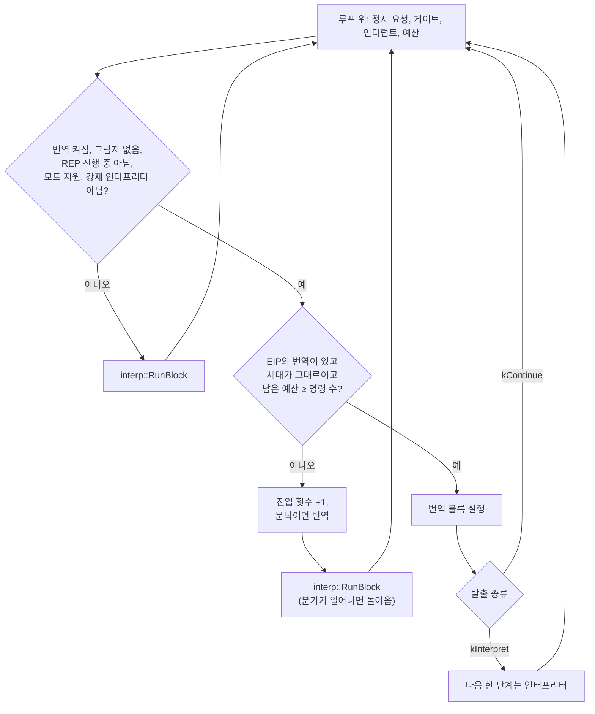

# #44 설계 : 번역 실행기 / #44 design : the translation runtime

이슈: [#44](https://github.com/reexec/rex86/issues/44) | 상위 설계: [#42](20261010-i042-phase3-translation.md) 결정 4~7, 9, 11 | 앞 이슈: [#43](20261010-i043-ir-frontend.md) | 지시서: [20261010-i044](../work-orders/20261010-i044-translation-runtime.md) | 로그: [20261010-i044](../work-logs/20261010-i044-translation-runtime.md)

#43의 프런트엔드와 평가기를 `Cpu::Run`에 잇는다. 번역 캐시, 디스패치, 계층화, 탈출 처리, 예산, 게이트, SMC를 맡는 번역 실행기를 만들고, 평가기를 첫 백엔드로 끝까지 연결해 인터프리터와 같은 결과를 내는지 검증한다.

*This wires #43's frontend and evaluator into `Cpu::Run`: a translation runtime for the translation cache, dispatch, tiering, exits, the budget, gates and SMC, connected end to end with the evaluator as its first backend and verified to give the interpreter's results.*

## 결정 1: 실행 루프에 끼우는 자리 / Decision 1: the place in the run loop



* 디스패치는 `Cpu::RunUntilStop`의 기존 검사(정지 요청, 게이트, 인터럽트 전달, 예산) **뒤**, `interp::RunBlock` **앞**에 들어간다. 그래서 그 검사들은 블록 경계마다 지금과 똑같이 돈다.
* 번역 블록은 남은 예산이 블록의 명령 수 이상일 때만 실행한다. 블록이 중간에 탈출하면 실행한 단계 수만 센다. `Run(budget)`은 정확히 budget 단계에서 돌아온다(#32).
* 인터럽트 그림자가 서 있거나 REP 문자열이 반복 사이에서 멈춰 있으면 인터프리터가 한 번 더 간다. 블록에는 STI, MOV SS, POP SS, 문자열이 없으므로 블록 뒤의 그림자는 언제나 꺼져 있다.
* **`kInterpret` 탈출**: 다음 한 단계는 반드시 인터프리터가 실행한다(`max_steps` 1). 그렇지 않으면 같은 EIP의 번역이 같은 검사에서 다시 탈출해 루프가 돌지 않는다. 그 한 단계 뒤의 EIP가 다시 디스패치되므로, 다루지 않는 명령 뒤의 코드도 블록 머리가 된다.

*Dispatch sits **after** `Cpu::RunUntilStop`'s existing checks (stop requests, gates, interrupt delivery, budget) and **before** `interp::RunBlock`, so those checks run at every block boundary as today. A translated block runs only when the remaining budget covers its instruction count, a block exiting midway counting only the steps it ran, so `Run(budget)` returns at exactly budget steps (#32). With the interrupt shadow raised or a REP string stopped between iterations, the interpreter goes once more; blocks hold no STI, MOV SS, POP SS or strings, so the shadow is always down after a block. A `kInterpret` exit makes the interpreter run the next step (`max_steps` 1), or the translation at the same EIP would exit at the same check again and the loop would not advance; the EIP after that step is dispatched again, so code after an uncovered instruction becomes a block head too.*

## 결정 2: 인터프리터가 블록 머리에서 돌아오게 / Decision 2: the interpreter returning at block heads

지금의 `interp::RunBlock`은 분기를 넘어 계속 실행한다(#35). 그러면 디스패치가 블록 머리를 보지 못해 횟수를 셀 수도, 번역으로 들어갈 수도 없다.

* `BlockLimits`에 `stop_after_branch`를 더한다. 켜져 있으면 `RunBlock`은 제어 이동(분기를 탄 Jcc, JMP, CALL, RET 등)을 실행한 직후 돌아온다.
* `ExecuteDecoded`는 이미 "EIP가 fallthrough가 아니거나 CS가 바뀐" 경우만 따로 처리한다(분기 목적지 검사). 그 길에서만 `StepResult::branched`를 세운다. 분기하지 않는 명령의 길에는 쓰기가 없다.
* `RunBlock`은 두 판으로 나눈다(템플릿). 번역이 꺼진 판은 지금과 같은 기계어다. #35, #32에서 측정한 명령당 비용을 다시 재서 확인한다.

*Today's `interp::RunBlock` runs on across branches (#35), so dispatch would never see a block head to count or enter. `BlockLimits` gains `stop_after_branch`: with it set, `RunBlock` returns right after a control transfer (a taken Jcc, JMP, CALL, RET and so on). `ExecuteDecoded` already handles apart the case where EIP is not the fallthrough or CS changed (the branch-target check), and only that path sets `StepResult::branched`; the path of instructions that do not branch writes nothing more. `RunBlock` splits into two versions (a template), the one with translation off compiling to today's code, re-measured against #35's and #32's per-instruction costs.*

## 결정 3: 번역 실행기 / Decision 3: the translation runtime

`src/translate/runtime.{h,cpp}`의 `translate::Translator` 하나가 `Cpu`마다 있다(번역이 켜질 때 만든다).

| 부분 | 내용 |
|---|---|
| 캐시 | 블록 시작 EIP(평탄한 CS이므로 선형 주소) → 항목. 항목은 진입 횟수, 상태(셈, 번역됨, 번역 불가), 번역된 블록과 백엔드의 것 |
| 유효성 | 블록이 기록한 페이지 세대가 지금 세대와 같아야 한다. 다르면 항목을 지우고 다시 센다 |
| 번역 | 문턱에 닿으면 `FormBlock`(게이트 필터 포함), `Optimize`, 백엔드의 `Compile`. 블록의 페이지에 `kTranslated`를 둔다 |
| 번역 불가 | `FormBlock`이 거절한 EIP는 그 페이지의 세대와 함께 기억해 매번 다시 시도하지 않는다 |
| 크기 | 항목이 한도(65,536)를 넘으면 모두 버린다. `EngineMemoryBytes`에 어림값을 더한다 |
| 게이트 | `RegisterGate`가 모든 번역을 버린다(#42 결정 5). `UnregisterGate`는 버리지 않는다(블록이 일찍 끝날 뿐이다) |

* **백엔드 계약**(내부): `Compile(block) → 결과(준비됨, 기다림, 실패)`와 `Run(번역, 상태, 메모리) → ExitResult`. 평가기 백엔드는 최적화한 IR을 그대로 들고 `Evaluate`로 돈다. 동기라 언제나 "준비됨"이다. "기다림"은 wasm(#45)의 비동기 설치를 위해 둔다.
* 평가기는 값 버퍼를 호출마다 할당하지 않도록 백엔드가 가진 버퍼를 빌려 쓴다.

*One `translate::Translator` in `src/translate/runtime.{h,cpp}` per `Cpu`, made when translation turns on, with the parts in the table above: a cache from block start EIP (a linear address, CS being flat) to an entry holding the entry count, a state (counting, translated, untranslatable) and the translated block with its backend's data; validity requiring the block's recorded page generations to equal today's, a mismatch dropping the entry to be counted again; translation at the threshold through `FormBlock` (with the gate filter), `Optimize` and the backend's `Compile`, putting `kTranslated` on the block's pages; untranslatable EIPs, refused by `FormBlock`, remembered with their page's generation so they are not retried every time; a cap of 65,536 entries past which everything is dropped, with an estimate added to `EngineMemoryBytes`; `RegisterGate` dropping every translation (#42 decision 5) and `UnregisterGate` dropping none (blocks just end earlier). The internal backend contract is `Compile(block)` returning ready, pending or failed, and `Run(translation, state, memory)` returning an `ExitResult`; the evaluator backend keeps the optimized IR and runs `Evaluate`, always ready being synchronous, pending kept for wasm's asynchronous installation (#45). The evaluator borrows a value buffer the backend owns rather than allocating one per call.*

## 결정 4: 공개 계약의 추가 / Decision 4: additions to the public contract

```cpp
// include/rex86/cpu.h
enum class TranslationMode : std::uint8_t
{
    kOff,        // the interpreter alone (the default)
    kEvaluator,  // the portable IR evaluator, for verification (design #44)
};

struct TranslationOptions
{
    TranslationMode mode = TranslationMode::kOff;
    // Entries into a block start before it is translated; 0 translates a
    // block at its first entry (forced translation, for tests).
    std::uint32_t threshold = 32;
};

void Cpu::SetTranslation(const TranslationOptions& options);
[[nodiscard]] const TranslationOptions& Cpu::translation() const;

// Added during implementation: counts since translation was turned on, so
// that a forced build shows translation happened, and for the benchmark.
struct TranslationStats
{
    std::uint64_t blocks_translated, block_runs, interpreter_exits, translated_steps;
};
[[nodiscard]] TranslationStats Cpu::translation_stats() const;
```

* 기본값은 꺼짐이다. 그래서 소비자는 아무것도 하지 않으면 지금과 같다. 켜면 `ActiveEngine()`이 `kTranslator`를 보고한다.
* `kEvaluator`는 검증용이다(#42 결정 1). wasm 백엔드(#45)는 이 열거형에 모드를 더한다.
* **빌드 옵션** `REX86_FORCE_TRANSLATION`(CMake): 켜면 모든 `Cpu`의 기본값이 `{kEvaluator, 0}`이 된다. 그래서 기존 테스트, trace 묶음, 견고성 하네스를 코드 변경 없이 번역 경로로 돌린다. `REX86_DECODE_CACHE_WARMUP`과 같은 방식이다.

*The default is off, so a consumer doing nothing sees today's behavior; with it on, `ActiveEngine()` reports `kTranslator`. `kEvaluator` is for verification (#42 decision 1); the wasm backend (#45) adds its mode to the enum. The CMake option `REX86_FORCE_TRANSLATION` makes `{kEvaluator, 0}` every `Cpu`'s default, so the existing tests, trace corpora and the robustness harness run through translation unchanged, the way `REX86_DECODE_CACHE_WARMUP` works.*

## 결정 5: 검증 / Decision 5: verification

| 수단 | 내용 |
|---|---|
| 번역 강제 빌드 | `REX86_FORCE_TRANSLATION=ON`으로 ctest 전부(단위 테스트, trace 묶음, 견고성 smoke, 벤치마크 smoke, IR 차등). x86-64, i386, wasm32는 로컬, CI에 강제 작업 하나(x86-64 GCC ASan/UBSan) |
| 견고성 차등 | `rex86_robust`가 케이스마다 인터프리터 실행(지금의 두 번)에 더해 `{kEvaluator, 0}` 실행을 한 번 더 하고 이벤트, 상태, 메모리, 페이지 속성을 비교한다(#31 결정 6). 새 불변식 I8 |
| 실행기 단위 테스트 | 예산 경계(블록 길이보다 작은 예산), `kInterpret` 탈출 뒤 한 단계, 게이트 등록이 번역을 버림, 자기 수정 코드(블록이 자기 페이지에 씀, 호스트의 `InvalidateCode`), 문턱, 번역 불가 기억, `ActiveEngine`, 정지 요청과 인터럽트가 블록 사이에서 처리됨 |
| 성능 | 번역이 꺼진 인터프리터의 단계당 호스트 명령(cachegrind, #32 방식)이 바뀌지 않음. 평가기 모드의 MIPS는 기록만 한다(검증용이라 목표가 없다) |

* **SST는 제외한다.** SingleStepTests/80386은 real mode 16비트 코드라 프런트엔드의 모드(평탄한 32비트 CS) 밖이고, 러너는 `Cpu`가 아니라 `interp::Step`을 부른다. 명령 의미는 IR 차등(#43)이 맡는다. #42 결정 9의 "SST"를 고친다.

*Instruments in the table above: a forced-translation build (`REX86_FORCE_TRANSLATION=ON`) running all of ctest (unit tests, trace corpora, robustness smoke, benchmark smoke, IR differential), locally on x86-64, i386 and wasm32 and in one forced CI job (x86-64 GCC with ASan/UBSan); the robustness differential, `rex86_robust` adding to each case's interpreter runs (two today) one more run under `{kEvaluator, 0}` and comparing events, state, memory and page attributes (#31 decision 6), a new invariant I8; runtime unit tests for the budget boundary (a budget below the block length), the single step after a `kInterpret` exit, gate registration dropping translations, self-modifying code (a block writing its own page, the host's `InvalidateCode`), the threshold, remembered untranslatable EIPs, `ActiveEngine`, and stop requests and interrupts handled between blocks; performance, with the interpreter's host instructions per step with translation off unchanged (cachegrind, as in #32) and the evaluator mode's MIPS only recorded (it has no target, being for verification). SST is excluded: SingleStepTests/80386 is 16-bit real-mode code, outside the frontend's modes (a flat 32-bit CS), and its runner calls `interp::Step`, not `Cpu`; instruction semantics belong to the IR differential (#43), and #42 decision 9's "SST" is corrected.*

## 소비자 영향 / Consumer impact

공개 계약에 `TranslationMode`, `TranslationOptions`, `TranslationStats`, `Cpu::SetTranslation`, `Cpu::translation`, `Cpu::translation_stats`가 더해진다(추가만). 기본값이 꺼짐이므로 두 소비자의 동작은 바뀌지 않는다. `Cpu`의 크기가 포인터 하나 늘어 ABI가 바뀌므로 다시 빌드해야 한다.

*The public contract gains `TranslationMode`, `TranslationOptions`, `TranslationStats`, `Cpu::SetTranslation`, `Cpu::translation` and `Cpu::translation_stats` (additions only); with the default off, neither consumer's behavior changes, but `Cpu` grows by a pointer, an ABI change requiring a rebuild.*
