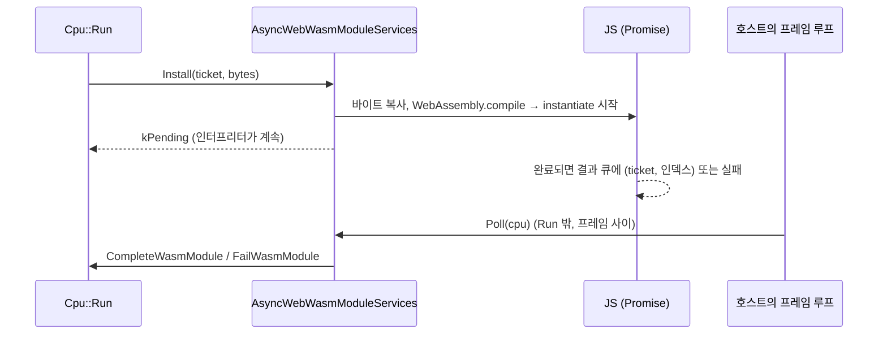

# #48 설계 : 브라우저 검증, 비동기 설치 어댑터, 브라우저 CI / #48 design : browser validation, the asynchronous installer, browser CI

이슈: [#48](https://github.com/reexec/rex86/issues/48) | 근거: [#45 설계](20261010-i045-wasm-backend.md) 결정 4, [#1 설계](20261007-i001-repository-and-public-contract.md) 결정 5, [kb: wasm에서 실행 중에 만든 코드](../kb/wasm-runtime-code.md) | 지시서: [20261011-i048](../work-orders/20261011-i048-browser-validation.md) | 로그: [20261011-i048](../work-logs/20261011-i048-browser-validation.md)

## 문제 / Problem

wasm 번역(#45)은 Node(V8)에서만 검증했다. 브라우저마다 wasm 엔진이 다르다(Chromium의 V8, Firefox의 SpiderMonkey, Safari의 JavaScriptCore). 동기 컴파일 제한도 다르고, Worker 실행 방식도 Node와 다르다. README 목표 3의 실용 기준(중급 모바일 브라우저)과 4단계 웹 실행 예제는 이 검증 위에 선다.

**확인됨(사전 실험, 2026-10-11)**: Playwright 1.63.0으로 헤드리스 Chromium 153과 Firefox 155의 Worker에서 `rex86_irdiff --cases 2000`을 돌렸다. 생성 모듈 2,466개를 동기 설치했고 불일치 0, 결과 줄이 Node와 같다. 조건은 둘이다. 빌드에 `-sEXIT_RUNTIME=1`이 있어야 종료 코드가 전달되고, Worker의 `locateFile`이 도구 디렉터리를 가리켜야 `.wasm`을 찾는다. WebKit은 이 기계에 시스템 라이브러리가 없어 뜨지 않는다.

*Wasm translation (#45) has been verified on Node (V8) only. Browsers differ in wasm engines (V8 in Chromium, SpiderMonkey in Firefox, JavaScriptCore in Safari), in synchronous compile limits and in how Workers run, and README goal 3's practical bar (a mid-range mobile browser) and phase 4's web demo rest on this verification. Confirmed (spike, 2026-10-11): with Playwright 1.63.0, `rex86_irdiff --cases 2000` ran in a Worker of headless Chromium 153 and Firefox 155, installing 2,466 generated modules synchronously with zero mismatches and the same result lines as Node; the build needs `-sEXIT_RUNTIME=1` for the exit code to arrive, and the Worker's `locateFile` must point at the tool directory for the `.wasm` to be found. WebKit lacks system libraries on this machine and does not start.*

## 결정 1: 브라우저 빌드 / Decision 1: the browser build

* CMake 옵션 `REX86_BROWSER`(Emscripten에서만). 켜면 테스트 도구가 Node 전용 `-sNODERAWFS`를 쓰지 않고 `-sEXIT_RUNTIME=1`로 링크된다.
* `rex86_trace`는 trace 묶음을 `--embed-file tests/traces@/traces`로 실어, 브라우저의 메모리 파일 시스템에서 `/traces/*.rxt`를 읽는다.
* ctest는 이 구성에서 등록하지 않는다. 브라우저 실행은 결정 3의 드라이버가 맡는다.

*A CMake option `REX86_BROWSER` (Emscripten only) links the test tools without Node's `-sNODERAWFS` and with `-sEXIT_RUNTIME=1`; `rex86_trace` carries the trace corpus through `--embed-file tests/traces@/traces` and reads `/traces/*.rxt` from the browser's memory file system; ctest registers nothing in this configuration, browser runs belonging to decision 3's driver.*

## 결정 2: 비동기 설치 어댑터 / Decision 2: the asynchronous installer

* `src/host/web/async_wasm_module_services.{h,cpp}`: `Install`은 바이트를 JS로 복사하고 `WebAssembly.compile`과 `instantiate`를 시작한 뒤 `kPending`을 돌려준다. 결과는 JS의 큐에 쌓인다.
* `Poll(Cpu&)`: 호스트가 `Run` 밖에서(프레임 사이) 부른다. 큐의 결과를 `CompleteWasmModule`/`FailWasmModule`로 넘긴다. Promise는 이벤트 루프가 돌 때만 끝나므로, 호스트는 프레임 사이에 제어를 돌려줘야 한다(웹의 보통 프레임 루프).
* ticket은 `Cpu`(번역 실행기)마다 따로 매겨지므로, **어댑터 하나는 `Cpu` 하나를 섬긴다**. 헤더에 적는다.
* 이 어댑터는 메인 스레드에서도 쓸 수 있다. Chromium의 메인 스레드 동기 컴파일 한도(8 MB)나 앞으로의 묶음 설치에서 의미가 있다.

*`src/host/web/async_wasm_module_services.{h,cpp}`: `Install` copies the bytes into JS, starts `WebAssembly.compile` and `instantiate`, and returns `kPending`, results queuing in JS. `Poll(Cpu&)`, called by the host outside `Run` (between frames), hands the queued results to `CompleteWasmModule`/`FailWasmModule`; Promises settle only while the event loop runs, so the host must yield between frames (a web page's ordinary frame loop). Tickets are numbered per `Cpu` (per runtime), so one adapter serves one `Cpu`, as its header says. It works on the main thread as well, which matters for Chromium's 8 MB main-thread synchronous compile limit and for later batched installation.*

## 결정 3: 브라우저 실행기 / Decision 3: the browser runner

`tests/host/web/`(호스트 전용 테스트, AGENTS.md):

| 파일 | 내용 |
|---|---|
| `index.html`, `suite.js` | 도구 목록을 차례로 Worker에서 돌려 표로 보여 주고, `window.rex86Results`에 결과를 둔다. 사람이 실기기에서 열어 볼 수 있다 |
| `worker.js` | Emscripten 도구 하나를 `Module`(인자, 출력, `onExit`, `locateFile`)로 띄운다 |
| `serve.mjs` | 빌드 디렉터리와 이 디렉터리를 내주는 작은 정적 서버(실기기용, LAN 주소 출력) |
| `drive.mjs` | Playwright로 브라우저를 띄워 `index.html`을 열고 결과를 모아 `[rex86-browser]` 줄로 보고. 하나라도 실패하면 종료 코드 1 |
| `async_test.cpp` | 비동기 어댑터 테스트(결정 2). 프레임 루프(`emscripten_set_main_loop`)로 돌고, Node(ctest)와 브라우저 메인 스레드에서 돈다 |
| `package.json`, `package-lock.json` | Playwright 1.63.0 고정 |

* **모음**: 단위 테스트, IR 차등(wasm 포함), 견고성 smoke, trace 묶음, 벤치마크 smoke, 벤치마크의 세 엔진(성능 기록), probe, 비동기 테스트(메인 스레드).
* Worker 실행이 기본이다(#1 결정 5). 비동기 테스트만 메인 스레드에서 돈다.

*`tests/host/web/` (host-specific tests, AGENTS.md) holds the files in the table above: `index.html` and `suite.js` running a list of tools in Workers one after another, showing a table and leaving results in `window.rex86Results`, openable by a person on a real device; `worker.js` starting one Emscripten tool through `Module` (arguments, output, `onExit`, `locateFile`); `serve.mjs`, a small static server for the build directory and this one (for real devices, printing LAN addresses); `drive.mjs`, opening `index.html` in browsers through Playwright, gathering results as `[rex86-browser]` lines and exiting 1 if anything failed; `async_test.cpp`, the asynchronous adapter's test (decision 2), running on a frame loop (`emscripten_set_main_loop`) under Node (ctest) and on a browser's main thread; `package.json` and `package-lock.json` pinning Playwright 1.63.0. The suite: unit tests, the IR differential (with wasm), robustness smoke, the trace corpus, benchmark smoke, the benchmark's three engines (a performance record), probe and the asynchronous test (main thread). Workers are the default (#1 decision 5); only the asynchronous test runs on the main thread.*

## 결정 4: CI와 실기기 / Decision 4: CI and real devices

* CI 작업 `browsers`: emsdk 3.1.74, `npm ci`, `npx playwright install --with-deps chromium firefox webkit`, 브라우저 빌드, 브라우저 셋에서 `drive.mjs`. 작업 요약에 브라우저마다 결과와 벤치마크 MIPS를 적는다. 브라우저 CI의 성능 수치는 기록하지 않는다(러너 변동, #27 가이드).
* 실기기(모바일 Chrome, iOS Safari, macOS Safari)는 가이드 `docs/guides/browser-tests.md`의 수동 절차다. `serve.mjs`를 띄우고 기기에서 LAN 주소를 연다. 결과 표와 벤치마크 수치를 분석 문서에 적는다.
* Playwright는 테스트 도구로만 쓰고 배포하지 않는다. 라이선스(Apache-2.0)를 `THIRD_PARTY_NOTICES.md`에 적는다.

*A CI job `browsers` runs emsdk 3.1.74, `npm ci`, `npx playwright install --with-deps chromium firefox webkit`, the browser build and `drive.mjs` in all three browsers, writing each browser's results and benchmark MIPS to the job summary, CI's browser performance figures not being recorded (runner variance, #27's guide). Real devices (mobile Chrome, iOS Safari, macOS Safari) follow the manual procedure in the guide `docs/guides/browser-tests.md`: start `serve.mjs` and open the LAN address on the device, recording the result table and benchmark figures in the analysis. Playwright is used as a test tool only and not distributed; its license (Apache-2.0) goes into `THIRD_PARTY_NOTICES.md`.*

## 소비자 영향 / Consumer impact

* 공개 계약은 바뀌지 않는다. `src/host/web/`에 비동기 어댑터 `AsyncWebWasmModuleServices`가 더해진다. 메인 스레드에서 돌리는 웹 소비자가 쓸 수 있다.
* 웹 소비자는 같은 브라우저 실행기로 자기 빌드를 검증할 수 있다.

*The public contract does not change; `src/host/web/` gains the asynchronous `AsyncWebWasmModuleServices`, usable by web consumers running on the main thread, and web consumers can verify their builds with the same browser runner.*

## 구현에서 정한 것 / Settled in implementation

* `main.html`: 메인 스레드 도구는 페이지 안의 frame에서 띄운다. 페이지의 전역 `Module`과 섞이지 않게 하기 위해서다. `report.mjs`는 페이지와 드라이버가 함께 쓰는 보고 줄 형식이다.
* Firefox는 wasm 코드 메모리를 쓰레기 수집에서만 돌려주고, 프로세스당 모듈 16,349개에서 설치를 거절한다([기록](../analysis/browser-wasm.md) 3절). 그래서 모음은 다음과 같이 돈다.
  * 테스트 사이에 5초를 기다린다.
  * IR 차등을 5,000건만 돌린다. Node ctest는 2만 건을 유지한다.
  * 메모리 부족만으로 실패한 실행은 15초 뒤 두 번까지 다시 시작하고, 재시도 횟수를 보고한다.
* 결과 큐는 어댑터마다 둔다. 어댑터의 소멸자는 넘기지 않은 결과의 테이블 칸을 돌려준다.

*`main.html` starts the main-thread tool in a frame inside the page so it does not mix with the page's global `Module`, and `report.mjs` is the report line format the page and the driver share. Firefox returns wasm code memory only at a garbage collection and refuses installation at 16,349 modules per process (record section 3), so the suite waits 5 seconds between tests, runs 5,000 IR differential cases (Node's ctest keeping 20,000), and restarts a run that failed for want of memory alone up to twice after 15 seconds, reporting the retries. The result queue is kept per adapter, whose destructor gives back the table slots of results not delivered.*
