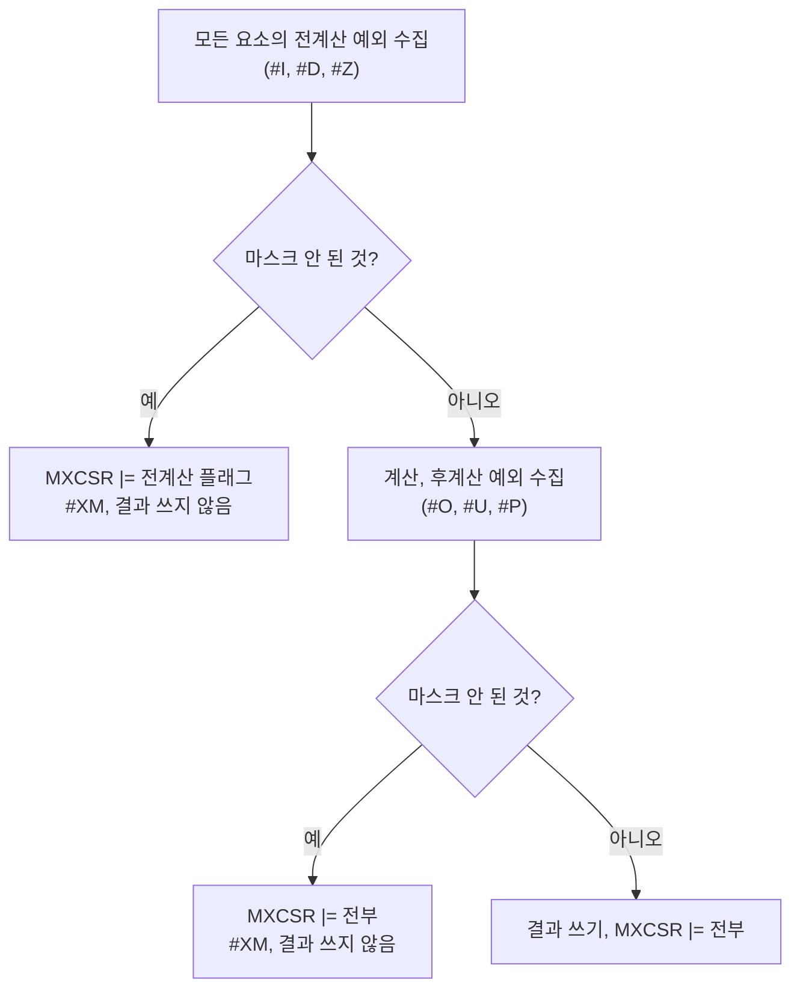

# MMX와 SSE / MMX and SSE

근거 작업: [#29](https://github.com/reexec/rex86/issues/29) ([설계](../design/20261009-i029-mmx-and-sse.md)) | 출처: [Intel SDM](https://www.intel.com/content/www/us/en/developer/articles/technical/intel-sdm.html) Vol. 1 9장(MMX), 10장(SSE), 11.5(SIMD 부동소수점 예외), 4.9(부동소수점 예외), Vol. 2 각 명령, FXSAVE 항목 | 이 프로젝트가 잰 사실: [SIMD 호스트 대조](../analysis/simd-host-comparison.md)

이 문서는 rex86이 구현하는 Pentium III 수준의 MMX와 SSE의 배경을 정리한다. 이 프로젝트가 호스트 CPU로 확인한 동작은 분석 문서에 있다.

*Background on the Pentium III-level MMX and SSE that rex86 implements. Behavior this project verified on host CPUs is in the analysis topic.*

## 1. 어느 CPU에 무엇이 있나 / Which CPU has what

| 기능 | CPUID.01H:EDX | 대상 기판 | rex86 `Features` |
|---|---|---|---|
| MMX | 비트 23 | 넷 모두 | `mmx` |
| FXSAVE/FXRSTOR | 비트 24 (FXSR) | MK3, MK5, EZ2DJ 2세대 (K6-2 없음) | `fxsr` |
| SSE (Katmai) | 비트 25 | MK5, EZ2DJ 2세대 | `sse` |
| SSE2 이후 | 비트 26~ | 없음 | `sse2` (끔) |

SSE는 XMM 레지스터 위의 명령만 더한 것이 아니다. MMX 레지스터 위의 정수 명령 열둘(PSHUFW, PAVGB/W, PEXTRW, PINSRW, PMAXSW, PMAXUB, PMINSW, PMINUB, PMULHUW, PSADBW, PMOVMSKB, MASKMOVQ)과 MOVNTQ도 SSE와 함께 왔다. 그래서 Mendocino Celeron(MMX만)에서 PSHUFW는 #UD다.

*SSE added more than XMM instructions: twelve integer instructions on the MMX registers (PSHUFW, PAVGB/W, PEXTRW, PINSRW, PMAXSW, PMAXUB, PMINSW, PMINUB, PMULHUW, PSADBW, PMOVMSKB, MASKMOVQ) and MOVNTQ came with it, so PSHUFW is #UD on a Mendocino Celeron (MMX only).*

## 2. MMX 레지스터는 x87 레지스터다 / MMX registers are the x87 registers

MMn은 x87 **물리** 레지스터 n의 하위 64비트다(스택 순서 ST(i)가 아니다). SDM Vol. 1 표 9-2:

| 명령 | TOP | 태그 | 쓴 레지스터의 비트 79:64 |
|---|---|---|---|
| MMX 명령(EMMS 제외) | 0 | 전부 유효(00) | FFFF |
| EMMS | 0 | 전부 비움(11) | — |

MMX 명령과 EMMS는 마스크 안 된 x87 예외가 대기 중이면 먼저 #MF를 낸다. 그래서 x87 코드와 MMX 코드를 섞는 게임은 경계마다 EMMS를 둔다.

*MMn is the low 64 bits of x87 **physical** register n, not ST(i). Per SDM Vol. 1 table 9-2, an MMX instruction other than EMMS sets TOP to 0 and every tag to valid and writes FFFF into bits 79:64 of the register it writes; EMMS sets TOP to 0 and every tag to empty. MMX instructions and EMMS raise #MF first when an unmasked x87 exception is pending, which is why games mixing x87 and MMX put EMMS at each boundary.*

## 3. MXCSR

| 비트 | 이름 | 뜻 |
|---|---|---|
| 0~5 | IE, DE, ZE, OE, UE, PE | 예외 플래그(끈적임) |
| 6 | DAZ | 비정규 입력을 0으로. **Pentium III에 없다**(쓰면 #GP) |
| 7~12 | IM, DM, ZM, OM, UM, PM | 예외 마스크 |
| 13~14 | RC | 반올림: 00 가장 가까운 값, 01 아래, 10 위, 11 0 쪽 |
| 15 | FZ | 마스크된 언더플로 결과를 0으로 |
| 16~31 | 예약 | 쓰면 #GP |

초기값은 0x1F80(전부 마스크, 가장 가까운 값). LDMXCSR과 FXRSTOR가 예약 비트를 보면 #GP다. FXSAVE의 MXCSR_MASK(바이트 28~31)는 쓸 수 있는 비트를 알려 주며, 0이면 0xFFBF로 본다.

*Bits as in the table; the reset value is 0x1F80 (everything masked, round to nearest). LDMXCSR and FXRSTOR raise #GP on a reserved bit, and DAZ is reserved on the Pentium III. FXSAVE's MXCSR_MASK (bytes 28-31) tells the writable bits, 0 meaning 0xFFBF.*

## 4. SIMD 부동소수점 예외 / SIMD floating-point exceptions

SDM Vol. 1 11.5. 예외는 두 묶음이다.

* **전계산**: 무효 연산(#I: SNaN, ∞−∞, 0×∞, 0/0, ∞/∞, 음수의 제곱근, 범위 밖 변환), 비정규 피연산자(#D), 0 나누기(#Z).
* **후계산**: 오버플로(#O), 언더플로(#U), 부정확(#P).

한 요소 안의 우선순위는 SNaN의 #I, QNaN 피연산자, 그 밖의 #I와 #Z, #D, #O/#U, #P 순이다. 높은 것이 나면 낮은 것은 그 요소에서 보고되지 않는다.

마스크 안 된 SIMD 예외는 #XM(벡터 19)이다(운영체제가 CR4.OSXMMEXCPT를 켠 경우. Windows와 Linux는 켠다). 마스크된 응답: #I는 기본 QNaN(0xFFC00000) 또는 정수 indefinite(0x80000000), #Z는 부호 있는 ∞, #O는 반올림 방향에 따른 ∞ 또는 최대 유한값, #U는 비정규 결과(FZ면 0).

NaN 전파는 x87과 다르다. 두 피연산자가 모두 NaN이면 **첫 피연산자(목적지)**를 QNaN으로 바꿔 낸다(x87은 유효 숫자가 큰 쪽). MINPS/MAXPS는 예외적으로 NaN이 하나라도 있거나 둘 다 0이면 **둘째 피연산자를 그대로** 낸다.

*Pre-computation exceptions are #I (SNaN, ∞−∞, 0×∞, 0/0, ∞/∞, the square root of a negative, an out-of-range conversion), #D and #Z; post-computation ones #O, #U and #P. Within a lane the precedence is SNaN #I, a QNaN operand, other #I and #Z, #D, #O/#U, #P, a higher one hiding the lower. Across lanes the flow is the diagram's. An unmasked SIMD exception is #XM (vector 19, with CR4.OSXMMEXCPT set as Windows and Linux do). Masked responses: the default QNaN 0xFFC00000 or the integer indefinite 0x80000000 for #I, a signed ∞ for #Z, ∞ or the largest finite value by rounding direction for #O, a denormal (0 under FZ) for #U. NaN propagation differs from the x87: with two NaNs the **first operand** (the destination) comes back quieted; MINPS/MAXPS instead return the **second operand as it is** when either is a NaN or both are zero.*

## 5. FXSAVE 이미지 / The FXSAVE image

512바이트, 16바이트 정렬(어긋나면 #GP). 32비트 형식:

| 바이트 | 내용 |
|---|---|
| 0~1, 2~3 | FCW, FSW |
| 4 | 축약 FTW: 물리 레지스터마다 1비트(1 = 비어 있지 않음) |
| 6~7 | FOP(11비트) |
| 8~11, 12~13 | FIP, FCS |
| 16~19, 20~21 | FDP, FDS |
| 24~27, 28~31 | MXCSR, MXCSR_MASK |
| 32~159 | ST0~ST7(**스택 순서**), 16바이트 슬롯마다 80비트 |
| 160~287 | XMM0~XMM7 |
| 288~511 | 64비트 모드의 XMM8~15와 예약 |

FXRSTOR는 축약 태그와 레지스터 내용으로 2비트 태그를 다시 만든다.

*512 bytes, 16-byte aligned (#GP otherwise), laid out as in the table; FXRSTOR rebuilds the 2-bit tags from the abridged tag and the register contents.*

## 6. 정렬 / Alignment

16바이트 메모리 피연산자를 읽거나 쓰는 패킹 SSE 명령(MOVAPS, MOVNTPS, ADDPS 등)과 FXSAVE/FXRSTOR는 16바이트 정렬을 요구하고, 어긋나면 #GP다. MOVUPS, 스칼라형(…SS), MOVLPS/MOVHPS, MMX의 64비트 피연산자는 요구하지 않는다.

*Packed SSE instructions with a 16-byte memory operand (MOVAPS, MOVNTPS, ADDPS, ...) and FXSAVE/FXRSTOR require 16-byte alignment and raise #GP otherwise; MOVUPS, the scalar forms, MOVLPS/MOVHPS and MMX's 64-bit operands do not.*
