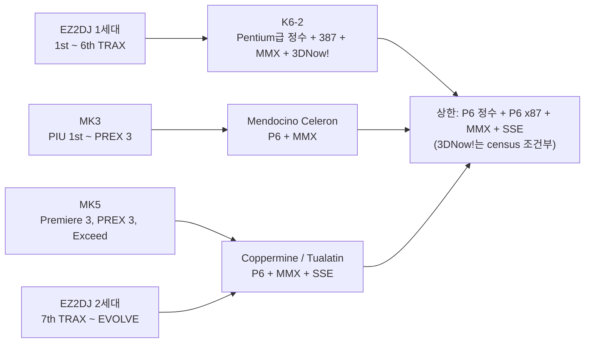

# 대상 기판의 CPU / The CPUs of the target boards

근거 작업: [#21](https://github.com/reexec/rex86/issues/21) ([설계](../design/20261008-i021-target-board-cpu-baseline.md)) | CPU 기능의 기준: [Intel SDM](https://www.intel.com/content/www/us/en/developer/articles/technical/intel-sdm.html) Vol. 2A CPUID, [AMD K6-2](https://en.wikipedia.org/wiki/AMD_K6-2)

이 문서는 rex86의 최소 지원 사양을 정하는 네 기판의 CPU를 정리한다. 기판 사양은 제조사 공식 자료가 없어 공동체 자료로만 확인된다. 그래서 CPU 이름보다 **명령 집합의 상한**에 결론을 두었다. 출처가 어떤 CPU를 말하든 명령 집합의 결론은 같다.

*This document collects the CPUs of the four boards that set rex86's minimum supported specification. No manufacturer documentation exists, only community sources, so the conclusion rests on the **instruction-set ceiling** rather than the CPU name: whichever CPU a source names, the instruction-set conclusion is the same.*

> 확인 방법: 처음 작성할 때(#21)는 네트워크 정책이 원 문서 사이트를 막아 검색 결과 발췌만 읽었다. 같은 날 후속 조사에서 원문을 직접 읽었다. 나무위키 두 문서와 dcinside는 원 사이트에서, Shiz arcade-docs는 원 사이트가 응답하지 않아 GitHub 미러 [`shizmob/arcade-docs`][shiz-gh] (보관됨, codeberg로 이전)에서, Arcade Otaku는 봇 검사 때문에 [Wayback 사본(2024-07-18)][aow-wb]에서, EZ2 Wiki는 Cloudflare 526 오류 때문에 [Wayback 사본(2023-03-26)][ez2wiki-wb]에서 읽었다. EZ2 Wiki 사본에는 사양표의 내용이 거의 없고 세대 구분과 연도만 남아 있다. 실기 덤프는 MK3의 PC-Doctor 덤프 하나뿐이다.
>
> *How this was verified: when first written (#21), the network policy blocked the original sites and only search-result excerpts were read. A follow-up the same day read the originals directly: the two NamuWiki pages and dcinside from their sites; Shiz's arcade-docs from its GitHub mirror [`shizmob/arcade-docs`][shiz-gh] (archived, moved to Codeberg) because the original host does not answer; Arcade Otaku from a [Wayback copy (2024-07-18)][aow-wb] because of a bot challenge; and EZ2 Wiki from a [Wayback copy (2023-03-26)][ez2wiki-wb] because of a Cloudflare 526 error. The EZ2 Wiki copy keeps little of its spec tables beyond the generation split and years. The only real-hardware dump is the MK3's PC-Doctor dump.*

## 1. 기판별 CPU / CPU by board

| 기판 | CPU (출처) | 칩셋, 그래픽 | 게임 | 확실성 |
|---|---|---|---|---|
| 안다미로 MK3 | **Mendocino Celeron 333 ~ 400 MHz.** 실기 PC-Doctor 덤프: "Intel Celeron 333", CPUID Family 6 Model 6 Stepping 5, L2 128 kB, 440BX([Shiz arcade-docs][shiz]). 나무위키: Mendocino Celeron 366 MHz(SD 기체), 400 MHz(DX 기체), 440ZX([나무위키 안다미로 Mk][namu-mk]). 갤러리 보고: Mendocino Celeron([dcinside][dc]). Arcade Otaku만 Pentium II 333/366 MHz로 적는다([Arcade Otaku][aow-wb]) | Intel 440BX 또는 440ZX(출처마다 다름) 독자 보드, 3dfx Voodoo Banshee 온보드, SDRAM 64 MB, DOS(DiskOnChip) + CD | rePIU의 DOS/4GW 게임(1st ~ PREX 3 MK3판) | **확인됨**(실기 덤프). Family 6 Model 6과 L2 128 kB는 Mendocino Celeron이다. Arcade Otaku의 Pentium II는 덤프와 맞지 않는다 |
| 안다미로 MK5 | **Celeron 1.0 또는 1.3 GHz.** 나무위키: Tualatin Celeron 1.3 GHz, VIA 694T([나무위키 안다미로 Mk][namu-mk]). Shiz: Celeron 1 GHz 또는 1.3 GHz, VIA Apollo Pro133A(VT82C694X + VT82C686B)([Shiz MKV][shiz-mkv]) | VIA 694T 또는 694X 독자 보드(DCAMP), GeForce2 MX400 온보드(Shiz는 TNT2와 NV11을 함께 적음), SDRAM 128 MB | Premiere 3, PREX 3(MK5판), Exceed(HDD, MK5 필수) | 출처 둘. 1.3 GHz Celeron은 Tualatin뿐이다. 1 GHz 변형이 어느 코어인지는 **추정**(Coppermine-128) |
| EZ2DJ 1세대 | **AMD K6-2 300 MHz 이상**(나무위키 "300MHz 이상의 AMD K6-2 (Chomper Extended)", 메인보드 Soltek SL-56D5)([나무위키 EZ2AC 기체][namu-ez2]). EZ2 Wiki: "1st Gen PC (1999-2007) AMD K6"([EZ2 Wiki][ez2wiki-wb]) | Super Socket 7, 1st: Intel 740 8 MB, SDRAM 64 MB, Windows 98. 2nd TRAX부터 RIVA TNT2 M64, 128 MB, Windows 98 SE("1.5세대"), Platinum부터 256 MB. CPU는 그대로 | **EZ2DJ 1st ~ 6th TRAX**(1999 ~ 2004) | CPU 계열(K6-2) 확인. 클럭 상한은 출처마다 다름(300 ~ 400 MHz) |
| EZ2DJ 2세대 | **Intel P6, Socket 370**: Pentium III Coppermine 533 MHz ~ 1.0 GHz 또는 Tualatin Celeron 1.1 ~ 1.4 GHz. 나무위키 각주: "EC를 통해 확인된 최저 클럭 모델은 533MHz"([나무위키 EZ2AC 기체][namu-ez2]). EZ2 Wiki: "2nd Gen PC (2007-2015)"([EZ2 Wiki][ez2wiki-wb]) | VIA Apollo Pro 133A/133T(GIGABYTE GA-6VTXE-A 등), SDRAM 256 ~ 512 MB, RIVA TNT2 M64(EVOLVE에서 GeForce FX), Windows 98 SE(EVOLVE 후기는 XP) | **EZ2DJ 7th TRAX ~ EZ2AC EVOLVE 2.03a**(2007 ~ 2015) | 출처 하나(나무위키)와 EZ2 Wiki의 연도. 실기 덤프는 없음 |

[shiz]: https://github.com/shizmob/arcade-docs/blob/main/andamiro/board.md
[shiz-mkv]: https://github.com/shizmob/arcade-docs/blob/main/andamiro/board/mkv.md
[shiz-gh]: https://github.com/shizmob/arcade-docs
[dc]: https://gall.dcinside.com/board/view/?id=superidea&no=212936
[namu-mk]: https://namu.wiki/w/%EC%95%88%EB%8B%A4%EB%AF%B8%EB%A1%9C%20Mk
[namu-ez2]: https://namu.wiki/w/EZ2AC%20%EC%8B%9C%EB%A6%AC%EC%A6%88/%EA%B8%B0%EC%B2%B4
[aow-wb]: https://web.archive.org/web/20240718112401/https://wiki.arcadeotaku.com/w/Pump_it_UP
[ez2wiki-wb]: https://web.archive.org/web/20230326204520/https://www.ez2wiki.com/EZ2_Arcade_System_Specifications
[mame]: https://github.com/mamedev/mame/blob/master/src/mame/misc/ez2d.cpp

*MK3: a **Mendocino Celeron at 333-400 MHz**. A PC-Doctor dump from a real board reads "Intel Celeron 333", CPUID family 6 model 6 stepping 5, 128 kB L2, 440BX (Shiz's arcade-docs); NamuWiki gives a Mendocino Celeron at 366 MHz (SD cabinet) or 400 MHz (DX cabinet) on a 440ZX; a gallery report says Mendocino Celeron; only Arcade Otaku says Pentium II 333/366. Confirmed by the dump: family 6 model 6 with a 128 kB L2 is a Mendocino Celeron, which Arcade Otaku's Pentium II does not match. MK5: a **Celeron at 1.0 or 1.3 GHz**: NamuWiki gives a 1.3 GHz Tualatin Celeron on a VIA 694T, Shiz a 1 or 1.3 GHz Celeron on a VIA Apollo Pro133A (694X); a 1.3 GHz Celeron exists only as a Tualatin, and the 1 GHz variant's core is inferred (Coppermine-128); it runs Premiere 3, PREX 3 (MK5 builds) and Exceed. EZ2DJ generation 1: an **AMD K6-2 at 300 MHz or more** on a Soltek SL-56D5 (NamuWiki; EZ2 Wiki's "1st Gen PC (1999-2007) AMD K6"), running **EZ2DJ 1st through 6th TRAX** (1999-2004); 2nd TRAX upgraded the graphics card (RIVA TNT2 M64), memory (128 MB) and OS (Windows 98 SE), the "generation 1.5", and Platinum the memory again (256 MB), the CPU staying a K6-2. EZ2DJ generation 2: an **Intel P6 on Socket 370**, a Coppermine Pentium III at 533 MHz-1.0 GHz or a Tualatin Celeron at 1.1-1.4 GHz on VIA Apollo Pro 133A/133T boards (NamuWiki, whose footnote says the slowest model confirmed through EC is 533 MHz; EZ2 Wiki's "2nd Gen PC (2007-2015)"), running **EZ2DJ 7th TRAX through EZ2AC EVOLVE 2.03a** (2007-2015); one source plus EZ2 Wiki's years, no hardware dump.*

### 바로잡은 해석: MAME의 Celeron 533 / A corrected reading: MAME's Celeron 533

#21의 첫 판은 EZ2DJ 2세대를 "Celeron 533 또는 K6-2, 미확정"으로 적었다. Celeron 533은 [MAME `ez2d.cpp`][mame]에서 왔는데, 그 주석이 적는 기판은 **EZ2Dancer 2nd Move**의 것이다(ASUS CUBX-103, Celeron 533 MHz, 128 MB). 주석이 이어 나열하는 EZ2DJ 1st ~ 7th는 "이 하드웨어나 파생 하드웨어에서 돌았을 것으로 생각되는 게임"이라는 추정이다. 원문으로 보면 EZ2DJ 2nd ~ 6th는 1세대 K6-2 기판의 게임이고, 2세대는 7th TRAX부터다.

*The first version of #21 recorded generation 2 EZ2DJ as "a Celeron 533 or a K6-2, unresolved". The Celeron 533 came from [MAME's `ez2d.cpp`][mame], whose comment describes the **EZ2Dancer 2nd Move** board (ASUS CUBX-103, Celeron 533 MHz, 128 MB); the EZ2DJ 1st-7th list that follows is "games thought to run on this or derived hardware", a guess. Read in the originals, EZ2DJ 2nd through 6th are games of the generation 1 K6-2 board, and generation 2 starts at 7th TRAX.*

## 2. CPU별 명령 집합 / Instruction sets by CPU

CPU 기능은 제조사 사양에서 확정된 사실이다(Intel SDM의 CPUID 기능 비트, AMD K6-2 자료).

| CPU | 정수 | x87 | MMX | SSE | 3DNow! | FXSAVE |
|---|---|---|---|---|---|---|
| Celeron (Mendocino, 333 ~ 400 MHz) — MK3 | P6(CMOVcc, CMPXCHG8B, UD2 등) | P6(FCOMI, FCMOVcc) | 예 | 아니오 | 아니오 | 예 |
| Pentium III (Coppermine, 533 MHz ~ 1.0 GHz) — EZ2DJ 2세대 | P6 | P6 | 예 | **예** | 아니오 | 예 |
| Celeron (Coppermine-128, 1.0 GHz) — MK5 변형(추정) | P6 | P6 | 예 | **예** | 아니오 | 예 |
| Celeron (Tualatin, 1.1 ~ 1.4 GHz) — MK5, EZ2DJ 2세대 | P6 | P6 | 예 | **예**(SSE2 없음) | 아니오 | 예 |
| AMD K6-2 — EZ2DJ 1세대 | Pentium급(CMOV 없음, CMPXCHG8B 있음) | 387 계열(FCOMI/FCMOV 없음) | 예 | 아니오 | **예** | 아니오 |

* **합집합의 상한은 P6 정수 + P6 x87 + MMX + SSE(Pentium III의 Katmai SSE)다.** SSE는 MK5와 EZ2DJ 2세대가 요구한다. SSE2 이후는 네 기판 어디에도 없다.
* K6-2만의 3DNow!는 Intel 기판과 공유되지 않는 확장이다. EZ2DJ 1세대 기판의 게임(1st ~ 6th TRAX)이 직접 쓰는지는 census로만 알 수 있다.
* K6-2의 정수와 x87은 P6의 부분집합이므로 별도 구현이 필요 없다. 다만 K6-2 기판을 흉내 낼 때는 CMOV와 FCOMI/FCMOV가 #UD여야 하고, 이것은 CPUID와 기능 플래그(`Features::cmov`, #22)의 일이다. EZ2DJ 2nd ~ 6th TRAX도 이 흉내의 대상이다.
* 기판별 `Features`(#29): EZ2DJ 1세대(K6-2)는 `cmov`, `fxsr`, `sse`를 끄고, MK3(Mendocino)는 `sse`만 끄고, MK5와 EZ2DJ 2세대는 기본값(전부 켬, `sse2`만 끔)이다. SSE가 더한 MMX 정수 명령(PSHUFW 등)은 `sse`를 따른다([MMX와 SSE](simd.md)).

*Per-board `Features` (#29): generation 1 EZ2DJ (K6-2) turns `cmov`, `fxsr` and `sse` off, the MK3 (Mendocino) `sse` alone, and the MK5 and generation 2 EZ2DJ keep the defaults (everything on but `sse2`); the MMX integer instructions SSE added (PSHUFW, ...) follow `sse` ([MMX and SSE](simd.md)).*

*CPU features are settled by the vendors (Intel SDM CPUID feature bits, AMD's K6-2). **The union's ceiling is P6 integer + P6 x87 + MMX + SSE (the Pentium III's Katmai SSE)**: SSE is required by the MK5 and generation 2 EZ2DJ, and nothing past SSE exists on any of the four. 3DNow!, the K6-2's alone, is not shared with the Intel boards, and only a census can tell whether the generation 1 board's games (1st through 6th TRAX) use it. The K6-2's integer and x87 sets are subsets of the P6's, needing no separate implementation; emulating a K6-2 board means CMOV and FCOMI/FCMOV raise #UD, which is a matter of CPUID and the feature flags (`Features::cmov`, #22), and EZ2DJ 2nd through 6th TRAX are emulated that way too.*

## 3. 클럭 / Clocks

| 기판 | CPU 클럭(변형) | 성능 기준(가장 빠른 변형) |
|---|---|---|
| EZ2DJ 1세대 | 300 ~ 400 MHz (K6-2) | 400 MHz |
| MK3 | 333 ~ 400 MHz (Mendocino Celeron) | 400 MHz |
| MK5 | 1.0 ~ 1.3 GHz (Celeron) | 1.3 GHz |
| EZ2DJ 2세대 | 533 MHz ~ 1.4 GHz (Coppermine Pentium III, Tualatin Celeron) | 1.4 GHz |

성능 기준은 기판마다 **가장 빠른 변형**이다. 같은 게임이 모든 변형에서 돌았으므로 가장 빠른 변형까지 재현해야 안전하다(사용자 결정, [#21 설계](../design/20261008-i021-target-board-cpu-baseline.md) 결정 4). 실시간 실행의 상한은 EZ2DJ 2세대의 1.4 GHz다. 게임이 원래 기판의 CPU를 다 쓰는지는 게임마다 다르므로, 성능 목표의 수치는 벤치마크 하네스의 측정으로 정한다(README 목표 3).

*Each board's performance reference is its **fastest variant**: the same game ran on every variant, so reproducing up to the fastest is the safe bar (the user's decision, [#21 design](../design/20261008-i021-target-board-cpu-baseline.md) decision 4). The real-time ceiling is generation 2 EZ2DJ's 1.4 GHz. Whether a game used all of its board's CPU varies by game, so the performance numbers are fixed by measurements with the benchmark harness (README goal 3).*

## 4. 남은 미확정 / Still unresolved

* EZ2DJ 2세대의 실기 덤프(CPUID)가 없다. 지금 근거는 나무위키 하나와 EZ2 Wiki의 연도다.
* MK5 1 GHz 변형의 코어(Coppermine-128로 추정). 어느 쪽이든 SSE가 있고 SSE2가 없어 결론은 같다.
* EZ2DJ 1세대 K6-2의 클럭 상한(300 MHz 이상으로만 적는 출처와 400 MHz까지 적는 출처). 성능 기준은 400 MHz로 둔다.

*Still unresolved: a hardware dump (CPUID) of a generation 2 EZ2DJ board, which today rests on NamuWiki and EZ2 Wiki's years; the core of the MK5's 1 GHz variant (inferred Coppermine-128), which has SSE without SSE2 either way; and the top clock of the generation 1 K6-2 (some sources say only "300 MHz or more", others go up to 400 MHz), taken as 400 MHz for the performance reference.*
