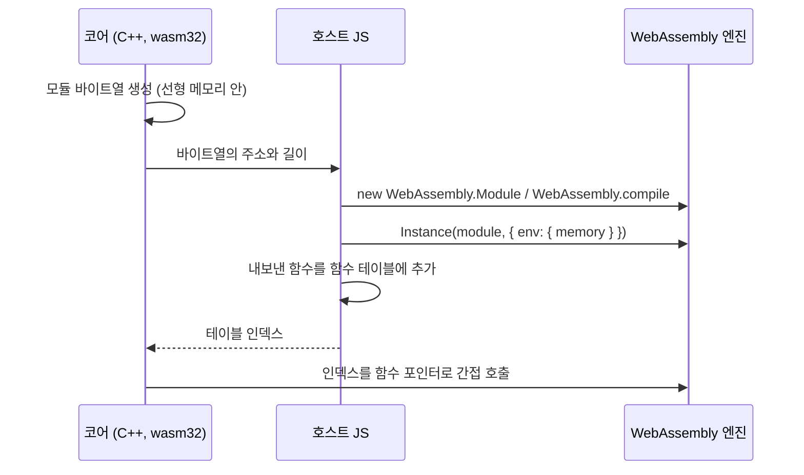

# WebAssembly에서 실행 중에 만든 코드 부르기 / Calling code generated at run time in WebAssembly

근거 작업: [#42 설계](../design/20261010-i042-phase3-translation.md)

wasm 모듈은 자기 코드를 바꿀 수 없다. 코드 영역은 선형 메모리 밖에 있고, 실행 가능한 메모리를 만드는 API도 없다. 그래서 wasm 위의 JIT는 새 **모듈**을 바이트열로 만들고, 호스트(JavaScript)가 그 모듈을 컴파일하고 인스턴스화한 뒤, 기존 모듈에서 부를 수 있게 이어 붙인다.

*A wasm module cannot change its own code: code lives outside linear memory, and there is no API to make memory executable. A JIT on wasm therefore builds a new **module** as bytes, which the host (JavaScript) compiles and instantiates, then links so the existing module can call it.*

## 이어 붙이는 방법 / Linking

* **메모리 공유**: 새 모듈은 메모리를 정의하지 않고 기존 모듈의 `WebAssembly.Memory`를 import한다. 그러면 새 코드가 같은 선형 메모리의 주소로 게스트 메모리와 CPU 상태를 읽고 쓴다. import하는 메모리의 최소 크기는 실제 메모리보다 작거나 같아야 한다([WebAssembly JS API](https://webassembly.github.io/spec/js-api/)).
* **함수 포인터 = 테이블 인덱스**: wasm32에서 C/C++ 함수 포인터는 간접 함수 테이블의 인덱스다. Emscripten의 `addFunction`은 함수를 테이블에 넣고 "함수 포인터를 나타내는 정수"를 돌려준다. C 코드는 그 값을 함수 포인터로 부를 수 있다. 테이블에 새 칸을 더하려면 `-sALLOW_TABLE_GROWTH`로 빌드해야 한다. 그렇지 않으면 테이블 크기가 고정이다([Emscripten: Interacting with code](https://emscripten.org/docs/porting/connecting_cpp_and_javascript/Interacting-with-code.html)).
* 그래서 코어의 C++ 코드는 emscripten 헤더 없이 생성 코드를 부를 수 있다. 바이트열을 넘기고 인덱스를 받는 일만 호스트 JS가 맡는다.

*Sharing memory: the new module defines no memory and imports the existing module's `WebAssembly.Memory`, so the new code reads and writes guest memory and CPU state at the same linear addresses; an imported memory's minimum must not exceed the actual size (WebAssembly JS API). A function pointer is a table index: in wasm32 a C/C++ function pointer indexes the indirect function table; Emscripten's `addFunction` puts a function into the table and returns "an integer value that represents a function pointer", which C code can call; adding table slots needs `-sALLOW_TABLE_GROWTH`, the table having a fixed size otherwise (Emscripten: Interacting with code). So the core's C++ calls generated code with no emscripten header; only handing over the bytes and receiving the index belongs to the host's JS.*

## 이 저장소에서 잰 값 / Measured here

이 저장소의 wasm 백엔드(#45)에서 잰 설치 시간과 처리량은 [인터프리터 성능 분석](../analysis/interpreter-performance.md) 2.4절에 있다.

*The installation times and throughput measured for this repository's wasm backend (#45) are in section 2.4 of the interpreter performance analysis.*

## 동기와 비동기 컴파일 / Synchronous and asynchronous compilation

* `new WebAssembly.Module(bytes)`와 `new WebAssembly.Instance(...)`는 동기다. `WebAssembly.compile`과 `WebAssembly.instantiate`는 Promise를 돌려준다.
* Chrome은 메인 스레드의 동기 컴파일 크기를 제한한다. 처음 한도는 4 KB였고, Chromium은 Liftoff와 지연 컴파일 뒤에 이를 8 MB로 올렸다([Chromium 커밋](https://chromium.googlesource.com/chromium/src/+/d1a1a8fdd9b28feaf5d3accc0578092444a1083e)). 4 KB로 적은 안내 문서도 아직 있다([web.dev](https://web.dev/articles/loading-wasm)). Worker 안의 동기 생성자에는 이 제한이 없다.
* **이 저장소에서 확인함**(#48): Chromium 153과 Firefox 155의 Worker에서 동기 생성자로 생성 모듈 수천 개를 설치했다. Firefox와 Chromium의 메인 스레드에서는 비동기 경로(`WebAssembly.compile`, `instantiate`)로 설치했다.
* **미확인**: 8 MB 한도가 들어간 Chrome 버전, Safari와 Firefox의 메인 스레드 동기 컴파일 정책. 이 프로젝트는 Worker에서 코어를 돌리는 것을 전제로 하고(#1 설계 결정 5), 호스트가 비동기 경로를 쓸 수 있게 계약을 둔다.

*`new WebAssembly.Module(bytes)` and `new WebAssembly.Instance(...)` are synchronous; `WebAssembly.compile` and `WebAssembly.instantiate` return Promises. Chrome caps synchronous compilation on the main thread: the cap was 4 KB, and Chromium raised it to 8 MB after Liftoff and lazy compilation (Chromium commit), though some guidance still says 4 KB (web.dev); synchronous constructors inside a Worker have no such cap. Confirmed in this repository (#48): thousands of generated modules installed through the synchronous constructors in Workers of Chromium 153 and Firefox 155, and through the asynchronous path (`WebAssembly.compile`, `instantiate`) on their main threads. Unverified: the Chrome version that shipped the 8 MB cap, and Safari's and Firefox's main-thread synchronous compile policies. This project assumes the core runs in a Worker (#1 design decision 5) and keeps a contract under which the host may take the asynchronous path.*

## 모듈 수와 코드 메모리 / Module count and code memory

* 엔진마다 컴파일된 wasm 코드를 담는 실행 메모리의 예산과 회수 방식이 다르다. 작은 모듈을 많이 만드는 JIT(블록 하나에 모듈 하나)는 모듈 바이트 크기보다 **모듈 수**에 먼저 걸린다.
* **이 저장소에서 확인함**(#48, [기록](../analysis/browser-wasm.md) 3절): Firefox 155(SpiderMonkey)는 한 프로세스에서 작은 모듈 16,349개째에 `InternalError: out of memory`를 낸다. 참조를 버리거나 이벤트 루프에 제어를 돌려줘도 같다. 버린 모듈의 코드 메모리는 JS 힙 할당이 일으키는 쓰레기 수집에서만 돌아오는 것으로 보인다. Chromium 153(V8)은 10만 개에서도 실패하지 않았다. Safari(JavaScriptCore)는 미확인이다.
* 그래서 웹의 JIT는 여러 블록을 모듈 하나로 묶어(모듈 하나가 함수 여러 개를 내보냄) 모듈 수를 줄인다. 또 설치 거절을 정상 경로(인터프리터로 계속)로 다뤄야 한다.

*Engines differ in the executable memory budget holding compiled wasm code and in how they reclaim it, so a JIT making many small modules (one per block) meets the **module count** before module byte sizes. Confirmed in this repository (#48, record section 3): Firefox 155 (SpiderMonkey) throws `InternalError: out of memory` at the 16,349th small module in a process, whether the references are dropped or the loop yields to the event loop; a dropped module's code memory appears to return only at a garbage collection started by JS heap allocation. Chromium 153 (V8) did not fail at 100,000; Safari (JavaScriptCore) is unverified. A web JIT therefore batches several blocks into one module (one module exporting several functions) to keep the count down, and must treat a refused installation as an ordinary path (carry on in the interpreter).*

## Emscripten JS 라이브러리의 값 / Values in an Emscripten JS library

* `addToLibrary({ $name: value })`의 함수가 아닌 값은 생성되는 JS에 **직렬화**되어 들어간다. 배열과 객체 리터럴은 그대로 들어가지만, `new Map()`은 `{}`가 된다. 실행할 식은 문자열로 쓴다. 예: `$queues: 'new Map()'`는 `var queues = new Map();`이 된다.
* 라이브러리 함수가 다른 항목을 쓰려면 `name__deps: ['$other']`로 밝혀야 한다. 그래야 링크 결과에 그 항목이 남는다([Emscripten: Interacting with code](https://emscripten.org/docs/porting/connecting_cpp_and_javascript/Interacting-with-code.html)).

*Non-function values in `addToLibrary({ $name: value })` are **serialized** into the generated JS: array and object literals survive, but `new Map()` becomes `{}`; an expression to run is written as a string, e.g. `$queues: 'new Map()'` becomes `var queues = new Map();`. A library function using another item declares it with `name__deps: ['$other']` so the item stays in the link output (Emscripten: Interacting with code).*
