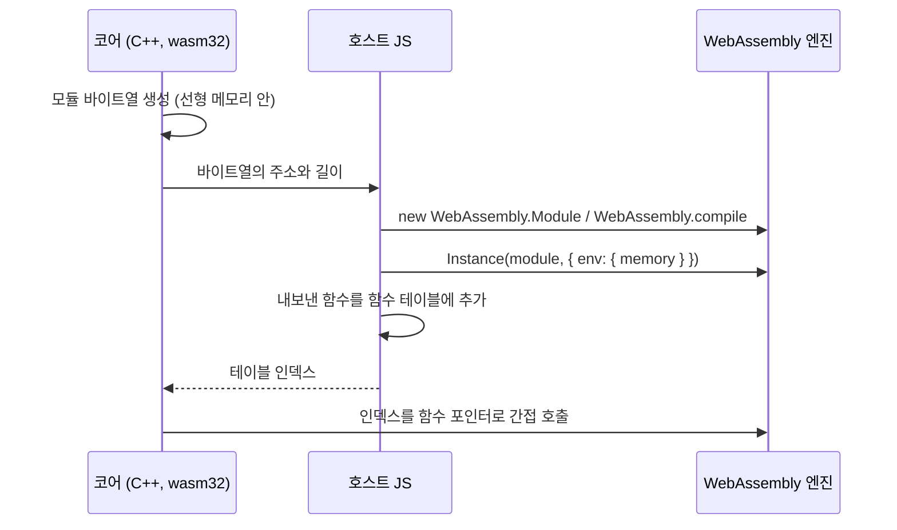

# WebAssembly에서 실행 중에 만든 코드 부르기 / Calling code generated at run time in WebAssembly

근거 작업: [#42 설계](../design/20261010-i042-phase3-translation.md)

wasm 모듈은 자기 코드를 바꿀 수 없다. 코드 영역은 선형 메모리 밖에 있고, 실행 가능한 메모리를 만드는 API도 없다. 그래서 wasm 위의 JIT는 새 **모듈**을 바이트열로 만들고, 호스트(JavaScript)가 그 모듈을 컴파일하고 인스턴스화한 뒤, 기존 모듈에서 부를 수 있게 이어 붙인다.

*A wasm module cannot change its own code: code lives outside linear memory, and there is no API to make memory executable. A JIT on wasm therefore builds a new **module** as bytes, which the host (JavaScript) compiles and instantiates, then links so the existing module can call it.*

## 이어 붙이는 방법 / Linking

* **메모리 공유**: 새 모듈은 메모리를 정의하지 않고 기존 모듈의 `WebAssembly.Memory`를 import한다. 그러면 새 코드가 같은 선형 메모리의 주소로 게스트 메모리와 CPU 상태를 읽고 쓴다. import하는 메모리의 최소 크기는 실제 메모리보다 작거나 같아야 한다([WebAssembly JS API](https://webassembly.github.io/spec/js-api/)).
* **함수 포인터 = 테이블 인덱스**: wasm32에서 C/C++ 함수 포인터는 간접 함수 테이블의 인덱스다. Emscripten의 `addFunction`은 함수를 테이블에 넣고 "함수 포인터를 나타내는 정수"를 돌려준다. C 코드는 그 값을 함수 포인터로 부를 수 있다. 테이블에 새 칸을 더하려면 `-sALLOW_TABLE_GROWTH`로 빌드해야 한다. 그렇지 않으면 테이블 크기가 고정이다([Emscripten: Interacting with code](https://emscripten.org/docs/porting/connecting_cpp_and_javascript/Interacting-with-code.html)).
* 그래서 코어의 C++ 코드는 emscripten 헤더 없이 생성 코드를 부를 수 있다. 바이트열을 넘기고 인덱스를 받는 일만 호스트 JS가 맡는다.

*Sharing memory: the new module defines no memory and imports the existing module's `WebAssembly.Memory`, so the new code reads and writes guest memory and CPU state at the same linear addresses; an imported memory's minimum must not exceed the actual size (WebAssembly JS API). A function pointer is a table index: in wasm32 a C/C++ function pointer indexes the indirect function table; Emscripten's `addFunction` puts a function into the table and returns "an integer value that represents a function pointer", which C code can call; adding table slots needs `-sALLOW_TABLE_GROWTH`, the table having a fixed size otherwise (Emscripten: Interacting with code). So the core's C++ calls generated code with no emscripten header; only handing over the bytes and receiving the index belongs to the host's JS.*

## 동기와 비동기 컴파일 / Synchronous and asynchronous compilation

* `new WebAssembly.Module(bytes)`와 `new WebAssembly.Instance(...)`는 동기다. `WebAssembly.compile`과 `WebAssembly.instantiate`는 Promise를 돌려준다.
* Chrome은 메인 스레드의 동기 컴파일 크기를 제한한다. 처음 한도는 4 KB였고, Chromium은 Liftoff와 지연 컴파일 뒤에 이를 8 MB로 올렸다([Chromium 커밋](https://chromium.googlesource.com/chromium/src/+/d1a1a8fdd9b28feaf5d3accc0578092444a1083e)). 4 KB로 적은 안내 문서도 아직 있다([web.dev](https://web.dev/articles/loading-wasm)). Worker 안의 동기 생성자에는 이 제한이 없다.
* **미확인**: 8 MB 한도가 들어간 Chrome 버전, Safari와 Firefox의 정책. 이 프로젝트는 Worker에서 코어를 돌리는 것을 전제로 하고(#1 설계 결정 5), 호스트가 비동기 경로를 쓸 수 있게 계약을 둔다.

*`new WebAssembly.Module(bytes)` and `new WebAssembly.Instance(...)` are synchronous; `WebAssembly.compile` and `WebAssembly.instantiate` return Promises. Chrome caps synchronous compilation on the main thread: the cap was 4 KB, and Chromium raised it to 8 MB after Liftoff and lazy compilation (Chromium commit), though some guidance still says 4 KB (web.dev); synchronous constructors inside a Worker have no such cap. Unverified: the Chrome version that shipped the 8 MB cap, and Safari's and Firefox's policies. This project assumes the core runs in a Worker (#1 design decision 5) and keeps a contract under which the host may take the asynchronous path.*
